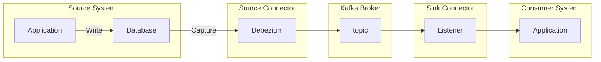

Change Data Capture (CDC) は、データベースで発生した変更をキャプチャーして別のシステムに伝播させ、応答できるようにする仕組みです。CDC を利用することで、テーブルの更新をポーリングするバッチ処理などを作り込まずに、イベントドリブンな応答処理を実装できます。CDC はイベントソーシングと並んで分散システムをリアクティブに連携させるためのソリューションとして位置付けられます。[^1]

[^1]: [マイクロサービスのための分散データ 〜  イベントソーシング vs チェンジデータキャプチャ - 赤帽エンジニアブログ](https://rheb.hatenablog.com/entry/2020/02/10/event-sourcing-vs-cdc/)

[Amazon DynamoDB](https://aws.amazon.com/jp/dynamodb/) や [Azure CosmosDB](https://azure.microsoft.com/ja-jp/services/cosmos-db/) などのマネージドサービスでは、変更イベントを通知する仕組みを備えているものがあります。Debezium を使うと、MySQL や PostgreSQL などオンプレミス環境で広く使われている DBMS でも CDC を利用できます。

この記事では Debezium の概要を簡単に説明し、PostgreSQL と Debezium を使った開発環境を macOS 上に構築する手順を示します。

[[TOC]]

# Debezium の概要
[Debezium](https://debezium.io/) は、Red Hat が OSS として開発している CDC のためのプラットフォームであり、Kafka Connect として動作します。

Kafka は 高速でスケーラブルな分散型メッセージングシステムであり、Kafka Connect は Kafka と他のシステムでデータをストリーミングするためのフレームワークです。Kafka Connect にはデータソース側の Souce Connector と Consumer 側の Sink Connector があります。Debezium は Souce Connector に位置付けられます。



Debezium 設定で指定されたテーブルの変更が所定の Kafka topic にメッセージとして投入されます。Consumer システムではその topic に subscribe し、イベント受信時の処理を実装します。

Debezium のドライバーは各 DBMS ごとに提供されています。

- MySQL
- MongoDB
- PostgreSQL
- SQL Server
- Oracle[^2]
- Cassandra

[^2]: Oracle の場合は XStream に依存しています。

Debezium は、ソースとなるアプリケーションのデータベースのトランザクションログを監視して変更をキャプチャーします。PostgreSQL では WAL (Write Ahead Log)、MySQL では row-lebel binlog を監視します。このため、JDBC などのクエリ用のドライバーで実装された Source Connector に比べて DBMS の負荷が小さく高速です。

# Debezium による開発環境構築
macOS で PostgreSQL と Debezium の環境を構築して動作を確認してみます。HomeBrew を使用します。

## PostgreSQL インストールとデータベース作成
PostgreSQL をインストールして、コマンドのディレクトリに PATH を通します。

```shell
brew install postgresql@13
echo 'export PATH="/opt/postgresql@13/bin:$PATH"' >> ~/.zshrc
```

postgresql.conf で `wal_level` を設定します。

```shell
vi /opt/homebrew/var/postgresql@13/postgesql.conf
```

:::check
postgresql.conf は環境によって `/usr/local/var/postgresql@13` 配下に生成されている場合もあります。
:::


```properties
wal_level = logical
```

WAL level `logical` を指定する必要があり、出力されるログの量は多くなります。

PostgreSQL のサービスを起動します。

```shell
brew services start postgresql@13
```

PostgreSQL に接続して `wal_level` の設定を確認します。

```shell
psql postgres -c 'show wal_level;'
 wal_level 
-----------
 logical
(1 row)
```

### キャプチャー対象のテーブル作成

データベースを作成してキャプチャー対象のテーブルを作成します。以下のような DDL を記述したファイルを用意しました。スキーマ `dz` に `account` というシンプルなテーブルを1つ作るだけの DDL です。

```sql
DROP SCHEMA IF EXISTS dz CASCADE;
CREATE SCHEMA IF NOT EXISTS dz;

CREATE TABLE dz.account(
  id character(5) NOT NULL,
  name character varying(20) NOT NULL
);
```

データベース `db1` を作成し DDL ファイル(ここでは ddl.sql) を実行します[^3]。

```shell
psql postgres -c 'CREATE USER postgres SUPERUSER;'
psql -U postgres -c 'CREATE DATABASE db1;'
psql -U postgres -d db1 -f ddl.sql
```

[^3]: ここでは先行して postgres というロールも作成しています。

テーブルができていることを確認します。

```shell
$ psql -U postgres -d db1 -c '\d dz.account;'
                       Table "dz.account"
 Column |         Type          | Collation | Nullable | Default
--------+-----------------------+-----------+----------+---------
 id     | character(5)          |           | not null |
 name   | character varying(20) |           | not null |
```

## Kafka インストール

Kafka をインストールして、ZooKeeper と Kafka のサービスを起動します。ZooKeeper は Kafka Cluster のメタ情報を管理するサービスです。

```shell
brew install kafka
brew services start zookeeper
brew services start kafka
```

記事執筆時点では、Kafka 3.1.0 がインストールされました。

## Debezium インストール

続いて Debezium をインストールします。

[Installing Debezium :: Debezium Documentation](https://debezium.io/documentation/reference/install.html)

公式ドキュメントのリンク先は Nightly ビルドのアーカイブに向いていますので、このページのリンク先からダウンロードできるのは Stable 版ではありません。記事執筆時点の Stable release は 1.8 で、以下のページのリンクからダウンロード可能です。

[https://debezium.io/documentation/reference/1.8/install.html](https://debezium.io/documentation/reference/1.8/install.html)

ここでは、Kafka の plugin ディレクトリを作成し、ダウンロードしたアーカイブを解凍したディレクトリをコピーしました。

```shell
curl -LO https://repo1.maven.org/maven2/io/debezium/debezium-connector-postgres/1.8.1.Final/debezium-connector-postgres-1.8.1.Final-plugin.tar.gz
tar xfz debezium-connector-postgres-1.8.1.Final-plugin.tar.gz
sudo mkdir -p /usr/local/share/kafka/plugins
sudo mv debezium-connector-postgres /usr/local/share/kafka/plugins
```

Kafka の `connect-distributed.properties` ファイルを編集します。

```shell
vi /opt/homebrew/etc/kafka/connect-distributed.properties
```

`plugin.path` で上記で作成した plugin ディレクトリを指定します。

```properties
plugin.path=/usr/local/share/kafka/plugins
```

connect-distributed コマンドを使って Kafka Connect を起動します。上記で編集した properties ファイルを指定して plugin ディレクトリを認識させる必要があります。

```shell
connect-distributed /opt/homebrew/etc/kafka/connect-distributed.properties
```

8083 ポートで Kafka Connect の REST API エンドポイントが起動するので、plugin の一覧を習得して Debezium が有効化されていることを確認します。

```shell
$ curl http://localhost:8083/connector-plugins | jq .
  % Total    % Received % Xferd  Average Speed   Time    Time     Time  Current
                                 Dload  Upload   Total   Spent    Left  Speed
100   599  100   599    0     0  31412      0 --:--:-- --:--:-- --:--:-- 46076
[
  {
    "class": "io.debezium.connector.postgresql.PostgresConnector",
    "type": "source",
    "version": "1.8.1.Final"
  },
  {
    "class": "org.apache.kafka.connect.file.FileStreamSinkConnector",
    "type": "sink",
    "version": "3.1.0"
  },
  {
    "class": "org.apache.kafka.connect.file.FileStreamSourceConnector",
    "type": "source",
    "version": "3.1.0"
  },
  {
    "class": "org.apache.kafka.connect.mirror.MirrorCheckpointConnector",
    "type": "source",
    "version": "1"
  },
  {
    "class": "org.apache.kafka.connect.mirror.MirrorHeartbeatConnector",
    "type": "source",
    "version": "1"
  },
  {
    "class": "org.apache.kafka.connect.mirror.MirrorSourceConnector",
    "type": "source",
    "version": "1"
  }
]
```

Debezium plugin が読み込まれました。Debezium 以外に FileStreamSourceConnector などいくつかの plugin も組み込まれています。

## キャプチャー設定登録

次に、PostgreSQL から変更データを受け取れるように以下のような JSON ファイル (ここでは、`register-postgres.json` としました) を作成します。PostgreSQL への接続情報のほか、キャプチャー対象のテーブルを whitelist で指定しています。

```json
{
  "name": "postgres-connector",
  "config": {
      "connector.class": "io.debezium.connector.postgresql.PostgresConnector",
      "tasks.max": "1",
      "database.hostname": "localhost",
      "database.port": "5432",
      "database.user": "postgres",
      "database.password": "postgres",
      "database.dbname" : "db1",
      "database.server.name": "postgres",
      "table.whitelist": "dz.account",
      "plugin.name": "pgoutput"
  }
}
```

Kafka Connect の REST API でキャプチャー設定を登録します。成功すると、登録した情報が JSON で返却されます。

```shell
$ curl -i -X POST -H "Accept:application/json" -H  "Content-Type:application/json" http://localhost:8083/connectors/ -d @register-postgres.json

HTTP/1.1 201 Created
Date: Mon, 28 Feb 2022 05:27:15 GMT
Location: http://localhost:8083/connectors/postgres-connector
Content-Type: application/json
Content-Length: 409
Server: Jetty(9.4.43.v20210629)

{"name":"postgres-connector","config":{"connector.class":"io.debezium.connector.postgresql.PostgresConnector","tasks.max":"1","database.hostname":"localhost","database.port":"5432","database.user":"postgres","database.password":"postgres","database.dbname":"db1","database.server.name":"postgres","table.whitelist":"dz.account","plugin.name":"pgoutput","name":"postgres-connector"},"tasks":[],"type":"source"}
```

`kafka-topics` コマンドで Kafka cluster に作成された topic の一覧を見ると、Kafka Connect 関連の topic が作成されています。

```shell
$ kafka-topics --bootstrap-server=localhost:9092 --list
__consumer_offsets
connect-configs
connect-offsets
connect-status
```

account テーブルにデータを挿入します。

```shell
psql -U postgres -d db1 -c "INSERT INTO dz.account (id, name) VALUES ('00001', 'Alice');"
```

データ挿入後に topic を確認すると、`postgres.dz.account` という topic が作成されています。topic 名は `<データベース名>.<スキーマ名>.<テーブル名>` という規約に従います。

```shell
$ kafka-topics --bootstrap-server=localhost:9092 --list
__consumer_offsets
connect-configs
connect-offsets
connect-status
postgres.dz.account
```

Kafka の console consumer で topic のイベントを確認してみます。

```shell
$ kafka-console-consumer \
  --bootstrap-server localhost:9092 \
  --topic postgres.dz.account \
  --from-beginning
{"schema":{"type":"struct","fields":[{"type":"struct","fields":[{"type":"string","optional":false,"field":"id"},{"type":"string","optional":false,"field":"name"}],"optional":true,"name":"postgres.dz.account.Value","field":"before"},{"type":"struct","fields":[{"type":"string","optional":false,"field":"id"},{"type":"string","optional":false,"field":"name"}],"optional":true,"name":"postgres.dz.account.Value","field":"after"},{"type":"struct","fields":[{"type":"string","optional":false,"field":"version"},{"type":"string","optional":false,"field":"connector"},{"type":"string","optional":false,"field":"name"},{"type":"int64","optional":false,"field":"ts_ms"},{"type":"string","optional":true,"name":"io.debezium.data.Enum","version":1,"parameters":{"allowed":"true,last,false,incremental"},"default":"false","field":"snapshot"},{"type":"string","optional":false,"field":"db"},{"type":"string","optional":true,"field":"sequence"},{"type":"string","optional":false,"field":"schema"},{"type":"string","optional":false,"field":"table"},{"type":"int64","optional":true,"field":"txId"},{"type":"int64","optional":true,"field":"lsn"},{"type":"int64","optional":true,"field":"xmin"}],"optional":false,"name":"io.debezium.connector.postgresql.Source","field":"source"},{"type":"string","optional":false,"field":"op"},{"type":"int64","optional":true,"field":"ts_ms"},{"type":"struct","fields":[{"type":"string","optional":false,"field":"id"},{"type":"int64","optional":false,"field":"total_order"},{"type":"int64","optional":false,"field":"data_collection_order"}],"optional":true,"field":"transaction"}],"optional":false,"name":"postgres.dz.account.Envelope"},"payload":{"before":null,"after":{"id":"00001","name":"Alice"},"source":{"version":"1.8.1.Final","connector":"postgresql","name":"postgres","ts_ms":1646026975330,"snapshot":"false","db":"db1","sequence":"[null,\"23102744\"]","schema":"dz","table":"account","txId":493,"lsn":23102744,"xmin":null},"op":"c","ts_ms":1646026975842,"transaction":null}}
```

メタデータが多くて見づらいですが、以下のような payload が送信されたことがわかります。`after` に挿入されたデータ、`source` にデータソースの情報が入っています。

```json
"payload": {
    "before": null,
    "after": {
        "id": "00001",
        "name": "Alice"
    },
    "source": {
        "version": "1.8.1.Final",
        "connector": "postgresql",
        "name": "postgres",
        "ts_ms": 1646026975330,
        "snapshot": "false",
        "db": "db1",
        "sequence": "[null,\"23102744\"]",
        "schema": "dz",
        "table": "account",
        "txId": 493,
        "lsn": 23102744,
        "xmin": null
    },
    "op": "c",
    "ts_ms": 1646026975842,
    "transaction": null
}
```
topic `connect-status` に送信されたメッセージを見てみると、`postgres.dz.account` という topic が作成されたことが記録されています。

```shell
$ kafka-console-consumer \
  --bootstrap-server localhost:9092 \
  --topic connect-status \
  --from-beginning
{"state":"RUNNING","trace":null,"worker_id":"127.0.0.1:8083","generation":2}
{"state":"RUNNING","trace":null,"worker_id":"127.0.0.1:8083","generation":3}
{"topic":{"name":"postgres.dz.account","connector":"postgres-connector","task":0,"discoverTimestamp":1646026976168}}
```

## イベントデータの調整
先ほどの payload の before は、INSERT なので null になっていると思いきや、UPDATE しても null のままです。更新前の情報を取得したいケースもあるでしょう。before を有効化するには、PostgreSQL のテーブルの `REPLICA IDENTITY` を `FULL` か `USING INDEX` に設定する必要があります。

```sql
ALTER TABLE dz.account REPLICA IDENTITY FULL;
```

この状態で、レコードを更新します。

```shell
psql -U postgres -d db1 -c "UPDATE dz.account SET name = 'Bob' WHERE id = '00001';"
```

payload に before の値も入るようになります。

```json
"payload": {
    "before": {
        "id": "00001",
        "name": "Alice"
    },
    "after": {
        "id": "00001",
        "name": "Bob"
    },
    "source": {
    },
    "op": "u",
    "ts_ms": 1646028575960,
    "transaction": null
}
```

送信されたメッセージには payload 以外のスキーマ情報が含まれているため、列が多いほどデータサイズも巨大になります。これは、Debezium の設計思想で、アップストリームのデータベース構造が時間の経過とともに変化してもイベントが意味をなすよう自己記述的になっているためです。スキーマレジストリを利用することでメッセージとメタデータ管理を分離可能です。

:::check
スキーマレジストリではメッセージ形式に [Avro](https://avro.apache.org/) のような軽量バイナリフォーマットも利用できます。
:::

スキーマレジストリのような、やや複雑な構成を導入せずに、シンプルに payload だけをやり取りしたいケースもあるでしょう。そのためにはキャプチャー設定で JsonConverter のスキーマ情報を無効化するオプションを追加します (key.converter 以降の4行)。

```json
{
  "name": "postgres-connector",
  "config": {
      "connector.class": "io.debezium.connector.postgresql.PostgresConnector",
      "tasks.max": "1",
      "database.hostname": "localhost",
      "database.port": "5432",
      "database.user": "postgres",
      "database.password": "postgres",
      "database.dbname" : "hoge",
      "database.server.name": "postgres",
      "table.whitelist": "wf.process_activated",
      "plugin.name": "pgoutput",
      "key.converter": "org.apache.kafka.connect.json.JsonConverter",
      "key.converter.schemas.enable": false,
      "value.converter": "org.apache.kafka.connect.json.JsonConverter",
      "value.converter.schemas.enable": false
  }
}
```

登録されている postgres-connector の定義を一旦削除します。

```shell
curl -X DELETE http://localhost:8083/connectors/postgres-connector
```

Kafka Connect を再起動します。

:::info
connect-distributed を起動したターミナルで Ctrl + C を入力して停止し、再度 connect-distributed を起動します。
:::

そして、上記のファイルを再登録します。

```shell
$ curl -i -X POST -H "Accept:application/json" -H  "Content-Type:application/json" http://localhost:8083/connectors/ -d @register-postgres.json
HTTP/1.1 201 Created
Date: Mon, 28 Feb 2022 06:47:22 GMT
Location: http://localhost:8083/connectors/postgres-connector
Content-Type: application/json
Content-Length: 615
Server: Jetty(9.4.43.v20210629)

{"name":"postgres-connector","config":{"connector.class":"io.debezium.connector.postgresql.PostgresConnector","tasks.max":"1","database.hostname":"localhost","database.port":"5432","database.user":"postgres","database.password":"postgres","database.dbname":"db1","database.server.name":"postgres","table.whitelist":"dz.account","plugin.name":"pgoutput","key.converter":"org.apache.kafka.connect.json.JsonConverter","key.converter.schemas.enable":"false","value.converter":"org.apache.kafka.connect.json.JsonConverter","value.converter.schemas.enable":"false","name":"postgres-connector"},"tasks":[],"type":"source"}
```

これで topic には payload の中身だけが流れるようになります。

```json
{
    "before": {
        "id": "00001",
        "name": "Alice"
    },
    "after": {
        "id": "00001",
        "name": "Bob"
    },
    "source": {
        "version": "1.8.1.Final",
        "connector": "postgresql",
        "name": "postgres",
        "ts_ms": 1646031007028,
        "snapshot": "false",
        "db": "db1",
        "sequence": "[\"23105640\",\"23105696\"]",
        "schema": "dz",
        "table": "account",
        "txId": 497,
        "lsn": 23105696,
        "xmin": null
    },
    "op": "u",
    "ts_ms": 1646031007522,
    "transaction": null
}
```

## アプリケーション開発

以上、PostgreSQL テーブルの変更を Debezium でキャプチャーできる環境を構築しました。あとは、topic に subscribe して CDC メッセージを消費する Consumer を書けば CDC に対応したアプリケーションを作成できます。利用したいプログラミング言語に対応した Kafka Client ライブラリが提供されています。

[Kafka Clients | Confluent Documentation](https://docs.confluent.io/platform/current/clients/index.html)

# 参考
- [Frequently Asked Questions - Debezium](https://debezium.io/documentation/faq/)
- [Debezium connector for PostgreSQL :: Debezium Documentation](https://debezium.io/documentation/reference/stable/connectors/postgresql.html)
