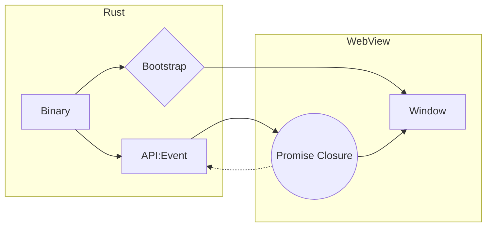

Tauri はクロスプラットフォームデスクトップアプリのための Rust によるフレームワークです。Electron と同様 Web 技術でアプリの UI を構築します。

[Build smaller, faster, and more secure desktop applications with a web frontend | Tauri Studio](https://tauri.studio/)

記事執筆時点で v1.0.0-rc.5 (Pre-release)、もうすぐ v1.0 がリリースされそうなところです。

[Release v1.0.0-rc.5: Apply Version Updates From Current Changes (#3468) · tauri-apps/tauri](https://github.com/tauri-apps/tauri/releases/tag/v1.0.0-rc.5)

Electron と比べて、インストーラーのサイズ、メモリ消費量、起動時間などが圧倒的に小さいと謳われています。

[https://github.com/tauri-apps/tauri#comparison-between-tauri-and-electron](https://github.com/tauri-apps/tauri#comparison-between-tauri-and-electron)

Electron では main プロセスを Node.js、UI を Chrome という構成でアプリケーションを実行します。Tauiri は Electron の main プロセスに相当する部分を Rust、UI は各 OS 標準の WebView でレンダリングする wry というライブラリを使用します。

[GitHub - tauri-apps/wry: Cross-platform WebView library in Rust for Tauri.](https://github.com/tauri-apps/wry)

macOS では、WebKit、Windows では、WebViwe2[^1]、Linux では WebKitGTK を使用します。Electron と違ってクロスブラウザ的な動作の違いはありそうですが、この方式でモバイル対応も計画されています。

[^1]: Microsoft Edge (Chromium) のエンジン。

簡単なアプリケーションを作って開発体験を見てみます。

:::info
記事執筆時点では M1 Mac ではビルドがうまくできず、Intel Mac と Windows 10 で確認しました。
:::

まず Rust を最新版に更新します。[^2]

```shell
rustup update
```

[^2]: rustup は各 OS 用にインストーラが用意されているので事前にインストールしておきます。macOS では Xcode command line tools, Windows では Visual Studio で C++ のビルド環境を構築しておく必要があります。

Node.js も最新安定版[^3]をインストールしておきます。

[^3]: 記事執筆時点では、16.14.0 LTS でした。

環境が整ったら、アプリケーションのボイラープレートを生成します。選択肢はすべてデフォルトを指定しました。


```shell
$ npx create-tauri-app

Need to install the following packages:
  create-tauri-app
Ok to proceed? (y) 

Press any key to continue...
? What is your app name? tauri-app
? What should the window title be? Tauri App
? What UI recipe would you like to add? Vanilla.js (html, css, and js without the bundlers)
? Add "@tauri-apps/api" npm package? Yes
>> Running initial command(s)
>> Installing any additional needed dependencies
- Installing @tauri-apps/cli@latest...

added 2 packages, and audited 3 packages in 4s

1 package is looking for funding
  run `npm fund` for details

found 0 vulnerabilities
- Installing @tauri-apps/api@latest...

added 2 packages, and audited 5 packages in 3s

3 packages are looking for funding
  run `npm fund` for details

found 0 vulnerabilities
>> Updating "package.json"
>> Running "tauri init"

> tauri
> tauri "init" "--app-name" "tauri-app" "--window-title" "Tauri App" "--dist-dir" "../dist" "--dev-path" "../dist" "--ci"

>> Updating "tauri.conf.json"
>> Running final command(s)

    Your installation completed.

    $ cd tauri-app
    $ npm install
    $ npm run tauri dev
```

生成されたプロジェクトの構造は以下のようになっています。dist 配下に Web ページ、src-tauri 配下にソースコードやアイコンなどが格納されています。

```
├── dist
│   └── index.html
├── node_modules
├── package-lock.json
├── package.json
└── src-tauri
    ├── Cargo.lock
    ├── Cargo.toml
    ├── build.rs
    ├── icons
    │   ├── 128x128.png
    │   ├── 128x128@2x.png
    │   ├── 32x32.png
    │   ├── Square107x107Logo.png
    │   ├── Square142x142Logo.png
    │   ├── Square150x150Logo.png
    │   ├── Square284x284Logo.png
    │   ├── Square30x30Logo.png
    │   ├── Square310x310Logo.png
    │   ├── Square44x44Logo.png
    │   ├── Square71x71Logo.png
    │   ├── Square89x89Logo.png
    │   ├── StoreLogo.png
    │   ├── icon.icns
    │   ├── icon.ico
    │   └── icon.png
    ├── src
    │   └── main.rs
    └── tauri.conf.json
```

package.json はシンプルです。

```json
{
  "name": "tauri-app",
  "scripts": {
    "tauri": "tauri"
  },
  "devDependencies": {
    "@tauri-apps/cli": "^1.0.0-rc.5"
  },
  "dependencies": {
    "@tauri-apps/api": "^1.0.0-rc.1"
  }
}
```

tauri という CLI により、アプリケーション起動やリリースビルドなど行います。tauri.conf.json に記述されているアプリ構成が実行されます。tauri dev を実行すると Rust のパッケージマネージャが必要なパッケージをダウンロードしビルドします。最後にアプリケーションが DevTools 利用可能な状態で起動します。

```shell
$ npm run tauri dev

> tauri
> tauri "dev"

   Compiling libc v0.2.119
   Compiling cfg-if v1.0.0
   Compiling proc-macro2 v1.0.36
    :
   Compiling tauri-utils v1.0.0-rc.2
   Compiling tauri-runtime v0.3.2
   Compiling tauri-codegen v1.0.0-rc.2
   Compiling tauri-build v1.0.0-rc.3
   Compiling tauri-runtime-wry v0.3.2
   Compiling tauri-macros v1.0.0-rc.2
   Compiling app v0.1.0 (/Users/masa/codes/rust-study/tauri-app/src-tauri)
    Finished dev [unoptimized + debuginfo] target(s) in 3m 31s
     Running `target/debug/app`
```

起動したアプリの画面上で右クリックすると Reload や DevTools の起動が可能です。


Windows でも同様です。


初回はパッケージダウンロードとビルドで時間がかかりますが、ビルド結果は、src-tauri/target にキャッシュされるため2回目以降はすぐに起動します。

[公式ドキュメント](https://tauri.studio/docs/about/architecture/)には HTML/CSS/TS/JS など UI 部分のコードを変更すると devserver が instant hot module reloading で即時反映するとあります。Vanilla.js だとホットリロードは効きませんでした。試しに create-tauri-app で Svelte を選択すると、[Svelte 公式のアプリ生成コマンド](https://github.com/sveltejs/template)により Svelte アプリの雛型が作成されました。そして tauri-svelte というモジュールが rollup で Svelte のコードをバンドル、Tauri アプリ内で Svelte アプリをホストしてホットリロードが可能になりました。

```shell
$ npm run tauri dev 

> tauri-svelte@1.0.0 tauri
> tauri "dev"

[tauri:dev] Running `npm run dev`
    Finished dev [unoptimized + debuginfo] target(s) in 0.26s
     Running `target/debug/app`

> tauri-svelte@1.0.0 dev
> rollup -c -w

rollup v2.69.1
bundles src/main.ts → public/build/bundle.js...
LiveReload enabled on port 35730
created public/build/bundle.js in 1.7s

[2022-03-06 10:23:20] waiting for changes...

> tauri-svelte@1.0.0 start
> sirv public --no-clear "--dev"


  Your application is ready~! 🚀

  - Local:      http://localhost:8080
  - Network:    Add `--host` to expose

────────────────── LOGS ──────────────────
```

Rust のコードを変更した場合はリビルドとリロードが自動的に行われました。

:::info
create-tauri-app では、メジャーなフロントエンドのフレームワークの生成ツールと連携してプロジェクトを生成できます。プレーンな Vanilla.js 以外に、以下の生成ツールを選択可能です。

- create-react-app
- create-vite
- Vue CLI
- Angular CLI
- Svelte
- Solid
- Dominator
- ClojureScript
:::

tauri build を実行すると実行したプラットフォーム用のインストーラーが生成されます。

```shell
npm run tauri build
```

生成された macOS 用の dmg ファイル、Windows 用の MSI ファイルは共に 4MB 弱でした。確かに Electron の 100MB 弱と比べると格段に小さいですね。

公式のサンプルアプリ集が tauri リポジトリにあります。

[tauri/examples at dev · tauri-apps/tauri](https://github.com/tauri-apps/tauri/tree/dev/examples)

[state サンプル](https://github.com/tauri-apps/tauri/tree/dev/examples/state)のカウンターの UI を切り出して、create-tauri-app で生成されたプロジェクトに移植してみました[^4]。

[^4]: examples は tauri 自体をビルドして、tauri プロジェクト配下でビルドする構成のため、単独のプロジェクトとしては動作しません。

HTML/JS から Tauri の機能を利用するため、tauri.conf.json の build セクションに `"withGlobalTauri": true` を追加します。これで JS から `window.__TAURI__` というプロパティ経由で tauri の API を利用できるようになります。

```json
  "build": {
    "distDir": "../dist",
    "devPath": "../dist",
    "beforeDevCommand": "",
    "beforeBuildCommand": "",
    "withGlobalTauri": true
  },
```

dist/index.html を以下のコードで置き換え。カウントアップ用のボタンと値を表示するだけの UI です。ボタンのクリックイベントで `window.__TAURI__` オブジェクトを使って Rust 側の処理を invoke し、結果を表示しています。

```html
<!DOCTYPE html>
<html lang="en">
  <head>
    <meta charset="UTF-8" />
    <meta http-equiv="X-UA-Compatible" content="IE=edge" />
    <meta name="viewport" content="width=device-width, initial-scale=1.0" />
    <title>Tauri</title>
  </head>

  <body>
    <h3>Counter</h3>
    <div>
      <button id="increment-btn">Increment counter</button>
    </div>
    <div id="response"></div>

    <script>
      const KEY = 'db-key'
      const incrementBtn = document.querySelector('#increment-btn')
      const responseContainer = document.querySelector('#response')

      function updateResponse(response) {
        responseContainer.innerText =
          typeof response === 'string' ? response : JSON.stringify(response)
      }

      incrementBtn.addEventListener('click', () => {
        window.__TAURI__
          .invoke('increment_counter')
          .then(updateResponse)
          .catch(updateResponse)
      })
    </script>
  </body>
</html>
```

src/main.rs を以下のコードで置き換えます。`tauri::command` のアトリビュートが付与された関数群を定義しています。UI から invoke される increment_counter 以外に UI との通信設定が実装されています。

```rust
#![cfg_attr(
  all(not(debug_assertions), target_os = "windows"),
  windows_subsystem = "windows"
)]

use std::{
  sync::{
    atomic::{AtomicUsize, Ordering},
    Mutex,
  },
};

use tauri::State;

struct Counter(AtomicUsize);

struct Client;

impl Client {
  fn send(&self) {}
}

#[derive(Default)]
struct Connection(Mutex<Option<Client>>);

#[tauri::command]
fn connect(connection: State<'_, Connection>) {
  *connection.0.lock().unwrap() = Some(Client {});
}

#[tauri::command]
fn disconnect(connection: State<'_, Connection>) {
  // drop the connection
  *connection.0.lock().unwrap() = None;
}

#[tauri::command]
fn connection_send(connection: State<'_, Connection>) {
  connection
    .0
    .lock()
    .unwrap()
    .as_ref()
    .expect("connection not initialize; use the `connect` command first")
    .send();
}

#[tauri::command]
fn increment_counter(counter: State<'_, Counter>) -> usize {
  counter.0.fetch_add(1, Ordering::Relaxed) + 1
}

fn main() {
  tauri::Builder::default()
    .manage(Counter(AtomicUsize::new(0)))
    .manage(Connection(Default::default()))
    .invoke_handler(tauri::generate_handler![
      increment_counter,
      connect,
      disconnect,
      connection_send
    ])
    .run(tauri::generate_context!(
      "tauri.conf.json"
    ))
    .expect("error while running tauri application");
}
```

アプリを起動し `increment counter` ボタンをクリックすると、テキストフィールドの数値がインクリメントされます。


Tauri ではいくつかのアプリケーション構成のパターンが定義されています。ドキュメントにわかりやすいダイアグラムと共に解説があります。

- [Hermit](https://tauri.studio/docs/architecture/recipes/hermit)
- [Bridge](https://tauri.studio/docs/architecture/recipes/bridge)
- [Cloudish](https://tauri.studio/docs/architecture/recipes/cloudish)
- [Cloudbridge](https://tauri.studio/docs/architecture/recipes/cloudbridge)
- [Lockdown](https://tauri.studio/docs/architecture/recipes/lockdown)
- [Multiwin](https://tauri.studio/docs/architecture/recipes/multiwin)
- [GLUI](https://tauri.studio/docs/architecture/recipes/glui)

上記のカウンターの例は、Lockdown パターンのようです。



Bridge パターンは Lockdown のスーパーセットで Rust と WebView 双方にある Broker オブジェクト経由で通信します。

Tauri は Electron よりも Web フレームワークの利用が簡単です。開発体験としては、Rust のビルドに時間がかかりますが、キャッシュされてしまえば Electron での開発と同じような感覚で UI 周りの実装はできる感じでした。~~今のところ Electron のようにリモートのサイトをまるっとアプリのコンテンツとして表示する機能はなさそうです。~~

:::info:訂正 (2022.07.06)
tauri.conf.json の `build/devPath` や `build/distDir` に URL を指定するとリモートのサイトをコンテンツとしてロード可能でした。

[https://tauri.app/v1/api/config/#buildconfig](https://tauri.app/v1/api/config/#buildconfig)
:::

Electron からの移行に際してハードルになるのは、やはり Rust しょう。Electron アプリは JavaScript だけで書けますが、Tauri を使いこなすには Rust の知識が不可欠です。厳密な型付けやメモリ安全性を備える Rust を使うことで堅牢なアプリケーションが作成できそうです。Rust に CPU パワーが要るのでなるべく性能の高いマシンが欲しいところです。

いずれにしても、Electron を凌駕する可能性のあるフレームワークということは言えそうです。
