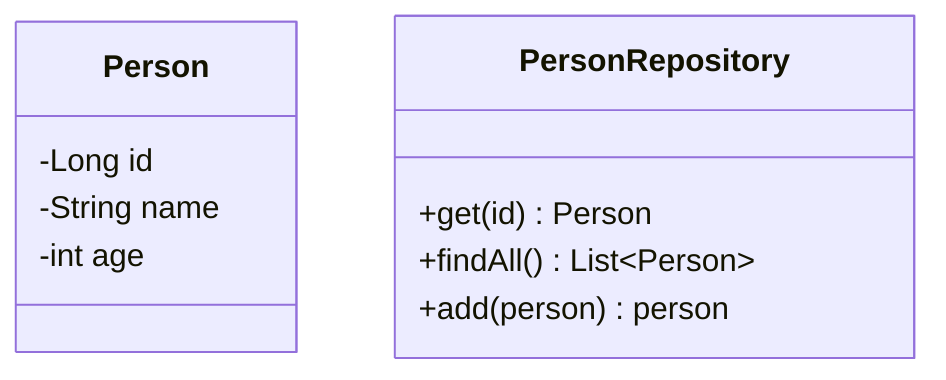

JUnit5がリリースされてから5年近く経ちましたが、皆さんはもう乗り換えましたか？私も遅ればせながら1年くらい前から本格的に使い始めましたがJUnit5便利ですよね。@Nestedのテストのカテゴリ化や@ParameterizedTestによるパラメタライズドテストなどJUnit5から入った便利な機能はいくつもありますが、その中でも筆者が特に気に入っているのはExtensionによるテストライフサイクルコールバックの拡張と引数の解決です。どちらもその仕組みを使わなくてもやりたいことは実現できたりしますが、この拡張機能を使うことでただでさえゴチャゴチャしがちなテストコードをスッキリさせることができます。

今回はこのテストライフサイクルコールバックの拡張と引数の解決のExtension実装を説明します。

[[TOC]]

記事はExtensionを使って実装するお題を説明し、その後にJUnit5のExtension機能の概要と今回利用する拡張ポイント、そして具体的な実装を説明していきます。

## Extensionを実装して作るもの
トランザクションが必要なことをアノテーションで指定されているテストメソッドに対して、テストメソッド開始前にトランザクションを開始し、テストメソッド終了でトランザクションを終了させる仕組みをExtension機能を使って実装します。

Springであれば[SpringTest](https://docs.spring.io/spring-framework/docs/current/reference/html/testing.html)で、JakartaEEであれば[Arquillian](https://arquillian.org/)の[Arquillian Persistence Extension](http://arquillian.org/arquillian-extension-persistence/)でそれぞれのフレームワークが定義するトランザクションアノテーションをテストメソッドにつけることによりトランザクション配下でテストを実行できるようになりますが、今回のサンプルで利用するMicroProfileはTransactionの扱いがオプションとなっているため、このような標準的な仕組み用意されていません。

そこで今回はExtensionの実装例としてMicroProfile実装の１つであるHelidonの"Helidon MP Testing with JUnit5"を使ったオレオレトランザクションサポート機能をExtensionを使って実装してみたいと思います。

:::check
記事の理解にMicroProfileとHelidoTestの知識は不要ですが、興味がある方は以下のブログを見ていただくのが良いと思います。
- [豆蔵デベロッパーサイト: 第1回 MicroProfileってなにそれ？ - MicroProfileの登場](https://developer.mamezou-tech.com/msa/mp/cntrn01-what-mp/)
- [豆蔵デベロッパーサイト: Helidon Tips - Helidon MP Testing with JUnit5を使ってみる](https://developer.mamezou-tech.com/msa/mp/ext02-helidon-testing/)
:::

今回は上述のExtensionを作っていきますが、その前にそもそも記事のテーマであるJUnit5のExtensionとその中で今回利用する拡張ポイントがどのようなものかを説明します。

## JUnit5のExtensionの概要
ExtensionはJUnit5から導入されたテストの仕組みを拡張可能にする機能で、その実体はメソッドが定義されていない単なるマーカーインタフェースとなります。拡張可能な拡張ポイントは複数用意されており[^1]、拡張ポイントごとにExtensionを継承したインタフェースが提供されています。拡張を行う場合は拡張ポイントに対するインタフェースを実装し、その実装クラスを@ExtendWithでテストクラスに指定します。今回はテストライフサイクルコールバックと引数の解決の拡張ポイントを使ってお題のExtensionを実装します。

[^1]:用意されている拡張ポイントとその詳細は「[JUnit5ユーザーガイド: 5.拡張モデル](https://oohira.github.io/junit5-doc-jp/user-guide/#extensions)」に詳しく説明されています。

### テストライフサイクルコールバック
JUnit5にはテストクラスごとの前処理／後処理を行う@BeforeAll/@AfterAllメソッドとテストメソッドごとに前処理／後処理を行う@BeforeEach/@AfterEachメソッド、そしてテストを実行する@Testメソッドがライフサイクルメソッドとして用意されていますが、テストライフサイクルコールバックの拡張インタフェースを実装することでそれぞれのライフサイクルメソッドの前後でJUni5からコールバックを掛けてもらうことができるようになります。

用意されている拡張インタフェースとコールバックタイミングは以下のとおりになります。


引用元: [JUnit5ユーザーガイド: 5.12. ユーザーコードと拡張機能の相対的な実行順序]( https://oohira.github.io/junit5-doc-jp/user-guide/#extensions-execution-order)

青字が拡張インフェースで、オレンジがライフサイクルメソッドになり、カッコ内の順番で呼び出しが行われます。また、グレーの網掛け部分はテストメソッドごとの繰り返しとなります。

### 引数の解決
ライフサイクルメソッドに引数が定義されている場合、ParameterResolverインタフェースを実装することでテスト実行時に任意の引数を与えることができるようになります。

ParameterResolverインフェースにはsupportsParameterメソッドとresolveParameterメソッドが定義されています。@BeforeEachや@Testなどのライフサイクルメソッドに引数が定義されている場合、そのライフライクルメソッドの実行前にテストのコンテキスト情報（テストコンテキスト）とライフサイクルメソッドに定義されているパラメータ情報（パラメータコンテキスト）を引数にsupportsParameterメソッドが呼び出されるため、supportsParameterメソッドではコンテキスト情報をもとに引数の解決を行うかをbooleanで返す実装を行います。

次にsupportsParameterメソッドでtrueが返された場合、引数の決定を行うresolveParameterメソッドが呼び出されるので、ここではコンテキスト情報などをもとにライフサイクルメソッドに渡したい引数の値を返却するようにします。JUnitは最終的にこの返却された値を引数にライフサイクルメソッドを呼び出します。

この一連の流れによりParameterResolverインタフェースを実装することでライフサイクルメソッドに任意の引数を渡すことができるようになります。

## 実装するExtensionの利用イメージ
Extensionと拡張ポイントの説明が終わったところで実装に入っていきたいところですが、いきなり実装の詳細に入っても作るもののイメージがまだ沸かないと思いますので、実装対象をよりイメージアップしてもらう意味でお題として作るオレオレトランザクションサポートExtensionを利用する側のコード例を先に説明したいと思います。

今回サンプルで利用するテストクラスは以下のPersonクラスをJPAを使って取得／検索／保存を行うRepositoryクラスのテストクラスとなります。

- PersonクラスとPersonRepositoryクラス


そして、Extensionを利用する側のコードとなるRepositoryのテストクラスのコードは次のようになります。

```java
@ExtendWith(JpaTransactionalExtension.class) // 1.
public class JpaPersonRepositoryTest {
    private JpaPersonRepository repository;
    @BeforeEach
    void setup(EntityManager em) { // 2.
        repository = new JpaPersonRepository(em);
    }
    @Test
    void tesGet() {
        var expected = new Person(1L, "soramame", 18);
        var actual = repository.get(1L);
        assertEquals(expected, actual);
    }
    @Test
    void tesGetAll() {
        var actual = repository.findAll();
        assertEquals(2, actual.size());
    }
    @Test
    @TransactionalForTest // 3.
    void testAdd() {
        var expected = new Person(null, "test", 99);
        var actual = repository.add(expected);
        expected.setId(3L);
        assertEquals(expected, actual);
    }
}
```
1. オレオレトランザクションサポートExtension（今から作るExtension実装クラス）を`@ExtendWith`で指定します。
2. Jakarta EE環境ではJPAの`EntityManager`は`@PersistenceContext`によりコンテナからInjectionされることで取得できますが、JUnit5はJavaSE環境のため自力で`EntityManager`を生成する必要がありま。Extensionではこの生成した`EntityManager`をParameterResolverインタフェースを実装することで@BeforEachメソッドの引数に渡せるようにします。
3. `@TransactionalForTest`が付いているテストメソッドはテスト実行前にExtension側でトランザクションを開始し、テストメソッド終了時には開始したトランザクションを確定するようにテストライフサイクルコールバックのExtensionを実装します。

なお、`TransactionalForTest`アノテーションは次のように定義しています。トランザクションはデフォルトではロールバックするようにしていますが、`shouldCommit`属性に`true`を指定することでコミットもできるようにします。
```java
@Target({ElementType.TYPE, ElementType.METHOD})
@Retention(RetentionPolicy.RUNTIME)
public @interface TransactionalForTest {
    boolean shouldCommit() default false;
}
```

## Extensionの実装

上記で説明したテストの仕組みを実現するにはすべてのテストライフサイクルメソッドに対して処理を織り込む必要があるため、Extension実装のJpaTransactionalExtensionクラスは以下のすべてのテストライフサイクルコールバックインタフェースを実装します。


次にJpaTransactionalExtensionが実装するそれぞれのテストライフサイクルコールバックインタフェースを処理の順を追って部分ごとに説明していきます。
なお、コードは一部抜粋となっています。テストコードも含め記事のサンプルコードの全量は以下のGitHubリポジトリを参照ください。
- <https://github.com/extact-io/person-multi-module-app>

### 1. テストクラスごとの前処理実行前(BeforeAllCallback#beforeAll)
```java
private static final String CURRENT_ENTITY_FACTORY = "CURRENT_ENTITY_MANAGER_FACTORY";
...
public void beforeAll(ExtensionContext context) {
  var unitName = geTragetUnitName();
  var properties = getPersistenceProperties();
  var emf = Persistence.createEntityManagerFactory(unitName, properties);
  Store store = getEntityManagerFactoryStore(context);
  store.put(CURRENT_ENTITY_FACTORY, new CloseableWrapper(emf));
}
...
private Store getEntityManagerFactoryStore(ExtensionContext context) {
  return context.getStore(Namespace.create(context.getRequiredTestClass()));
}
```
テストクラスで利用する`EntityManagerFactory`を生成し、後続のコールバックメソッドから利用できるように`ExtensionContext`のStore領域に保存しておきます。

`ExtensionContext`はコールバックされる際にJUnit5から引き渡されるコンテキストで、任意の情報を引き継ぐための領域(`Store`)や実行しているテストクラスやメソッドなどテストの実行状況を取得することができます。また、Store領域は任意の`Namespace`ごとに独立した領域を作成することができ、作成したStore領域はMapのようにキー名に紐づけてオブジェクトを保存することができます。

今回は実行しているテストクラスを`Namespace`にしたStore領域を生成し、そこへ定数定義した文字列をキーに`EntityManagerFactory`を保存しています。

また、生成した`EntityManagerFactory`はテストが異常終了した場合でも確実にclose処理が行われるようにJUnit5のCloseableResourceインタフェースを実装した`CloseableWrapper`クラスでラップしてStore領域に保存しておきます。JUnit5はStore領域を破棄する際に内包している要素にCloseableResourceのオブジェクトがあれば、CloseableResourceのcloseメソッドを呼び出します。

### 2. テストメソッドごとの前処理実行前(BeforeEachCallback#beforeEach)
```java
@Override
private static final String CURRENT_ENTITY_MANAGER = "CURRENT_ENTITY_MANAGER";
...
public void beforeEach(ExtensionContext context) throws Exception {
  Store factoryStore = getEntityManagerFactoryStore(context);
  EntityManagerFactory emf = factoryStore.get(CURRENT_ENTITY_FACTORY, CloseableWrapper.class).unwrap();
  Store managerStore = getEntityManagerStore(context);
  managerStore.put(CURRENT_ENTITY_MANAGER, new CloseableWrapper(emf.createEntityManager()));
}
...
private Store getEntityManagerStore(ExtensionContext context) {
  return context.getStore(Namespace.create(getClass(), context.getRequiredTestMethod()));
}
```
[BeforeAllCallback](#1-テストクラスごとの前処理実行前beforeallcallback#beforeall)で保存した`EntityManagerFactory`をStore領域から取り出します。取り出す際、Store領域には`CloseableWrapper`でラップしたものを格納しているのでunwrapをします。次に取り出した`EntityManagerFactory`からテストメソッドで使用するEntityManager(≒JDBCコネクション)を生成し、今度はExtensionクラスとテストメソッドのペアを`Namespace`にしたStore領域に定数定義した文字列をキーに`EntityManager`を保存しておきます。ここでも`EntityManagerFactory`と同様に`EntityManager`もclose処理が確実に行われるように`CloseableWrapper`クラスでラップしてStore領域に保存しておきます。

### 3. 引数が指定されているライフサイクルメソッド実行前(setupメソッド実行前)(ParameterResolver#supportsParameter)
```java
@Override
public boolean supportsParameter(ParameterContext parameterContext, ExtensionContext extensionContext) {
  return parameterContext.getParameter().getType() == EntityManager.class;
}
```

引数で渡された`ParameterContext`や`ExtensionContext`をもとに実行しようとしているライフサイクルメソッドに指定されている引数を解決（サポート）するかを決定します。今回は定義されている引数の型がEntityManagerの場合に`true`を返し、後続のresolveParameterメソッドが呼び出されるようにします。

### ４. 引数が指定されているライフサイクルメソッド実行前(setupメソッド実行前)(ParameterResolver#resolveParameter)
```java
public Object resolveParameter(ParameterContext parameterContext, ExtensionContext extensionContext) {
  Store store = getEntityManagerStore(extensionContext);
  return store.get(CURRENT_ENTITY_MANAGER, CloseableWrapper.class).unwrap();
}
```
ParameterResolver#supportsParameterで`true`が返された後に呼び出されるコールバックメソッドで、ライフサイクルメソッドの引数に渡す値を返却します。今回は[BeforeEachCallback](#2-テストメソッドごとの前処理実行前beforeeachcallback#beforeeach)で`ExtensionContext`のStore領域に保存していた`EntityManager`を取得し、そのインスタンスを返します。これにより戻り値で返したEntityManagerインスタンスがJUnit5を経由し、最終的にはsetupメソッドのem引数に渡されます。なお、Store領域には`CloseableWrapper`でラップしたものを格納しているのでunwrapしてから返却しています。

### 5. テストメソッド実行前(BeforeTestExecutionCallback#beforeTestExecution)
```java
private static final String CURRENT_ENTITY_TRANSACTION = "CURRENT_ENTITY_TRANSACTION";
...
public void beforeTestExecution(ExtensionContext context) throws Exception {
  if (!AnnotationSupport.isAnnotated(context.getTestClass()
            , TransactionalForTest.class)
      && !AnnotationSupport.isAnnotated(context.getTestMethod()
            , TransactionalForTest.class)) {
    return;
  }
  Store store = getEntityManagerStore(context);
  EntityManager em = store.get(CURRENT_ENTITY_MANAGER, CloseableWrapper.class).unwrap();
  if (em == null) {
    throw new IllegalStateException("EntityManager is unset.");
  }
  var tx = em.getTransaction();
  tx.begin();
  store.put(CURRENT_ENTITY_TRANSACTION, tx);
}
```
BeforeTestExecutionCallback#beforeTestExecutionはすべてのテストメソッドに対してコールバックされるため、`ExtensionContext`から実行対象となっているテストクラスとテストメソッドを取得し、どちらかに`@TransactionalForTest`が付いている場合にトランザクションを開始するようにします。トランザクションの開始は[BeforeEachCallback](#2-テストメソッドごとの前処理実行前beforeeachcallback#beforeeach)でのStore領域に保存していた`EntityManager`に対して行い、開始したトランザクションオブジェクト(EntityTransaction)を`EntityManager`と同じStore領域へ定数定義した文字列をキーに保存しておきます。

### 6. テストメソッド実行後(AfterTestExecutionCallback#afterTestExecution)
```java
public void afterTestExecution(ExtensionContext context) {
  // Give priority to Method Annotation
  TransactionalForTest transactionalTest = AnnotationSupport
      .findAnnotation(context.getRequiredTestMethod()
        , TransactionalForTest.class)
      .orElse(AnnotationSupport.findAnnotation(context.getRequiredTestClass()
        , TransactionalForTest.class)
      .orElse(null));
  if (transactionalTest == null) {
    return;
  }
  Store store = getEntityManagerStore(context);
  var tx = store.remove(CURRENT_ENTITY_TRANSACTION, EntityTransaction.class);
  if (transactionalTest.shouldCommit()) {
    tx.commit();
  } else {
    tx.rollback();
  }
}
```
[BeforeTestExecutionCallback](#5-テストメソッド実行前beforetestexecutioncallback#beforetestexecution)と同様に`@TransactionalForTest`の有無により処理対象かを判定し、処理対象の場合は[BeforeTestExecutionCallback](#5-テストメソッド実行前beforetestexecutioncallback#beforetestexecution)で開始したトランザクションをStore領域から取得し、トランザクションを確定します。
トランザクションは`TransactionalForTest`の`shouldCommit`属性が`true`の場合はコミット、`false`の場合はロールバックをします（デフォルトはfalse）。
なお、トランザクションの取得はStore#removeで行っていますが、これはStore領域からの要素の取得と削除になります。

### 7. テストメソッドごとの後処理実行後(AfterEachCallback#afterEach)
```java
public void afterEach(ExtensionContext context) {
  Store store = getEntityManagerStore(context);
  store.remove(CURRENT_ENTITY_MANAGER, CloseableWrapper.class).close();
}
```
テストメソッドごとの共通的な後処理として[BeforeEachCallback](#2-テストメソッドごとの前処理実行前beforeeachcallback#beforeeach)で生成した`EntityManager`をStore領域から削除するとともにclose処理を行います。

### 8. テストクラスごとの後処理実行後(AfterAllCallback#afterAll)
```java
public void afterAll(ExtensionContext context) {
  Store store = getEntityManagerFactoryStore(context);
  store.remove(CURRENT_ENTITY_FACTORY, CloseableWrapper.class).close();
}
```
テストクラスごとの共通的な後処理として[BeforeAllCallback](#1-テストクラスごとの前処理実行前beforeallcallback#beforeall)で生成した`EntityManagerFactory`をStore領域から削除するとともにclose処理を行います。


最後にGitHubのJpaTransactionalExtensionクラスの全量コードは[こちら](https://github.com/extact-io/person-multi-module-app/blob/main/person-persistence-jpa/src/test/java/io/extact/sample/person/persistence/jpa/junit5/JpaTransactionalExtension.java)になります。

## まとめ
JUnit5のExtension は若干とっつきにくいところがありますが、うまく使うことでテストコードをスッキリさせることができます。 
ただし、使い過ぎるとかえってテストコードが追いにくくなったりします。共通的な処理を見つけるとなんでもExtensionで実装したくなる気持ちは分かりますが拡張は用法用量を守って行いましょう！

---
参照資料

- [JUnit 5 ユーザーガイド](https://oohira.github.io/junit5-doc-jp/user-guide/)
