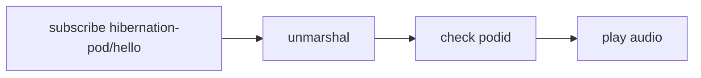

2002年の「[Patterns of Enterprise Application Architecture](https://www.amazon.co.jp/dp/0321127420/) ([エンタープライズアプリケーションアーキテクチャパターン](https://www.amazon.co.jp/dp/B01B5MX2O2/))」と2003年の「[Domain-Driven Design: Tackling Complexity in the Heart of Software](https://www.amazon.co.jp/dp/0321125215/) ([エリック・エヴァンスのドメイン駆動設計](https://www.amazon.co.jp/dp/B00GRKD6XU/))」、「[Enterprise Integration Patterns: Designing, Building, and Deploying Messaging Solutions](https://www.amazon.co.jp/dp/0321200683/) (通称 EIPs)」は20年近く経った今でも人気のある書籍です。

唯一日本語の訳本のない「EIPs」ですが、ここに書かれているパターンを認知しているかは別としてソフトウェア開発の中では当然のように使われているものが多数あります。

この記事では EIPs を実装したオープンソースソフトウェア (OSS) である [Apache Camel](https://camel.apache.org/) を使い、[Publish/Subscribe Channel](https://www.enterpriseintegrationpatterns.com/PublishSubscribeChannel.html) パターンの Subscribe 側のアプリケーションを見ていくことにします。

この記事のコード全体は [GitHub リポジトリ](https://github.com/edward-mamezou/hibernation-pod)にあります。

## 作成するアプリケーション

題材としては、別の[シリーズ記事](/blogs/2022/06/09/openapi-generator-2/)に書いた宇宙船の冬眠カプセルを使うことにします。


この図を描いた当初は中央のクラスタが、開いた冬眠カプセルを特定し、冬眠カプセルのホスト名を取得して挨拶の音声の再生を要求しようと考えていました。

しかし、冬眠ポッド (Hibernation Pod) を開発しているチームと中央を開発するチームは異なっていて、冬眠ポッドのチームは冬眠ポッドを誰が使っているか、冬眠ポッドのホスト名リストを変更があるたびに中央のチームと連携するオーバーヘッドが気になっていました。

:::info
中央のチームが「冬眠カプセル」と呼んでいるものを、別のチームでは「冬眠ポッド」と呼んでいるというような用語の違いはおなじみでしょう。このイベントストーミングの結果がユビキタス言語を表すものであるとすれば、両者は用語を統一すべきでしょう。
:::

冬眠ポッドチームは、冬眠ポッド (中央のチームが、冬眠カプセルと呼んでいるもの) が開いた時、認証情報とともに冬眠ポッドID (PodId) を付加して中央のクラスタに通知することとしました。また、中央で音声ファイルが生成された時、イベントを Publish することを提案し中央チームの了解を得ることができました。

結果として「冬眠カプセルのホスト名リスト」という集約はひとまず不要となりました。

## Publish/Subscribe Channel に使用するインフラストラクチャ

今回作成するアプリケーションは MQTT を採用しました。

pub/sub で使用するインフラとして Kafka の人気が高いですが、自動車等の組込用途では CPU やメモリなどの厳しいリソース制約があり、フットプリントの小さい [MQTT](https://mqtt.org/) が採用される場合も多いです。実際 [AWS IoT Core](https://docs.aws.amazon.com/iot/latest/developerguide/mqtt.html) や [Azure IoT Hub](https://docs.microsoft.com/en-us/azure/iot-hub/iot-hub-mqtt-support) ではこうしたデバイスとの通信に MQTT のサポートがあります。


pub/sub は、誰かがイベント/メッセージを取り出したら見えなくなる [Amazon SQS](https://aws.amazon.com/jp/sqs/) などのメッセージキューとは全く異なります。

この記事の場合は、全ての冬眠ポッドが購読者 (subscriber) となり、それ自身へのイベントだけをフィルター (イベントに含まれる PodId を使用) して処理します。つまり、中央がイベントを冬眠ポッドに送信しようとする場合、それぞれの冬眠ポッドのホスト名やアドレスを知る必要はありません。それぞれの冬眠ポッドが、自身へのイベントにのみ反応し、自身以外のイベントは無視します。

## Spring Boot プロジェクトの作成

Spring Boot プロジェクトの作成では、"start.spring.io" にある [spring initializr](https://start.spring.io/) を使用すると便利です。

今回は、Apache Camel との統合が必要だったため、Spring Boot のバージョンは "2.6.8" を選択しました。

- Project: Gradle Project
- Language: Java
- Spring Boot: 2.6.8
- Packaging: jar
- Java: 17
- Dependencies
  - Apache Camel
  - Spring Boot DevTools

2022年6月11日に生成したプロジェクトの Apache Camel のバージョンは "3.17.0" になりました。

### イベントのフォーマット

イベントのフォーマットには JSON 形式を採用することにしました。Apache Camel で使用できる JSON ライブラリにはいくつかありますが、Spring でよく使われている Jackson を使用することとし、プロジェクトの `build.gradle` の依存関係に次のように追加しました。

```groovy
	implementation 'org.apache.camel.springboot:camel-jackson-starter:3.17.0'
```

### MQTT サポート

MQTT を扱うライブラリもいくつかありますが、ここでは筆者自身の馴染みもある [Eclipse paho](https://www.eclipse.org/paho/) を採用することにしました。一番の決め手は Apache Camel Version 3.17.0 に対応していたためです。`build.gradle` に次のように追加しました。

```groovy
	implementation 'org.apache.camel.springboot:camel-paho-starter:3.17.0'
```

## フロー

さて、開発を進める準備ができました。

改めて、ここで処理の流れを考えてみることにします。



1. 「挨拶の音声を再生する」コマンドは、MQTT のトピック "hibernation-pod/hello" を購読します。
2. イベントを受信すると、Jackson ライブラリを使ってオブジェクト "HelloEvent" に変換します。
3. 変換された "HelloEvent" の "podId" フィールドを確認して自身宛かをチェックします。ここで `true` を返した場合のみ後続に処理が流れます。
4. 自身宛のイベントの "helloVoice" フィールドの URL にアクセスして挨拶の音声を再生します。
   
Apache Camel ではこのような流れを `RouteBuilder` を拡張したクラスにドメイン固有言語 (DSL) で定義します。

`HibernationPodRoute` の[コード](https://github.com/edward-mamezou/hibernation-pod/blob/main/src/main/java/com/mamezou_tech/hibernation_pod/controller/api/HibernationPodRoute.java)は次の通りです。

```java
package com.mamezou_tech.hibernation_pod.controller.api;

import com.mamezou_tech.hibernation_pod.application.HelloProcessor;
import com.mamezou_tech.hibernation_pod.controller.model.HelloEvent;
import org.apache.camel.builder.RouteBuilder;
import org.apache.camel.model.dataformat.JsonLibrary;
import org.springframework.beans.factory.annotation.Autowired;
import org.springframework.stereotype.Component;

@Component
public class HibernationPodRoute extends RouteBuilder {

    private final PodFilter podFilter;

    private final HelloProcessor helloProcessor;

    @Autowired
    public HibernationPodRoute(PodFilter podFilter, HelloProcessor helloProcessor) {
        this.podFilter = podFilter;
        this.helloProcessor = helloProcessor;
    }

    @Override
    public void configure() {
        from("paho:hibernation-pod/hello")
            .unmarshal().json(JsonLibrary.Jackson, HelloEvent.class)
            .filter(podFilter)
            .process(helloProcessor);
    }
}
```

`configure` メソッドの `from` が `hibernation-pod/hello` トピックを購読することを意味しています。

`unmarshal` は JSON 形式のメッセージを `HelloEvent` 型に変換させています。

`filter` の処理を実装する `PodFilter` により、自身の冬眠ポッドID (podId) とイベントに設定された冬眠ポッドID (podId) を比較し、一致したら `true` を返します。

`process` は、イベントから URL (helloVoice) を取り出してインフラストラクチャー層のオーディオプレーヤーを実行します。

このコードでは、Spring Boot と統合したため `@Autowired` を使って注入したオブジェクトを DSL 内で使用できています。Spring Boot との統合の利点は DI 以外にもあります。さまざまなインフラへの接続先等の `application.properties` ファイルへの記述には一定のルールがあるため、推測しやすく学習コスト上の利点です。

ここで使用している `paho` のための設定は次の通りです。

```text
camel.component.paho.broker-url=tcp://localhost:1883
```

他のコンポーネントも基本的に `camel.component.` にコンポーネント名が続くルールとなっています。

さらに運用時に、この値を Spring の機能によって環境変数 "CAMEL_COMPONENT_PAHO_BROKER_URL" で上書きできます。

## アプリケーションのレイヤー構成

このアプリケーションでは、入力されたイベントに設定された URL の音声イメージ (wave 形式) を再生するだけのため、ドメイン層は用意しませんでした。

コントローラ層では、サブスクライブとフィルター処理、アプリケーション層では、イベントの中身の取り出し、インフラストラクチャ層では `javax.sound` モジュールを使ってオーディオ再生する実装となっています。

## まとめ

[Apache Camel](https://camel.apache.org/) は日本ではあまりメジャーでないように感じていますが、多くのエンタープライズ統合パターン (EIPs) をサポートし、MQTT 以外にも非常に多くの[コンポーネントのリスト](https://camel.apache.org/components/3.17.x/index.html)があります。

記事では Spring Boot との統合を説明しました。他では [Quarkus](https://quarkus.io/) を拡張する [Camel Quarkus](https://camel.apache.org/camel-quarkus/2.9.x/) もあります。

## 参考

- [Azure IoT HubのMQTT(s)](https://s-edword.hatenablog.com/entry/2016/08/23/140633)
