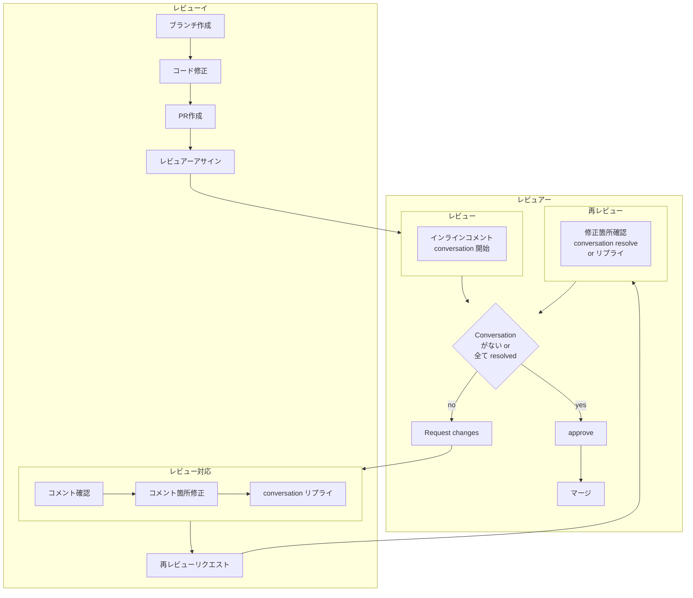
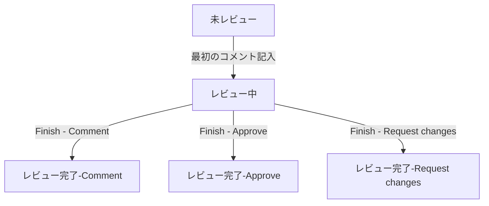

GitHub の PR(Pull Request) レビューのプロセスは、開発チームによってバリエーションはあると思いますが、おおよそ次のようになると思います。

レビューイは PR を作って、レビュアーをアサインし、アサインされたレビュアーが、ソースコードにインラインコメントしてレビューを完了します。レビューイは指摘があれば対応、再レビューリクエストし、レビュアーの再レビューで問題なければ承認(approve)、マージという流れです。

:::info
このフローではレビュアーが approve 後にマージしていますが、approve 後であれば、レビューイがマージしても構いません。特にレビュアーが複数の場合は、レビューイがマージする方が分かりやすいでしょう。

また、このフローでは PR 作成してすぐにレビュアーアサインしていますが、Draft で PR を作成し準備ができるまで、レビュアーのアサインやレビュー自体ができない状態にすることも可能です[^1]。

[^1]: Draft の PR は Organization と Public リポジトリで利用可能です。

Draft の PR で準備が完了したら、`Ready for review` をクリックしてレビュアーをアサイン可能にします。

:::

フローに登場する、コメントを起点とする conversation について少し詳しめに説明します。

GitHub のレビューでは、コードにインラインでコメントしますが、PRに対して最初のコメントを記入し、`Start a review` ボタンをクリックすることでレビュー中状態に移行します。

インラインコメントは、即時にレビューイに開示されるのではなく、Pending 状態になり、レビューを完了するまでは、レビュアーにのみ見えています。レビュー中はコメントを何度編集しても edited のようなマークはつきません。

コードに対する1つのコメントを起点としたコメント-リプライのセットが1つの conversation として管理されます。

レビュアーはコメントの記入が終わったら、`Finish your review` をクリックしてレビュー完了のコメントを残すとともに、ラジオボタンから、レビュー結果を選択します。

一人のレビュアーにとっては、PR(アサイン後)の状態は以下のように遷移します。

Approve は PR を承認した状態で、レビュアーの右にチェックマークが付きます。

Request changes はレビューイに PR の修正を要求、Comment は単にコメントして完了です。いずれも、レビュアーの右に状態とともに、`Re-request review` のリロードのようなボタンが表示されます。

レビューイは、approve でない場合はコードを修正し push した上で conversation にリプライすることでレビュアーに対応内容を返信します。レビュアーは再レビュー時に conversation と修正箇所を個別に確認し、問題なければ resolve します[^2]。

[^2]: スクリーンショットはすでに resolve した conversation を開いたものなので、ボタンが Unresolve になっています。

Conversation が全て resolve されるとレビュー完了で approve ということになります。

つまり、レビューとその対応の中で、

- レビューイはコードを修正するだけでなく、conversation にリプライする
- レビュアーはリプライとコード修正を確認して問題なければ、conversation を resolve する

のように conversation 単位でやり取りを完結するようにします。

conversation にリプライせず、コードを push しただけで再レビュー依頼をする人がよくいますが、レビュアーからすると修正されたのか、修正されていない場合コメントを見逃しているのか、それとも修正不要と判断したのか、などがぱっとわかりません。指摘箇所が多い場合はかなりの労力で、無駄に再レビューの回数も増えたりします。

conversation の存在はあまり意識していない人も多いかもしれませんが、このように対話が成立するように使うとレビューの進捗が分かりやすく、レビューイ、レビュアーがお互いにストレスなく作業できると思います。
