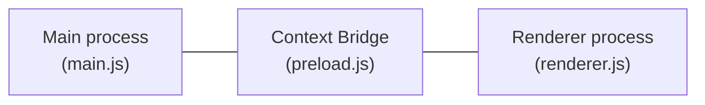

昨年書いた「[非公式 Scrapbox アプリを開発している話](/blogs/2021/12/15/developing-unofficial-scrapbox-app/)」の記事の最後に

> Electron のリリース速度が早まり、古いバージョンのサポート切れが容赦なくて追従するのが大変ではありますが・・。

と書いていましたが、その後、実際に追従できなくなりました。

Electron v14 から v15 にアップデートすると、ページ一覧画面でプライベートな Scrapbox プロジェクトを表示できなくなってしまいました。Scrapbox API でデータを取得しているのですが、WebView 間で認証情報が共有されなくなったようです。Main プロセス側で API を呼び出すことで一応回避は可能です。しかし WebView を使っていること自体がもはや非推奨です。

タブの UI は [electron-tabs](https://www.npmjs.com/package/electron-tabs) というライブラリを使って WebView を切り替える形で実装していました。このコンポーネントも非推奨の webPrefereces オプション `nodeIntegration` と `webviewTag` を有効化しないと使えません[^1]。

ということで、これまでの作りで継続していくのは無理だと判断しました。

[^1]: 最新バージョンでは、`nodeIntegration` を有効化せずに使えるようになっています。

- [Electron - WebView から BrowserView に移行する](/blogs/2022/01/07/electron-browserview/)
- [electron-quick-start のコミット履歴で見る Electron プログラミングモデルの変遷](/blogs/2022/02/14/history-of-electron-quick-start/)

これらの記事を書いた頃から式年遷宮に着手しました。BrowserView の利用についてはある程度見通しがついていたので、既存機能を徐々に移行していきました。

タブの UI ですが、前述の通り electron-tabs を利用して作っていました。


BrowserView 向けにはこのような便利コンポーネントはないので、最初は button を横に並べて動的に生成することで開発を進めていました。最終的には、UI は全て Vuetify のコンポーネントで作ることにして、タブも Vuetify のものを使いました。


フラットな見た目ですが、タブが増えて画面から溢れると自動的にスクロールするようにできたりして、悪くない感じです。

ちょっと困ったのが、BrowserView ではレイアウトが自在にできないという点です。元々お気に入りや履歴などの機能は、ツールバーからドロップダウンリストを出す UI でした。


しかし、BrowserView は Main Window に 子 Window を重ねているようなもので、ドロップダウンリストが下に隠れてしまうため、ツールバー部分からコンテンツにかぶさるような描画はできません。


なので、お気に入りや履歴も独立したページにして BrowserView で表示するようにしました。


[Electron プログラミングモデルの変遷の記事](/blogs/2022/02/14/history-of-electron-quick-start/)にも書きましたが、Renderer プロセスで Node.js の機能を使うプログラミングは非推奨で、preload スクリプトで Node.js の機能をブリッジする構造が推奨されています。



Scrapbox のページ、お気に入りページ、履歴ページ、一覧のページを BrowserView で作り、ページのメタ情報を表示するための子ウィンドウ を BrowserWindow で作っていますが、それぞれに preload スクリプトを用意して、Main プロセスとブリッジするようにしました。

例えば、履歴ページでは、表示するページ遷移履歴を BrowserView を管理している Main プロセスから取得しています。

まず、preload スクリプトでは、getHistory という API を定義します。Main プロセスと IPC 通信をして、履歴情報を取得し返却しています。また、Main プロセスからの受信用のイベントハンドラーも用意しています。

```javascript
const { contextBridge, ipcRenderer } = require('electron');

contextBridge.exposeInMainWorld(
  'api', {
    getHistory: async () => {
      const history = await ipcRenderer.invoke('get-history');
      return history;
    },
    on: (channel, callback) => ipcRenderer.on(channel, (event, ...args) => callback(event, ...args))
  }
);
```

履歴ページの Vue.js 側の処理では、フォーカス時に呼び出される onFocus 関数で getHistory API を呼び出し描画する履歴データを更新しています。

```javascript
const app = new Vue({
  vuetify: new Vuetify(),
  el: '#app',
  async mounted () {
    window.api.on('browser-window-fucus', this.onFocus);
    window.api.on('bring-to-top', this.onFocus);
    await this.onFocus();
  },
  methods: {
    async onFocus () {
      const history = await window.api.getHistory();
      this.items = history;
    },
  },
  data: () => ({
    selectedItem: 0,
    items: [],
  })
});
```

`browser-window-fucus` は、アプリのメインウィンドウがアクティブになった時のイベント、`bring-to-top` は 履歴ページがアプリ内でアクティブになった時のイベントです。


Main process では、preload スクリプトから通知があったタイミングでヒストリ情報をデータストアから取得して返しています。

```javascript
ipcMain.handle('get-history', async () =>{
  const history = store.get('history');
  return history;
});
```

このように、すべて preload スクリプトを介して IPC 通信でデータを受け渡す必要があるのでちょっと面倒ですが、Renderer プロセスは普通の Vue のコードになるし、各プロセスの役割もはっきりしてあまり実装に悩まなくてよくなりました。

Vuetify はデスクトップアプリの UI コンポーネントとしては情報密度が低く、少し間伸びした感じがありますが、機能が充実しており、Darkmode toggle にも対応しているので、これでいいかということになりました。

週末などで少しずつ移植を進め、main ブランチにマージしました。Electron v14 のサポート切れには間に合いませんでしたが。

[Release v3.0.0 · kondoumh/sbe](https://github.com/kondoumh/sbe/releases/tag/v3.0.0)

移行前の MainWindow では、webPreferences で3つも推奨値を変更して使っており、継続性が危機的状況でした。

```javascript
webPreferences: {
  nodeIntegration: true,
  webviewTag: true,
  contextIsolation: false
}
```

移行後の webPreferences は preload の指定のみになりました。

```javascript
webPreferences: {
  preload: path.join(__dirname, 'preload.js')
}
```

なんとか Electron v19 以降にキャッチアップできて、開発を継続できる状態になりました。
