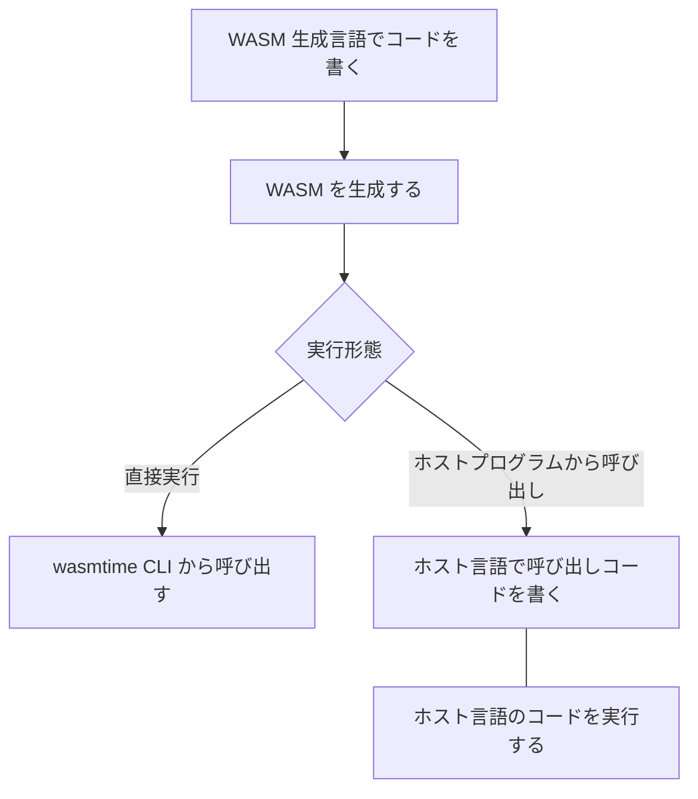

Bytecode Alliance は WebAssembly(WASM) のランタイムである [Wasmtime](https://wasmtime.dev/) が v1.0 に到達し Production Ready になったことを宣言しました。

[Wasmtime Reaches 1.0: Fast, Safe and Production Ready!](https://bytecodealliance.org/articles/wasmtime-1-0-fast-safe-and-production-ready)

Wasmtime は 以前「[スタンドアローンおよび言語組み込みの WebAssembly ランタイム Wasmer](/blogs/2022/03/21/wasmer/)」という記事で紹介した [Wasmer](https://wasmer.io/) と同様、WASI (WebAssembly System Interface: WASM をブラウザ以外の環境で実行するためのインターフェース) を実装する WASM ランタイムです。

すでに、Shopify、Fastly、DFINITY などの著名サービスのプロダクション環境で、半年から1年以上の実績があるとのことです。

:::info
Fastly は自社開発の WASI をサポートする WASM ランタイム Lucet を持っていますが、開発・利用共に Wasmtime に完全に移行したようでリポジトリはアーカイブされていました。

[GitHub - bytecodealliance/lucet: Lucet, the Sandboxing WebAssembly Compiler.](https://github.com/bytecodealliance/lucet)
:::


## WASI 対応 WASM の開発フロー

WASI 対応の WASM を作成し利用するフローは以下のようになります。



## WASI 対応 WASM の作成方法の選択肢

WASI 対応の WASM を作成する手段は以下があります。

- WASM を生成できるネイティブコード生成言語で書く
  - Rust
  - C/C++
  - AssemblyScript
- WAT (WebAssembly Text Format: LISP の S 式)で書く

WAT でのハンドアセンブルはかなりの猛者でないと厳しいでしょう。

C/C++ については環境構築を楽にするための SDK が提供されています。

[GitHub - WebAssembly/wasi-sdk: WASI-enabled WebAssembly C/C++ toolchain](https://github.com/WebAssembly/wasi-sdk)

ビルドオプションがまだ安定していないなど若干難がありますが、C/C++ の資産を活用する場合は選択することになります。

AssemblyScript については下記のコラムで紹介しているように、WASI 対応としては微妙な状態です。

Rust は慣れが必要ですが、WASI 対応の WASM を作成する上で最も素直な選択と言えるでしょう。

:::info
AssemblyScript は TypeScript のコードを WASM にコンパイルするプロジェクトです。Web デベロッパーに馴染みのある言語で WASM を生成できるため、WASM を使用するプロジェクトでは有力な選択肢と目されています。

先月 AssemblyScript プロジェクトは、WASI サポート機能を削除しました。

[https://twitter.com/AssemblyScript/status/1561699214069047299](https://twitter.com/AssemblyScript/status/1561699214069047299)
> A new week, a new major AssemblyScript version! Among general improvements, we have removed support for WASI and from now on consider WASI, derived proposals, the W3C's endorsement of its subgroup and the Bytecode Alliance's practices harmful to open Web standards. 💔

プロジェクトは WASI が WASM 仕様にとって有害であると宣言しており、Bytecoode Aliance との関係も悪化した模様です。

[AssemblyScript project: WASI damages open standards and the web &bull; DEVCLASS](https://devclass.com/2022/09/08/assemblyscript-project-wasi-damages-open-standards-and-the-web/)

代わりに AssemblyScript からは WASI の Shim が提供されており、既存のコードをマイグレーションすることが可能です。

[GitHub - AssemblyScript/wasi-shim: Patches the AssemblyScript compiler to utilize WASI imports instead of Web APIs.](https://github.com/AssemblyScript/wasi-shim)
:::

## Rust での WASI 対応 WASM 作成

Rust ではビルドターゲットとして`wasm32-wasi` を追加します。

```shell
$ rustup target add wasm32-wasi
info: downloading component 'rust-std' for 'wasm32-wasi'
info: installing component 'rust-std' for 'wasm32-wasi'
```

引数指定されたファイルを読んで表示する簡単なコードで試してみます。

```shell
cargo new --bin simple_cat
```

CLI の引数を処理する structopt を Cargo.toml の dependencies に追加しています。

```toml
[package]
name = "simple_cat"
version = "0.1.0"
edition = "2021"

# See more keys and their definitions at https://doc.rust-lang.org/cargo/reference/manifest.html

[dependencies]
structopt = "0.3"
```

```rust
extern crate structopt;

use structopt::StructOpt;
use std::path::PathBuf;
use std::fs;

#[derive(StructOpt)]
#[structopt(name = "simple_cat", about = "Simple cat program")]
pub struct Options {
    #[structopt(parse(from_os_str))]
    filename: PathBuf,
}

fn main() {
    let options = Options::from_args();
    let contents = fs::read_to_string(options.filename)
        .expect("Something went wrong reading the file");
    println!("{}", contents);
}
```

`--target wasm32-wasi` オプションでビルドします。

```shell
cargo build --target wasm32-wasi
```
```
   Compiling unicode-width v0.1.10
   Compiling atty v0.2.14
   Compiling ansi_term v0.12.1
   Compiling vec_map v0.8.2
   Compiling bitflags v1.3.2
   Compiling strsim v0.8.0
   Compiling lazy_static v1.4.0
   Compiling textwrap v0.11.0
   Compiling clap v2.34.0
   Compiling structopt v0.3.26
   Compiling simple_cat v0.1.0 (/Users/masahiro-kondo/dev/wasm-study/wasmtime/simple_cat)
    Finished dev [unoptimized + debuginfo] target(s) in 2.00s
```

プロジェクトの `target/wasm32-wasi/debug` 配下に WASM ファイルが生成されます。


## wasmtime CLI による実行
まず、wasmtime CLI をインストールします。

```shell
curl https://wasmtime.dev/install.sh -sSf | bash
```

WASI はサンドボックスモデルのため、ファイルを読むために `--dir` オプションでファイルがあるディレクトリへのアクセス権を付与して実行する必要があります。

```shell
wasmtime --dir . target/wasm32-wasi/debug/simple_cat.wasm -- ./Cargo.toml
```
```
[package]
name = "simple_cat"
version = "0.1.0"
edition = "2021"

# See more keys and their definitions at https://doc.rust-lang.org/cargo/reference/manifest.html

[dependencies]
structopt = "0.3"
```

:::info
ちなみに、Wasmer でも CLI のオプションは互換性があり、上記のコマンドの `wasmtime` を `wasmer` に変えても実行できます。
:::

wasmtime は 上記のようなエントリーポイントのある WASM だけでなく `--invoke` フラグを使ってモジュールで公開されている関数を呼び出すこともできます。

```shell
wasmtime --invoke some_func foo.wasm
```

## ホスト言語からの呼び出し
Wasmtime の言語への組み込みとしては、Rust / C / Python / .NET / Go をサポートしています。

[Using WebAssembly from your language - Wasmtime](https://docs.wasmtime.dev/lang.html)

## まとめ
Wasmtime による開発の流れを見てみました。

サーバーレスやエッジ環境では ポータビリティとランタイムの起動速度、実行速度、そしてセキュリティが重要になります。非力なデバイスでもそれは同様です。Wasmtime は WASM の特性を活かし、ランタイムを速くセキュアなものにしてくことで、これを実現しています。

v1.0 の公開ブログでは、以下のようなユースケースも紹介されています。

- WASM をデータベース内で実行することにより、データベースと分離された従来のアプリでは不可能な速度と安全性を実現する
- ホストの VM や OS に依存しないセキュアで分離された実行環境(Trusted execution environments: TEEs)を実現する

セキュリティ実現のために、Wasmtime の[サプライチェーンセキュリティ](/blogs/2022/08/17/github-actions-workflows-for-software-supply-chain-security/)に [cargo vet](https://mozilla.github.io/cargo-vet/) を導入していたり、Fuzzing Test を頑張ったり、セキュリティ検証のために形式言語を利用したりなどの対策を実施しているそうです。

Wasmtime、通常の業務アプリで利用するケースはあまりなさそうですが、プラットフォーム的なサービス開発では有効な選択肢になっていきそうです。
