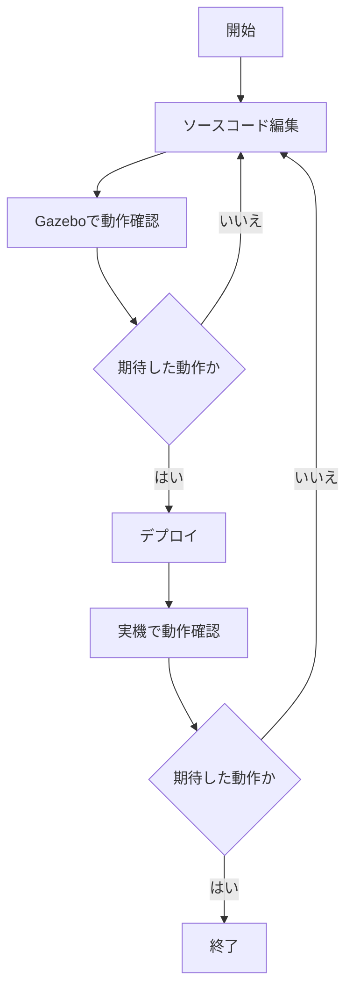

社内のとある技術相談会で、所属しているグループのインターンシップを紹介したところ、内容が面白いので記事を書いてみないかということで書いてみました。   

[[TOC]]

## はじめに
エンジニアリングソリューション事業部には八王子を拠点としたロボット開発グループがあります。  
新卒向けにロボット開発を体験してみようという名目でインターンシップを開催しています。  
その内容について紹介したいと思います。

:::info
ロボット開発者を募集しております。[採用情報](https://hrmos.co/pages/mamezou-recruit/jobs?category=1751150653226418177)
:::

## 6軸ロボットの制御ソフトウェア開発を体験しよう
ロボット工学の講義とロボットアームを制御するソフトウェアの開発がインターンシップの内容になります。

コロナが流行る前は豆蔵の新宿本社にて開催されていましたが、コロナ禍の現在はリモートによる開催となっています。  
  
リモート環境を活かし、AWSや[Gazeboシミュレータ](https://gazebosim.org/home)などを取り入れて今風な開発ができるコンテンツに成長しています。  

## システム構成
システム構成は以下になります。  

- 受講者はWebブラウザから[Amazon EC2](https://aws.amazon.com/jp/ec2/)のサービスを利用してUbuntuの仮想デスクトップへログインします。  
- Ubuntu上にはあらかじめ、Gazeboシミュレータを配置しており、実装したコードをシミュレーションできます。  
- コードの開発環境は[Amazon Cloud9](https://aws.amazon.com/jp/cloud9/)を利用してアプリケーションを開発します。  
- Gazeboシミュレータで動作確認をしたら八王子の会場にある実機のロボットへコードをデプロイします。  
- 実機のロボットとは[AWS IoT Core](https://aws.amazon.com/jp/iot-core/)を利用して通信します。

## コンポーネント構成
コンポーネントの構成は以下になります。  
  
シミュレータ、実機ともに[ROS](https://www.ros.org/)で制御しています。  
ROSは近年のロボット開発において採用されることが多く、ロボット開発に必要なツールやライブラリが充実しています。 

## 演習内容
あらかじめ用意したアーム制御のAPIを利用して、ロボットアームを八の字に動かしたり、受講者がテーマを決めてオリジナルな動きをするアプリケーションを開発したりします。  

## 開発の流れ
開発の流れは以下になります。 

ロボット開発はソフトウェアだけでなく、メカ、エレキの開発も含まれます。  
シミュレータをうまく活用する事でメカ、エレキの完成を待たずして、ソフトウェアの開発を進めることができます。  
また、事前にシミュレータで動作確認を行うことで、実機で事故をするリスクを低減させることができます。

インターンシップではシミュレータを取り入れることによって、より実際のロボット開発の近い体験をしてもらうことができるようになりました。

## 参加者の声
- シミュレータと実機の動作を繰り返すロボット開発の基本を体験出来て面白かった
- AWSのツールを使用してロボット開発を体験できて良かった

## まとめ
流行りの要素技術が詰まったインターンシップです。  
  

以上、お疲れ様でした。  