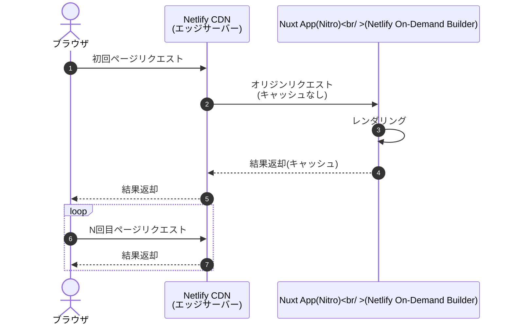
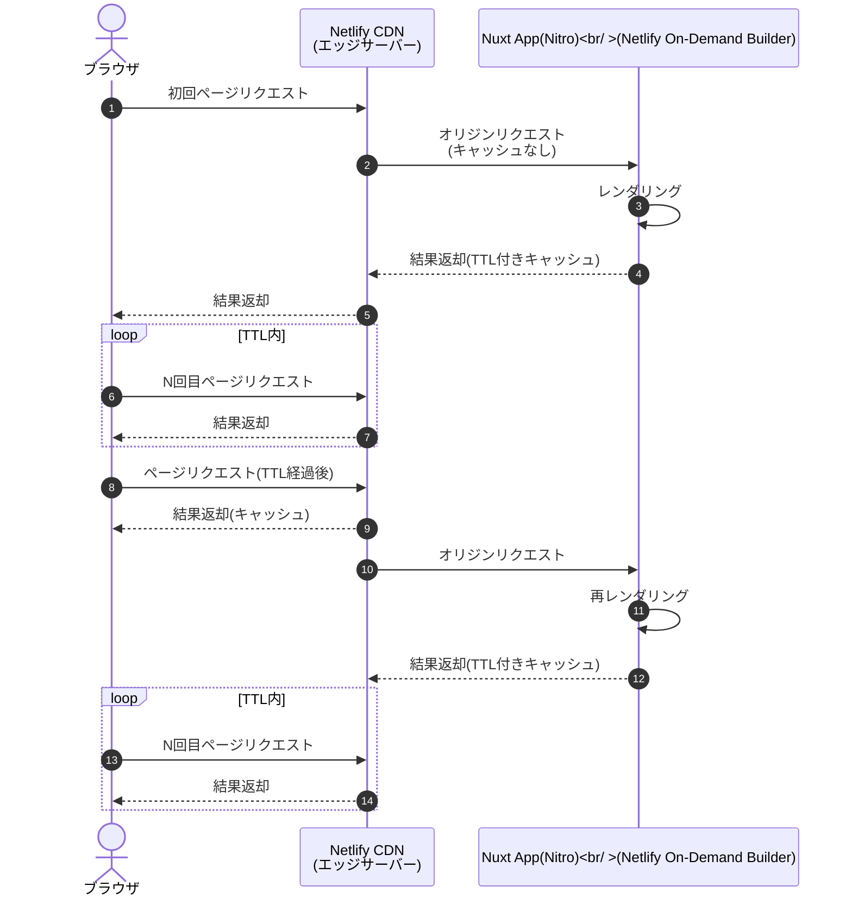

これは、[豆蔵デベロッパーサイトアドベントカレンダー2022](https://developer.mamezou-tech.com/events/advent-calendar/2022/)第18日目の記事です。

今年春にRCバージョンとなったNuxt3は、先月ようやく安定バージョンとなりました。

- [Announcing Nuxt 3.0 stable](https://nuxt.com/v3)

Nuxt3の目玉機能の1つとしてハイブリッドレンダリングがあります。
以下[公式ドキュメント](https://nuxt.com/docs/guide/concepts/rendering#hybrid-rendering)からの引用と機械翻訳結果です。

> Hybrid rendering allows different caching rules per route using Route Rules and decides how the Server should respond to a new request on a given URL.

> ハイブリッドレンダリングは、Route Rulesを使用してルートごとに異なるキャッシュルールを可能にし、与えられたURLの新しいリクエストに対してServerがどのように応答すべきかを決定する。

Nuxt2までは、アプリケーション全体で1つのレンダリングモード(SPA/SSG/SSR)しか指定できませんでした。
一方で、Reactフレームワークとして人気のNext.jsでは、ページ単位で柔軟にレンダリング方法を切り替えできました。

Nuxt3でようやくこれに追い付いた形です。各ページ(ルート)の特性に応じて柔軟なレンダリングモードやキャッシュルールを選択できるようになりました。
さらに、環境は限定されますがキャッシュを使用したオンデマンドなレンダリング(ISG/ISR)もサポートしています。

先行するNext.jsは、任意のタイミングでキャッシュをクリアするOn-Demand ISRとさらに進化を続けていますが、Nuxt3でもNext.jsに近いことができるようになったと言えると思います。

まだ現時点では、Nuxtのハイブリッドレンダリングのドキュメントは充実しているとは言えない状況ですが、今回は暗中模索で試してみました。

:::alert
現時点でハイブリッドレンダリングはExperimental(実験的)バージョンです。
利用する際は、Nuxt、またはハイブリッドレンダリングを実装しているNitroの最新ドキュメントを参照してください。
:::

[[TOC]]

## ハイブリッドレンダリングを試す

ISG/ISRに入る前に、ローカル環境で従来のレンダリングモードでハイブリッドレンダリングを体感してみます。

NuxtではNext.jsのように各ページ内でレンダリング方法(getStaticProps / getServerSideProps等)を指定するのではなく、設定ファイル(nuxt.config.ts)で各ルートにルールを指定する宣言的スタイルです。
この辺りは両フレームワークの思想の違いからくるもので、好みはあるかと思いますが、個人的にはNuxtの方が設定ファイルを見れば全て把握できていいなと感じました。

以下がNuxtの設定例です。

```typescript
export default defineNuxtConfig({
  routeRules: {
    '/admin/**': { ssr: false },
    '/foo': { ssr: true, prerender: false },
    '/bar/home': { ssr: true, prerender: true },
  },
});
```

`routeRules`配下にルートとそれに対応するルールを記述します。
上記は以下のようにルート別のルールを設定しています。

| ルート       | レンダリングモード            |
|-----------|----------------------|
| /admin配下  | クライアントサイドレンダリング(SPA) |
| /foo      | サーバーサイドレンダリング(SSR)   |
| /bar/home | 静的ホスティング(SSG)        |

:::info
現時点(v3.0.0)では、プリレンダリングで`/bar/**`のようなワイルドカード指定は機能せず、フォールバックされてデフォルトのサーバーサイドレンダリングになりました。
:::

ハイブリッドレンダリングは、内部的にはNuxt3のサーバーエンジンである[Nitro](https://github.com/unjs/nitro)によって実現しています。 
これに対応するNitroのインターフェースを見ると、以下のようになっています。

```typescript
interface NitroRouteConfig {
    cache?: CachedEventHandlerOptions | false;
    headers?: Record<string, string>;
    redirect?: string | {
        to: string;
        statusCode?: HTTPStatusCode;
    };
    prerender?: boolean;
    cors?: boolean;
    swr?: boolean | number;
    static?: boolean | number;
}
```

キャッシュ関連の`cache`/`swr`/`static`については後述しますが、レンダリングモードだけでなく、HTTPヘッダ(`headers`)やリダイレクト(`redirect`)、CORS要否(`cors`)等もルート単位で指定できることが分かります。

ハイブリッドレンダリング利用時は、`npm run build`(`nuxt build`)でビルドします。

```shell
npm run build

```

.output/public配下にプリレンダリング結果(SSG)を含むクライアントサイドリソース、.output/server配下にSSR用のサーバーサイドアプリが生成されます。

```
.output/
├── nitro.json
├── public
│ ├── _nuxt
│ │ ├── asyncData.7c640ab7.js
│ │ ├── composables.f627409f.js
│ │ ├── dashboard.54804e5e.js <- SPA(パス:/admin/dashboard) 
│ │ ├── entry.20817671.js <- Nuxtアプリエントリーポイント
│ │ ├── (省略)
│ │ ├── foo.0f7b43dd.js <- SSRハイドレーション用(パス:/foo)
│ │ └── home.10226be2.js <- SSGハイドレーション用(パス/bar/home)
│ └── bar
│     └── home
│         └── index.html <- SSG静的リソース(パス:/bar/home)
└── server
    ├── chunks
    │ ├── app <- サーバーサイドアプリ
    │ │ ├── _nuxt
    │ │ ├── client.manifest.mjs
    │ │ ├── client.manifest.mjs.map
    │ │ ├── server.mjs
    │ │ ├── server.mjs.map
    │ │ ├── styles.mjs
    │ │ └── styles.mjs.map
    │ ├── (以下省略)
```

ローカル環境(node-server)ではサーバーサイドレンダリングモードと同じように、生成されたNitroアプリを実行して確認できます。

```shell
node .output/server/index.mjs
```

実行結果は省略しますが、期待通りルートごとに指定したレンダリングが実行されていました。

:::info
ここで使用しているNuxt3のレンダリングモードの詳細は、以下記事にまとめていますので興味のある方はご参照ください。

- [Nuxt3入門(第1回) - Nuxtがサポートするレンダリングモードを理解する](/nuxt/nuxt3-rendering-mode/)

ここでは、上記で紹介しているレンダリングモードがルートごとに適用されているイメージとなります。
:::

## Nuxt版のISG/ISR

SSR/SSGは相反するメリット・デメリットがあり、ビルド時間やデータ鮮度の面ではSSRが優位ですが、パフォーマンス面ではSSGが望ましいです。
このような背景から、Next.jsでISG(Incremental Static Generation) / ISR(Incremental Static Regeneration)が登場してきます。

ISG/ISRは、オンデマンドにビルドすることで最新コンテンツ提供とビルド時間を短縮する一方で、CDNの共有キャッシュでパフォーマンスも最適化しようとする欲張り(?)な試みです。

そしてNuxtでも現状はNetlify/Vercelのみですが、バージョン3でようやくISG/ISRをサポートするようになりました。
ここではNetlifyを使ってISG/ISRを試してみます。事前にNetlifyのアカウントを作成しておく必要があります（未検証ですがフリープランでも問題ないかと思います）。

## Netlifyサイトを準備する

事前にNetlifyのサイトを作成しておきます。
Netlifyのコンソールからでも構いませんが、ここでは[Netlify CLI](https://docs.netlify.com/cli/get-started/)で作成しました。

```shell
netlify sites:create -n nuxt3-ondemand-example

> ? Team: <your-team>
>
> Site Created
> 
> Admin URL: https://app.netlify.com/sites/nuxt3-ondemand-example
> URL:       https://nuxt3-ondemand-example.netlify.app
> Site ID:   xxxxxxxx-xxxx-xxxx-xxxx-xxxxxxxxxxxx
> 
> Linked to nuxt3-ondemand-example
```

サイト名は任意です（全体で一意である必要があります）。
Netlifyの管理コンソール上でも以下のように確認できます。


次に、Netlifyの設定ファイルも準備しておきます。
プロジェクトルート配下に、以下の`netlify.toml`を用意します。

```toml
[build]
publish = "dist"
command = "npm run build"
```

上記は、静的リソースの出力先と、Netlifyにホスティングする際のビルドコマンドを指定しています。

## ISG(Incremental Static Generation)

ISGは、初回アクセス時にサーバーサイドでレンダリングを実行し、CDNにその結果をキャッシュします。
2回目以降のアクセスではCDNから配信されるため、都度レンダリングするSSRよりもパフォーマンス面で優位です。
ユーザーからのリクエストに応じて徐々にページが生成されるため、インクリメンタルなSSGといった感じです[^1]。

[^1]: Next.jsでは、getStaticPathsでfallbackをtrueまたはblockingを指定することで実現するものです。

Nuxt+NetlifyのISGは以下のイメージになります。



SSG等の静的ホスティングと同じような動きのため、この流れは分かりやすいと思いますが、ISGは事前にページを生成するのではなくオンデマンドで生成してキャッシュします。
Netlifyでは、再デプロイでキャッシュがクリアされますので、再デプロイ後はこのフローを繰り返します。

では、このNuxt3版のISGを試してみます。
まず`pages`配下に、以下のページ(`isg.vue`)を用意しました。

```html
<script setup lang="ts">
console.log('running ISG setup...')
const {data: time} = useAsyncData(async () => new Date().toLocaleString('ja'))
</script>

<template>
  <div>
    <h1>Hello ISG!!</h1>
    <p>time: {{ time }}</p>
  </div>
</template>
```

サーバーサイドで時刻を取得して、それを表示するだけのシンプルなページです。

nuxt.config.tsには、以下のように指定します。

```typescript
export default defineNuxtConfig({
  nitro: {
    preset: 'netlify',
  },
  routeRules: {
    '/isg': { static : true },
    // 以下も同じ
    // '/isg': { cache: { static: true } },
  },
});
```

指定するルールに`{ static: true }`と指定しました。この指定は`{ cache: { static: true } }`のショートカットです。
また、Nitroのプリセットに`netlify`を指定し、Nuxtのビルド時にNetlifyへのデプロイモードを指定します[^2]。

[^2]: Netlify CLIでは、明示的に指定しなくてもNetlifyのプリセットでビルドされるようです。

Netlifyへデプロイする前に、ビルド成果物を確認してみます。

```shell
npm run build
```

`.netlify`/`dist`ディレクトリが作成され、そこにビルド結果が配置されます。

`.netlify`ディレクトリがNetlify側で実行されるサーバーサイドコードです。
ここでは、エントリーポイントの`.netlify/functions-internal/server/chunks/nitro/netlify.mjs`を確認します。
以下、実際に生成されたソースコードにコメントを追記したものです。

```javascript
const handler = async function handler2(event, context) {
  const query = { ...event.queryStringParameters, ...event.multiValueQueryStringParameters };
  const url = withQuery(event.path, query);
  const routeRules = getRouteRulesForPath(url);
  // ISG/ISR有効チェック(staticはcache.static、swrはcache.swrのショートカット)
  if (routeRules.cache && (routeRules.cache.swr || routeRules.cache.static)) {
    // Netlify On-Demand Builderに切り替え
    const builder = await import('@netlify/functions').then((r) => r.builder || r.default.builder);
    const ttl = typeof routeRules.cache.swr === "number" ? routeRules.cache.swr : 60;
    const swrHandler = routeRules.cache.swr ? (event2, context2) => lambda(event2, context2).then((r) => ({ ...r, ttl })) : lambda;
    return builder(swrHandler)(event, context);
  }
  // それ以外は通常のNetlify Functionsとして実行(SSR+キャッシュなし)
  return lambda(event, context);
};
```

これは、[Netlify Functions](https://docs.netlify.com/functions/overview/)のコードですが、よく見ると実態はAWS Lambdaのイベントハンドラです。
実装を見ると、ルートルール(`routeRules`)でISG(`static`)またはISR(`swr`)(後述)が指定されている場合に、通常のNetlify Functionsではなく、[On-demand Builders](https://docs.netlify.com/configure-builds/on-demand-builders/)が使われていることが分かります。

ここでサーバーサイドレンダリング(ページ生成)が実行され、その結果がCDNにキャッシュするように動作するようになっています。
ただし、ここではISG(`static`)を指定していますので、再デプロイ時までは永続的にキャッシュされます。

もう1つの`dist`ディレクトリも確認します。
こちらはNetlifyに限らずNuxtの静的リソースが出力されますが、よく見ると`_redirects`というファイルも作成されています。
これは、Netlifyのリダイレクト設定ファイルです。

- [Netlify Docs - Redirects and rewrites](https://docs.netlify.com/routing/redirects/)

内容は以下の通りです。

```text
/isg	/.netlify/builders/server 200
/*      /.netlify/functions/server 200
```

`/isg`というパスにリクエストがくると、先程のNetlify On-Demand Builderのにリダイレクトするように指定されています。このファイルもNitroのプリセットで出力されています。

ビルド結果の確認ができましたので、先程作成したNetlifyにデプロイしてみます。

```shell
netlify deploy --build --site nuxt3-ondemand-example --prod
```
以下整形後の出力です。
```
────────────────────────────────────────────────────────────────
  Netlify Build                                                 
────────────────────────────────────────────────────────────────

❯ Version
  @netlify/build 27.18.6

(省略)

────────────────────────────────────────────────────────────────
  1. build.command from netlify.toml                            
────────────────────────────────────────────────────────────────

$ npm run build

> build
> nuxt build

(省略)

────────────────────────────────────────────────────────────────
  2. Functions bundling                                         
────────────────────────────────────────────────────────────────

Packaging Functions from .netlify/functions-internal directory:
 - server/server.js


(Functions bundling completed in 1.5s)

────────────────────────────────────────────────────────────────
  Netlify Build Complete                                        
────────────────────────────────────────────────────────────────

(Netlify Build completed in 10.3s)
Deploy path:        /Users/noboru-kudo/workspace/nuxt3-example/hybrid-rendering
Functions path:     /Users/noboru-kudo/workspace/nuxt3-example/hybrid-rendering/.output/server
Configuration path: /Users/noboru-kudo/workspace/nuxt3-example/hybrid-rendering/netlify.toml
Deploying to main site URL...
✔ Deploying functions from cache (use --skip-functions-cache to override)
✔ Finished hashing 35 files and 1 functions
✔ CDN requesting 29 files and 1 functions
✔ Finished uploading 31 assets
✔ Deploy is live!

Logs:              https://app.netlify.com/sites/nuxt3-ondemand-example/deploys/63901acdae2d9432b95ef28b
Unique Deploy URL: https://63901acdae2d9432b95ef28b--nuxt3-ondemand-example.netlify.app
Website URL:       https://nuxt3-ondemand-example.netlify.app
```

静的リソースだけでなく、Netlify On-Demand BuilderのFunctionsがデプロイされていることが確認できます。

後は、表示されたURLよりブラウザからアクセスするだけです。`/isg`パスにアクセスすると先程の時刻表示ページが表示されます。

貧素なページのためスクリーンショットは載せませんが、最初にアクセスしたタイミングでページ内に時刻が表示され、それ以降は何度アクセスしても同じページ(CDNキャッシュ)が表示されます。
Netlifyの管理コンソールからFunctionsのログを見ても初回のみ実行され、2回目以降はログに出力されることはありません。


このようにISGは、その特性から以下のようなサイトに有効です。

- 大量のページがあるサイトでSSGにするとビルド時間が長時間かかる
- ページ新規追加のみで、更新がほとんど発生しない(更新する場合は再デプロイしてキャッシュクリアが必要)

## ISR(Incremental Static Regeneration)

ISGは、コンテンツに更新がある場合に再デプロイ(キャッシュクリア)が必要というデメリットがあります。
これを緩和するのがISRです。

ISRは、基本的なスタイルはISGと同様のオンデマンドなビルドですが、キャッシュにTTL(有効期限)を設けます。
とはいってもパフォーマンス優先の方針は同じです。TTL経過後の初回アクセスにはキャッシュ済みの結果を返します。
ただし、ISRはその一方で、バックグラウンドで再レンダリングと再キャッシュを行う点が異なります。
つまり、再キャッシュ後のアクセスは、再レンダリング後にキャッシュされたものから取得されることになり、ISG同様のパフォーマンスが得られることになります。
ISRは、Stale While Revalidate(SWR)を使ったキャッシュ戦略と呼ばれます。

Nuxt+NetlifyのISRは以下のイメージになります。



ISGとは異なり、TTLが経過すると再レンダリング(Regeneration)が実行されますので、コンテンツは最新となります。
ただし、TTL経過後の初回アクセスに限りキャッシュから旧バージョン(Stale)の結果が返却されます。

では、NuxtのISRを試してみます。
ソースコードは、ISGのときとほぼ同じです(`isr.vue`)。

```html
<script setup lang="ts">
console.log('running ISR setup...')
const {data: time} = useAsyncData(async () => new Date().toLocaleString('ja'))
</script>

<template>
  <div>
    <h1>Hello ISR!!</h1>
    <p>time: {{ time }}</p>
  </div>
</template>
```

サーバーサイドで現在時刻を取得して表示します。

ISRのの場合、nuxt.config.tsは以下のようになります。

```typescript
export default defineNuxtConfig({
  routeRules: {
    '/isr': { swr: 300 },
    // 以下も同じ
    // '/isr': { cache: { swr: 300 } },
  },
});
```

ISGのときは`static`を指定しましたが、ISRの場合は`swr`として、値にTTLを指定します。この設定は`{ cache: { swr: 300 } }`と指定した場合と同義です(ショートカット)。
今回はTTLに5分(300秒)を指定しています。

ビルド結果はISGと同じですので省略しますが、ISRの場合の動きを確認しておきます。
以下先程掲載した`netlify.mjs`でISRに関連する部分を抜粋します。

```javascript
const builder = await import('@netlify/functions').then((r) => r.builder || r.default.builder);
const ttl = typeof routeRules.cache.swr === "number" ? routeRules.cache.swr : 60;
const swrHandler = routeRules.cache.swr ? (event2, context2) => lambda(event2, context2).then((r) => ({ ...r, ttl })) : lambda;
return builder(swrHandler)(event, context);
```

ISR(`swr`)の場合では、レスポンスと合わせてnuxt.config.tsで指定したTTL(デフォルト60秒)を返却しています。

デプロイ手順はISGと同じです。

```shell
netlify deploy --build --site nuxt3-ondemand-example --prod
```

これでブラウザから`/isr`にアクセスします。
ここでもスクリーンショットは省略しますが、継続的にリロードを繰り返すと、以下の動きになっていることが分かります。

1. 初回アクセス: この時点のサーバー時刻表示。初回レンダリング＋キャッシュ
2. 初回アクセスから5分間: 前回キャッシュ済み結果
3. 5分経過後: キャッシュ済み結果。バックグラウンドでは再レンダリング＋再キャッシュ
4. 再アクセス: 3で更新されたサーバー時刻表示。再キャッシュ結果

初回を除いて、CDNつまりエッジ環境からコンテンツを取得しています。
NetlifyのコンソールよりFunctionsのログを確認すると、サーバーサイドの動きを確認できます。


初回とTTL経過後の2回のみサーバーサイドでレンダリングされていることが分かります。

## 最後に
今回はNuxt3で導入されたハイブリッドレンダリングとISG/ISRを使ったレンダリングモードをご紹介しました。
同一アプリケーション内でも各ルート(ページ)で適したレンダリングモードに違いは出てきますので、ルート別で指定できるようになったハイブリッドレンダリングはNuxtの大きな進歩だと思います。

また、新しいレンダリングモードとしてISG/ISRをNetlifyを使って動作の確認もしました。
特にISRはメリットしかないと思われがちが、1度は古い結果を返すことや（厳密に最新ではない）、デバッグが難しいなど全てのケースで適しているとも思えません。
ここでも従来のレンダリングモードと同様に、ページの特性に応じて適用していく必要があるのは変わらないと思います。
