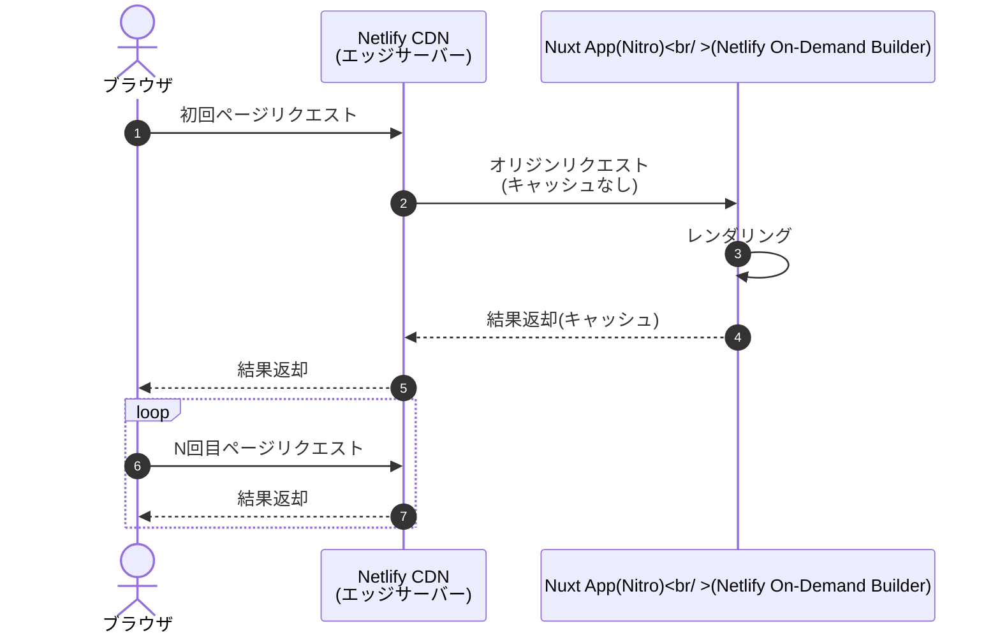
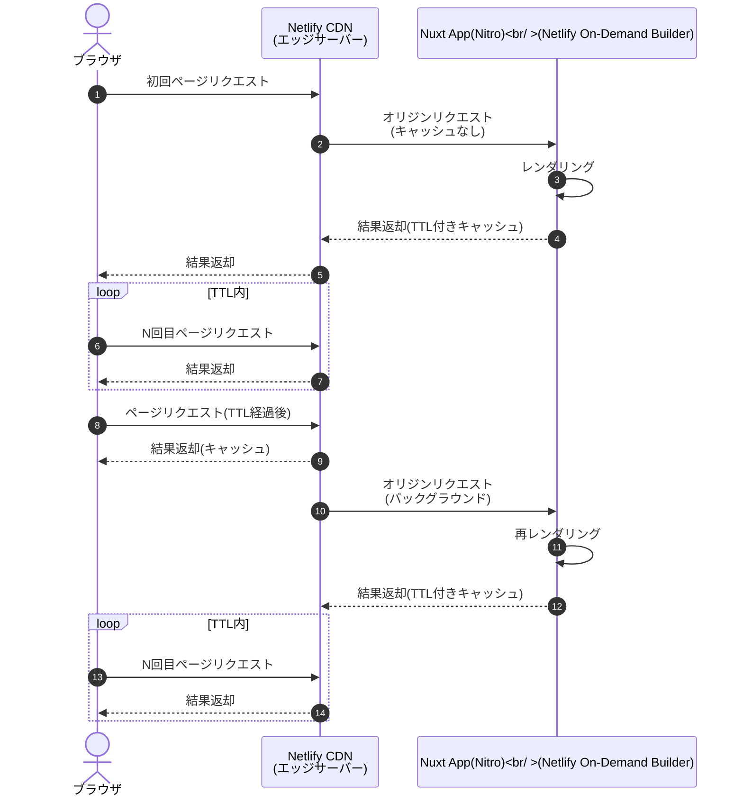

これは、[豆蔵デベロッパーサイトアドベントカレンダー2022](https://developer.mamezou-tech.com/events/advent-calendar/2022/)第18日目の記事です。

今年春にRCバージョンとなったNuxt3は、先月ようやく安定バージョンとなりました。

- [Announcing Nuxt 3.0 stable](https://nuxt.com/v3)

Nuxt3の目玉機能の1つとしてハイブリッドレンダリングがあります。
以下[公式ドキュメント](https://nuxt.com/docs/guide/concepts/rendering#hybrid-rendering)からの引用と機械翻訳結果です。

> Hybrid rendering allows different caching rules per route using Route Rules and decides how the Server should respond to a new request on a given URL.

> ハイブリッドレンダリングは、Route Rulesを使用してルートごとに異なるキャッシュルールを可能にし、与えられたURLの新しいリクエストに対してServerがどのように応答すべきかを決定する。

Nuxt2までは、アプリケーション全体で1つのレンダリングモード(SPA/SSG/SSR)しか指定できませんでした。
一方で、Reactフレームワークとして人気のNext.jsでは、ページ単位で柔軟にレンダリング方法を切り替えできました。

Nuxt3でようやくこれに追い付いた形です。各ルートに対してレンダリングモードやキャッシュルールを選択できるようになりました。
さらに、環境は限定されますがNext.jsのISG/ISRようにキャッシュを使用したオンデマンドビルドもサポートしています。

現時点ではNuxtのハイブリッドレンダリングのドキュメントは充実しているとは言えない状況ですが、今回は暗中模索で試してみました。

:::alert
現時点でハイブリッドレンダリングはExperimental(実験的)バージョンです。
利用する際は、Nuxt、またはハイブリッドレンダリングを実装しているNitroの最新ドキュメントを参照してください。

- [Nuxt Doc - Route Rules](https://nuxt.com/docs/guide/concepts/rendering#route-rules)
- [Nitro Doc - routeRules](https://nitro.unjs.io/config#routerules)
:::

[[TOC]]

## ハイブリッドレンダリングを試す

まずはローカル環境で従来のレンダリングモードを使ってハイブリッドレンダリングを体感してみます。

NuxtではNext.jsのように各ページ内でレンダリング方法(getStaticProps / getServerSideProps等)を指定するのではなく、設定ファイル(nuxt.config.ts)で各ルートにルールを指定する宣言的スタイルです。
この辺りは両フレームワークの思想の違いからくるもので、好みはあるかと思いますが、個人的にはNuxtの方が設定ファイルを見れば全て把握できていいなと感じました。

以下がNuxtの設定例です。

```typescript
export default defineNuxtConfig({
  routeRules: {
    '/admin/**': { ssr: false },
    '/foo': { ssr: true, prerender: false },
    '/bar/home': { ssr: true, prerender: true },
  },
});
```

`routeRules`配下にルートとそれに対応するルールを記述します。
上記は以下のようにルート別のルールを設定しています。

| ルート       | レンダリングモード            |
|-----------|----------------------|
| /admin配下  | クライアントサイドレンダリング(SPA) |
| /foo      | サーバーサイドレンダリング(SSR)   |
| /bar/home | 静的ホスティング(SSG)        |

なお、SSR/SSGのルールで指定している`ssr: true`はデフォルト値ですので、省略可能です。

:::info
現時点(v3.0.0)では、SSG(`prerender: true`)している部分で`/bar/**`のようなワイルドカードを使ったパス指定は機能しませんでした。
フォールバックされてデフォルトのサーバーサイドレンダリングになりました。
:::

ここで指定しているルールは、Nuxt3のサーバーエンジンである[Nitro](https://github.com/unjs/nitro)のものです。 
対応するNitroのインターフェースを確認してみると、以下のようになっていました。

```typescript
interface NitroRouteConfig {
    cache?: CachedEventHandlerOptions | false;
    headers?: Record<string, string>;
    redirect?: string | {
        to: string;
        statusCode?: HTTPStatusCode;
    };
    prerender?: boolean;
    cors?: boolean;
    swr?: boolean | number;
    static?: boolean | number;
}
```

キャッシュ関連の`cache`/`swr`/`static`については後述しますが、レンダリングモードだけでなく、HTTPヘッダ(`headers`)やリダイレクト(`redirect`)、CORS要否(`cors`)等もルート単位で指定できることが分かります。

ハイブリッドレンダリング利用時は、`npm run build`でビルドします。

```shell
npm run build
```

`.output/public`ディレクトリに静的リソース、`.output/server`ディレクトリにサーバーリソースが生成されます。

```
.output/
├── nitro.json
├── public <- 静的リソース
│ ├── _nuxt
│ │ ├── asyncData.7c640ab7.js
│ │ ├── composables.f627409f.js
│ │ ├── dashboard.54804e5e.js <- SPA(パス:/admin/dashboard) 
│ │ ├── entry.20817671.js <- Nuxtアプリエントリーポイント
│ │ ├── (省略)
│ │ ├── foo.0f7b43dd.js <- SSRハイドレーション用(パス:/foo)
│ │ └── home.10226be2.js <- SSGハイドレーション用(パス/bar/home)
│ └── bar
│     └── home
│         └── index.html <- SSG静的リソース(パス:/bar/home)
└── server <- サーバーリソース
    ├── chunks
    │ ├── app
    │ │ ├── _nuxt
    │ │ ├── client.manifest.mjs
    │ │ ├── client.manifest.mjs.map
    │ │ ├── server.mjs
    │ │ ├── server.mjs.map
    │ │ ├── styles.mjs
    │ │ └── styles.mjs.map
    │ ├── (以降省略)
```

`.output/public`配下に先程SSG(プリレンダリング)で指定した`/bar/home`の静的HTMLが生成されています。
一方で、SPA/SSRとしたルートではHTMLは生成されていません。これらはクライアントサイドまたはサーバーサイドでリアルタイムにレンダリングされるためです。

ローカル環境でこれを実行してみます。
Node.jsでサーバーリソースを実行して確認できます。クライアントリソースもここから取得されますので、個別にデプロイする必要はありません。

```shell
node .output/server/index.mjs
```

実行結果の掲載は省略しますが、期待通りルートごとに指定したレンダリングが実行されていました。

:::info
ここで使用しているNuxt3のレンダリングモードの詳細は、以下記事にまとめていますので興味のある方はご参照ください。

- [Nuxt3入門(第1回) - Nuxtがサポートするレンダリングモードを理解する](/nuxt/nuxt3-rendering-mode/)

ここでは、上記で紹介しているレンダリングモードがルートごとに適用されているイメージとなります。
:::

## Nuxt版のISG/ISR登場

SSR/SSGは相反するメリット・デメリットがあり、最新コンテンツ提供の側面ではSSRが優位ですが、パフォーマンス面ではSSGが望ましいです。
また、数万ページにおよぶ大規模サイトともなると、SSGで事前にビルドするのはかなりの時間やリソースが必要になってきます。

このような中でNext.jsは、両者のメリットをそのまま活かすISG(Incremental Static Generation) / ISR(Incremental Static Regeneration)をサポートしています[^1]。

[^1]: Next.jsは任意のタイミングでキャッシュクリアするOn-Demand ISRとさらに進化を続けています。

ISG/ISRは、ユーザーリクエストに応じてビルドして最新コンテンツ提供を可能とする一方で、その結果をキャッシュしてパフォーマンスも最適化しようとする欲張り(?)な試みです。

そしてNuxtでも現時点ではNetlify/Vercelのみですが、Nuxt3でISG/ISRをサポートするようになりました。
なお、ISG/ISRという言葉はNext.js由来のもの(だと思います。違っていたらすみません)ですが、こちらの用語が一般的に流通しているように感じますので、便宜的に使わせていただきます[^2]。

[^2]: この辺りの名前は、フレームワークやベンダーによってかなり違って混乱します。他にもGatsbyのDSRやNetlifyのDPRとか。。

ここでは[Netlify](https://www.netlify.com/)を使ってISG/ISRを試してみます。
事前にNetlifyのアカウントを作成しておく必要があります。Proプランで試しましたが、フリープランでも問題ないかと思います(未検証ですが)。

## Netlifyサイトを準備する

事前にNetlifyのサイトを作成しておきます。
Netlifyのコンソールからでも構いませんが、ここでは[Netlify CLI](https://docs.netlify.com/cli/get-started/)で作成しました。

```shell
netlify sites:create -n nuxt3-ondemand-example

> ? Team: <your-team>
>
> Site Created
> 
> Admin URL: https://app.netlify.com/sites/nuxt3-ondemand-example
> URL:       https://nuxt3-ondemand-example.netlify.app
> Site ID:   xxxxxxxx-xxxx-xxxx-xxxx-xxxxxxxxxxxx
> 
> Linked to nuxt3-ondemand-example
```

サイト名は任意です（全体で一意である必要があります）。
Netlifyの管理コンソール上でも以下のように確認できます。


次に、Netlifyの設定ファイルも準備しておきます。
プロジェクトルート配下に、以下の`netlify.toml`を用意します。

```toml
[build]
publish = "dist"
command = "npm run build"
```

上記は、静的リソースの出力先と、Netlifyにホスティングする際のビルドコマンドを指定しています。

## ISG(Incremental Static Generation)

ISGは、初回アクセス時にサーバーサイドでレンダリングを実行し、CDNにその結果をキャッシュします。
2回目以降のアクセスではCDNから配信されるため、都度レンダリングするSSRよりもパフォーマンス面で優位です。
ユーザーからのリクエストに応じて徐々にページが生成されるため、インクリメンタルなSSGといった感じです[^3]。

[^3]: Next.jsでは、getStaticPathsでfallbackをtrueまたはblockingを指定することでISGを実現します。

Nuxt+NetlifyのISGは以下のイメージになります。



SSGとは異なり、ISGは事前にページを生成するのではなく、オンデマンドに生成してキャッシュします。
このため、大規模サイトになるとビルド時間は劇的に短縮されるはずです。

では、このNuxtのISGを試してみます。
まず`pages`配下に、以下のページ(`isg.vue`)を用意しました。

```html
<script setup lang="ts">
console.log('running ISG setup...')
const {data: time} = useAsyncData(async () => new Date().toLocaleString('ja'))
</script>

<template>
  <div>
    <h1>Hello ISG!!</h1>
    <p>time: {{ time }}</p>
  </div>
</template>
```

サーバーサイドで時刻を取得して、それを表示するシンプルなページです。

nuxt.config.tsは、以下のように指定します。

```typescript
export default defineNuxtConfig({
  nitro: {
    preset: 'netlify',
  },
  routeRules: {
    '/isg': { static : true },
    // 以下も同じ
    // '/isg': { cache: { static: true } },
  },
});
```

指定するルールを`{ static: true }`としました。この指定は`{ cache: { static: true } }`のショートカットです。
また、Nitroのプリセットに`netlify`を指定します。この指定をするとNitroはNetlify用のビルド成果物を出力します[^4]。

[^4]: Netlify CLI経由でビルドすると、明示的にプリセット指定がなくても、Netlifyプリセットとしてビルドされるようです。

実際にNetlifyへデプロイする前に、ビルド結果を確認してみます。

```shell
npm run build
```

ビルドが成功すると、`.netlify`/`dist`ディレクトリが作成されます。

`.netlify`ディレクトリがNetlify側で実行されるサーバーサイドコードです。
エントリーポイントの`.netlify/functions-internal/server/chunks/nitro/netlify.mjs`を確認します。
以下、実際に生成されたソースコードにコメントを追記したものです。

```javascript
const handler = async function handler2(event, context) {
  const query = { ...event.queryStringParameters, ...event.multiValueQueryStringParameters };
  const url = withQuery(event.path, query);
  const routeRules = getRouteRulesForPath(url);
  // ISG/ISR有効チェック(staticはcache.static、swrはcache.swrのショートカット)
  if (routeRules.cache && (routeRules.cache.swr || routeRules.cache.static)) {
    // Netlify On-Demand Builderに切り替え
    const builder = await import('@netlify/functions').then((r) => r.builder || r.default.builder);
    const ttl = typeof routeRules.cache.swr === "number" ? routeRules.cache.swr : 60;
    const swrHandler = routeRules.cache.swr ? (event2, context2) => lambda(event2, context2).then((r) => ({ ...r, ttl })) : lambda;
    return builder(swrHandler)(event, context);
  }
  // それ以外は通常のNetlify Functionsとして実行(SSR+キャッシュなし)
  return lambda(event, context);
};
```

これは、[Netlify Functions](https://docs.netlify.com/functions/overview/)のコードです(実態はAWS Lambdaのイベントハンドラですが)。
実装を見ると、ルートルール(`routeRules`)で`static`または`swr`(後述)が指定されている場合に、通常のNetlify Functionsではなく、[On-demand Builders](https://docs.netlify.com/configure-builds/on-demand-builders/)が使われていることが分かります。
ここでは`static`を指定していますので、On-Demand BuilderにTTL(有効期限)は設定されません。つまり、再デプロイ時までキャッシュは残ります。

もう1つの`dist`ディレクトリも確認します。
こちらはNuxtの静的リソースが出力されますが、見慣れない`_redirects`というファイルも作成されています。
これは、Netlifyのリダイレクト設定ファイルです。

- [Netlify Docs - Redirects and rewrites](https://docs.netlify.com/routing/redirects/)

内容は以下の通りです。

```text
/isg	/.netlify/builders/server 200
/*      /.netlify/functions/server 200
```

nuxt.config.tsに指定した内容に従って設定されていることが分かります。

- `/isg`へのリエクストはOn-Demand Builderにリダイレクト
- それ以外(`/*`)は通常のNetlify FunctionsつまりデフォルトのSSRの方にリダイレクト(キャッシュしない)

ビルド結果の確認ができましたので、実際にNetlifyのサイトにデプロイしてみます。

```shell
netlify deploy --build --site nuxt3-ondemand-example --prod
```
以下コンソール出力の抜粋です。
```
────────────────────────────────────────────────────────────────
  Netlify Build                                                 
────────────────────────────────────────────────────────────────

❯ Version
  @netlify/build 27.18.6

(省略)

────────────────────────────────────────────────────────────────
  1. build.command from netlify.toml                            
────────────────────────────────────────────────────────────────

$ npm run build

> build
> nuxt build

(省略)

────────────────────────────────────────────────────────────────
  2. Functions bundling                                         
────────────────────────────────────────────────────────────────

Packaging Functions from .netlify/functions-internal directory:
 - server/server.js


(Functions bundling completed in 1.5s)

────────────────────────────────────────────────────────────────
  Netlify Build Complete                                        
────────────────────────────────────────────────────────────────

(Netlify Build completed in 10.3s)
Deploy path:        /Users/noboru-kudo/workspace/nuxt3-example/hybrid-rendering
Functions path:     /Users/noboru-kudo/workspace/nuxt3-example/hybrid-rendering/.output/server
Configuration path: /Users/noboru-kudo/workspace/nuxt3-example/hybrid-rendering/netlify.toml
Deploying to main site URL...
✔ Deploying functions from cache (use --skip-functions-cache to override)
✔ Finished hashing 35 files and 1 functions
✔ CDN requesting 29 files and 1 functions
✔ Finished uploading 31 assets
✔ Deploy is live!

Logs:              https://app.netlify.com/sites/nuxt3-ondemand-example/deploys/63901acdae2d9432b95ef28b
Unique Deploy URL: https://63901acdae2d9432b95ef28b--nuxt3-ondemand-example.netlify.app
Website URL:       https://nuxt3-ondemand-example.netlify.app
```

静的リソースだけでなく、Netlify Functions(On-Demand Builder)もデプロイされていることが確認できます。

後は、表示されたURLよりブラウザからアクセスするだけです。`/isg`パスにアクセスすると先程のサンプルページが表示されます。

貧素なページのためスクリーンショットは載せませんが、リロードを繰り返すと、最初にアクセスしたタイミングの時刻が表示され、それ以降は同じページ(CDNキャッシュ)が表示されます。
Netlifyの管理コンソールからFunctionsのログを見ても、初回レンダリング時のログのみが出力され、2回目以降は出力されることはありません。


## ISR(Incremental Static Regeneration)

ISGは、コンテンツ更新が発生した場合に問題が生じます。Netlifyの場合は再デプロイしなければキャッシュはクリアされず古いページが表示され続けます。
これを緩和するのがISRです。

ISRは、基本的なスタイルはISGと同様のオンデマンドなビルドですが、キャッシュにTTL(有効期限)を設けます。
とはいってもパフォーマンス優先の方針は同じです。TTL経過後の初回アクセスにはキャッシュ済みの古い(かもしれない)結果を返します。
ただし、ISRはその一方で、バックグラウンドで再レンダリングと再キャッシュを行う点がISGと異なります。
再キャッシュ後のアクセスは、新しいキャッシュから取得されることになり、ISG同様のパフォーマンスが得られることになります。
ISRのキャッシュ戦略は、Stale While Revalidate(SWR)と呼ばれます。

Nuxt+NetlifyのISRは以下のイメージになります。



ISGとは異なり、TTLが経過すると再レンダリング(Regeneration)が実行されますので、コンテンツは最新となります。
ただし、前述の通りTTL経過後しても、最初の1人はキャッシュから旧バージョン(Stale)のコンテンツが返却されます。
ISRはこの緩い整合性を許容できる場合に有効なキャッシュ戦略です。

では、NuxtのISRを試してみます。
ソースコードは、ISGのときとほぼ同じです(`isr.vue`)。

```html
<script setup lang="ts">
console.log('running ISR setup...')
const {data: time} = useAsyncData(async () => new Date().toLocaleString('ja'))
</script>

<template>
  <div>
    <h1>Hello ISR!!</h1>
    <p>time: {{ time }}</p>
  </div>
</template>
```

サーバーサイドで現在時刻を取得して表示します。

ISRのの場合、nuxt.config.tsは以下のようになります。

```typescript
export default defineNuxtConfig({
  routeRules: {
    '/isr': { swr: 300 },
    // 以下も同じ
    // '/isr': { cache: { swr: 300 } },
  },
});
```

ISRの場合は、ルーティングルールとして`{ swr: 300 }`としました。この設定は`{ cache: { swr: 300 } }`と指定した場合と同義です(ショートカット)。
今回はTTLに5分(300秒)を指定しています。

ビルド結果はISGと同じですので省略しますが、ISRの場合の動きを確認しておきます。
以下先程掲載した`netlify.mjs`でISRに関連する部分を抜粋します。

```javascript
const builder = await import('@netlify/functions').then((r) => r.builder || r.default.builder);
const ttl = typeof routeRules.cache.swr === "number" ? routeRules.cache.swr : 60;
const swrHandler = routeRules.cache.swr ? (event2, context2) => lambda(event2, context2).then((r) => ({ ...r, ttl })) : lambda;
return builder(swrHandler)(event, context);
```

`swrHandler`変数初期化のタイミングで、`swr`の場合はlambda実行時のレスポンスに対してTTL(デフォルト60秒)を指定しているのが分かります。

これをNetlifyに再デプロイします。

```shell
netlify deploy --build --site nuxt3-ondemand-example --prod
```

デプロイ完了後は、ブラウザから`/isr`にアクセスして確認します。
ここでもスクリーンショットは省略しますが、継続的にリロードを繰り返すと、以下の動きになっていることが分かります。

1. 初回アクセス: この時点のサーバー時刻表示。初回レンダリング＋キャッシュ
2. 初回アクセスから5分間: 前回キャッシュ済み結果
3. 5分経過後: キャッシュ済み結果。(見た目は分からないけど)バックグラウンドでは再レンダリング＋再キャッシュ
4. 再アクセス: 3で更新されたサーバー時刻表示。つまり再キャッシュ結果。

再度NetlifyのコンソールよりFunctionsのログを確認してみます。


初回とTTL(5分)経過後のみサーバーサイドレンダリングが発生していることが分かります。

## 最後に
今回はNuxt3で導入されたハイブリッドレンダリングとISG/ISRを使ったレンダリングモードをご紹介しました。
同一アプリケーション内でも、各ルート(ページ)に適したレンダリング方法がありますので、細かく指定できるようになったハイブリッドレンダリングはNuxtの大きな進歩だと思います。

また、Nuxt3でサポートされたISG/ISRをNetlifyを使って動作確認しました。
特にISRはメリットしかないと思われがちですが、1度は古い結果を返すことや、デバッグが難しいなど全てのケースに適しているとも思えません。
ここでも従来のレンダリングモードと同様に、ページの特性に応じて適材適所で使用していく必要があるのは変わりません。
