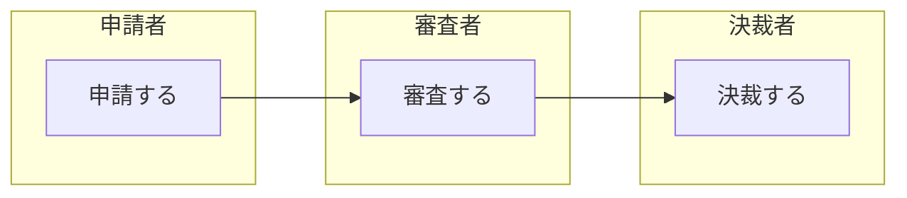

 
これは、[豆蔵デベロッパーサイトアドベントカレンダー2022](https://developer.mamezou-tech.com/events/advent-calendar/2022/)第22日目の記事です。

[[TOC]]

## 概要
ここ数年、マイクロサービスの開発に携わっています。
そんな中で、イテレーティブにマイクロサービスの開発を続け、安定してリリースを続けるためにはAPI間のテストが重要であると実感しています。
これまでも、さまざまな方法を試してきましたが、たまたま目にした[StepCI](https://docs.stepci.com/)が使いやすそうだったので、使用感を書いていきます。

### API間のテストでやりたいこと
イテレーションを重ねる過程で、設計が全体整合性を保てているか検証できる仕組みが欲しくなります。
イテレーションの終了を迎えると、テスト環境などへアプリをデプロイすると思います。その際、基本的な業務シナリオが実行できるか確認することで、アプリやインフラの設定不備の検出が見込めます。
これらを実現するためには、以下のようなポイントを抑えた仕組み作りが必要になってきます。StepCIの機能仕様がこれにフィットしそうな印象だったため、今回試してみました。
* frontendがない状態でテストしたい
  * 業務的な流れを検証する場合、backendだけで十分
  * frontendの開発を待たずに検証したいことも多い
* APIを複数呼び出して、業務シナリオに沿ってテストしたい
  * リソースの生成→更新→更新のようにシナリオを組むには、実行時に生成される情報(IDなど)の引継ぎが必要
* 実行環境の切り替えが簡単にできること
  * 複数の環境で使用したいケースが多く、簡単に切り替えることが必要
    * 開発環境やCI環境：APIのリグレッションテスト
    * 動作確認可能な環境：シナリオを流して、正常にデプロイされていることを確認

## 執筆時の環境
* npm 8.15.0
* stepci 2.6.0

## 実行までの流れ
StepCIのインストールから、テスト実行までの流れは以下のようになります。
1. インストール
    ```bash
    npm install -g stepci
    ```
2. ワークフローを定義する
    * 検証内容は後述します。
3. 実行
    ```bash
    stepci run workflow.yml

    # 環境変数の切り替え
    stepci run workflow.yml -e host=localhost:8080
    ```
    :::info
    環境変数が起動パラメーターで変更できるため、環境が切り替えやすいです。
    :::
4. 実行結果
    * 正常終了したイメージ
      
    * 異常終了したイメージ
       

## 今回の検証内容
### シナリオ
申請、審査、決裁に流れるシンプルな流れをサービス化し、テスト対象とします。


### ワークフロー定義
今回の試行用に作成したテストコード。
ポイントごとに簡単な説明を後述します。


```yaml
version: "1.1"
name: stepciを使ってみた

# 環境変数
env:
  protocol: http
  # 今回はホスト名を変数化し、パラメーターで環境を切り替えられるようにしています。
  host: localhost:8080
  resource: applications
# テスト群
tests:
  # テスト名
  applicatons:
    # テストに含まれるステップ群
    steps:
      # ステップ名
      - name: 申請
        http:
          # リクエスト先の設定
          url: ${{env.protocol}}://${{env.host}}/${{env.resource}}
          method: POST
          headers:
            Content-Type: application/json
          body: |
            {
              "applicationBy": "申請した人",
              "applicationAt": "2022-12-20T00:00:00Z"
            }
          # 値の記録
          captures:
            id:
              jsonpath: $.id
          # 検証
          check:
            status: 200
            statusText: OK
            headers:
              Content-Type: application/json
            jsonpath:
              $.id: 
                - isNumber: true
              $.applicationBy: 申請した人
              $.applicationAt: "2022-12-20T00:00:00Z"
      - name: 審査
        http:
          # 値の利用
          url: ${{env.protocol}}://${{env.host}}/${{env.resource}}/${{captures.id}}/inspected
          method: PUT
          headers:
            Content-Type: application/json
          body: |
            {
              "inspectedBy": "審査した人",
              "inspectedAt": "2022-12-21T00:00:00Z"
            }
          check:
            status: 200
            headers:
              Content-Type: application/json
            jsonpath:
              $.id: 
                - eq: ${{captures.id}}
                - isNumber: true
              $.applicationBy: 申請した人
              $.applicationAt: "2022-12-20T00:00:00Z"
              $.inspectedBy: 審査した人
              $.inspectedAt: "2022-12-21T00:00:00Z"
      - name: 決裁
        http:
          url: ${{env.protocol}}://${{env.host}}/${{env.resource}}/${{captures.id}}/approval
          method: PUT
          headers:
            Content-Type: application/json
          body: |
            {
              "approvalBy": "決裁した人",
              "approvalAt": "2022-12-22T00:00:00Z"
            }
          check:
            status: 200
            headers:
              Content-Type: application/json
            jsonpath:
              $.id: 
                - eq: ${{captures.id}}
                - isNumber: true
              $.applicationBy: 申請した人
              $.applicationAt: "2022-12-20T00:00:00Z"
              $.inspectedBy: 審査した人
              $.inspectedAt: "2022-12-21T00:00:00Z"
              $.approvalBy: 決裁した人
              $.approvalAt: "2022-12-22T00:00:00Z"
```


:::info
* 一般的な認証用の機能が提供されており、認証が必要な環境でも対応しやすいです。
  * Basic、Bearer、OAuth、Certificate
* http以外の通信もサポートされているため、多くの用途に使えます。
  * http、GraphQL、tRPC、gRPC、SOAP
* CIでも動作させることができます。
:::

#### リクエスト先の設定
HTTPメソッド、url、bodyなど、APIのアクセスに必要な情報を設定します。


```yaml
tests:
  applicatons:
    steps:
      - name: 申請
        http:
          # リクエスト先のURL
          # バインド後：　http://localhost:8080/applicaions
          url: ${{env.protocol}}://${{env.host}}/${{env.resource}}
          # リクエストに使用するHTTPメソッドの設定
          method: POST
          # リクエストヘッダー設定
          headers:
            Content-Type: application/json
          # リクエストボディ設定
          # 今回は、RestClientの定義をそのまま使いたかったので「body」を使用しましたが、「json」を使って書くこともできます。
          # json:
          #   applicationBy: 申請した人
          #   applicationAt: 2022-12-20T00:00:00Z
          body: |
            {
              "applicationBy": "申請した人",
              "applicationAt": "2022-12-20T00:00:00Z"
            }
# ～略～
```



#### 値の記録、利用
値をキャッシュして、テスト内で利用できます。
jsonパスだけではなく、ヘッダー、Cookie、CSSセレクタや正規表現に該当する要素なども記録できます。


```yaml
tests:
  applicatons:
    steps:
      - name: 申請
        http:
          # ～略～
          # 値の記録
          captures:
            # cookieなどの記録もできます。
            id:
              jsonpath: $.id
          # ～略～
      - name: 審査
        http:
          # 値の利用
          # 申請で記録した値をリクエスト先のURLに使用
          # 参照：${{captures.<name>}}
          # バインド後：　http://localhost:8080/applicaions/1/inspeced
          url: ${{env.protocol}}://${{env.host}}/${{env.resource}}/${{captures.id}}/inspected
          # ～略～
```

:::info
* 値の記録、その利用ともに容易です。
:::

#### テストの実行順序
tests、steps配下を上から順に実行します。
下の例だと、applicationsの申請→審査→決裁、samplesのサンプル１→サンプル２の順番に実行されます。


```yaml
# テスト群
# ここに含まれるテストを上から順に実行していきます
tests:
  # テスト名
  applicatons:
    # テストに含まれるステップ群
    # ここに含まれるステップを上から順に実行していきます
    steps:
      # ステップ名
      - name: 申請
        # ～略～
      - name: 審査
      - name: 決裁
  samples:
    steps:
      -name: サンプル１
      -name: サンプル２
```


#### 検証
check配下にレスポンスの検証仕様を設定します。


```yaml
tests:
  applicatons:
    steps:
      - name: 申請
        http:
          # ～略～
          # 検証
          check:
            # HTTPステータス
            status: 200
            # HTTPステータス名
            statusText: OK
            # ヘッダー
            headers:
              Content-Type: application/json
            # jsonデータの検証
            jsonpath:
              $.id: 
                - isNumber: true
              $.applicationBy: 申請した人
              $.applicationAt: "2022-12-20T00:00:00Z"
```


:::info
* 値の検証も同値比較だけでなく、型チェックや正規表現によるチェックなど、バリエーションも豊富で、実際にテストを組むときに便利です。
  * Status code、Headers、JSONPath、JSON Schema、Matchersなど
:::

## 使用感
生成された値の引継ぎが容易で、APIを組み合わせたテストシナリオが組みやすいです。
環境の切り替えも容易で、実行したい環境に合わせて用途が切り替えられるのも使いやすいです。

テストでエラーが発生した場合、開発者に返される情報が少なく、デバッグしづらいです。(今回の試行でも定義位置のミスで少しはまりました)

やりたいことは満たせるものの、小規模なコミュニティなので、特定のチーム内で採用するなど、採用規模も小規模にすると良いかと思います。
デバッグ向きではないので、ある程度、安定したものを対象にするのが良いと思います。
