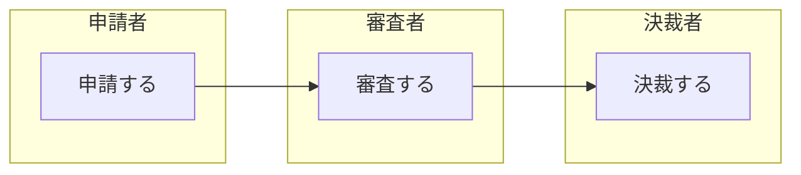
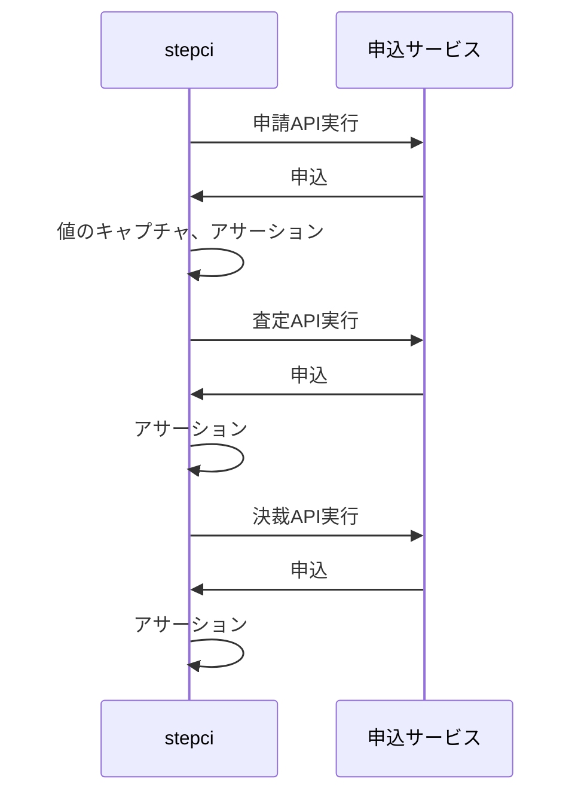

 
これは、[豆蔵デベロッパーサイトアドベントカレンダー2022](https://developer.mamezou-tech.com/events/advent-calendar/2022/)第22日目の記事です。

[[TOC]]

## 概要
ここ数年、マイクロサービスの開発に携わっています。
そんな中で、イテレーティブにマイクロサービスの開発を続け、安定してリリースを続けるためにはAPI間のテストが重要であると実感しています。
これまでも、さまざまな方法を試してきましたが、たまたま目にした[StepCI](https://docs.stepci.com/)が使いやすそうだったので、使用感を書いていきます。

### API間のテストでやりたいこと
* frontendがない状態でテストしたい
  * 業務的な流れを検証する場合、backendだけで十分
  * frontendの開発を待たずに検証したいことも多い
* APIを複数呼び出して、業務シナリオに沿ってテストしたい
  * リソースの生成→更新→更新のようにシナリオを組むには、実行時に生成される情報(IDなど)の引継ぎが必要
* 実行環境の切り替えが簡単にできること
  * 複数の環境で使用したいケースが多く、簡単に切り替えることが必要
    * 開発環境やCI環境：APIのリグレッションテスト
    * 動作確認可能な環境：シナリオを流して、正常にデプロイされていることを確認

## 執筆時の環境
* npm 8.15.0
* stepci 2.6.0

## 実行までの流れ
1. インストール
    ```bash
    npm install -g stepci
    ```
2. ワークフローを定義する
   * 検証内容は後述します。
3. 実行
    ```bash
    stepci run workflow.yml

    # 環境変数の切り替え
    stepci run workflow.yml -e host=localhost:8080
    ```
    * 実行結果
        
    :::info
    環境変数が起動パラメーターで変更できるので、環境の切り替えがしやすい。
    :::

## 今回の検証内容
### シナリオ



### ワークフロー定義
```yaml
version: "1.1"
name: stepciを使ってみた

# 環境変数
env:
  protocol: http
  host: localhost:8080
  resource: applications
# テスト
tests:
  applicatons:
    steps:
      - name: 申請
        http:
          # http://localhost:8080/applicaions
          url: $｛｛env.protocol｝｝://$｛｛env.host｝｝/$｛｛env.resource｝｝
          method: POST
          headers:
            Content-Type: application/json
          body: |
            {
              "applicationBy": "申請した人",
              "applicationAt": "2022-12-20T00:00:00Z"
            }
          # 値をキャプチャ
          captures:
            id:
              jsonpath: $.id
          check:
            status: 200
            headers:
              Content-Type: application/json
            jsonpath:
              $.id: 
                - isNumber: true
              $.applicationBy: 申請した人
              $.applicationAt: "2022-12-20T00:00:00Z"
      - name: 審査
        http:
          # 申請でキャプチャした値を使ってリクエスト
          url: $｛｛env.protocol｝｝://$｛｛env.host｝｝/$｛｛env.resource｝｝/$｛｛captures.id｝｝/inspected
          method: PUT
          headers:
            Content-Type: application/json
          body: |
            {
              "inspectedBy": "審査した人",
              "inspectedAt": "2022-12-21T00:00:00Z"
            }
          check:
            status: 200
            statusText: OK
            headers:
              Content-Type: application/json
            jsonpath:
              $.id: 
                - eq: $｛｛captures.id｝｝
                - isNumber: true
              $.applicationBy: 申請した人
              $.applicationAt: "2022-12-20T00:00:00Z"
              $.inspectedBy: 審査した人
              $.inspectedAt: "2022-12-21T00:00:00Z"
      - name: 決裁
        http:
          url: $｛｛env.protocol｝｝://$｛｛env.host｝｝/$｛｛env.resource｝｝/$｛｛captures.id｝｝/approval
          method: PUT
          headers:
            Content-Type: application/json
          body: |
            {
              "approvalBy": "決裁した人",
              "approvalAt": "2022-12-22T00:00:00Z"
            }
          check:
            status: 200
            headers:
              Content-Type: application/json
            jsonpath:
              $.id: 
                - eq: $｛｛captures.id｝｝
                - isNumber: true
              $.applicationBy: 申請した人
              $.applicationAt: "2022-12-20T00:00:00Z"
              $.inspectedBy: 審査した人
              $.inspectedAt: "2022-12-21T00:00:00Z"
              $.approvalBy: 決裁した人
              $.approvalAt: "2022-12-22T00:00:00Z"
```
  * 環境変数やキャプチャの参照に使用している中括弧は、執筆の都合上、全角にしています。

    :::info
    ・値の引継ぎが容易
    ・チェックのバリエーションが豊富
    :::

## 使用感
* 環境が切り替えやすい
* 値の引継ぎが簡単で、シナリオが組みやすい
* チェックのバリエーションが豊富
  * Status code、Headers、JSONPath、JSON Schema、Matchersなど
* CI環境で動作させることができる
* 一般的な認証用の機能が提供されている
  * Basic、Bearer、OAuth、Certificate
* http以外の通信もサポートされている
  * http、GraphQL、tRPC、gRPC、SOAP
* エラーが発生した場合、結果として表示される情報が少ないため、使用する場合は、ある程度、安定してからの方が良いと思います
  * 今回の検証でもcaptureをcheck配下に入れてしまい、少しハマりました
     