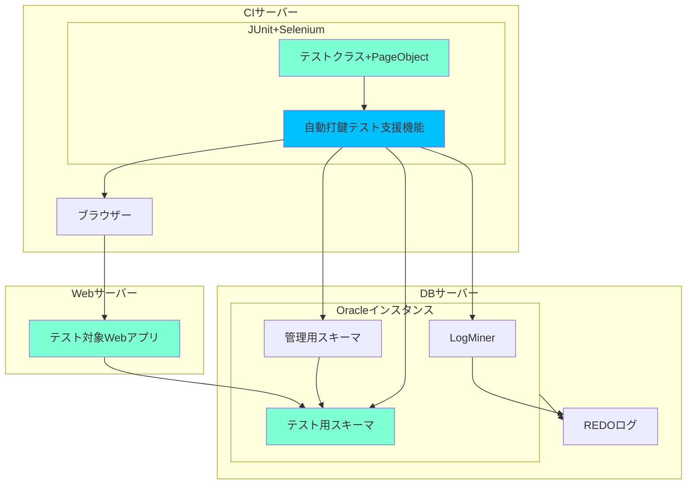

[[TOC]]

## ここでいう「自動打鍵テスト」とは

WebアプリのテストをSelenium[^1]やPuppeteer[^2]、Playwright[^3]などを利用することにより、 **人の手による操作（キー入力やマウスクリック）** を必要とせず、 **人の目による確認を必要としない** 意味で自動化したものをさします（一般的にE2Eテストの操作を自動化したもの）。

さらに操作用コードも **自動生成** したり、HTML検証やコミットされたDBスキーマの更新情報（画面に現れない情報）も **自動検証** したり、アプリの変更を検知してJenkinsで自動的に実行したりするなど、不具合の検出を自動化することまでを範囲とします。

「自動操作テスト」と呼んだ方が一般的かもしれないですが、システム開発現場の一部でアプリを操作することを「打鍵する」と呼んでいるのと、「自動打鍵」という響きが気に入ってこう呼んでいます。

:::info
ブラウザーの自動操作についてはSeleniumを筆頭に、PuppeteerやPlaywrightなど楽しそうなものがいくつかあります。

この記事ではSeleniumを使ったケースを書いていますが、特にどのライブラリーでなければできないというような話はありませんので、対応ブラウザーや細かい機能に応じて読み替えてもらえればいいと思います。
:::

[^1]: [Seleniumブラウザー自動化プロジェクト](https://www.selenium.dev/ja/documentation/)
[^2]: [Puppeteer](https://github.com/puppeteer/puppeteer/blob/main/docs/index.md)
[^3]: [Playwright](https://playwright.dev/)

## 操作と検証を自動化するメリット

* ブラウザ操作をプログラム化することで、操作ミスをなくすことができる。
* テストに要する工数が削減できる。
* 長時間のテストや、夜間のテスト、複数アプリ同時にテストなどもできる。
* 機械によるチェックを行うため、人間では見逃してしまうような検証漏れを防ぐことができる。
* 画面からDBまで結合したテストを行うことで、画面に表示されないような変更も検出できる。

## あるプロジェクトの例

* Webアプリ
  * WebLigic（Tomcat）で動くJSPベースのアプリ
* DB
  * Oracle
* ブラウザ
  * 当初IE→現在EdgeのIE互換モード、一部Chromeも対応

### ページオブジェクトデザインパターンの採用

あるプロジェクトではページオブジェクトデザインパターンを採用しました。

ページオブジェクトクラスは、対応する画面上で実行可能なすべての操作をそれぞれの操作に対応するメソッドとして提供するクラスです。

画面（＝各画面のページオブジェクトクラス）ごとに操作（＝メソッド）をあらかじめ定義しておくことで、操作手順にしたがって、それらを順に呼び出すだけでテストシナリオが実装できるようになります。メソッドの返り値を画面のページオブジェクトにすることで、メソッドチェーンで分かりやすいテストコードが書けるようになります。
画面遷移をする操作の場合は、遷移後の画面のページオブジェクトを返すように記述します。

### テスト用のクラス、メソッドはあえて日本語名を採用

画面名やボタン名などは日本語ラベルなので、クラス名やメソッド名を日本語にします。画面がわかっていれば、次の例のようにテストコードを見ただけで何をしているかわかるようになります。

#### テスト対象


#### テストコードの例

```java
public class 顧客管理Test extends BaseTest {
  @Test
  public void test顧客を検索する() {
    login("user01") // 認証の操作は共有化しておく

      .___顧客管理メニュー画面___() // thisを返すだけの画面名を表すメソッド
      .顧客検索() // 1.「顧客検索」リンクをクリック

      .___顧客検索画面___()
      .担当社員検索() // 2.入力補助ボタンをクリックし、入力補助ダイアログを開く

      .___社員検索ダイアログ___()
      .氏名("山田") // 3.氏名の検索条件（テキストボックス）に入力
      .社員検索()
      .選択(1) // 4.入力補助ダイアログで1件選択するとダイアログが閉じる

      .___顧客検索画面___()
      .顧客検索() // 5.「顧客検索」ボタンクリック
      .次ページ() // 6.リンクでページングして動作確認
      .前ページ() // 7.リンクでページングして動作確認
      .顧客番号("C0000001") // 8.一覧のリンクをクリック

      .___法人顧客詳細画面___() // 詳細画面に遷移
      .閉じる();
  }
}

```

:::info
ページオブジェクトデザインパターンはSeleniumのサイトでも推奨されているもので、テスト対象のアプリケーションの画面を1つのオブジェクトとしてとらえるデザインパターンです。

画面の操作をページオブジェクトに隠蔽し、テストケースと画面操作を分離することでコードの重複を防ぎ、画面に修正があってもテストコードの変更が最小限で済むような保守性の高いテストコードが書けるようになります。

参考までに、ページオブジェクトパターンの原則としては以下のものがあります。

> * The public methods represent the services that the page offers
> publicメソッドは、ページが提供するサービスを表す
> * Try not to expose the internals of the page
> ページの内部を公開しない
> * Generally don't make assertions
> 通常はアサーションを作らない
> * Methods return other PageObjects
> メソッドは他のPageObjectsを返す
> * Need not represent an entire page
> ページ全体を表現する必要はない
> * Different results for the same action are modelled as different methods
> 同じ動作で異なる結果になるものは、別のメソッドを作る
:::

#### ページオブジェクトコードの例

```java
public class 顧客検索画面 extends BasePageObject<窓口検索画面> {
  public 顧客検索画面 ___顧客検索画面___() {
    return this;
  }

  public 社員検索ダイアログ 担当社員検索() {
    click(By.id("userSearch"));
    // 後述の自動化の2（画面切り替え）、自動化の3.3（勝手に検証）
    return openPopupPage(社員検索ダイアログ.class);
  }

  public 顧客検索画面 担当社員番号(String userCode) {
    sendKeys(By.id("userCode"), userCode);
    return this;
  }

  public 顧客検索画面 顧客検索() {
    click(By.id("searchButton"));
    // 後述の自動化の3.3（勝手に検証）
    return refresh();
  }

  public 法人顧客詳細画面 顧客番号(String customerNo) {
    click(By.linkText(customerNo));
    // 後述の自動化の2（画面切り替え）、自動化の3.3（勝手に検証）
    return createPage(法人顧客詳細画面.class);
  }
}
```

このプロジェクトで豆蔵が作った自動打鍵テストのサポート機能は、ページオブジェクトデザインパターンの考え方に沿ったテストを作成する際に、もっとも省力化できるように設計しました。例えば、ページオブジェクトクラスの自動生成や、画面遷移時/再描画時の自動検証などです。

## 豆蔵が自動化したこと

1. 画面を操作するためのJavaソースコードの大半を自動生成できる
1. ブラウザ操作、ポップアップや画面遷移操作を簡易に実装できる
   1. 画面切り替えでWindowハンドルを扱わなくてもいいようにした（開いたウインドウを操作して、閉じたら元のウインドウを操作する）
1. 任意のタイミングにおける画面の内容（=htmlソース）について、期待値と比較検証できる
   1. 画面全体の比較や、IDを指定したエレメント内容の比較
   1. 毎回変動する要素や比較不要な要素については正規表現で除外して比較
   1. いちいち検証コードを書かなくても勝手に検証するモードも用意（画面描画のタイミング）
1. 任意のタイミングまでに行われたDB更新内容について、期待値と比較検証できる（今のところoracleだけ）
   1. 登録、更新、削除の内容が記録され、意図しない変更を検出する
   1. 毎回変動するカラムについてはテーブル名と列名を指定することで比較対象外にできる
   1. いちいち検証コードを書かなくても勝手に検証するモードも用意（テスト終了のタイミング）
1. テストケース実行後に、DBをテスト実行前の状態に戻すことができる（今のところoracleだけ）
   1. 追加、更新、削除してコミットしたデータ、シーケンスの値が元に戻る（テスト終了のタイミング）
1. ダウンロードしたファイルについて、期待値との比較ができる
   1. テキストとして比較：txt、xls、xlsx、doc、docx
   1. 画像として比較：pdf（差異個所を強調表示したpngを出力）
   1. 展開して中身を比較：zip
   1. いちいち検証コードを書かなくても勝手に検証するモードも用意（ファイル保存のタイミング）
1. 画面やDB更新の検証に用いる期待値を自動的に生成することができる
   1. テストを実行すると特定のフォルダにファイルを生成する（画面描画、ファイル保存、テスト終了のタイミング）

### 配置のイメージ

（テスト対象とテストがaquamarine、テスト支援機能がdeepskyblue）



## どういう仕組みになっているのか

面白そうなところいくつかについて解説します。

### ページオブジェクト自動生成

Webページからブックマークレットを呼び出すと、ページのタイトルや操作可能エレメントの情報をテキスト形式でダウンロードできるようにし、ダウンロードしたファイルからJavaのクラスを自動生成する仕組みを用意しました。

TODO:例（操作可能エレメントにIDがあればID、無ければnameやclassなどで特定するようなファイルを出力。画面タイトルも。）

### 自動検証

普通に画面操作をして画面描画する際や、画面遷移する際、ポップアップを開く際などに勝手に検証を行うようにしたので、いちいちアサーションを入れなくてもいいようにしました（ページオブジェクトを生成するメソッドを用意し、その中でやるようにしました）。
ファイルのダウンロードも同様で、ファイルを保存したら勝手に期待値と比較するので、差があったらテストの最後にエラーになるようにしました。
テストを実行すると、自動検証の際にわかりやすい名前でhtmlファイルやダウンロードファイルがactualsフォルダーに自動生成されます。それらをそのまま期待値のフォルダーに上書きすればいいので、期待値づくりの手間はかかりません。ただし、最初の1回だけは自動で操作される様子を目視する必要があります（テスト実装時に目視するでしょうが）。

TODO：クラス図と簡単なシーケンス図（要らないか？）

### DB更新内容の比較

OracleのLogMinerを使ってREDOログを採掘し、変更のタイプ（INSERT、UPDATE、DELETE）、変更内容を取得します。
そして表ごとに変更された行のデータをCSVファイルに出力すると、テストの操作でDBに行われた変更が一目でわかります。

以前実行したときのファイルと比較することで、DB更新に差が出ていないかどうか検証します。
検証漏れを防ぐため、基本的にはテストケース終了のタイミングで勝手に検証を行うようにしました。

いくつか困るケースがあるので以下のように対処します。

* 毎回差分になるケース
  * シーケンスの値
    * テスト実施時に設定したいシーケンスの値をあらかじめ（共通機能用に用意しておいたテーブルに）保持しておきます。テスト開始前に現在のシーケンスの値を一括で変更し、テスト終了後に戻します。
    * 例えばテストデータ作成時にはシーケンスを1などの初期値に設定しておき、テスト実施時には100001などに変更してから実施すると、テストで使用されるシーケンスの値は毎回同じになります。テスト実施後には元に戻すことで、テストデータの追加などでシーケンス値が重複しないようにします。
  * 日付や時刻
    * これはテスト対象アプリで対処しておくとスマートです。アプリで日付や時刻を利用する際に特定のコンポーネントから取得するようにしておき、テスト用環境にデプロイする際にはそのコンポーネントを固定の日付や時刻を返却するようなモックに差し替えます。
  * 上記対処をしても差分になるもの
    * 順不同なコレクションを永続化した場合のサロゲートキーや、モック化していないランダム文字列の生成機能などがある場合は深追いせず諦めています。
    * DB差分の検証時に無視するように、テーブル名＋カラム名をテスト用の設定ファイルなどに記載します。記載されたカラムはDB更新の検出ファイルに出力しないようにします。

### テストで更新されたDBの高速なリストア

DBスキーマ全体をリストアすると時間がかかるので、OracleのLogMinerを使ったり、LogMinerが対応していないところ（シーケンスとかLOBの値を戻すところ）は自前でテスト前の状態をとっておいてテスト後に戻すようにしたりして、変更があった分だけ戻すようにしました。これはかなり高速になりました。
