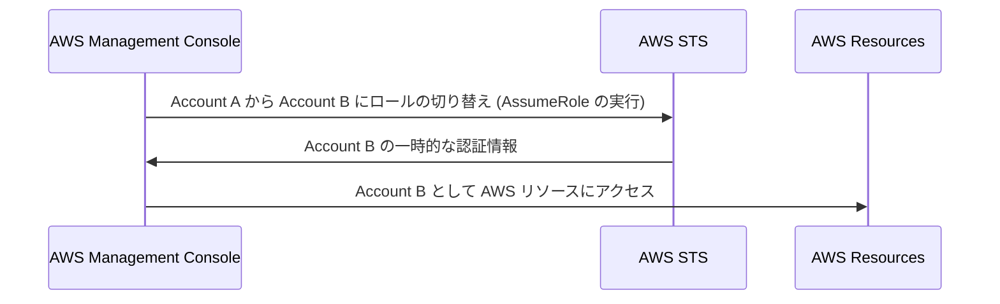

[庄司](https://github.com/edward-mamezou)です。

2023年1月4日の CircleCI のセキュリティインシデントの[レポート](https://circleci.com/ja/blog/jan-4-2023-incident-report/)の中で、セキュリティのベストプラクティスの1つが次のように書かれています。

> 可能な限り[OIDCトークン](https://circleci.com/docs/ja/openid-connect-tokens/)を使用し、CircleCI に長期間の認証情報を保存しないようにする。

AWS のための CI/CD では、GitHub Actions には [AWS for GitHub Actions](https://github.com/aws-actions) リポジトリの [configure-aws-credentials](https://github.com/aws-actions/configure-aws-credentials) に OIDC トークンを使用する実装があります。

また、GitLab CI/CD は [Configure OpenID Connect in AWS to retrieve temporary credentials](https://docs.gitlab.com/ee/ci/cloud_services/aws/) に説明があります。

AWS へのアクセスでは、これらはどれも [AWS Security Token Service (AWS STS)](https://docs.aws.amazon.com/ja_jp/IAM/latest/UserGuide/id_credentials_temp.html) に OIDC トークンを渡して一時的な認証情報 (AWS_ACCESS_KEY_ID、AWS_SECRET_ACCESS_KEY、AWS_SESSION_TOKEN) を取得します。

## AWS Security Token Service とは

[AWS Organizations](https://aws.amazon.com/jp/organizations/) 等で複数の AWS アカウント ID を使用して管理コンソールを利用している場合、[Switch Role (ロールの切り替え)](https://docs.aws.amazon.com/ja_jp/IAM/latest/UserGuide/id_roles_use_switch-role-console.html) を使ったことがあるでしょう。

この仕組みも AWS STS が利用されています。

例えば、Account A で管理コンソールにログインして、Account B にロールの切り替えを行った場合のフローは下図のようになります。



AWS STS で一時的な認証情報を取得する場合、ロールの切り替えで使用する [AssumeRole](https://docs.aws.amazon.com/STS/latest/APIReference/API_AssumeRole.html) と、SAML に対応する [AssumeRoleWithSAML](https://docs.aws.amazon.com/STS/latest/APIReference/API_AssumeRoleWithSAML.html)、そしてこの記事で説明する OIDC に対応する [AssumeRoleWithWebIdentity](https://docs.aws.amazon.com/STS/latest/APIReference/API_AssumeRoleWithWebIdentity.html) があります。

## Amazon Cognito user pools の OIDC を使用した実験

では、ここから [Cognito user pools](https://aws.amazon.com/jp/cognito/) を使って OIDC トークンを取得して、STS で一時的な認証情報を取得する実験をしたいと思います。

### IAM ID プロバイダの追加

Cognito user pools のクライアントと AWS Identity and Access Management (IAM) を連携させるため、管理コンソールを開いて、IAM - アクセス管理 - ID プロバイダ の「プロバイダを追加」ボタンをクリックします。


プロバイダの設定のプロバイダのタイプに「OpenID Connect」を選択します。

プロバイダの URL には、`https://cognito-idp.{リージョン}.amazonaws.com/{プールID}` を入力します。リージョン、プールID はそれぞれ Cognito user pools のリージョンとプールIDです。

プロバイダの URL を入力したら「サムプリントを取得」ボタンをクリックします。

対象者には、Cognito user pools のクライアント ID を入力します。


「プロバイダを追加」ボタンをクリックします。

### IAM ロールの追加

次に、IAM ロールを追加します。IAM - アクセス管理 - ロール の「ロールを作成」ボタンをクリックします。


信頼されたエンティティタイプに「ウェブアイデンティティ」を選択します。

ウェブアイデンティティのアイデンティティプロバイダーには、追加した ID プロバイダ を選択し、Audience は追加した ID プロバイダの対象者に設定した クライアント ID を選択します。


「次へ」ボタンをクリックします。

ここでは、許可ポリシーに「AmazonS3ReadOnlyAccess」を選択しておきましょう。


「次へ」ボタンをクリックします。

ロール名に「TestRole」と入力して「ロールを作成」ボタンをクリックします。


### 実験開始

では、はじめましょう。

まず、aws cli を使って、OIDC トークンを取得します。

```text
aws cognito-idp admin-initiate-auth \
  --user-pool-id {プールID} \
  --client-id {クライアントID} \
  --auth-flow ADMIN_USER_PASSWORD_AUTH \
  --auth-parameters 'USERNAME={ユーザ名},PASSWORD={パスワード}
```

認証をパスすれば、次のようなイメージの JSON が返ります。

```json
{
    "ChallengeParameters": {},
    "AuthenticationResult": {
        "AccessToken": "...",
        "ExpiresIn": 3600,
        "TokenType": "Bearer",
        "RefreshToken": "...",
        "IdToken": "..."
    }
}
```

レスポンスの IdToken の値を使って、次のように `curl` コマンドを実行します。

```text
curl https://sts.amazonaws.com/ \
  --data-urlencode 'Action=AssumeRoleWithWebIdentity' \
  --data-urlencode 'RoleSessionName=app1' \
  --data-urlencode 'RoleArn={IAM に登録した TestRole の ARN}' \
  --data-urlencode 'WebIdentityToken={IdToken の値}' \
  --data-urlencode 'Version=2011-06-15'
```

成功すると、次のような一時的な認証情報が返ります。

```xml
<AssumeRoleWithWebIdentityResponse xmlns="https://sts.amazonaws.com/doc/2011-06-15/">
  <AssumeRoleWithWebIdentityResult>
    <Audience>{クライアントID}</Audience>
    <AssumedRoleUser>
      <AssumedRoleId>...</AssumedRoleId>
      <Arn>arn:aws:sts::{ACCOUNT ID}:assumed-role/TestRole/app1</Arn>
    </AssumedRoleUser>
    <Provider>cognito-idp.{リージョン}.amazonaws.com/{プールID}</Provider>
    <Credentials>
      <AccessKeyId>...</AccessKeyId>
      <SecretAccessKey>...</SecretAccessKey>
      <SessionToken>...</SessionToken>
      <Expiration>2023-02-28T17:26:54Z</Expiration>
    </Credentials>
    <SubjectFromWebIdentityToken>...</SubjectFromWebIdentityToken>
  </AssumeRoleWithWebIdentityResult>
  <ResponseMetadata>
    <RequestId>...</RequestId>
  </ResponseMetadata>
</AssumeRoleWithWebIdentityResponse>
```

この一時的な認証情報を使ってみましょう。環境変数にレスポンスの認証情報 (Credentials) の値を設定します。

```text
export AWS_ACCESS_KEY_ID={AccessKeyId の値}
export AWS_SECRET_ACCESS_KEY={SecretAccessKey の値}
export AWS_SESSION_TOKEN={SessionToken の値}
```

まず、EC2 インスタンス一覧を取得してみましょう。

```text
aws ec2 describe-instances
```

`TestRole` は ec2 の DescribeInstances を許可していないため、次のようなエラーになります。

```text
An error occurred (UnauthorizedOperation) when calling the DescribeInstances operation: You are not authorized to perform this operation.
```

次に許可されている s3 の ListBuckets を実行してみましょう。

```text
aws s3api list-buckets
```

バケット一覧が返されます。

## おわりに

この記事では、ベストプラクティスとされる OIDC トークンを使用して一時的認証情報を取得する AWS STS のフローを解説しました。

CI/CD で OIDC トークンから一時的認証情報がどのように取得されるかを理解する一助になれば幸いです。
