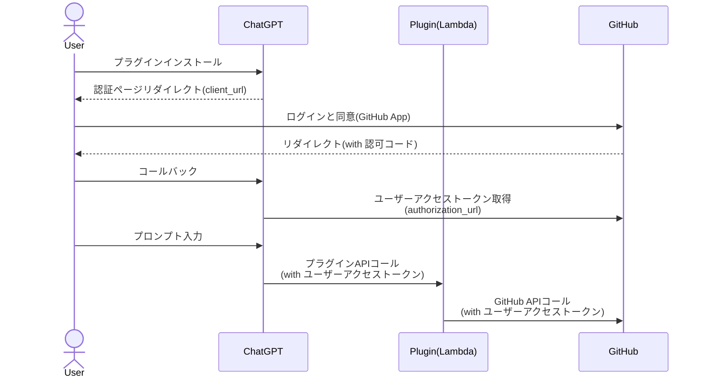

少し前にAWS上でChatGPTプラグインを構築する記事を書きました。

- [AWS LambdaでChatGPTプラグイン開発を試してみる - ローカル開発編](/blogs/2023/05/21/chatgpt-dev-intro-1/)
- [AWS LambdaでChatGPTプラグイン開発を試してみる - AWSデプロイ編](/blogs/2023/05/25/chatgpt-dev-intro-2/)

ここでは認証なし(auth: none)の実装としていました。
ユーザー固有のリソースを使うなど認証が必要なケースも多くあるかと思います。

現時点ではChatGPTプラグインは、認証方式として以下3タイプを提供しています。

- [サービスレベル認証](https://platform.openai.com/docs/plugins/authentication/service-level)
- [ユーザーレベル認証](https://platform.openai.com/docs/plugins/authentication/user-level)
- [OAuth](https://platform.openai.com/docs/plugins/authentication/oauth)

今回は、以前の記事で作成したAWS LambdaベースのGitHub検索プラグインを、OAuthを使った認証に切り替えたいと思います。

以下のような認証フローになります。



ここで使用したGitHubのソースコードは、[こちら](https://github.com/kudoh/chatgpt-plugin-example-aws-lambda/tree/auth)で公開しています。

:::alert
ChatGPTプラグインは実験的フェーズです。本記事は現時点(2023-06-07)の仕様をもとに試したものです。
今後フィードバックを受けて大きな変更が入ることも予想されます。実際に試す際は最新の公式ドキュメントを参照するようにしてください。
:::

## Lambda関数の修正

プラグインの機能自体は変えませんが、GitHub APIで連携しているトークンはOAuthで取得するアクセストークンに変更します。
変更部分にコメントを入れています。

```typescript
const octokit = new Octokit({
  // ユーザーアクセストークンを使用するため不要
  // auth: process.env.GITHUB_TOKEN
});
export const search: APIGatewayProxyHandler = async (event: APIGatewayEvent, context: Context) => {
  const { q } = event.queryStringParameters ?? {};
  const resp = await octokit.request('GET /search/repositories', {
    q,
    sort: 'stars',
    order: 'desc',
    per_page: 5,
    // ChatGPTが取得するユーザーアクセストークン(Bearer ghu_xxxxxxx)をそのまま指定
    headers: {
      authorization: event.headers.Authorization
    }
  });
  const repos: Repo[] = resp.data.items.map(item => ({
    full_name: item.full_name,
    url: item.url,
    star: item.stargazers_count,
    description: item.description
  }));
  return {
    statusCode: 200,
    body: JSON.stringify({
      repos
    }),
    headers: {
      ...CORSHeaders,
      'Content-Type': 'application/json'
    }
  };
};
```

ChatGPTではOAuth認証した際のアクセストークンを、HTTPリクエストのAuthorizationヘッダにそのままの形(`Bearer ghu_xxxxxxxx`)で連携してくれます。
ここでは、これをそのままGitHub APIのAuthorizationヘッダに指定するように修正しました。

:::column:AWS CDKスクリプトの修正
AWS CDK側でも一部修正が必要です。変更点は以下2点です。

- Authorizationヘッダをオリジンまで連携するようキャッシュポリシーのホワイトリストに追加
- Lambdaの環境変数に指定していたGitHubトークンを削除(ユーザーアクセストークンを使用するので不要)

変更後のソースコードは[こちら](https://github.com/kudoh/chatgpt-plugin-example-aws-lambda/blob/auth/cdk/lib/cdk-stack.ts)です。
:::

## プラグインマニフェスト修正

次に、プラグインマニフェスト(`static/.well-known/ai-plugin.json`)を修正します。
ここでプラグインの認証方式を指定します。

今後変わるかもしれませんが、現時点では2段階のマニフェスト変更が必要でした。
初期段階は以下のようにします。
    
```json
{
  "schema_version": "v1",
  "name_for_human": "GitHub Search",
  "name_for_model": "GitHubSearch",
  "description_for_human": "Plugin for searching GitHub repositories, You can search the repository by entering your search query.",
  "description_for_model": "Plugin for searching GitHub repositories, You can search the repository by entering your search query.",
  "auth": {
    "type": "oauth",
    "client_url": "https://github.com/login/oauth/authorize",
    "authorization_url": "https://github.com/login/oauth/access_token",
    "scope": "",
    "authorization_content_type": "application/json",
    "verification_tokens": {
      "openai": ""
    }
  },
  "api": {
    "type": "openapi",
    "url": "https://chatgpt.mamezou-tech.com/openapi.yaml"
  },
  "logo_url": "https://chatgpt.mamezou-tech.com/logo.png",
  "contact_email": "support@chatgpt.mamezou-tech.com",
  "legal_info_url": "https://chatgpt.mamezou-tech.com/legal"
}
```

`auth`配下が変更部分です。前回の記事では`none`のみでしたが、ここではOAuthを表す`oauth`を指定し、各種プロパティを設定します。
`client_url`等の各プロパティの仕様は、ChatGPTプラグインの[公式ドキュメント](https://platform.openai.com/docs/plugins/authentication/oauth)の通りです。

なお、`verification_tokens.openai`の値はプラグインのセットアップ時に設定しますが、この段階でもフィールド自体は必要でした(省略したらマニフェストを認識してくれませんでした)。

## GitHub Appを作成する

以下のGitHubの公式ドキュメントを参照してユーザーアクセストークンベース(OAuth)のGitHub Appを作成しました。

- [Registering a GitHub App](https://docs.github.com/en/apps/creating-github-apps/registering-a-github-app/registering-a-github-app)
- [Generating a user access token for a GitHub App](https://docs.github.com/en/apps/creating-github-apps/authenticating-with-a-github-app/generating-a-user-access-token-for-a-github-app)

GitHub App作成時のOAuth認証後のコールバックURLの値ですが、ちょっとここはハマりました。
ChatGPTプラグインでのコールバック先は以下の形式になります。

`https://chat.openai.com/aip/{plugin-id}/oauth/callback`

ここで問題になるのが、パスに含まれるプラグインID(`{plugin-id}`)です。
これを探すのにだいぶ時間を費やしてしまいました。これはChatGPTプラグインのセットアップ時に分かります。ここでは適当なもので問題ありませんでした。

作成後はOAuthのクライアントシークレットを生成します。これは後ほどChatGPTプラグインセットアップ時にクライアントIDと共に登録することになります。


## ChatGPTプラグインをセットアップする

それでは、ChatGPTプラグインをセットアップします。
認証なしの場合の時と同様にChatGPTのUIからプラグインストアを表示し、「Develop your own plugin」を選択してドメインを入力します。
すると、以下のようにOAuthのクライアントIDとシークレットの入力を求められました。


ここには、先ほどGitHub App作成時に払い出されたものを入力して、「Next」をクリックします。
以下のようにトークン検証を求めるダイアログが表示されました。


ここで修正と再デプロイが必要になります。
表示されたトークンを`ai-plugin.json`の`verification_tokens.openai`に設定して再度デプロイします。ここではCloudFront経由ですので、CDNキャッシュもクリアしました。

また、もう1つ重要なことがあります。先ほどGitHub AppのOAuthコールバックURLに指定する必要があったプラグインIDを確認します。
前述しましたが、これが見つけられなくて苦戦しました。[公式ドキュメント](https://platform.openai.com/docs/plugins/authentication/oauth)をよく読むと以下のように記載されています。

> The plugin_id is passed via the request made to your OAuth endpoint (note that it is not visible in the ChatGPT UI today but may be in the future). You can inspect the request there to see the plugin_id.

現時点ではChatGPTのUIからは確認できなさそうです。
最終的には、Chromeのデベロッパーツールで確認できましたが、この見方が正しいのかは全く自信がありません（きっと正しくない）。


上記赤枠部分がプラグインIDのようです。
先ほど、GitHub App作成時コールバックURLに適当の値を指定していましたが、ここで正しいパスに置き換えて更新しておきます。


ChatGPTのUIに戻って先ほど表示されていたダイアログの「Verify tokens」をクリックします。
以下のダイアログが表示されますので「Install for me」をクリックします。


「Continue」をクリックします。


ここでログインが求められます。「Log in with <プラグイン名>」をクリックします。


GitHubのログインとGitHub Appに対する許可が求められます。


これで「Authorize...」をクリックすればプラグインのインストールは完了です。
特にプラグインの機能は変えていないのでできることは同じですが、ユーザーアクセストークンを使ってGitHub APIが実行されるようになりました。

## まとめ

OAuthに関する実装をすることなく、プラグインからアクセストークンを利用できました。

今回使ったGitHubレポジトリを検索するだけのプラグインでは、OAuthを使うメリットはほとんどありません。
ですが、このアクセストークンをうまく活用して機能拡張すれば、レポジトリ作成やコミット、PR作成等、開発作業に必要なことがほぼできてしまいます(もちろんコーディングはChatGPT)。
ChatGPTと会話しながら、ノーコードで開発を進めていく日も近いのかなと思います。GitHub Copilotが拡張して、そういうサービスが近々でるんだろうなと思ったりもしますが、、、
