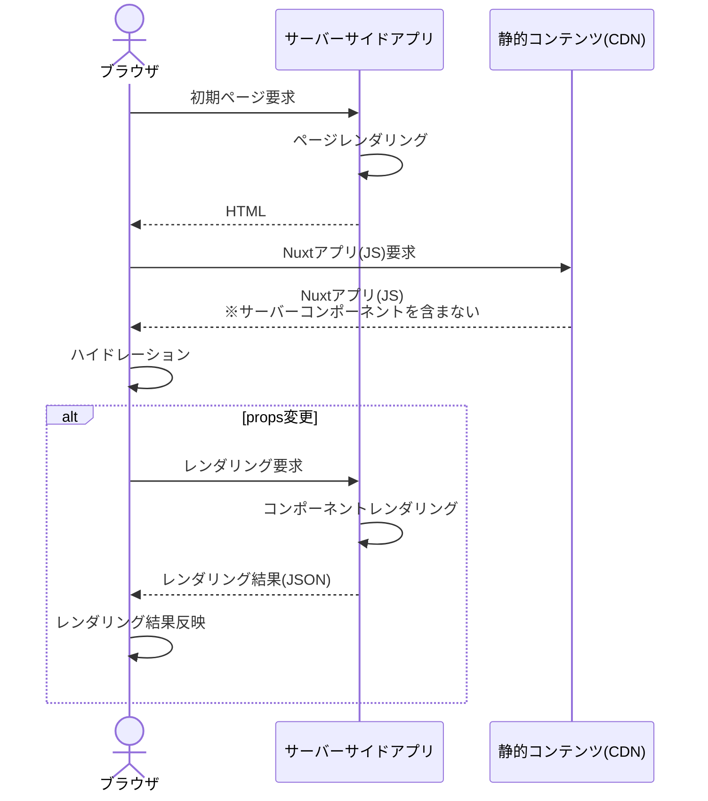

Server Componentsと言えば、React[^1]/Next.jsのApp Router[^2]を思い浮かべる方が多いと思います。
特に、Next.jsのApp RouterはデフォルトでServer Componentsが適用されるので、今後目にするケースが増えていくことと思います。

[^1]: [React Server Components RFC](https://github.com/reactjs/rfcs/blob/main/text/0188-server-components.md)
[^2]: [Next.js App Router - Server Components](https://nextjs.org/docs/getting-started/react-essentials#server-components)

Server Componentは文字通りサーバーサイドのみでレンダリングされるコンポーネントです。
これによる制約もありますが、パフォーマンスや効率性が大きく改善されます。
そんなServer Componentsですが、Nuxtでも実験的扱いですが開発が進められています。

- [Nuxt3 Doc - Server Components](https://nuxt.com/docs/guide/directory-structure/components#server-components)

今回はこのNuxtのServer Componentsを試してみたいと思います。

:::alert
NuxtのServer Componentsは実験的段階でドキュメントも充実してるとは言えません。現時点ではクリティカルな環境での利用は控えた方が良いと思います。

NuxtでのServer Componentsのロードマップやその状況は、以下GitHub Issueで管理されています。

- [GitHub Nuxt - server component roadmap](https://github.com/nuxt/nuxt/issues/19772)
:::

## nuxt.config.ts

前述しましたが、現時点ではServer Componentsは実験的段階です。
利用するには`nuxt.config.ts`でフィーチャーフラグ(`componentIslands`)を有効にします。

```typescript
export default defineNuxtConfig({
  experimental: {
    componentIslands: true
  }
});
```

フィーチャーフラグ名(`componentIslands`)の通り、Server ComponentsはNuxt版のアイランドアーキテクチャの一部になっているようです。

なお、ここで使ったNuxtのバージョンは`3.6.1`です。
Nuxtのバージョンアップとともに、Server Componentsもアップグレードされています。利用するNuxtバージョンには注意が必要です。

## サーバーコンポーネント

作成したサーバーコンポーネントは以下のようなものです(Blog.server.vue)。

```html
<script setup lang="ts">
import MarkdownIt from 'markdown-it';

const props = defineProps<{
  page: string
}>();

const { blog, fetchByPage } = useBlog(); // マークダウン形式のブログをフェッチするダミーComposable
fetchByPage(Number(props.page));

const md = new MarkdownIt();
const html = md.render(blog.value?.content ?? 'Page Not Found');
console.log('server-side initialization completed!!');
</script>

<template>
  <div v-html="html" />
</template>
```

Nuxtの公式ドキュメントの動画を見ながら作りました。
ファイル名がポイントです。サフィックスを`.server.vue`にします。これでNuxtはこのコンポーネントをサーバーコンポーネントとして認識します。

このコンポーネントは、propsで受け取ったページ(page)に対応するブログ(マークダウン形式)を取得し、マークダウンパーサー(markdown-it)でHTMLに変換してレンダリングしています。

Reactも同様ですが、サーバーコンポーネントはサーバーサイドのみでレンダリングされますので、その実装に注意が必要です。
以下の機能は使えません。

- ライフサイクルイベント(onMounted等)
- イベントハンドリング(@click等)
- リアクティブな変数(ref()等)
- ブラウザでのみ動作するAPI(DOM API等)

これらは実装したところで、期待通りに動作しません。

また、サーバーコンポーネント内で通常のコンポーネント(ファイル名から`.server`を外したもの)[^3]を使っても、サーバーコンポーネントとして扱われてしまうようです。
つまり、上記制約が通常コンポーネントに対しても適用されてしまいました。 
後述しますが、この通常のコンポーネントをサーバーコンポーネントのスロットとして使うことで解消します[^4]。

[^3]: ここでいう「通常のコンポーネント」はクライアントサイドでリアクティブに動作するコンポーネントを指します。`.client.vue`サフィックスのコンポーネントと区別するために、クライアントコンポーネントの表現は使いませんでした。
[^4]: [GitHub Nuxt Issue - support client interactivity within server components](https://github.com/nuxt/nuxt/issues/19765)

このようにいくつかの制約に気を付ける必要がありますが、サーバーコンポーネントのソースコードはクライアント向けのバンドルファイルには含まれません。
このため、ファイルサイズが削減されるのはもちろん、ブラウザからアクセスできないようなプライベートなデータのフェッチ等をここでしても問題ありません。

## サーバーコンポーネントを利用するページ

サーバーコンポーネントを使うページは以下のようになります(pages/index.vue)。

```html
<script setup lang="ts">
const page = ref('1');
</script>

<template>
  <div>
    <div>
      <label for="page">Page: </label>
      <input id="page" v-model="page" />
    </div>
    <Blog :page="page" />
  </div>
</template>
```

通常のVueコンポーネントと特に変わるところはありません。
サーバーコンポーネントのpropsとしてユーザー入力値を渡すようにしています。
つまり、入力値の変更に反応して、サーバーコンポーネントの内容を切り替えるリアクティブ性を持たせています。

## サーバーコンポーネントの動きを確認する

これをビルドして動かしてみます。

```shell
npm run build
node .output/server/index.mjs
```

以下のイメージになります。


試しに、通常コンポーネント(`.server`を外した場合)とサーバーコンポーネントでクライアントにダウンロードされるNuxtアプリ(`.nuxt/dist/client/_nuxt/index.xxxxxxxx.js`)のバンドルサイズを比較してみました。

- 通常コンポーネント: 109KB
- サーバーコンポーネント: 11.9KB

サーバーコンポーネントの場合は、劇的にファイルサイズが削減されています。
これは、通常コンポーネントではクライアント側のレンダリングのために、コンポーネント自体と外部ライブラリ(この場合はmarkdown-it)のソースコードがバンドルファイルに含まれているためです。

このサーバーコンポーネントもユーザーの入力値(page)が変わると再レンダリングする必要があります。
通常コンポーネントであれば、入力値の変更に反応してクライアントサイドで再レンダリングされますが、ここではサーバーサイドでレンダリングする仕組みが必要です。
Nuxtではサーバーサイド側にGETリクエスト(クエリパラメータとしてpropsを連携)を投げてレンダリング結果をJSONで受け取っていました。

以下はChrome DevToolでこの動を追ってみた様子です。


なお、この結果はクライアント側にキャッシュされていて、同一のpropsで再取得することはありませんでした[^5]。

[^5]: 現時点でこのキャッシュ戦略を変更できるのかは検証できませんでした。

最後に、サーバーコンポーネントを使った場合の動きをシーケンスで整理しておきます。



今回はローカル環境(Node.jsサーバー)で動かしていますが、実運用をイメージして上記シーケンスではサーバーサイドアプリ(Nitro)と静的コンテンツとして配信する部分(CDN)はレーンを分けています。

## サーバーコンポーネントと通常コンポーネントを組み合わせる

Next.jsの場合はコンポーネントツリーのリーフコンポーネントに、リアクティブ性が要求されるコンポーネントを配置すること推奨しています[^6]。

[^6]: [Next.js Doc - Moving Client Components to the Leaves](https://nextjs.org/docs/getting-started/react-essentials#moving-client-components-to-the-leaves)

ただし、前述の通りNuxtではサーバーコンポーネント内に通常のコンポーネントを使ってもリアクティブになりません。

例えば、以下のイベントハンドラを持つボタンコンポーネントがあるとします。

```html
<script setup lang="ts">
const log = () => console.log('click!!')
</script>

<template>
  <button @click="log">クリック</button>
</template>
```

ボタンをクリックすると、コンソールにログ出力するコンポーネントです。
これを先ほど作成したサーバーコンポーネントに配置します。

```html
<script setup lang="ts">
// ソースコード省略
</script>

<template>
  <div>
    <Button />
    <div v-html="html" />
  </div>
</template>
```

これは動作しません。ボタンをクリックしてもコンソールログは出力されません。

現時点では、このような場合はスロットを使います(スロットのサポートはv3.5よりサポートされました)。
サーバーコンポーネントは以下のような実装になります。

```html
<script setup lang="ts">
// ソースコード省略
</script>

<template>
  <div>
    <slot />
    <div v-html="html" />
  </div>
</template>
```

直接Buttonコンポーネントを配置していた部分を`slot`に置き換えました。
代わりに、サーバーコンポーネントを利用するページファイル(index.vue)で、このスロットにButtonコンポーネントを配置します。

```html
<script setup lang="ts">
const page = ref('1');
</script>

<template>
  <div>
    <div>
      <label for="page">Page: </label>
      <input id="page" v-model="page" />
    </div>
    <Blog :page="page">
      <!-- default slot -->
      <Button />
    </Blog>
  </div>
</template>
```

このように変更することで、期待通りクリックイベントが動作するようなります。

## 最後に

今回は現時点でのNuxt版Server Componentsの実装について見ていきました。
まだ実験的段階であるものの、うまく使いことなすとパフォーマンス観点のメリットが大きいと思います。

語弊があるかもしれませんが、大きな潮流としてフロントエンドはサーバーサイドレンダリングに戻ってきているのを感じます。
Next.jsのApp RouterがStableになって、Server Componentsの普及が進んでいくのは確実ですが、Nuxtの方の動きも注目していきたいと思いました。
