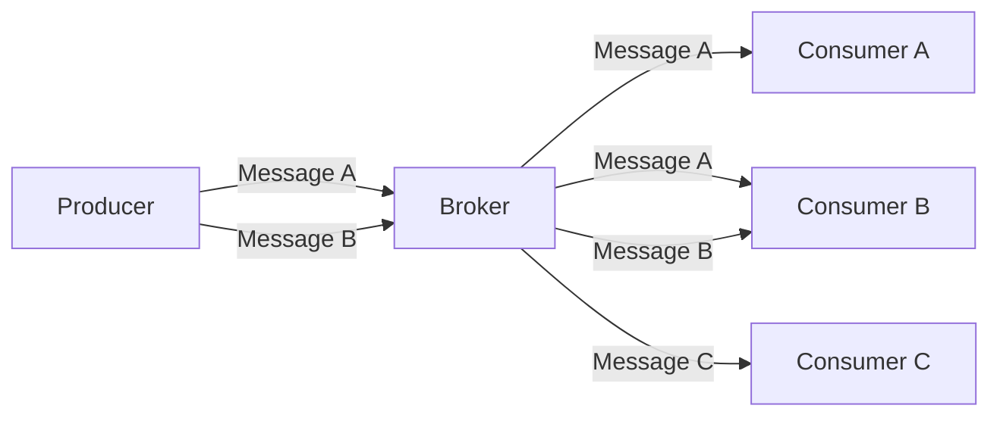
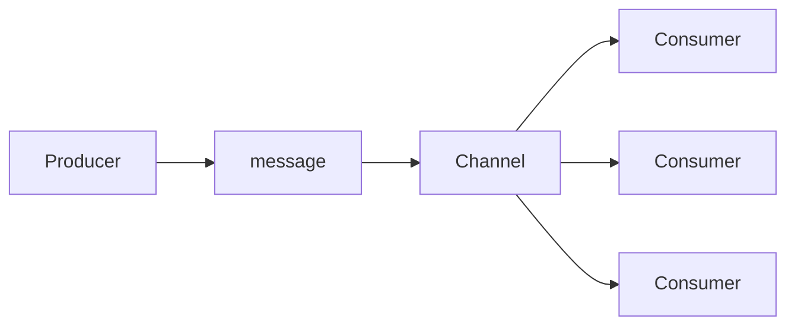

## はじめに
イベント駆動アーキテクチャ(Event-Driven-Architectures: EDA)について耳にする機会が増えてきました。EDA ではマイクロサービス間で同期的な通信を行うのではなく、イベントをトリガーとした非同期的な通信を行います。これによりスケーラブルで応答性の高いシステムが構築できる、IoT などの多数のイベントソースからの情報をリアルタイムに処理できるなどのメリットがあります。

イベントの生成元である Producer はイベントチャネルに対してイベントを発行、イベントチャネルを購読する Consumer が受信を契機として処理を行います。Apache Kafka や RabbitMQ などがメッセージを配信するための Broker として利用されます。

:::info
以前の記事「[Debezium によるチェンジデータキャプチャー](/blogs/2022/02/28/debezium-cdc/)」で紹介した CDC もイベント駆動アーキテクチャで利用される技術の一つと言えます。
:::

AsyncAPI は EDA アプリケーションのイベントを契機として実行される非同期 API の業界標準を目指して整備されている仕様です。

[AsyncAPI Initiative for event-driven APIs](https://www.asyncapi.com/)

REST API のような同期的 API によるアーキテクチャをリクエスト駆動型のアーキテクチャ(Request-Driven-Architectures: RDA) と捉えることもできます。RDA の代表格である REST API では、[OpenAPI](https://www.openapis.org/) による仕様記述が標準化されています。これにより API 仕様をドキュメントとして交換し、異なるプログラミング言語同士であってもクライアントとサーバーの開発を仕様齟齬のない状態で進めることが可能になっています。

AsyncAPI Initiative の目的は REST API と同じぐらいに EDA を扱いやすくすることであり、文書化・コード生成・ディスカバリ・イベント管理などをカバーすることです。

[Introduction | AsyncAPI Initiative for event-driven APIs](https://www.asyncapi.com/docs/tutorials/getting-started)

RDA と EDA の簡単な比較を表にしてみました。

|         | RDA | EDA |
|:----------|:------|:-----| 
| 通信 | 同期 | 非同期 |
| データ | リクエスト・レスポンス | メッセージ |
| 操作 | GET, PUT, POST, etc | Publish, Subscribe | 
| プロトコル | HTTP | MQTT, Kafka, etc. |
| 仕様 | OpenAPI | AsyncAPI |

本記事では、AsyncAPI の概要を眺め、OpenAPI と対比しながら現在のエコシステムを体験してみたいと思います。

## AsyncAPI の概念

AsyncAPI ではイベントの上位概念としてメッセージを位置付けています。

[Message | AsyncAPI Initiative for event-driven APIs](https://www.asyncapi.com/docs/concepts/message)

Message を送信する Producer、受信する Consumer、仲介する Broker という概念が取り入れられています。

[Overview | AsyncAPI Initiative for event-driven APIs](https://www.asyncapi.com/docs/concepts)



OpenAPI では Server は API がホストされる場所ですが、AsyncAPI における Server は Broker の場所を表します。

Channel はメッセージが publish される先、Conumer が subscribe する先であり、Kafka でいう Topic にあたります。



Application は Consumer / Producer 両方に存在します。EDA のアプリケーションは、Consumer または Producer またはその両方になります。

[Application | AsyncAPI Initiative for event-driven APIs](https://www.asyncapi.com/docs/concepts/application)

Kafka や MQTT など実装の違いは Protocol として抽象化されます。

[Protocol | AsyncAPI Initiative for event-driven APIs](https://www.asyncapi.com/docs/concepts/protocol)

## OpenAPI との対比

OpenAPI とスタックを合わせる形で定義されています。公式ドキュメントから OpenAPI 3.0 との比較チャートを引用します。


[Coming from OpenAPI | AsyncAPI Initiative for event-driven APIs](https://www.asyncapi.com/docs/tutorials/getting-started/coming-from-openapi)

同期と非同期でテクノロジーが異なるため、個々の要素はかなり違います。OpenAPI の Paths が Channel に対応、Request や Response が Message に対応といった具合です。GET / PUT などの HTTP メソッドは、Publish / Subscribe が対応しています。Components に定義に必要な構造を纏めて書いて API 記述本体から参照可能にしているのも OpenAPI オマージュです。

## AsyncAPI 仕様とドキュメント例

本記事執筆現在では、AsyncAPI のバージョンは 2.6.0 が最新です。

[2.6.0 | AsyncAPI Initiative for event-driven APIs](https://www.asyncapi.com/docs/reference/specification/v2.6.0)

AsyncAPI のドキュメント例として [AsyncAPI Studio](https://studio.asyncapi.com/) でもデフォルトで表示されている Smart Streetlights(スマート街灯) API の例を見てみましょう。このドキュメントは、街灯を制御する分散アプリケーションが題材になっています。

- 特定の街灯の明るさについてリアルタイム情報を受け取る
- 特定の街灯を点灯する
- 特定の街灯を消灯する
- 特定の街灯を暗くする

などの API を定義しており、特定のチャネルにサブスクライブしたりメッセージを送ったりすることで API を利用できるというものです。

Broker として Kafka を利用する場合の AsyncAPI ドキュメント例は以下にあります。

[spec/examples/streetlights-kafka.yml at master · asyncapi/spec](https://github.com/asyncapi/spec/blob/master/examples/streetlights-kafka.yml)

一部を抜粋してみましょう。

冒頭部分です。AsyncAPI のバージョンから始まり、情報セクションに API のタイトル、バージョン、API の説明、ライセンス情報が記述されています。

```yaml
asyncapi: '2.6.0'
info:
  title: Streetlights Kafka API
  version: '1.0.0'
  description: |
    The Smartylighting Streetlights API allows you to remotely manage the city lights.
    ### Check out its awesome features:
    * Turn a specific streetlight on/off 🌃
    * Dim a specific streetlight 😎
    * Receive real-time information about environmental lighting conditions 📈
  license:
    name: Apache 2.0
    url: https://www.apache.org/licenses/LICENSE-2.0
```

サーバーに関するセクションです。Kafka Broker の URL、Kafka で 簡易認証 SASL を利用することなどが定義されています。

```yaml
servers:
  test:
    url: test.mykafkacluster.org:8092
    protocol: kafka-secure
    description: Test broker
    security:
      - saslScram: []
```

チャネルセクションには、4つの AsyncAPI が列挙されています。街灯の明るさの測定値を取得する API の部分は以下のようになっています。

この API は Kafka の Producer により publish される情報であり、チャネル(トピック)に街灯の ID(streetlightId) が埋め込まれているので、当該 ID のトピックにサブスクライブして取得することになります。REST API のパスパラメータのような使い方ですね。

```yaml
channels:
  smartylighting.streetlights.1.0.event.{streetlightId}.lighting.measured:
    description: The topic on which measured values may be produced and consumed.
    parameters:
      streetlightId:
        $ref: '#/components/parameters/streetlightId'
    publish:
      summary: Inform about environmental lighting conditions of a particular streetlight.
      operationId: receiveLightMeasurement
      traits:
        - $ref: '#/components/operationTraits/kafka'
      message:
        $ref: '#/components/messages/lightMeasured'
```
publish される明るさの情報は、components に以下のように定義されています。メッセージの Payload は lightMeasuredPayload への参照となっています。

```yaml
components:
  messages:
    lightMeasured:
      name: lightMeasured
      title: Light measured
      summary: Inform about environmental lighting conditions of a particular streetlight.
      contentType: application/json
      traits:
        - $ref: '#/components/messageTraits/commonHeaders'
      payload:
        $ref: "#/components/schemas/lightMeasuredPayload"
```

lightMeasuredPayload の定義は以下のようになっており、ルーメンの値が整数型で取得できることがわかります。さらに、測定された時刻も別スキーマとして参照するようになっています。

```yaml
  schemas:
    lightMeasuredPayload:
      type: object
      properties:
        lumens:
          type: integer
          minimum: 0
          description: Light intensity measured in lumens.
        sentAt:
          $ref: "#/components/schemas/sentAt"

    sentAt:
      type: string
      format: date-time
      description: Date and time when the message was sent.
```

街灯を点灯する API についても同様なトピック定義、メッセージの定義がされています。この API は Kafka の Consumer として実装されるため、利用側は、当該トピックに turnOnOff のスキーマに準拠したメッセージを送る必要があります。

```yaml
  smartylighting.streetlights.1.0.action.{streetlightId}.turn.on:
    parameters:
      streetlightId:
        $ref: '#/components/parameters/streetlightId'
    subscribe:
      operationId: turnOn
      traits:
        - $ref: '#/components/operationTraits/kafka'
      message:
        $ref: '#/components/messages/turnOnOff'

    turnOnOff:
      name: turnOnOff
      title: Turn on/off
      summary: Command a particular streetlight to turn the lights on or off.
      traits:
        - $ref: '#/components/messageTraits/commonHeaders'
      payload:
        $ref: "#/components/schemas/turnOnOffPayload"

  schemas:
    turnOnOffPayload:
      type: object
      properties:
        command:
          type: string
          enum:
            - on
            - off
          description: Whether to turn on or off the light.
        sentAt:
          $ref: "#/components/schemas/sentAt"
```

## ツールの利用

OpenAPI の Swagger Editor に相当するツールや、OpenAPI Generator に相当するツールが、オールインワンの AsyncAPI CLI 経由で利用できます。CLI の他に NPM で提供されるライブラリもあります。ここでは CLI の使い方を見てみます。

まずは、インストールから。NPM パッケージとして提供されています。

```shell
npm install -g @asyncapi/cli
```
[Installation guide | AsyncAPI Initiative for event-driven APIs](https://www.asyncapi.com/docs/tools/generator/installation-guide)


また、各種ジェネレーターのテンプレートは、CLI とは別にインストールして利用する方式になっています。

公式のテンプレート一覧は以下にあります。

[https://www.asyncapi.com/docs/tools/generator/template](https://www.asyncapi.com/docs/tools/generator/template)

例えば HTML ドキュメントを生成するための html-template は以下のようにインストールします。

```shell
npm install -g @asyncapi/html-template
```

:::info
CLI は Docker イメージも用意されているので、ローカルにインストールすることなく使えます。

[CLI usage with Docker](https://www.asyncapi.com/docs/tools/generator/usage#cli-usage-with-docker)

また、CI/CD 環境で CLI を使ってジェネレータを実行する場合、CLI をグローバルインストールするのではなく、npx で実行することが推奨されています。

```shell
npx -p @asyncapi/cli asyncapi generate fromTemplate ./asyncapi.yaml @asyncapi/html-template
```

[Usage | AsyncAPI Initiative for event-driven APIs](https://www.asyncapi.com/docs/tools/generator/usage)

ジェネレーターに関しては公式の GitHub Action を利用することも可能です。

[Generator for AsyncAPI documents - GitHub Marketplace](https://github.com/marketplace/actions/generator-for-asyncapi-documents)
:::

### AsyncAPI Studio を起動
AsyncAPI ドキュメントの作成・編集のための Studio を起動できます。以下のようにドキュメントファイルを指定して起動します。

```shell
asyncapi start studio -f streetlights-kafka.yml
```


ポートの指定も可能です。

[asyncapi start studio | Usage](https://www.asyncapi.com/docs/tools/cli/usage#asyncapi-start-studio)

:::info
VS Code で編集したい場合、公式から VS Code 拡張が提供されており、VS Code 上でプレビュー可能です。

[asyncapi-preview&#32;-&#32;Visual&#32;Studio&#32;Marketplace](https://marketplace.visualstudio.com/items?itemName=asyncapi.asyncapi-preview)
:::

### ドキュメントの検証
AsyncAPI ドキュメントの検証は以下のように実行します。
```shell
asyncapi validate streetlights-kafka.yml
```

streetlights のドキュメントでは以下のような警告が出力されました。

```
File streetlights-kafka.yml is valid but has (itself and/or referenced documents) governance issues.

streetlights-kafka.yml
   1:1   warning  asyncapi-id                  AsyncAPI document should have "id" field.
   1:1   warning  asyncapi2-tags               AsyncAPI object should have non-empty "tags" array.
   2:6   warning  asyncapi-info-contact        Info object should have "contact" object.            info
  96:19  warning  asyncapi2-message-messageId  Message should have a "messageId" field defined.     components.messages.lightMeasured
 105:15  warning  asyncapi2-message-messageId  Message should have a "messageId" field defined.     components.messages.turnOnOff
 113:14  warning  asyncapi2-message-messageId  Message should have a "messageId" field defined.     components.messages.dimLight

✖ 6 problems (0 errors, 6 warnings, 0 infos, 0 hints)
```

[asyncapi validate [SPEC-FILE] Usage](https://www.asyncapi.com/docs/tools/cli/usage#asyncapi-validate-spec-file)

### HTML ドキュメントを生成する

AsyncAPI ドキュメントは YAML ファイルですが、HTML によるリッチなドキュメントを生成して公開可能です。以下は html-template をインストールし、カレントディレクトリの docs 配下に HTML ドキュメントを出力する例です。

```shell
npm install -g @asyncapi/html-template
asyncapi generate fromTemplate streetlights-kafka.yml @asyncapi/html-template -o ./docs
```

### コードを生成する
java-spring-template を使うと Spring Boot のプロジェクト生成もできます。以下は、カレントディレクトリの project 配下に生成したコードを出力する例です。

```shell
npm install -g @asyncapi/java-spring-template
asyncapi generate fromTemplate streetlights-kafka.yml @asyncapi/java-spring-template -o ./project
```

streetlight のサンプルから生成されたプロジェクトの構造は以下のようになっていました。model 配下にドキュメントに定義されたスキーマやメッセージ情報が Java のクラスとして出力されました。service 配下には、点灯のオンオフや照明情報の送信などのサービスクラスの雛形が出力されていました。infrastructure 配下には Kafka 用の Configuration クラスも生成されていました。スキーマファーストで開発する場合の雛形として使えそうです。


:::info
生成された build.gradle には Jackson などは依存関係に含まれていましたが、Spring for Apache Kafka などは含まれていませんでした。実際に動くものを作るには適宜追加が必要です。
:::

### テンプレートの開発

html-template や java-spring-template のような公式テンプレートを利用するだけでなく、独自にテンプレートを開発することもできるようです。以下のページにガイドがあります。

[Template development | AsyncAPI Initiative for event-driven APIs](https://www.asyncapi.com/docs/tools/generator/template-development)

## サードパーティライブラリ Springwolf の利用
公式以外にも多くのツールが開発されており、様々な言語・フレームワークで利用可能です。以下のページで探すことができます。

[Tools | AsyncAPI Initiative for event-driven APIs](https://www.asyncapi.com/tools)

今回は、Spring Boot のアプリに組み込む Springwolf を見てみます。

[Springwolf](https://www.springwolf.dev/)

Springwolf は [Springfox](http://springfox.github.io/springfox/) の AsyncAPI 版です。Spring Boot で REST API を実装してから Springfox を導入すれば、Swagger UI でドキュメントを表示したり、Configuration クラスに Docket Bean を追加して詳細情報を付加したりできます。Springwolf もこのように実装ファーストで AsyncAPI ドキュメントを生成・公開することができます。

### プロジェクトへの Springwolf の組み込み
公式ドキュメントを参考に組み込んでみます。

[Quickstart | Springwolf](https://www.springwolf.dev/docs/quickstart)

[Spring for Apache Kafka](https://spring.io/projects/spring-kafka) を利用するプロジェクトへの追加が前提になります。build.gradle に以下のように springwolf-kafka と springwolf-ui の依存を追加します。また、AsyncAPI ドキュメントの取得や Web UI のため spring-boot-starter-web も必要となります。

```groovy
dependencies {
  // web を追加 
  implementation 'org.springframework.boot:spring-boot-starter-web'
	implementation 'org.springframework.kafka:spring-kafka'
	implementation group: 'com.fasterxml.jackson.core', name: 'jackson-core'
	implementation group: 'com.fasterxml.jackson.core', name: 'jackson-databind'
	implementation group: 'com.fasterxml.jackson.core', name: 'jackson-annotations'
  // springwolf を追加
	implementation 'io.github.springwolf:springwolf-kafka:0.13.0'
	compileOnly 'org.projectlombok:lombok'
	annotationProcessor 'org.projectlombok:lombok'
	testImplementation 'org.springframework.boot:spring-boot-starter-test'
	testImplementation 'org.springframework.kafka:spring-kafka-test'
  // springwolf-ui を追加
	runtimeOnly 'io.github.springwolf:springwolf-ui:0.8.0'
}

```

:::info
springwolf 0.13.0 は Spring Boot 3.X が対象となります。2.X系で使うなら古いバージョンをインストールする必要があります。

[Is Spring Boot 2.X supported? | Frequently Asked Questions | Springwolf](https://www.springwolf.dev/docs/faq#is-spring-boot-2x-supported)
:::

application.yaml に springwolf の設定を追加します。`docket/base-package` にはドキュメント生成のために、Producer や Consumer をスキャンする対象パッケージのルートを指定します。`docket/info` にはドキュメントのタイトルやバージョンを指定します。`doket/servers` には利用する Kafka broker の URL を指定します。`plugin/kafka/publishing` を有効化しておくと、Kafka トピックへのメッセージ送信を試すことができるようです。

```yaml
springwolf:
  enabled: true
  docket:
    base-package: com.kondoumh.kafkaconsumerexample
    info:
      title: kafka-consumer-example
      version: 0.1.0
      description: kafka-consumer-example
    servers:
      kafka:
        protocol: kafka
        url: localhost:9092
  plugin:
    kafka:
      publishing:
        enabled: true
```

### ドキュメント生成と閲覧

以下のような KafkaListener を使用した Consumer のコードがあるとします。

```java
@Component
public class ExampleListener {

    private static final Logger LOGGER = LoggerFactory.getLogger(ExampleListener.class);

    @KafkaListener(topics = "example-topic-01")
    public void listen(@Header(KafkaHeaders.RECEIVED_KEY) String key
                       @Payload ExampleEvent event, ) {

        LOGGER.info("Received: {}, {}", key, event);
    }
}
```

Payload に指定された ExampleEvent は以下のようになっています。

```java
@Data
@AllArgsConstructor
@NoArgsConstructor
public class ExampleEvent {
    @JsonProperty("event_id")
    Long eventId;
    @JsonProperty("event_name")
    String eventName;
}
```

Springwolf を組み込んだ状態でアプリを起動し、`localhost:8080/springwolf/docs` にアクセスすると以下のように AsyncAPI ドキュメントを JSON 形式で取得できます。`localhost:8080/springwolf/docs.yaml` にアクセスすると、YAML 形式でダウンロードできます。

```
{
  "asyncapi": "2.6.0",
  "info": {
    "title": "kafka-consumer-example",
    "version": "0.1.0",
    "description": "kafka-consumer-example"
  },
  "defaultContentType": "application/json",
  "servers": {
    "kafka": {
      "url": "localhost:9092",
      "protocol": "kafka"
    }
  },
  "channels": {
    "example-topic-01": {
      "publish": {
        "operationId": "example-topic-01_publish_listen",
        "description": "Auto-generated description",
        "bindings": {
          "kafka": {
            "bindingVersion": "0.4.0"
          }
        },
        "message": {
          "schemaFormat": "application/vnd.oai.openapi+json;version=3.0.0",
          "name": "com.kondoumh.kafkaconsumerexample.ExampleEvent",
          "title": "ExampleEvent",
          "payload": {
            "$ref": "#/components/schemas/ExampleEvent"
          },
          "headers": {
            "$ref": "#/components/schemas/HeadersNotDocumented"
          },
          "bindings": {
            "kafka": {
              "bindingVersion": "0.4.0"
            }
          }
        }
      },
      "bindings": {
        "kafka": {
          "bindingVersion": "0.4.0"
        }
      }
    }
  },
  "components": {
    "schemas": {
      "ExampleEvent": {
        "type": "object",
        "properties": {
          "event_id": {
            "type": "integer",
            "format": "int64"
          },
          "event_name": {
            "type": "string"
          }
        },
        "example": {
          "event_id": 0,
          "event_name": "string"
        }
      },
      "HeadersNotDocumented": {
        "type": "object",
        "properties": { },
        "example": { }
      }
    }
  },
  "tags": [ ]
}
```

`localhost:8080/springwolf/asyncapi-ui.html` にアクセスすると springwolf-ui で AsyncAPI ドキュメントをブラウズできます。


:::info
Springwolf の自動スキャンでは、Kafka メッセージの独自定義ヘッダーは出力されません。これはアノテーションを追加することで出力できるようになります。詳しくは以下を参照してください。

[Messages | Springwolf](https://www.springwolf.dev/docs/configuration/documenting-messages)

Header の追加例は [Kafka のサンプル](https://github.com/springwolf/springwolf-core/tree/master/springwolf-examples/springwolf-kafka-example/src/main/java/io/github/stavshamir/springwolf/example/kafka) にあります。
:::

:::info
application.yaml で `plugin/kafka/publishing` を有効化したのですが、画面の `Publish` ボタンを押すとエラーになってしまいました。

springwolf-ui Public archive になっており更新が止まっているようです。

[GitHub - springwolf/springwolf-ui: Web UI for Springwolf](https://github.com/springwolf/springwolf-ui)
:::


## 最後に
以上、AsyncAPI の概要とツール周りのエコシステムを見てみました。EDA なシステムは Polyglot な環境で開発され、開発自体も非同期なケースが多いため、AsyncAPI のような仕様記述とエコシステムが成熟してくれば、開発を円滑に進めることができるでしょう。

スキーマファーストか実装ファーストかというのはプロジェクトの事情により選択するのがよいと思いますが、AsyncAPI をサポートするライブラリやツールも数多く開発されているので、プロジェクトにあったツールセットを見つけられそうです。

ちなみに今回触ってみた Springwolf で生成されたドキュメントを AsyncAPI CLI の validate コマンドで検証したところ、エラーになってしまいました。AsyncAPI バージョンも合っているし AsyncAPI Studio ではちゃんと表示されるので謎です。余計なワークアラウンドが増えるので、ツール間での整合性はちゃんと取って欲しいところですね。
