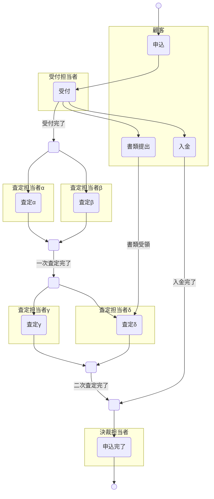
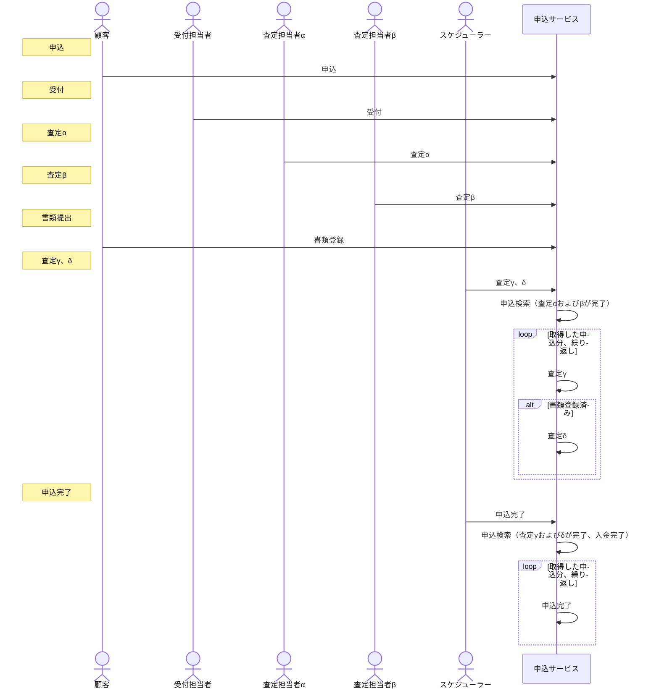
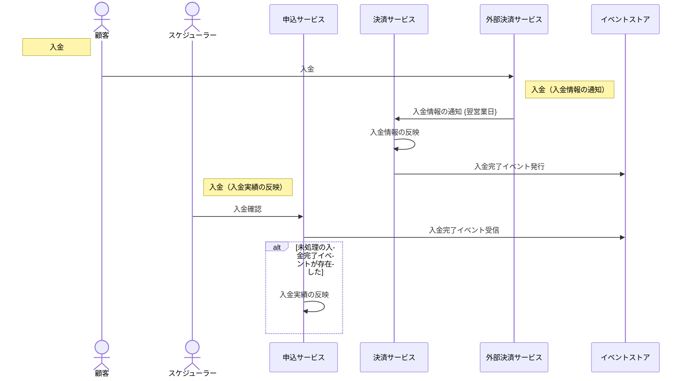

 
## はじめに
小規模なアプリケーションを開発する機会があったので、以前、[ココ](/blogs/2022/12/22/stepci/)で紹介した[Step CI](https://docs.stepci.com/)を実際に適用してみたので、一例としてその流れを紹介します。  
※アプリケーションのスペックやコードはイメージを付けて頂きやすいように本書用に書き起こしたもので実際のものとは異なります。

## アプリケーションスペック
今回、適用したアプリケーションの概要は以下の通りです。

### 業務フロー


### サービス構成


### システム化した際の大まかなフロー
左端のノートが業務フローで挙げたアクティビティに相当します。  
図が小さくなるため、入金は図を分けています。



## 執筆時の環境
| 名称              | バージョン | 用途                          |
| ----------------- | ---------- | ----------------------------- |
| openapi-generator | 6.4.0      | APIインターフェースの自動生成 |
| REST Client       | 0.25.1     | REST APIの動作確認            |
| npm               | 8.15.0     | Step CIの実行                 |
| Step CI           | 2.6.0      | API間のテスト                 |

## 適用までの流れ


1. API設計
まずはREST APIのインターフェースを設計します。  
[openapi-generator](https://github.com/OpenAPITools/openapi-generator)を使用してソースコードを自動生成したいので[OAS](https://github.com/OAI/OpenAPI-Specification)3.0に準拠して設計します。

  * OpenAPIドキュメント例
     ```yaml
     openapi: 3.0.0
     info:
       title: application-api
       version: "1.0"
       description: 申込サービスが提供するREST API
     servers:
       - url: "http://localhost:8081/application"
         description: ローカル環境
     paths:
       /applications:
         post:
           summary: 申込
           description: 申込の新規作成
           operationId: post-application
           tags:
             - application
           requestBody:
             content:
               application/json:
                 schema:
                   $ref: "#/components/schemas/ApplicationReq"
           responses:
             "200":
               description: OK
               content:
                 application/json:
                   schema:
                     $ref: "#/components/schemas/Application"
             # -----中略：400,401,403,500
       "/applications/{applicationId}":
         parameters:
           - schema:
               type: integer
               format: int64
             name: applicationId
             in: path
             required: true
             description: 申込ID
         get:
           summary: 申込取得
           description: IDに紐づく申込を1件取得する
           operationId: get-application
           tags:
             - application
           responses:
             "200":
               description: OK
               content:
                 application/json:
                   schema:
                     $ref: "#/components/schemas/Application"
             # -----中略：400,401,403,404,500
       "/applications/{applicationId}/accept":
         parameters:
           - schema:
               type: integer
               format: int64
             name: applicationId
             in: path
             required: true
             description: 申込ID
         put:
           summary: 受付
           description: 申込を受付る
           operationId: put-application-accept
           tags:
             - application
           parameters:
             - schema:
                 type: integer
               in: header
               name: applicationVersion
               description: 申込バージョン
               required: true
           requestBody:
             content:
               application/json:
                 schema:
                   $ref: "#/components/schemas/AcceptReq"
           responses:
             "200":
               description: OK
               content:
                 application/json:
                   schema:
                     $ref: "#/components/schemas/Application"
       # -----中略：査定などのAPI定義
     components:
       schemas:
         Application:
           title: 申込
           type: object
           properties:
             id:
               type: integer
               format: int64
               description: 申込ID
             version:
               type: integer
               description: バージョン
             "no":
               type: string
               description: 申込番号
             status:
               $ref: "#/components/schemas/ApplicationStatus"
             appliedBy:
               type: string
               description: 申請者名
             appliedAt:
               type: string
               description: 申請日時
               format: date-time
             acceptedBy:
               type: string
               description: 受付者名
             acceptedAt:
               type: string
               description: 受付日時
               format: date-time
             # -----以下、略
     ```

2. APIインターフェースを自動生成
前タスクで作成したOpenAPIドキュメントを元にopenapi-generatorを使ってAPIインターフェースを自動生成します。

3. APIの内部実装
前タスクで生成したAPIインターフェースを実装します。  
APIが安定するまで3, 4を繰り返します。

4. APIの動作確認
REST Clientの定義ファイルを作成して、APIの動作を確認します。  
業務アプリケーションのリクエストモデルは多くの属性を持つことが多く、このテストデータを作るのに多くの時間を要します。  
とくにリソースを新規作成するAPIのリクエストモデルの属性は多く、100項目を越えることもしばしば。  
折角作ったので後タスクでこれを最大限利用します。  

:::info
REST Clientの定義ファイルは業務の流れやバリエーションを意識して作成すると、他への転用や、他者への説明がしやすくなります。  
筆者は業務の流れに沿って上から下へ定義し、バリエーションが必要な部分はリクエストボディを必要な数作成し最も代表的なケース以外をコメントにして作成しています。  
:::

  * REST Client定義ファイル例
     ```yaml
     ### 申込取得
     GET http://localhost:8081/application/applications/1 HTTP/1.1
     content-type: application/json

     ### 申込
     POST http://localhost:8081/application/applications HTTP/1.1
     content-type: application/json

     {
       "appliedBy": "申請した人",
       "appliedAt": "2022-12-20T09:00:00+09:00[Asia/Tokyo]",
       //中略：100項目近くの属性
     }

     ### 受付
     PUT http://localhost:8081/application/applications/1/accept HTTP/1.1
     content-type: application/json
     applicationVersion: 0

     {
       "acceptedBy": "受付した人",
       "acceptedAt": "2022-12-21T09:00:00+09:00[Asia/Tokyo]"
     }

     //以下、略
     ```

5. 業務フローに沿ったテストの実装
ひととおり業務の流れを実現しAPIの動作が安定してきたら、業務フローに沿ったテストを実装します。  
テストと呼称していますが、手動で行っていた動作確認を自動化するイメージで捉えてください。  

:::info
以前の記事でも書いたようにStep CIのエラー情報は多くないのでデバッグには不向きです。  
このタイミングで品質が安定していない場合は、単体テストやサービス内の結合テストなどに立ち返って頂くのが良策です。  
:::

* REST Client定義からワークフロー定義を作成する
  動作確認に使用していたREST Clientの定義ファイルを有効活用し短時間で実装できました。
  下図はその手順を図示したものです。  
  

  * ワークフロー定義例
    ```yaml
    version: "1.1"
    name: API間テスト（業務フローに沿った検証）

    # 環境変数
    env:
      protocol: http
      event-store:
        host: localhost:8085
        service: event-store
        resource: events
      application:
        host: localhost:8081
        service: application
        resource: applications
      payment:
        host: localhost:8084
        service: payment
        resource: payments

    # テスト
    tests:
      業務の流れを検証:
        steps:
          # 業務フローに沿ったテスト前に、必要な関連サービスの死活確認 
          - 関連サービスの活性確認（イベントストア）:
            http:
              url: ${{env.protocol}}://${{env.event-store.host}}/${{env.event-store.service}}/actuator/health
              method: GET
              headers:
                content-type: application/json
          - 関連サービスの起動確認（申込）:
            http:
              url: ${{env.protocol}}://${{env.application.host}}/${{env.application.service}}/actuator/health
              method: GET
              headers:
                content-type: application/json
          - 関連サービスの起動確認（決済）:
            http:
              url: ${{env.protocol}}://${{env.payment.host}}/${{env.payment.service}}/actuator/health
              method: GET
              headers:
                content-type: application/json

          # 業務フローに沿ったテスト開始
          - name: 申込
            http:
              url: ${{env.protocol}}://${{env.application.host}}/${{env.application.service}}/${{env.application.resource}}
              method: POST
              headers:
                Content-Type: application/json
              body: |
                {
                  "appliedBy": "申請した人",
                  "appliedAt": "2022-12-20T09:00:00+09:00[Asia/Tokyo]",
                  // 中略
                }
              # キャプチャー
              ## APIの実行結果からキャッシュしたいデータを設定する
              captures:
                # IDをキャプチャして、後続ステップで利用
                id:
                  jsonpath: $.id
              # チェック
              ## APIの動作を保証するために必要なアサーションを設定する
              check:
                status: 200
                statusText: OK
                headers:
                  Content-Type: application/json
                jsonpath:
                  $.id:
                    - isNumber: true
                  $.version: 0
                  $.status: NEW
          - name: 受付
            http:
              url: ${{env.protocol}}://${{env.application.host}}/${{env.application.service}}/${{env.application.resource}}/${{captures.id}}/accept
              method: PUT
              headers:
                Content-Type: application/json
                # 独自定義したヘッダーも勿論使える
                applicationVersion: 0
              body: |
                {
                  "acceptedBy": "受付した人",
                  "acceptedAt": "2022-12-21T09:00:00+09:00[Asia/Tokyo]"
                }
              captures:
                version:
                  jsonpath: $.version
              check:
                status: 200
                statusText: OK
                headers:
                  Content-Type: application/json
                jsonpath:
                  $.id:
                    - eq: ${{captures.id}}
                    - isNumber: true
                  $.version: 1
                  $.status: ACCEPTED
          # 以下、略
    ```

## まとめ
業務フローに沿ったテストを自動化するツールとして利用すると扱いやすいです。  
動作確認時点で業務フローを意識して準備しておくことで、短時間で実装できます。テスト実行時間が短いのも魅力です。  
ですが、適用して困ったのが非同期処理。Waitさせるような機能は見当たりませんでした。1つのリソースを操作してテストを完結させたいような場合、トリガーになるもの（今回だとスケジューラー）を同期で外部から起動できるようにするなどの対応が必要になりそうです。  
* 参考：今回の作成したテストに要した時間など
  * テスト対象のAPI：26（死活監視APIなどの軽量なものを含む）
  * テスト実装：1日未満
  * テスト実行時間：合計で2.5秒以下
