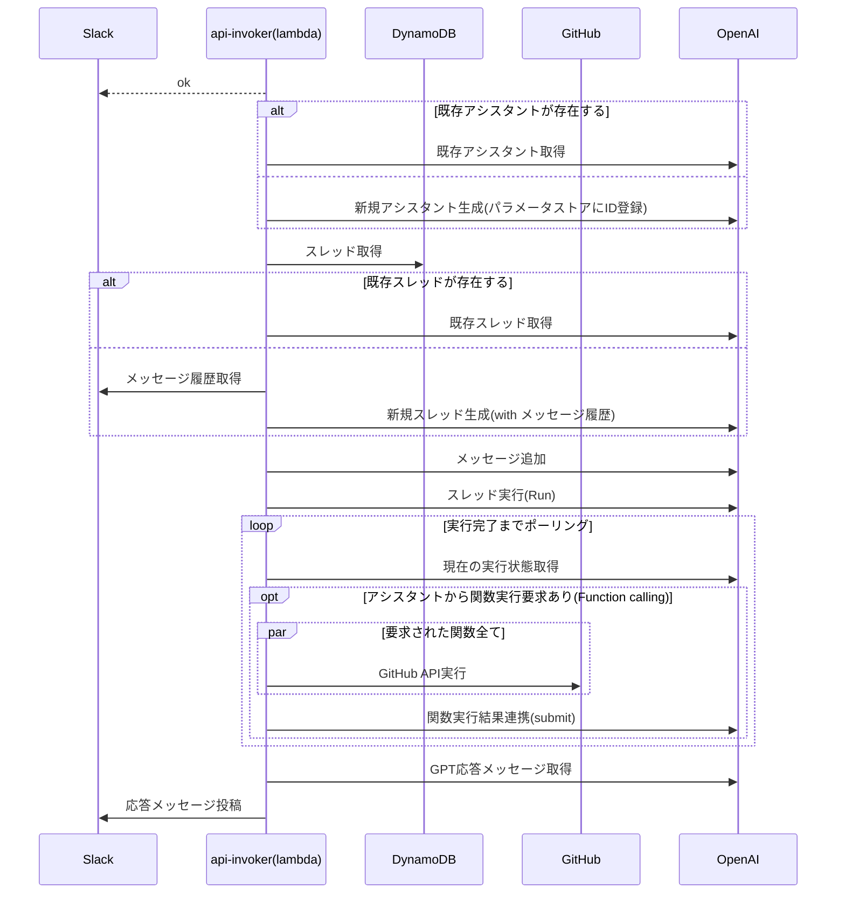

これは、[豆蔵デベロッパーサイトアドベントカレンダー2023](https://developer.mamezou-tech.com/events/advent-calendar/2023/)第4日目の記事です。

前に以下の記事でOpenAIのAssistants APIの紹介と簡単なCLIベースのチャットツールを作成しました。

- [OpenAIのAssistants API(ベータ版)を試す](/blogs/2023/11/08/openai-assistants-api-intro/)

今回せっかくのアドベントカレンダー記事なので、これをもう少し実用的に発展させて、Slack上でAssistants
APIを使ってGPTとチャットできるようにしてみたいと思います。

もちろんこのタイプのアプリはChat Completion APIだけでもできますが、会話の文脈を自前で管理する実装は手間でした。
Assistants APIはこの状態管理をスレッドとしてやってくれますでので、自然な会話がより簡単に実装できるようなりました。

チャットだけではつまらないので、今回はFunction callingを組み合わせてチャットボットがレビューアーに代わってプルリクエスト操作もしてくれるようにしたいと思います。
これはAIがコードレビューに参加してくれたらレビューが捗りそうというとても安易な発想ですw
最終的には、Slackを通して以下のようなレビューをアシスタントとできるようになります。


本当に効率的になるなのかどうかはさておき、レビューをするのが楽しくなりますね！

# 全体のシステム構成

このシステムはAWS上に構築します。全体構成は以下のようになります。


極力シンプルに必要最低限のサービスで構成しています。主要なロジックは2つのLambdaで実装ています。
以降でそれぞれの詳細を見ていきます。

ソースコード全体は[こちらTODO]()で公開しています（ソースコードが粗い点はご容赦ください）。
もし試してみる場合は、OpenAIの課金はそれなり(?)に発生しますのでご注意ください。課金の上限設定をきちんとしておくことをお勧めします。

# イベントコールバック(callback)

まずは1つ目のLambdaです。このLambdaはSlack App(ボット)のコールバックAPIの実装です。Slack Appへのメンション(`app_mentions`イベント)に反応して呼び出されます。
このAPI自体に重要な実装はありません。後続のアシスタントAPI実行Lambda(api-invoker)を非同期で実行し、すぐに成功レスポンスをSlackに返却します。

ここでAssistant APIを直接呼ばない理由は、Slack Appは3秒以内に成功レスポンスを返す必要があるからです[^1]。ここでAssistants APIとやりとりを実装してしまうと、Slack側でコールバックが失敗したと見做されてリトライが発生してしまいます。

[^1]: <https://api.slack.com/apis/connections/events-api#responding>

イベントコールバックのソースコードは[functions/callback.tsTODO]()です。以下抜粋です。

```typescript
export const handler: APIGatewayProxyHandler = async (event) => {
  const request: SlackRequest = JSON.parse(event.body || '{}');
  switch (request.type) {
    case 'event_callback': {
      const event: LambdaEvent = {
        channel: request.event.channel,
        text: request.event.text.replaceAll(/<@U[0-9A-Z]+>/g, ''), // メンション自体を除去
        ts: request.event.ts,
        threadTs: request.event.thread_ts,
        threadBroadcast: request.event.subtype === 'thread_broadcast'
      };
      await lambdaClient.send(
        new InvokeCommand({
          InvocationType: 'Event', // 非同期実行
          FunctionName: process.env.API_INVOKER_NAME,
          Payload: JSON.stringify(event)
        })
      );

      return {
        statusCode: 200,
        body: '',
        headers: {
          'Content-Type': 'text/plain'
        }
      };
    }
    case 'url_verification':
      return {
        statusCode: 200,
        body: request.challenge,
        headers: {
          'Content-Type': 'text/plain'
        }
      };
  }
};
```

`lambdaClient.send`の部分が後続のLambda関数の実行部分です。ここで必要な情報をJSONに変換して連携しています。
この時に`InvocationType`を`Event`にして同期型ではなく非同期で実行して[^2]、Slackにすぐに200レスポンスを返すようにしています。

[^2]: 先進的なエラーハンドリングやバッチ実行等のAWSの非同期機能を最大限に使いたい場合は、SQSに置き換えると良いかと思います。

Slackのメンションイベントについての詳細は以下公式ドキュメントを参照してください。

- [Slack API Doc - Event Type - app_mention](https://api.slack.com/events/app_mention)

ソースコードを見ると分かりますが、イベントコールバック以外に`url_verification`というURL検証リクエストもここで実施しています。
Slack AppにコールバックURLを設定する際に、Slack側でそのURLを検証するリクエストを発行します。
その際にこのURL検証リクエストのレスポンスに`challenge`を返す必要があります。
詳細は以下ドキュメントを参照してください。

- [Slack API Doc - Using the Slack Events API - Request URL configuration and verification ](https://api.slack.com/apis/connections/events-api#verification)

# アシスタントAPI実行(api-invoker)

後半部分です。ここは少し複雑です。
このLambda関数はAssistants APIのスレッドを通してGPTとやりとりをします。その結果はSlack Web
APIのpostMessageを通してSlackスレッドに投稿されます。
Assistants APIとの会話の中で関数呼び出し(Function calling)要求があれば、要求された関数を通してGitHub APIを実行します。
関数を呼ぶのかGPTと会話するのかはAssistants APIのアシスタントに委ねられます。

なお、SlackとAssistants APIのスレッド状態はDynamoDBに保存され、2回目以降は再利用されます。

全体のシーケンスは以下のようになります。



ソースコードもそこそこあるので、分割して重要な部分を抜粋したいと思います。

## Lambdaイベントハンドラ

ソースコードは[api-invoker.tsTODO]()です。

```typescript
export const handler: Handler = async (event: LambdaEvent) => {
  const slackClient = new WebClient(await getParameter('slackBotToken'));

  try {
    // アシスタントと会話
    const replies = await chat(event, slackClient);
    // 結果をSlackに投稿
    const blocks: SectionBlock[] = replies.map((text) => ({
      type: 'section',
      text: {
        type: 'mrkdwn',
        text
      }
    }));
    const slackResp = await slackClient.chat.postMessage({
      channel: event.channel,
      thread_ts: event.threadTs ?? event.ts,
      text: replies.join('\n'),
      reply_broadcast: event.threadBroadcast, // メンションメッセージがメインチャンネルにも返信する場合は返信も揃える
      blocks
    });
    console.log(slackResp);
  } catch (e) {
    console.log('failed...', { e });
    const slackResp = await slackClient.chat.postMessage({
      channel: event.channel,
      thread_ts: event.threadTs ?? event.ts,
      text: 'すみません。問題が発生して返信できません。。。',
      reply_broadcast: event.threadBroadcast
    });
    console.log(slackResp);
  }
};
```

ここはシンプルです。コールバックAPIからのイベントを受け取り、別モジュールで用意したチャットモジュール(chat.ts)に渡しています。
ここで必要なやりとりが実行されて、その結果をSlackにスレッド返信として投稿します(`thread_ts`を指定)。

以降はchat.ts内部の処理です。

## アシスタントとの会話

api-invokerから呼び出されるモジュールです。
chat関数がメイン処理です。

```typescript
export async function chat(event: LambdaEvent, slackClient: WebClient): Promise<string[]> {
  const apiKey = await getParameter('openAIApiKey');
  const openai = new OpenAI({ apiKey });
  const key = event.threadTs ?? event.ts;
  // Step1. Assistant
  const assistant = await createOrGetAssistant(openai);

  // Step2. Thread
  const thread = await createOrGetThread(event, key, { slackClient, openai });

  // Step3. Message
  await createMessage(openai, thread, event);

  // Step4. Run
  const run = await openai.beta.threads.runs.create(thread.id, {
    assistant_id: assistant.id
  });

  // Step5. wait...
  // eslint-disable-next-line no-constant-condition
  while (true) {
    await new Promise((resolve) => setTimeout(resolve, 1000));
    const currentRun = await openai.beta.threads.runs.retrieve(
      thread.id,
      run.id
    );
    if (currentRun.status === 'completed') {
      break;
    } else if (currentRun.status === 'requires_action') {
      const toolCalls =
        currentRun.required_action?.submit_tool_outputs.tool_calls;
      const chain = toolCalls?.filter((call) => call.type === 'function') ?? [];
      if (!chain.length) throw new Error('no function...');
      await callFunctions(chain, thread.id, run.id, openai);
    } else if (
      currentRun.status === 'failed' ||
      currentRun.status === 'cancelled' ||
      currentRun.status === 'expired'
    ) {
      throw new Error(currentRun.status);
    }
  }

  // Step6. Response
  const messages = await openai.beta.threads.messages.list(thread.id);

  const result = [];
  for (const message of messages.data) {
    if (message.role === 'user') break;
    for (const c of message.content) {
      switch (c.type) {
        case 'text':
          result.push(c.text.value);
          break;
        case 'image_file':
          console.log('image_file', c.image_file.file_id);
          result.push(
            'イメージファイルが返されましたがまだサポートしていません'
          );
      }
    }
  }
  return result;
}
```

Assistants APIのお作法通りです。アシスタント、スレッドを作成または取得し、スレッドにメッセージを追加して実行しています。
実行後は状態をポーリングして会話が完了するまで待ちます。
実行完了後はスレッドからメッセージを取り出し、GPTが返信したメッセージを返却します(結果Slackに投稿)。
この辺りの手順は[前回の記事](/blogs/2023/11/08/openai-assistants-api-intro/)でも触れていますので、そちらをご参考いただければと思います。

## アシスタント生成

アシスタント生成・取得関数(createOrGetAssistant)です。

```typescript
async function createOrGetAssistant(openai: OpenAI) {
  try {
    // SSMパラメータストアより既存のアシスタントID取得
    const assistantId = await getParameter('openAIAssistantId');
    return await openai.beta.assistants.retrieve(assistantId);
  } catch (e) {
    // 新規アシスタント生成
    const githubFunctions: OpenAI.Beta.Assistant.Function[] =
      functionDefinitions.map((def) => ({
        type: 'function',
        function: def
      }));
    const assistant = await openai.beta.assistants.create({
      name: await getParameter('assistantName'),
      instructions: await getParameter('assistantInstruction'),
      tools: [{ type: 'code_interpreter' }, ...githubFunctions],
      model: await getParameter('openAIModel'),
      file_ids: []
    });
    await ssmClient.send(
      new PutParameterCommand({
        Name: parameterNames.openAIAssistantId,
        Type: 'String',
        Value: assistant.id,
        Overwrite: true
      })
    );
    return assistant;
  }
}
```

アシスタントは一度生成すると、OpenAI側に残り続けるので毎回生成するのではなく再利用しています。
新規作成は取得できない場合のみ行い、ここで採番されるアシスタントのIDは次回利用できるようにSSMパラメータストアに保存しています。

:::column:SSMパラメータストアのLambda拡張
あちこちで使っている`getParameter`はSSMパラメータストアから値を取得しています。
本題から外れるので触れていませんが、内部ではAWSより提供されているSSMパラメータストアのLambda拡張を使用してキャッシュしています。

```typescript
export async function getParameter(name: keyof typeof parameterNames): Promise<string> {
  const params = new URLSearchParams();
  params.set('name', parameterNames[name]);
  params.set('withDecryption', 'true');
  const resp = await fetch(
    `http://localhost:${extensionPort}/systemsmanager/parameters/get?${params.toString()}`,
    {
      headers: {
        'X-Aws-Parameters-Secrets-Token': process.env.AWS_SESSION_TOKEN ?? '' // required for Lambda extension
      }
    }
  );
  if (resp.ok) {
    const value = (await resp.json()) as GetParameterCommandOutput;
    return value.Parameter?.Value ?? '';
  } else {
    throw new ParameterError(`${name}:${resp.status}:${await resp.text()}`, resp);
  }
}
```

Lambda拡張の詳細は公式ドキュメントを参照してください。

- [AWS SSM Doc - Using Parameter Store parameters in AWS Lambda functions](https://docs.aws.amazon.com/systems-manager/latest/userguide/ps-integration-lambda-extensions.html)
  :::

## スレッド生成

Assistants APIで使うスレッドの生成・取得関数(createOrGetThread)です。

```typescript
async function createOrGetThread(event: LambdaEvent, threadTs: string, opts: {
  openai: OpenAI,
  slackClient: WebClient
}): Promise<OpenAI.Beta.Threads.Thread> {
  const { openai, slackClient } = opts;
  const record = await documentClient.send(
    new GetCommand({
      TableName: process.env.OPENAI_THREAD_TABLE,
      Key: {
        threadTs
      }
    })
  );

  if (record.Item) {
    console.log('found dynamodb record', record.Item);
    const threadId = record.Item?.threadId;
    return openai.beta.threads.retrieve(threadId ?? '');
  }

  console.log('not found dynamodb record. creating new thread...');
  const initialMessages = await makeInitialMessages(event, slackClient);
  const thread = await openai.beta.threads.create({
    messages:
      initialMessages as OpenAI.Beta.Threads.ThreadCreateParams.Message[]
  });
  try {
    await documentClient.send(
      new PutCommand({
        TableName: process.env.OPENAI_THREAD_TABLE,
        Item: {
          threadTs: threadTs, // partition key(Slack側)
          threadId: thread.id, // OpenAI側のスレッド識別子
          expiration: (Math.ceil(new Date().getTime() / 1000 + 3 * 60 * 60)).toString() // 3日で失効
        }
      })
    );
  } catch (e) {
    console.log('failed to put thread to DynamoDB...', { e });
  }
  return thread;
}
```

Assistants APIで会話スレッド(メッセージ履歴)は、スレッドIDをキーに保持されます。
このため、クライアント側でメッセージ履歴は管理する必要がありませんが、Assistants APIとSlackのスレッドとの紐付け状態を保持しておく必要があります。ここではその紐付けにDynamoDBを使っています。
Slackのスレッドのタイムスタンプ(threadTs)をキーに、既存のAssistants APIのスレッドがある場合はOpenAIからスレッドを取得します。

既存のスレッドがない場合は、新規のスレッドを作成し、その紐付け情報をDynamoDBに保存します。

新規でスレッドを作成する場合は、Slack Web APIを使ってSlack側のスレッド(またはチャンネル)からメッセージを取得してSlackで保持する会話文脈を維持するようにしています。
この部分は本題ではありませんので、ソースコード掲載は省略します。[こちらTODO]()から参照できます。

## Function calling

Assistants APIのアシスタントは、Function callingが指定されている場合、会話の内容から関数実行有無を判定します。
クライアント側で関数実行が必要な場合は、スレッド実行後のポーリング中にステータスが`requires_action`に変わり、実行する関数名とその引数が連携されます。
ここで指定された関数を実行して、その結果を再度アシスタントに返す必要があります。

[前回の記事](/blogs/2023/11/08/openai-assistants-api-intro/)では、このFunction calling部分は関数を実行した体にして固定値を返していました。
今回はここも重要な機能の一部です。GitHub APIを実行してプルリクエストの取得やレビュー等のGitHub操作をします。
この部分は以下のような実装にしました(callFunctions関数)。

```typescript
async function callFunctions(chain: OpenAI.Beta.Threads.Runs.RequiredActionFunctionToolCall[], threadId: string, runId: string, openai: OpenAI) {
  const funcResults = chain.map(async (func) => {
    try {
      // アシスタントに指定された関数(GitHub API)を実行
      const resp = await functions[func.function.name].call(this, JSON.parse(func.function.arguments));
      const output = JSON.stringify(resp);
      return {
        tool_call_id: func.id,
        output
      };
    } catch (e) {
      console.log('function calling error:', { e });
      return {
        tool_call_id: func.id,
        output: (e as Error).message
      };
    }
  });
  await openai.beta.threads.runs.submitToolOutputs(threadId, runId, {
    tool_outputs: await Promise.all(funcResults) // 並列実行
  });
}
```

2023-11のアップデートでFunction callingは複数関数を同時に実行できるようになりました。
ここでは実行要求のあった関数を並列に実行し、その結果をまとめて`threads.runs.submitToolOutputs`で連携しています。
これでスレッドの実行ステータスは`in_progress`へと戻りポーリング処理が再開します。ここでアシスタントは再度関数を実行するのかGPTから結果を取得するのかを判断することになります。

なお、Function callingで実行する関数はGitHub APIの仕様に従って定義しています。
ソースコードは[こちらTODOgithub.ts]()になります。ここで関数本体(`functions`)とJSONスキーマを実装しています(
JSONスキーマはアシスタント生成時に設定しています)。
関数はシステムメッセージとしてトークン課金の対象となりますので、[GitHub API](https://docs.github.com/en/rest?apiVersion=2022-11-28)から利用するAPIを取捨選択しています。
同様に、実行結果の連携(submitToolOutputs)も、GitHub APIのレスポンス全てをそのまま連携せずに、必要な項目を取捨選択するのが望ましいと思います。

:::info
Function callingは、以下記事で紹介していますので詳細な説明は省略しています。

- [OpenAIのChat APIに追加されたFunction callingを使ってみる](/blogs/2023/06/14/gpt-function-calling-intro/)
  :::

# アプリをデプロイする(AWS CDK)

アプリのデプロイはAWS CDKを使います。プロジェクトルート直下の`cdk`ディレクトリにCDKプロジェクトを作成しました。

本題ではありませんので全ソースコードの掲載は省略しますが、[cdk/lib/csk-stack.tsTODO]()より内容が確認できます。
Lambda自体やIAMロール、DynamoDBテーブルの構成を定義しています。

Lambda関数は以下です。

```typescript
// ①コールバックAPI(callback)
const callback = new NodejsFunction(this, 'SlackEventCallbackFunction', {
  role: gatewayRole,
  functionName: `${this.stackName}-callback`,
  description: 'Slack event callback entry point',
  entry: '../functions/callback.ts',
  handler: 'handler',
  runtime: lambda.Runtime.NODEJS_18_X,
  logRetention: RetentionDays.ONE_MONTH,
  timeout: Duration.seconds(3), // Slackのタイムアウト閾値
  environment: {
    API_INVOKER_NAME: `${this.stackName}-api-invoker`
  }
});
const funcUrl = new lambda.FunctionUrl(this, 'SlackEventCallbackFunctionUrl', {
  function: callback,
  authType: FunctionUrlAuthType.NONE
});

// ②アシスタントAPI実行(api-invoker)
// https://docs.aws.amazon.com/systems-manager/latest/userguide/ps-integration-lambda-extensions.html
// AWS provided ssm parameter store extension
const parameterStoreExtension = lambda.LayerVersion.fromLayerVersionArn(this, 'ParameterStoreExtension',
  'arn:aws:lambda:ap-northeast-1:133490724326:layer:AWS-Parameters-and-Secrets-Lambda-Extension:11');
const invoker = new NodejsFunction(this, 'GptApiInvokerFunction', {
  role: invokerRole,
  functionName: `${this.stackName}-api-invoker`,
  description: 'Invoke OpenAI Assistants API',
  entry: '../functions/api-invoker.ts',
  handler: 'handler',
  logRetention: RetentionDays.ONE_MONTH,
  runtime: lambda.Runtime.NODEJS_18_X,
  timeout: Duration.seconds(120), // Assistants API用に延長
  layers: [parameterStoreExtension], // パラメータストアキャッシュ
  environment: {
    OPENAI_THREAD_TABLE: `${this.stackName}-OpenAIThread`,
    PARAMETER_NAME_PREFIX: parameterNamePrefix
  }
});
```

シンプルさを優先してSlackからのコールバックAPIはLambada Function URL[^3]を有効にしています。
細かい制御をしたい場合はAPI GatewayやALB等に置き換えると良いかと思います。

[^3]: Lambda Function URLは[こちら](/blogs/2022/04/14/lambda-function-url/)の記事でも紹介しています。

アシスタントAPI実行のLambda関数は以下を考慮しています。

- アシスタントAPIの実行時間に耐えられるうにタイムアウトを2分に延長
- LambdaレイヤーとしてAWSが提供するパラメータストアキャッシュのLambda拡張を追加

最後に、DynamoDBテーブルの方です。

```typescript
new dynamodb.Table(this, 'ThreadRelationTable', {
  tableName: `${this.stackName}-OpenAIThread`,
  billingMode: BillingMode.PAY_PER_REQUEST,
  partitionKey: {
    name: 'threadTs', // Slackのスレッド識別子
    type: AttributeType.STRING
  },
  encryption: TableEncryption.AWS_MANAGED,
  timeToLiveAttribute: 'expiration', // 一定期間経過後に削除
  removalPolicy: RemovalPolicy.DESTROY
});
```

パーティションキーとしてはSlackスレッドのタイムスタンプとしました(なければイベントのタイムスタンプ)。
また、TTL(timeToLiveAttribute)を有効にして、一定期間経過後にレコードを削除するようにします[^4]。

[^4]: 実装上は3日で削除するようにしていますが、ベータ版のAssistants APIのドキュメントでスレッド有効期限の言及は現時点ではありませんでした。

デプロイはCDK CLIで実行します(stackNameを指定)。

```shell
cdk deploy --context stackName=<your-stack-name>
> ...(省略)
>  ✅  CdkStack (<your-stack-name>)
>
> ✨  Deployment time: 42.11s
>
> Outputs:
> CdkStack.lambdafunctionurl = https://xxxxxxxxxxxxxxxxxxxxxxxxxxxxxxxx.lambda-url.ap-northeast-1.on.aws/
```

コールバックAPIのURLが出力されますので控えておきます。

# Slack Appを準備する

AWS側の準備ができてきましたので、関連システム側をセットアップしていきます。
まずはSlack Appです。Slack Appはメンションイベントや返信メッセージ投稿等の役割を担います。

基本的には以下公式ドキュメントの通りにセットアップするだけですので、細かい手順は省略します。

- [Slack Apps - Quickstart](https://api.slack.com/start/quickstart)

以下必要事項のみ説明します。

**OAuth & Permissions**

パーミッションは以下を選択します。

- app_mentions:read : メンションメッセージの読取
- channels:history / groups:history : チャンネルメッセージ履歴の取得(Assistants API側のスレッド新規作成時)
- chat:write : アシスタントとの会話レスポンスをメッセージ投稿


また、以下ボットトークンはSlack APIアクセス時に必要なので控えておきます。


**Event Subscriptions**

コールバックURLには、先ほど控えたコールバックAPIのFunction URLを設定します。入力するとSlackが自動でURLの検証を開始します。
検証に失敗した場合は、`url_verification`タイプのイベント処理に失敗している可能性があります。

サブスクライブするボットイベントには`app_mention`を選択します。これでSlack Appがメンションされると[イベントコールバック](#イベントコールバックcallback)APIが呼ばれるようになります。


最後に作成したSlack Appを利用するワークスペースにインストールしておきます。


インストール後は任意のSlackチャンネルにこのSlack Appを招待しておきましょう(`/invite @<bot-name>`等)。

# GitHub Appを準備する

続いてはGitHub側です。GitHub Appを作成し、アシスタントがFunction calling経由でプルリクエストの操作ができるようにします。
GitHub Appの作成も公式ドキュメントの通りにセットアップすればいいので、細かい手順は省略します。

- [GitHub App Doc - Registering a GitHub App](https://docs.github.com/en/apps/creating-github-apps/registering-a-github-app/registering-a-github-app)

なお、ここではWeb Hookは使いません。デフォルトはチェックされているのでチェックを外します。コールバックURL(Webhook URL)の入力が不要になります。


作成後はApp ID、プライベートキーを控えておきます。
いずれもGitHub APIのアクセスで使用しています[^5]。

[^5]: 本題からずれるので本記事では触れていませんが、先程取得したプライベートキーで認証をしています。ソースコードは[github.tsTODO]()です。


最後にPermissions & eventsメニューからGitHub Appに以下のレポジトリ操作を許可します。

- Contents: Read and write : レポジトリの参照・更新
- Pull Requests: Read and write : プルリクエストの各種操作


ここまで終わったら、GitHub Appを利用する個人アカウントまたは組織にインストールしておきます。


# 動作確認

ここまでくると動作確認できます。その前に必要な設定値を登録しておきます。
前述の通り、このアプリは全ての設定をSSMパラメータストアに保存していることを前提としています。
事前設定が必要なものは以下の通りです(アシスタントIDはアプリ内で作成されるので事前設定は不要です)。

| パス                                  | 内容                                       |
|-------------------------------------|------------------------------------------|
| /slack/app/gpt/botToken             | Slack App作成時に生成されるボットトークン                |
| /slack/app/gpt/githubApp/privateKey | GitHub App作成時に生成したプライベートキー(PEM)          |
| /slack/app/gpt/githubApp/appId      | GitHub App作成時に生成されるApp ID                |
| /slack/app/gpt/openai/apiKey        | OpenAI APIのAPIキー(OpenAIのUIから発行)          |
| /slack/app/gpt/model                | Assistants APIで使用するモデル名(gpt-4等)          |
| /slack/app/gpt/instruction          | Assistants APIのカスタムインストラクション(GPTのシステム設定) |
| /slack/app/gpt/name                 | Assistants APIのアシスタント名                   |

**設定後**


では簡単にプルリクエストのレビューをシミュレーションしてみたいと思います。
以下サンプルのプルリクエストを作成して、Slackからアシスタント(Slack App)にレビュー依頼をしてみます。


まずは、未マージのプルリクエスト有無をアシスタントに聞いてみます。


未マージのプルリクエストをちゃんと検索してくれています。
これはAssistants APIが与えられたURLを解析して、オーナーやレポジトリ名を取得して引数を作成し、Function callingを通してGitHub APIを実行しているものです。

続けて、ソースコード上の変更点を聞いてみます。


アシスタントはGPT-4の知能を持っているので、ソースコードに問題がないかレビューしてもらいます。


ごもっともな指摘ですね。そのままプルリクエストに優しくコメントしてもらいましょう。


GitHubのUIでは以下のようになっていました。


きちんとレビューコメント書いてくれましたが、指摘した行が残念な感じになってしまいました。
Function callingの説明をもう少しチューニングした方がいいかもしれませんね。

レビューコメントを修正したので承認します。


GitHub側でも以下のように確認できました。


最後にプルリクエストをマージします。


もちろんGitHub側でもちゃんとマージされています。


# まとめ

まだまだ調整の余地はありますが、(自分より遥かに)優秀なアシスタントがレビューに参加して、プルリクエスト操作までやってれるのでレビュー作業がとても楽になったと感じます。
とはいえ、これを発展させてレビューや指摘事項の修正まで全部任せられるようになるともはや人間としてのレビューアーは要らなくなりそう。。と思ったりしました。
