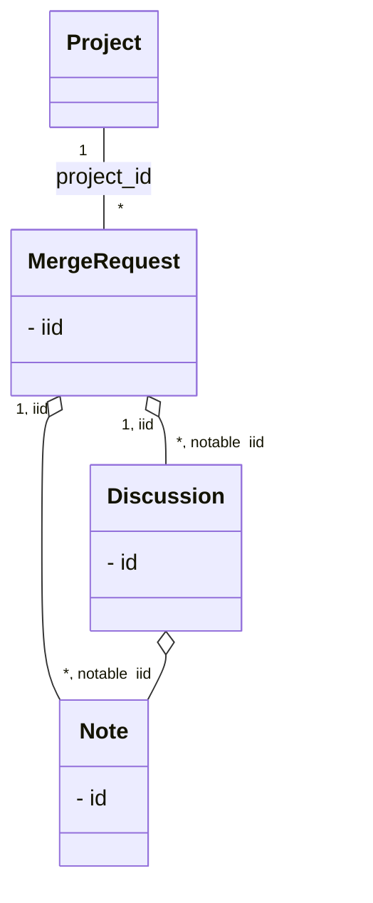

## 概要

GitLab上のレビューコメントを収集したいという要望があり、
そんなのAPIを順に呼べば楽勝でしょと思って実装したところ、
思わぬところでハマったので備忘を兼ねて記事にしました。  

## 環境

* GitLab Enterprise Edition 15.10.3
* GitLab Enterprise Edition 16.10.0

## ツール作成で踏んだ手順

GitLabプロジェクトの、マージリクエストに登録されているレビューコメントを収集して、指摘事項の傾向を確認する源泉データを作成することを目的にして実装を進めました。

1. アクセストークンの準備

   APIを使用してGitLabにアクセスするため、アクセストークンをあらかじめ準備しておきます。

   1. アクセストークンの作成
      
   1. アクセストークンのコピー
      

      :::info
      こっそり書いてある通り、アクセストークンは再確認できないのでメモしておくことをお奨めします。
      :::

1. プロジェクトが取得できることを確認

   まずは試しに対象プロジェクトが取得できるか確認します。

   1. プロジェクトIDの確認
      

   1. プロジェクトが取得できるか確認

      ```sh
      GET {GitLabを公開しているサイト}/api/v4/projects/{project-id}?private_token={access-token}
      ```

1. プロジェクトに紐づくマージリクエストが取得できることを確認

   続いてプロジェクトに紐づくマージリクエストが取得できるか確認します。

   ```sh
    GET {GitLabを公開しているサイト}/api/v4/projects/{project-id}/merge_requests?private_token={access-token}

    // 主要な属性以外は省略しています
    // 説明使用するマージリクエスト以外は省略しています
    HTTP/1.1 200 OK
    [
      {
        "id": 286186872,
        "iid": 1,
        "project_id": {project-id},
        "title": "1st merge",
        "description": "",
        "state": "merged",
      }, 
      // ～
    ]
   ```

    :::info
    ・プロジェクトに紐づくマージリクエストを特定するキーは「id」ではなく、「iid」です。
    ・APIは、1ページあたり20件取得します。最大100件なので、これを越える場合はページを切り替えて複数回取得する必要があります。
    :::


1. 特定のマージリクエストが取得できることを確認

   特定のマージリクエストが取得できることを確認します。  
   キーは前の手順で取得したiidを使用します。

   ```sh
    GET {GitLabを公開しているサイト}/api/v4/projects/{project-id}/merge_requests/1?private_token={access-token}

    // 主要な属性以外は省略しています
    HTTP/1.1 200 OK
    {
      "id": 286186872,
      "iid": 1,
      "project_id": {project-id},
      "title": "1st merge",
      "description": "",
      "state": "merged",
    }
   ```

1. マージリクエストに紐づくコメントを取得する

   いよいよレビューコメントの収集に取り掛かります。

   

   * ①、②
     * システムが出力するメッセージ
     * レビュー依頼やレビュアの変更などのGitLabの操作、commit履歴などがこれに該当します。

   ノートAPIというのがあり、これを使用するとマージリクエストに紐づくコメントが取得できるようなので、これを使用してみました。

   ```sh
    GET {GitLabを公開しているサイト}/api/v4/projects/project-id/merge_requests/1/notes?private_token={access-token}

    // 主要な属性以外は省略しています
    // レビュー指摘の例として掲載しているスクリーンショット部分以外は省略しています
    HTTP/1.1 200 OK
    [
      {
        "id": 1798829788,
        "type": "DiffNote",
        "body": "OK",
        "attachment": null,
        "system": false,
        "noteable_id": 286186872,
        "noteable_type": "MergeRequest",
        "project_id": {project-id},
        "resolvable": true,
        "resolved": true,
        "resolved_at": "2024-03-04T06:22:14.608Z",
        "noteable_iid": 1,
      },
      {
        "id": 1798821763,
        "type": "DiffNote",
        "body": "同一行へのレビューイコメント（３）",
        "system": false,
        "noteable_id": 286186872,
        "noteable_type": "MergeRequest",
        "project_id": {project-id},
        "resolvable": true,
        "resolved": true,
        "resolved_at": "2024-03-04T06:22:14.608Z",
        "noteable_iid": 1,
      },
      {
        "id": 1798821533,
        "type": "DiffNote",
        "body": "レビューイコメント（３）",
        "system": false,
        "noteable_id": 286186872,
        "noteable_type": "MergeRequest",
        "project_id": {project-id},
        "resolvable": true,
        "resolved": true,
        "resolved_at": "2024-03-04T06:22:28.497Z",
        "noteable_iid": 1,
      },
      {
        "id": 1798821126,
        "type": "DiffNote",
        "body": "同一行へのレビュー指摘です（３）",
        "system": false,
        "noteable_id": 286186872,
        "noteable_type": "MergeRequest",
        "project_id": {project-id},
        "resolvable": true,
        "resolved": true,
        "resolved_at": "2024-03-04T06:22:14.608Z",
        "noteable_iid": 1,
      },
      {
        "id": 1798821124,
        "type": "DiffNote",
        "body": "レビュー指摘です（３）",
        "system": false,
        "noteable_id": 286186872,
        "noteable_type": "MergeRequest",
        "project_id": {project-id},
        "resolvable": true,
        "resolved": true,
        "resolved_at": "2024-03-04T06:22:28.497Z",
        "noteable_iid": 1,
      },
      {
        "id": 1798819335,
        "type": null,
        "body": "assigned to ～",
        "system": true,
        "noteable_id": 286186872,
        "noteable_type": "MergeRequest",
        "project_id": {project-id},
        "resolvable": false,
        "noteable_iid": 1,
      },
      {
        "id": 1798819334,
        "type": null,
        "body": "requested review from ～",
        "system": true,
        "noteable_id": 286186872,
        "noteable_type": "MergeRequest",
        "project_id": {project-id},
        "resolvable": false,
        "noteable_iid": 1,
      },
      // ～
    ]
   ```

   |属性名|概要|備考|
   |---|---|---|
   |id|ノートの識別子||
   |type|ノートの種類||
   |body|ノート本文||
   |system|システムが出力した判別するフラグ||
   |noteable_id|ノートが紐づくオブジェクトに対して振られるID||
   |noteable_type|ノートが紐づくオブジェクト種類|マージリクエスト以外にissue, snippet, epicがある|
   |resolvable|解決可能なノートか判別するフラグ||
   |resolved|解決したノードか判別するフラグ||
   |resolved_at|ノートが解決した日時||
   |noteable_iid|ノートが紐づくオブジェクトに対して振られるID||

   今回、システムが出力しているものは、必要ないので"systemがtrue"のものを除外すれば、これは対処できそう。  
   ただ、人が登録したノートの関連を示す情報がないため、このままではフィルタリングすることができない。

1. 問題点を再考

   GitLab上で常に順番に表示される以上、必ず関連を示す情報があるはずなので、下記について調査しました。
   * APIに特殊なオプションがあるのではないか？
     * ドキュメントを見る限り存在しない
   * 複数の属性を組み合わせた特殊な意味付けがあるのではないか？
     * さまざまなノートのパターンを試したが、これもなさそう
   * ノートのコレクションオブジェクトが存在するのでは？
     * ノートの削除は簡単に行うことができる。
     * ノート自身が前後関係を持っていると、ノートの削除APIが実行される度、他のリソースを意識することになってしまう。
   * 公開されているAPIでは取得できないのでは？

1. ディスカッションAPIを使用して、マージリクエストに紐づくコメントを確認

   ノートやスレッドで、ドキュメントを再調査した結果、やはりノートのコレクションにあたる概念がありました。  
   ディスカッションは、関連するノートのセットにあたる概念のようです。

   早速、ディスカッションAPIを使用してみます。

   ```sh
    GET {GitLabを公開しているサイト}/api/v4/projects/project-id/merge_requests/2/discussions?private_token={access-token}
   
    // 主要な属性以外は省略しています
    // レビュー指摘の例として掲載しているスクリーンショット部分以外は省略しています
    HTTP/1.1 200 OK
    [
      {
        "id": "c01e1c0a1bd309ba0321ddb0d29ca75e5878dc44",
        "individual_note": true,
        "notes": [
          {
            "id": 1798819334,
            "type": null,
            "body": "requested review from ～",
          }
        ]
      },
      {
        "id": "1a351de7da788384493e2a10cfed58ccab1e1261",
        "individual_note": true,
        "notes": [
          {
            "id": 1798819335,
            "type": null,
            "body": "assigned to ～",
          }
        ]
      },
      {
        "id": "56d70c61f73e4fbd0dfad9d3b364a188ea8981b5",
        "individual_note": false,
        "notes": [
          {
            "id": 1798821124,
            "type": "DiffNote",
            "body": "レビュー指摘です（３）",
          },
          {
            "id": 1798821533,
            "type": "DiffNote",
            "body": "レビューイコメント（３）",
          },
          {
            "id": 1798830037,
            "type": "DiffNote",
            "body": "OK",
          }
        ]
      },
      {
        "id": "414ab3d58cebafc02cf492f3cee7e6add63bd01c",
        "individual_note": false,
        "notes": [
          {
            "id": 1798821126,
            "type": "DiffNote",
            "body": "同一行へのレビュー指摘です（３）",
          },
          {
            "id": 1798821763,
            "type": "DiffNote",
            "body": "同一行へのレビューイコメント（３）",
          },
          {
            "id": 1798829788,
            "type": "DiffNote",
            "body": "OK",
          }
        ]
      }
    ]
   ```

   ようやくノートの順序を持った形で取得することができました。

    :::info
    ・APIは、1ページあたり20件取得します。最大100件なので、これを越える場合はページを切り替えて複数回取得する必要があります。
    :::

1. これらの情報を踏まえてツールの要件にあうようにReact+jsでツールを実装して提供

## まとめ

今回登場したGitLabの概念は、下図のような関係にありました。  
同じような独自ツールを作ることになった際に参考にしていただけると幸いです。



* プロジェクトに紐づくマージリクエストを取得する際、1ページあたり最大100件（デフォルト20件）しか取得できません。それを越える場合は複数回取得する必要があります。
* マージリクエストに紐づくコメントの関連が必要な場合はディスカッションを取得して処理する。
* ディスカッションも同様に1ページあたりの取得件数が決まっているため、上限を越える場合は複数回取得する必要があります。
