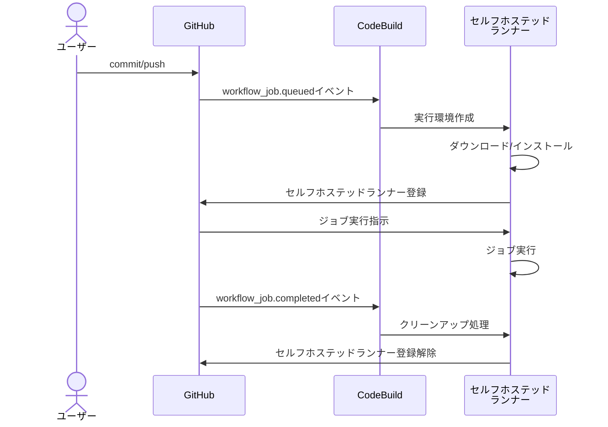

今や代表的なCI/CDサービスとなったGitHub Actionsですが、去年そのワークフロー記法が[AWS CodeBuild](https://aws.amazon.com/jp/codebuild/)でも使えるようになりました[^1]。
ただし、ここではあくまでパイプライン自体はCodeBuildのジョブとして動作します。このため、`github`コンテキストが利用できなかったりGitHub Actionsのマーケットプレイス利用にも一部制限がありました[^2]。

[^1]: 本サイトでも[こちら](/blogs/2023/07/12/githubactions-with-codebuild/)の記事でご紹介しました。
[^2]: <https://docs.aws.amazon.com/codebuild/latest/userguide/action-runner-buildspec.html#action-runner-limitations>

そうした中で、最近(2024-04-24)AWSから以下のリリースがありました。

- [AWS CodeBuild now supports managed GitHub Action runners](https://aws.amazon.com/jp/about-aws/whats-new/2024/04/aws-codebuild-managed-github-action-runners/)

今度はCodeBuild自体がGitHub Actionsのセルフホステッドランナーとして使えるようになりました。
ここではGitHub Actionsのジョブ実行環境(ephemeral self-hosted runners)としてCodeBuildが使われます。

これによりGitHub Actionsのワークフローで、CodeBuildがサポートするARMアーキテクチャやGPUワークロード、Lambda実行環境等が使えるようになりました。
また、ジョブ自体はCodBuild上で動作していますので、IAMやVPCリソース等AWSの各種サービスの利用も簡単です(OIDCプロバイダ設定やアクセスキー不要)。

もちろんセルフホステッドランナーとしての[制限](https://docs.github.com/en/actions/hosting-your-own-runners/managing-self-hosted-runners/about-self-hosted-runners#usage-limits)はありますが、セルフホステッドランナー自体はGitHub Actionsが提供しているものなので、基本的にはGitHub Actionsの機能を全て使えます。

今回こちらの機能を試してみましたので、その使い方をご紹介します。

- [AWS CodeBuild Doc - Set up self-hosted GitHub Actions runners](https://docs.aws.amazon.com/codebuild/latest/userguide/action-runner.html)

## 事前準備：GitHub接続設定

事前にCodeBuildからGitHubへの接続設定をしておく必要があります。
以下公式ドキュメントに記載の通り、パーソナルアクセストークン(PAT)またはOAuth Appを使って接続しておきます。

- [CodeBuild Doc - Access your source provider in CodeBuild](https://docs.aws.amazon.com/codebuild/latest/userguide/access-tokens.html#access-tokens-github)

以下はAWS CLIを利用してPATを登録する例です。

```shell
# アクセストークンをGITHUB_TOKENに設定
aws codebuild import-source-credentials --token ${GITHUB_TOKEN} \
  --server-type GITHUB --auth-type PERSONAL_ACCESS_TOKEN
# 設定確認
aws codebuild list-source-credentials
```

CodeBuildはこの設定を利用してWebHookの作成等を行っています。作成したPATには上記ドキュメントに記載されているパーミッションを設定するのを忘れないようにしましょう(設定しないとCodeBuildプロジェクト作成に失敗します)。

プライベートレポジトリでは以下のパーミッションを許可すればセルフホステッドランナーは作成できました。


## CodeBuildプロジェクトを作成する

では、CodeBuildのセルフホステッドランナーを作成していきます。

ここではマネジメントコンソールで作成します。
CodeBuildメニューから新規ビルドプロジェクトを作成します。

任意のプロジェクト名を入力し、ソースプロバイダとして「GitHub」を選択し、GitHubレポジトリのURLを入力します(事前にGitHubと接続していればレポジトリ一覧から選択できるはずです)。


「プライマリソースのウェブフックイベント」では、「コードの変更がこのレポジトリにプッシュされるたびに再構築する」にチェックを入れて、「フィルターグループ」で`WORKFLOW_JOB_QUEUED`を選択します。
これでGitHub Actionsのワークフローからジョブがキューイングされると、WebHookでCodeBuildに通知されます。


続いて、任意の実行環境を選択します。ここではデフォルトのままです。


次のBuildSpecですが、「buildspec ファイルを使用する」を選択します。
ちなみに、ここで実際にビルドスペックを用意しても無視されます。ジョブ実行時にGitHub Actionsランナーのセットアップ処理に置き換えられるようです。
以下[公式ドキュメント](https://docs.aws.amazon.com/codebuild/latest/userguide/action-runner.html)の抜粋です。

> Note that your Buildspec will be ignored. Instead, CodeBuild will override it to use commands that will setup the self-hosted runner. This project’s primary responsibility is to set up a self-hosted runner in CodeBuild to run GitHub Actions workflow jobs.


これでプロジェクトを作成します。成功すると以下のようにCodeBuildのビルドプロジェクトが作成されます。


:::info
作成されたプロジェクトのBuildSpecは以下のように固定で設定されていました。

```yaml
version: 0.2
phases:
  build:
    commands:
      - echo "BuildSpec will be overloaded for GHA self-hosted runner builds."
```
:::

一方で、GitHub側のレポジトリのWebHook設定を確認してみます。


WebHookが新規作成されています。このCodeBuildのエンドポイント経由でCodeBuild側の処理が実行されています。

## CodeBuildのセルフホステッドランナーを動かす

ではCodeBuildのセルフホステッドランナーでジョブを実行してみます。
GitHubレポジトリに以下ワークフローファイルを作成します。

```yaml
name: test-codebuild-runner
on:
  push:
jobs:
  build:
    runs-on: codebuild-GitHubActionsExampleRunner-${{ github.run_id }}-${{ github.run_attempt }}
    steps:
      - run: |
          echo "running on CodeBuild..."
          echo "OS: $(uname -a)"
          aws sts get-caller-identity
```

ポイントは`runs-on`に指定するラベルです。CodeBuildのセルフホステッドランナーの場合は、以下のいずれかにする必要があります。

- `codebuild-<CodeBuild Project名>-${{ github.run_id }}-${{ github.run_attempt }}`
- `codebuild-<CodeBuild Project名>-${{ github.run_id }}-${{ github.run_attempt }}-<image>-<image-version>-<instance-size>`

ここでは前者の指定方法を使っています。後者の指定方法はCodeBuildの実行環境を上書きしたい場合に使用します(コラム「GitHub Actionsのマトリックスを使う」参照)。

このファイルを`.github/workflows`ディレクトリ配下に配置してプッシュするとGitHub Actionsのワークフローが実行されます。
CodeBuildはキューイングされたジョブのラベル名(プロジェクト名)を確認し、セルフホステッドランナーを作成してGitHub側に登録します。

GitHub Actions実行中に、GitHub該当レポジトリのSettingsからRunnerメニューを見ると、以下のようにセルフホステッドランナーが登録されます。


このセルフホステッドランナーは一時的なもの(ephemeral self-hosted runners)で、ジョブ終了後には削除されます。

ジョブ終了後のGitHub Actionsのログは以下の通りです。


ジョブが正常に完了しており、スクリプトの実行結果が確認できます。
一方で、CodeBuild側のログも確認します。


こちらはセルフホステッドランナーの初期化やクリーンアップ処理に関するログが出力されます。

この動きを見ていると、CodeBuildのセルフホステッドランナーのライフサイクルは以下の流れのようです(一部想像も入っています)。



:::column:GitHub Actionsのマトリックスを使う
GitHub Actionsの[マトリックス](https://docs.github.com/ja/actions/using-jobs/using-a-matrix-for-your-jobs)はCodeBuildのセルフホステッドランナーでも使えます。
例えば、同一ジョブをAmazon Linux2023のx86/ARM、Ubuntuと3種類の環境で実行する場合は以下のように指定します。

```yaml
name: test-codebuild-runner
on:
  push:
jobs:
  build:
    runs-on: codebuild-GitHubActionsExampleRunner-${{ github.run_id }}-${{ github.run_attempt }}-${{ matrix.os }}
    strategy:
      matrix:
        os: ["al2-5.0-small", "arm-3.0-small", "ubuntu-7.0-small"]
    steps:
      - run: |
          echo "running on CodeBuild..."
          echo "OS: $(uname -a)"
          aws sts get-caller-identity
```
`runs-on`のラベルの最後に`matrix.os`を指定し、`strategy.matrix.os`にバリエーションを指定しています。
これで同一ジョブがそれぞれの環境で実行されます。
なお、ここではCodeBuildプロジェクト作成時に指定した実行環境はマトリックスの値で上書きされます。
:::

## (おまけ)CloudFormationで作成する

マネジメントコンソールでなく、CloudFormationでもセルフホステッドランナー向けのCodeBuildプロジェクトを作成してみました。
テンプレートファイルは以下です。

```yaml
Parameters:
  GitHubRepository:
    Type: String
    Description: The GitHub repository URL

Resources:
  CodeBuildProject:
    Type: AWS::CodeBuild::Project
    Properties:
      Name: GitHubActionsExampleRunner
      ServiceRole: !GetAtt CodeBuildRole.Arn
      Artifacts:
        Type: NO_ARTIFACTS
      Environment:
        Type: LINUX_CONTAINER
        ComputeType: BUILD_GENERAL1_SMALL
        Image: aws/codebuild/amazonlinux2-x86_64-standard:5.0
      Source:
        Type: GITHUB
        Location: !Ref GitHubRepository
      # WebHook(セルフホステッドランナー)設定
      Triggers:
        Webhook: true
        FilterGroups:
          - - Type: EVENT
              Pattern: WORKFLOW_JOB_QUEUED

  CodeBuildRole:
    Type: AWS::IAM::Role
    Properties:
      AssumeRolePolicyDocument:
        Version: 2012-10-17
        Statement:
          - Effect: Allow
            Principal:
              Service:
                - codebuild.amazonaws.com
            Action:
              - sts:AssumeRole
      Policies:
        - PolicyName: GitHubActionsExampleRunnerPolicy
          PolicyDocument:
            Statement:
              - Effect: Allow
                Action:
                  - logs:CreateLogGroup
                  - logs:CreateLogStream
                  - logs:PutLogEvents
                Resource: "*"
```

やっている内容はマネジメントコンソールと全く同じですので省略します。
実運用にあたっては、他のリソース同様に何らかのIaCツールで管理していくことになるかと思います(それにしても一見しただけではこれがセルフホステッドランナーのテンプレートには見えませんね)。

## まとめ

CodeBuildをGitHub Actionsのセルフホステッドランナーとして使う方法をご紹介しました。
GitHub Actionsが提供するランナーではスペックが不足する場合や、AWSネイティブなジョブに最適な方法ですね。

GitHub Actionsの[公式ドキュメント](https://docs.github.com/en/actions/hosting-your-own-runners/managing-self-hosted-runners/autoscaling-with-self-hosted-runners#using-ephemeral-runners-for-autoscaling)によると、セルフホステッドランナーは以下のように実装することを推奨しています。

> GitHub recommends implementing autoscaling with ephemeral self-hosted runners; autoscaling with persistent self-hosted runners is not recommended. In certain cases, GitHub cannot guarantee that jobs are not assigned to persistent runners while they are shut down. With ephemeral runners, this can be guaranteed because GitHub only assigns one job to a runner.

自前でこれを実装する場合は結構手間で、Kubernetesを用意してAction Runner Controller(ARC)で運用する方法も検討する必要があります。
CodeBuildのセルフホステッドランナーを使えば、ランナーインスタンスのオートスケールをマネージドサービスとして対応してくれますので、とても導入の敷居が低くなります。

GitHub + AWSの組み合わせのプロジェクトでは有力な選択肢の1つになってくるかもしれませんね。