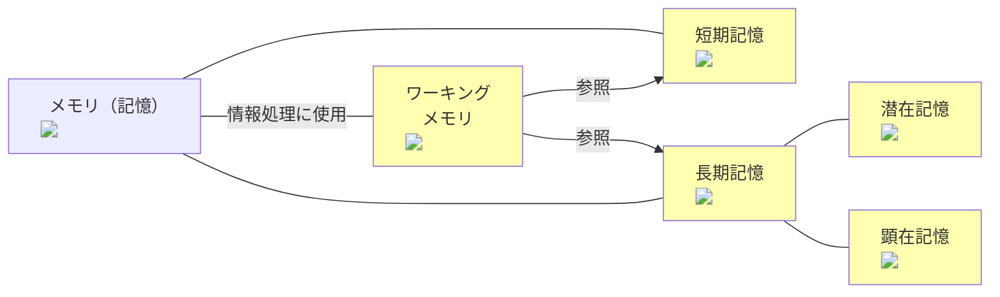
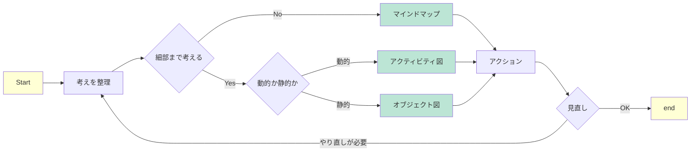

## はじめに

株式会社豆蔵の山下です。業界未経験の状態でしたが、昨年の8月に縁あって株式会社豆蔵に入社しました。

この度は、春という季節にふさわしいタイミングで、
当時の自分を振り返りながら記事を書かせていただきました。

記事の対象とする人としては以下のとおりです。
- プログラミング言語を習得し始めている人
- つい最近新しい技術に触れなければならなくなった人
- 技術面でなんとなく悩んでいる人

また、以下の事柄については、この記事で言及しないものとします。
- 個々の技術の詳細について
- 紹介する書籍の内容全て
- 何ができていれば、初心者から脱却できるのかといった個別的な話
- チームにおける立ち振る舞いなど

なお、本記事の内容は、あくまで私個人の実体験に基づいていることをご承知おきください。

## 慣れるためにやったことの概要

まず、先にポイントを列挙します。
自分が取り組んだことをまとめると、次のようなことが挙げられます。

```
1. インプットの習熟
2. 基本的な表現の暗記
3. 設計ドリブンで考える
```

実際の現場に参画して早々、他のメンバーが驚異的なスピードでタスクをこなしているのを目の当たりにしました。
それも、つい最近その技術を知った・見たという状態から、慣れた手つきで実装まで進めています。
確かに、慣れと言われればそれまでの話です。
ただ、「慣れ」という単語を辞書などで調べると、必ずといっていいほど「経験」や「時間」というキーワードを伴います。

- 単に時間をかければいいものだろうか
- もっと早くできないのだろうか
- そもそも、慣れるとは何なのだろうか
- 慣れるためには何をするべきなのだろうか

といった具合に色々な疑問点を念頭におきつつ、昨年度まで模索し続けた中で、
今の自分が振り返って有用だと思ったものを、いくつかピックアップさせていただきました。
その前に、参考にさせていただいた書籍を３冊紹介させていただきます。
この記事の内容を抜きにしても、読んでよかったと思えるものを紹介します。

## 参考にした書籍
### The Programmer's Brain（[書籍リンク](https://www.amazon.co.jp/dp/4798068535)）
まず、Felienne Hermans氏の著書「The Programmer's Brain」を紹介します。
「慣れる」とは何かの答えを示してくれた一冊であり、この記事で書かれている脳科学的な内容はほぼこの本に準拠しています。
本書の日本語版は秀和システム社から出版されています。
:::info
プログラマーとしてのスキルや能力を向上させるための脳の働きについて解説されています。
生まれつきどうこうというよりも、脳の動き方を知り、脳の動きを最適化するための「頭」の使い方について書かれています。
本記事では深く触れていませんが、脳の動きを最適化するような具体的な方法例についてもしっかり書かれています。
:::
### 世界一流エンジニアの思考法（[書籍リンク](https://www.amazon.co.jp/dp/4163917683)）
2冊目として、牛尾剛氏の著書である「世界一流エンジニアの思考法」を紹介します。
非常に有名な一冊であり、一読してみる価値は十分にあります。
2番目に紹介していますが、The Programmer's Brainよりも先に読んでいます。

:::info
この本は、2024年5月現在マイクロソフトで働く著者が、
最前線で活躍するエンジニアたちを分析・観察して、戦略として応用できそうなものをピックアップしてまとめた一冊です。
この記事は勉強法チックなものに偏っていますが、
チームとして働くとは何なのか、効率よく仕事をこなすためにはどうするべきなのか、など幅広い視点から役立つトピックが書かれています。
:::

### 勝負論 ウメハラの流儀（[書籍リンク](https://www.amazon.co.jp/dp/4098251817)）
最後に、有名なプロゲーマーである梅原大吾氏の著書「勝負論 ウメハラの流儀」を3つ目としてご紹介します。
技術者が執筆した本ですが、個人的には通じる部分がいくつかありましたので、紹介いたします。

:::info
この本では、プロゲーマーの視点から「勝ち」という概念について語られています。
読み始める前は技術者とプロゲーマーの世界はあまり接点がないものと認識していましたが。
実際に読んでみると所々通じるものがあると感じました。
:::

## 脳に関わる3つのメモリ
### メモリの分類
聞いたことのあり表現化かもしれませんが、人間の脳が持つメモリは次のような3つに分類されます[^1]。
- 短期記憶：瞬間的な情報を記憶する領域
- 長期記憶：永続的な情報が記憶する領域
- ワーキングメモリ：思考の際に、実際に情報を処理する領域

さらに、長期記憶は以下の２つに分類できます。
- 潜在記憶：長期記憶のうち、無意識な情報に保持する領域（本能のようなもの）
- 顕在記憶：長期記憶のうち、保持している自覚があるものを保持する領域（知識や思い出）

[^1]: 正確には「瞬間記憶」と呼ばれるものがあるようですが、文脈の都合上省略させていただきます

また、ワーキングメモリで思考をする際には、短期記憶や長期記憶を参照することが分かっています。

図示すると次のようになります。


<!--MerMaidの要素内に画像を埋め込む際、別途同じ画像のimgタグが無いと機能しませんでした-->


### 簡単な例
ここで、短期記憶と長期記憶がワーキングメモリにどう影響を及ぼすのかを見てみましょう。
まず、3秒以内に下の文字列(16文字)を覚えてください（技術ブログを意味するロシア語だそうです）。
```
технический_блог
```

何も見ない状態で、先ほど示した文字列を再現してみましょうといわれると、
おそらく多くの方が難しいと感じるかと思います。
次に、以下の文字列で同じようなことをやってみてください。
```
いかに久しきものとかは知る
```
同じような語数にも関わらず遥かに簡単に思えた方が、ほとんどだと思われます。
先ほどの例においては、16文字を1つずつ覚えなければなりませんでした。
しかしながら、今の例では、1文字ずつ律儀に考えた人はあまりいないはずです。
たいていの人は数文字の固まり[^2]に分割して覚えたのではないでしょうか。
ただし、分割した固まりの個数については、個人の経験に依存するはずです。
##### 日本語の単語をとらえて分割した場合
```いかに／久しき／ものとかは／知る```
→固まりは4つ

##### 五七五七七の下の句であると気づいた場合
```いかに久しき／ものとかは知る```
→固まりは2つ

##### 小倉百人一首53番の下の句と知っている場合
```いかに久しきものとかは知る```
→固まりは1つ

先ほどの話に関連させると、「どれだけの固まりに分割して認識したか」が、情報処理の効率に直結します。
[^2]: 同著ではチャンクという言葉で表現されています。今回は文字の集まりとして表現しましたが、同著ではより広い意味で使われています。

### 慣れ=メモリの最適化
今のは簡単な例でしたが、ワーキングメモリが行う情報処理の効率は他の記憶からの影響を受けることが伝わったと思います。

このようなことを踏まえると、冒頭に説明した「わからない」であったり、「サクサク」進むという状況は次のように説明できるはずです。
- 「意味が分からない」と感じる状況 => ワーキングメモリの枯渇が起こっている
- 「サクサク」進んでいる状況 => ワーキングメモリが最適に働いている

そこで、短期記憶と長期記憶を強化することにより、ワーキングメモリの効率を上げることを目標にしました。
いくつか試したうえで、良かったと感じた３つが冒頭に紹介したものとなります。

## 自分の行動
### 十分なインプット
そこで、第1に行ったのが、十分なインプット作業です。

長期記憶の中の顕在記憶(具体的には知識)の強化が目的です。

インプットが大事であるということは皆さんご存じだと思われますので、詳しくは語りません。
（先に紹介した３冊すべてでも言及されているくらいには大事な話です）

私個人としては、以下のようなものをインプット源をとらえてキャッチアップにいそしんでいました。

- 一般的な書籍
- ライブラリのリファレンス
- ライブイベント等
- 参画しているプロジェクトのコード

この手の話になると、どこまでやるのかという話になりそうですが、
他の方々の意見を反映しつつ、以下のような目安を設定していました。
```
- マスト　：疑問点が確実に消えるまで
- 努力目標：全部
```
もちろん、時間は有限なので、あの手この手[^3]を使いつつ読み進めています。
[^3]: 個人的に参考になった講演の[スライド](https://speakerdeck.com/yonetty/tech-to-read-tech-books)だけ共有させていただきます。

:::info
余談ですが、一生懸命読んでいたけど実は相性が悪かったみたいなこともあるので、
インプットすべきリファレンスについては、身近な人に聞いてみるのが一番かもしれません。
半分自慢のようなものですが、弊社では半自動的に先輩方から情報が入ってくるので非常に助かっています。
:::
### 基礎の反復学習

次に行っているのが、基本的な表現の反復学習です

こちらは長期記憶のうち、潜在記憶の強化が目的です。

生成AIを活用すれば構文を知らなくても書けるよねと思われる方も多いでしょう。
あくまでここで目的としているのは、潜在記憶に刷り込むことで、
ワーキングメモリへの負担を抑えることです。

泥臭い方法ではありますが、基本的な反復学習を行っていました。
梅原氏の著書では「分解し、反復する」という表現で論じられています。
文法の繰り返し学習を管理するために、各種ツールを活用するのも1つの方法です。

:::stop
分量にもよりますが、闇雲に暗記することだけは推奨できません。
自分なりに、「これはXXをしている」ということが説明できるようになってから、
反復練習に臨んだほうが健全だと思います。
:::

:::info
ツールにはAnkiというアプリを使っています。
- 学習管理機能があること(数日たった後にリマインドしてくれる)
- エクスポートandインポート機能があること（形式としてcsvが選択可能）
- [オープンソース](https://github.com/ankitects/anki)であること
- マルチプラットフォームで動作すること
- etc...

など、色々と魅力的な点があるため使っています。

見せられる範囲でお見せすると、こんな感じで使っています。


:::


### 設計ドリブンの習慣
最後に、設計ドリブンの習慣化を意識していました。
設計と聞くと仰々しいですが、（コーディングに限らず）何かを始める前に
ブループリント（設計図）を作成して進める程度に捉えてください。

先の２つとは違い、短期記憶のサポートが主な目的です。

何かしらブループリントを事前に作っておくと、
何かしら行動を進めるときに、頭だけで考えるよりも、
より少ない負担で物事を考えることができるという経験はされているでしょう。

また、事前に道筋を立てておくことで、ある程度の見通しがつきます。
その時点で間違っていたとしても、事前の設計図を基に早急に軌道修正することが可能となります。

紹介した牛尾さんの書籍や本人のライブイベントでも、「試行錯誤は悪」と強調されており、
「試行錯誤は（略）」というフレーズを耳にされている方は多いと思います。

ちなみに、私自身は以下のようなサイクルを回すように心がけています。



なので、時間に余裕がないときでも、最悪メモ書きのようなものは準備しています。

:::info
慣れるという内容からは若干外れますが、
現場に入ると、どうしてこういう風に考えたのかを聞かれる場面は、少なからずあります。
そのような状況に直面した際、事前に整理したものを用意しておくと、
話が比較的スムーズに進むことができるという副次的なメリットもあります。
いずれにせよ、設計図を用意する習慣をつけてよかったなと今でも思います。
:::

:::info
初めて機能の作成を任された時には、こんな感じの図を用意しました。
機能開発を進めていくと（色々と粗はありましたが）、非常に助かったのを覚えています。


:::
## まとめ
以下が本記事のまとめとなります。
- 脳には長期記憶、短期記憶、そしてワーキングメモリという３種類のメモリが存在する
- ワーキングメモリの効率が思考やタスク処理のパフォーマンスに関わる
- ワーキングメモリの効率は長期記憶と短期記憶の影響を受ける
- 十分なインプットは長期記憶をサポートする
- 基本的な反復練習も長期記憶をサポートする
- 設計ドリブンな習慣は短期記憶をサポートする