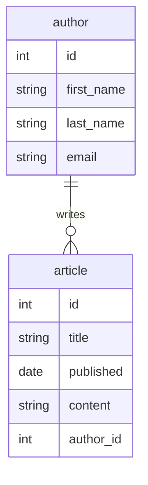

少し前ですが、TypeScript向けのORマッパーとして [TypeORM](https://typeorm.io/) を紹介しました。

- [ORマッパーのTypeORMをTypeScriptで使う](/blogs/2022/07/27/typeorm-with-typescript/)
- [TypeORMのスキーママイグレーションを使う](/blogs/2023/02/22/typeorm-migration-intro/)

この記事は予想以上にアクセスがあり、RDBおよびORマッパーの注目度はいまだに高いと思いました。

最近TypeScript向けで新しいORマッパーの [Drizzle](https://orm.drizzle.team/) を使ってみました。
軽量で使いやすいAPIを提供していて、結構良いなと思いましたので今回はこちらを紹介させていただきます。

## Drizzleとは？

Drizzleは2022年リリースの比較的新しいORマッパーです。

[公式ドキュメント](https://orm.drizzle.team/docs/overview)では冒頭でDrizzleを以下のように紹介しています。

> It’s the only ORM with both relational and SQL-like query APIs, providing you best of both worlds when it comes to accessing your relational data. Drizzle is lightweight, performant, typesafe, non lactose, gluten-free, sober, flexible and serverless-ready by design. Drizzle is not just a library, it’s an experience 🤩

何だかとても良さそうな感じですね。

ここで述べられているように、Drizzleは2つの機能を使ってRDBにアクセスします。
いずれもTypeScriptの型システム活かしたものになっていますので、IDEのコード補完機能でリズムよく記述できます。

**SQL-Like Query**
1つ目はSQLライクなAPIです。事前に記述したテーブルスキーマとDrizzleが提供するAPI(SQLラッパー)を使って記述します。
これが基本となるAPIで、CRUD操作全てに対応します(各DBのSQL方言も含む)。

- [Drizzle Doc - Select](https://orm.drizzle.team/docs/select)
- [Drizzle Doc - Insert](https://orm.drizzle.team/docs/insert)
- [Drizzle Doc - Update](https://orm.drizzle.team/docs/update)
- [Drizzle Doc - Delete](https://orm.drizzle.team/docs/delete)

**Relational Query**
2つ目はRelational Queryです。これは複雑なテーブル構成のクエリを簡潔に記述できるAPIで、Select APIの拡張となっています。
Relational Queryはテーブルスキーマとは別に関連(relation)を定義しておくことで、それに合った最適なSQL生成や結果セットのマッピングをDrizzleが担ってくれる抽象度の高いAPIになっています。
findManyとfindOneの2つのAPIを提供しています。

- [Drizzle Doc - Relational Query](https://orm.drizzle.team/docs/rqb)

現時点でDrizzleがサポートしているRDBは、PostgreSQL / MySQL / SQLiteの3つとメジャーなORマッパー製品と比較すると少なめです。

- [Drizzle Doc - PostgreSQL](https://orm.drizzle.team/docs/get-started-postgresql)
- [Drizzle Doc - MySQL](https://orm.drizzle.team/docs/get-started-mysql)
- [Drizzle Doc - SQLite](https://orm.drizzle.team/docs/get-started-sqlite)

とはいえ、各DBのサポート内容の詳細を見ると各種マネージドサービスやDeno/Bun等、幅広い製品での利用を想定していることが分かります。
ORマッパーは重量級のライブラリになりがちですが、Drizzleは様々なサーバーレス・エッジ環境での動作を想定して軽量に設計されていますので、気軽に使いやすいOSSになっています。

Drizzleの普及具合でいうと、PrismaやTypeORM等のメジャーなORマッパーほどではないですが、2023年のRelational Queryの登場で人気に火がついたようです[^1]。
現時点でGitHub Starは21,000を超え、かなり勢いのある製品となっています。

[^1]: [Medium - Drizzle Stories - Best TypeScript ORM just got better](https://medium.com/drizzle-stories/best-typescript-orm-just-got-better-5a33688b8d2e)

## Drizzleをインストールする

ここではNode.js + PostgreSQLを使います。

- [Drizzle Doc - Get Started - PostgreSQL - node-postgres](https://orm.drizzle.team/docs/get-started-postgresql#node-postgres)

```shell
npm install drizzle-orm pg
npm install -D drizzle-kit @types/pg
```

ここでは現時点で最新の`0.31.2`のDrizzleをセットアップしました。
なお、今回試していませんがDrizzleはNode.jsのみではなくDenoやBunでも使えます。

次に、利用するRDBはローカル環境で試せるようにDockerでPostgreSQLコンテナを起動しました。

```shell
docker run --name drizzle-postgres -e POSTGRES_PASSWORD=drizzlepass -p 5432:5432 -d postgres

# psqlで接続確認
psql -h localhost -p 5432 -U postgres -c 'select 1'
```

## スキーマを定義する

まずはテーブルスキーマを定義します。
スキーマはクエリ記述時の型として使用しますが、Drizzleの開発キットを提供するDrizzle Kitではこれを利用したスキーママイグレーション機能も提供しています。
今回は以下のテーブル構成で作成します。



それぞれ執筆者(`author`)と記事(`article`)を表すテーブルで、両者は1対多の関係を持っています。

これをDrizzleのスキーマ定義で表すと以下のようになります。

```typescript:db/schema.ts
import { integer, pgSchema, serial, text, varchar, date, index } from 'drizzle-orm/pg-core';

// sampleスキーマ作成
export const sample = pgSchema('sample');

// 記事テーブル
export const article = sample.table('article', {
  id: serial('id').primaryKey(),
  title: varchar('title', { length: 100 }).notNull(),
  published: date('date').notNull(),
  content: text('content'),
  author: integer('author_id').references(() => author.id)
}, (table) => ({
  titleIdx: index('title_idx').on(table.title),
  publishedIdx: index('published_idx').on(table.published)
}));

// 執筆者テーブル
export const author = sample.table('author', {
  id: serial('id').primaryKey(),
  firstName: varchar('first_name', { length: 30 }).notNull(),
  lastName: varchar('last_name', { length: 30 }).notNull(),
  email: varchar('email', { length: 256 }).notNull().unique()
});
```

`pgSchema`でテーブルスキーマを作成して、その中に各テーブルを配置しました。
カラムの型や制約はDrizzleが提供しているものを使います。

- [Drizzle Doc - SQL schema declaration](https://orm.drizzle.team/docs/sql-schema-declaration)

DDLを記述した経験があれば、簡単に記述できると思います。

## Drizzle Kitのスキーママイグレーションを使う

スキーママイグレーションツールは、TypeScriptのテーブルスキーマからDDLを作成するコマンドを提供し、スキーマのバージョン管理と実際のDBへの適用を担います[^2]。
利用自体は任意ですが、テーブルスキーマとソースコードのバージョン管理を同期するためにはぜひ活用したいものです。

[^2]: 現時点ではロールバックには対応していないようなので、そこは手動で対応する必要がありそうです。

- [Drizzle Doc - Migrations](https://orm.drizzle.team/docs/migrations)
 
まず、プロジェクトルートに`drizzle.config.ts`を作成します。

```typescript:drizzle.config.ts
import { defineConfig } from 'drizzle-kit';

export default defineConfig({
  schema: './db/schema.ts', // テーブルスキーマ記述ファイル
  out: './migration', // DDL出力先ディレクトリ
  dialect: 'postgresql',
  // 実際のDBへのマイグレーションで使用
  dbCredentials: {
    ssl: false,
    host: 'localhost',
    user: 'postgres',
    password: 'drizzlepass',
    port: 5432,
    database: 'postgres',
  },
});
```

では、Drizzle Kitのスキーママイグレーションを使ってDDLを生成します。
Drizzle Kitのgenerateコマンドを実行します。

```shell
npx drizzle-kit generate
```

実行が終わると、出力先として指定したディレクトリ配下にマイグレーション用のSQLファイルが出力されます。
ここでは以下のファイルが生成されました。

```sql
CREATE SCHEMA "sample";
--> statement-breakpoint
CREATE TABLE IF NOT EXISTS "sample"."article" (
	"id" serial PRIMARY KEY NOT NULL,
	"title" varchar(100) NOT NULL,
	"date" date NOT NULL,
	"content" text,
	"author_id" integer
);
--> statement-breakpoint
CREATE TABLE IF NOT EXISTS "sample"."author" (
	"id" serial PRIMARY KEY NOT NULL,
	"first_name" varchar(30) NOT NULL,
	"last_name" varchar(30) NOT NULL,
	"email" varchar(256) NOT NULL,
	CONSTRAINT "author_email_unique" UNIQUE("email")
);
--> statement-breakpoint
DO $$ BEGIN
 ALTER TABLE "sample"."article" ADD CONSTRAINT "article_author_id_author_id_fk" FOREIGN KEY ("author_id") REFERENCES "sample"."author"("id") ON DELETE no action ON UPDATE no action;
EXCEPTION
 WHEN duplicate_object THEN null;
END $$;
--> statement-breakpoint
CREATE INDEX IF NOT EXISTS "title_idx" ON "sample"."article" USING btree (title);--> statement-breakpoint
CREATE INDEX IF NOT EXISTS "published_idx" ON "sample"."article" USING btree (date);
```

今回は初回なのでスキーマと各テーブルを新規作成するDDLが出力されています。
これをDBに適用します。Drizzle Kitのmigrateコマンドを実行します。

```shell
npx drizzle-kit migrate

> drizzle-kit: v0.22.2
> drizzle-orm: v0.31.2
> 
> No config path provided, using default path
> Reading config file '/path/to/drizzle.config.ts'
> Using 'pg' driver for database querying
> [✓] migrations applied successfully!
```

実行が終わったらpsqlでテーブルを確認してみます。

```shell
psql -h localhost -p 5432 -U postgres

set search_path to sample;
\d article
\d author
```
```
                                     Table "sample.article"
  Column   |          Type          | Collation | Nullable |               Default               
-----------+------------------------+-----------+----------+-------------------------------------
 id        | integer                |           | not null | nextval('article_id_seq'::regclass)
 title     | character varying(100) |           | not null | 
 date      | date                   |           | not null | 
 content   | text                   |           |          | 
 author_id | integer                |           |          | 
Indexes:
    "article_pkey" PRIMARY KEY, btree (id)
    "published_idx" btree (date)
    "title_idx" btree (title)
Foreign-key constraints:
    "article_author_id_author_id_fk" FOREIGN KEY (author_id) REFERENCES author(id)
```
```
                                      Table "sample.author"
   Column   |          Type          | Collation | Nullable |              Default               
------------+------------------------+-----------+----------+------------------------------------
 id         | integer                |           | not null | nextval('author_id_seq'::regclass)
 first_name | character varying(30)  |           | not null | 
 last_name  | character varying(30)  |           | not null | 
 email      | character varying(256) |           | not null | 
Indexes:
    "author_pkey" PRIMARY KEY, btree (id)
    "author_email_unique" UNIQUE CONSTRAINT, btree (email)
Referenced by:
    TABLE "article" CONSTRAINT "article_author_id_author_id_fk" FOREIGN KEY (author_id) REFERENCES author(id)
```

指定した通りのカラムやインデックス、外部キーが作成されていることが分かります。

スキーマ変更時にどうなるかも見てみます。
ここで`author`テーブルにカラム(`nickName`)を追加してみます。

```diff-typescript:db/schema.ts
export const author = sample.table('author', {
  id: serial('id').primaryKey(),
  firstName: varchar('first_name', { length: 30 }).notNull(),
  lastName: varchar('last_name', { length: 30 }).notNull(),
  email: varchar('email', { length: 256 }).notNull().unique(),
+  // 追加
+  nickName: varchar('nick_name', { length: 20 })
});
```

この状態でもう一度`npx drizzle-kit generate`を実行すると以下のSQLファイルが出力されました。

```sql
ALTER TABLE "sample"."author" ADD COLUMN "nick_name" varchar(20);
```

Drizzle Kitのスキーママイグレーションツールがスキーマ変更点を抽出し、カラム追加のみのDDLを作成しているのが分かります。
変更適用も初回と同じで`npx drizzle-kit migrate`です。
Drizzle Kitが未適用のマイグレーションファイルを抽出して、未適用分を順次既存スキーマに対して適用してくれます。

:::column:Drizzle Kitのマイグレーション履歴管理
Drizzleのスキーママイグレーションツールはデフォルトでは`drizzle`スキーマの`__drizzle_migrations`というテーブル名でマイグレーションの履歴を管理しています。
今回は新規作成と変更の2回のマイグレーションを実行したので、このテーブルには以下のように2レコードが登録された状態になります。
```
 id |                               hash                               |  created_at   
----+------------------------------------------------------------------+---------------
  1 | a30e7cc63e932a7eaefa620ce714bfae3080fdf86a6e013b94ef739794c843ba | 1718168716519
  2 | a83e218dfa38520fc864473e5a97b85aaf8e740bba1a791a88c54da2f70c443a | 1718170300257
```
Drizzle Kitはこのテーブルから現在の適用状況を判断して、未適用のマイグレーションファイルを実行しています。
:::

## SQL-Like Query を実行する

テーブルの作成ができたので、Drizzleを使ってアクセスしてみます。
まずは、基本形のSQL-Like Queryです。

```typescript
import { drizzle } from 'drizzle-orm/node-postgres';
import { Client } from 'pg';
import { article, author } from './db/schema';
import { eq } from 'drizzle-orm';

const client = new Client({
  host: 'localhost',
  user: 'postgres',
  password: 'drizzlepass',
  port: 5432
});

async function main() {
  await client.connect();
  const db = drizzle(client);

  // Insert API
  const [ newAuthor ] = await db.insert(author).values({
    email: 'taro-mame@mamezou.com',
    firstName: '太郎',
    lastName: '豆蔵'
  }).returning();
  const [ newArticle ] = await db.insert(article).values({
    title: '軽量ORMのDrizzleを極める',
    content: 'こんにちは！\n今日は軽量ORMのDrizzleを紹介します！',
    published: '2024-06-12',
    author: newAuthor.id
  }).returning();

  // Update API
  await db.update(article).set({
    title: 'サーバーレス時代のORマッパーのDrizzleで快適にRDBアクセスを記述する'
  }).where(eq(article.id, newArticle.id));

  // Select API
  const result = await db.select()
    .from(article).innerJoin(author, eq(article.author, author.id))
    .where(eq(article.id, newArticle.id));
  console.log(result[0].article);
  // {
  //   id: 1,
  //   title: 'サーバーレス時代のORマッパーのDrizzleで快適にRDBアクセスを記述する',
  //   published: '2024-06-12',
  //   content: 'こんにちは！\n今日は軽量ORMのDrizzleを紹介します！',
  //   author: 1
  // }
  console.log(result[0].author);
  // {
  //   id: 1,
  //   firstName: '太郎',
  //   lastName: '豆蔵',
  //   email: 'taro-mame@mamezou.com',
  //   nickName: null
  // }

  // Delete API
  await db.delete(article).where(eq(article.id, newArticle.id));
  await db.delete(author).where(eq(author.id, newAuthor.id));
}

main().then(() => process.exit(0));
```
Drizzleが提供するINSERT/UPDATE/SELECT/DELETE文に対応するAPIを使用してSQLを組み立てています。
TypeScriptのソースコードですが、そのままSQLに読み替えられるので説明は不要ですね。
スキーマ記述(db/schema.ts)を使うことで、スキーマのコード補完も効いてくれますので、快適に記述できます。

## Relational Queryを使う

今回のようなシンプルなテーブル構成では問題になりませんが、ネストが深い複雑なテーブル構成では結合条件や実行結果のマッピングを記述するのは結構苦痛です。
Relational Queryはそのようなケースで力を発揮します。事前に関連を定義しておくことでテーブル結合やクエリ実行結果のマッピング記述を省略できます。

まずは、先ほど作成したスキーマ定義(`db/schema.ts`)に関連を追加します。

```diff-typescript:db/schema.ts
+ import { relations } from 'drizzle-orm';
import { integer, pgSchema, serial, text, varchar, date, index } from 'drizzle-orm/pg-core';

// sampleスキーマ作成
export const sample = pgSchema('sample');

// 記事テーブル
export const article = sample.table('article', {
  id: serial('id').primaryKey(),
  title: varchar('title', { length: 100 }).notNull(),
  published: date('date').notNull(),
  content: text('content'),
  author: integer('author_id').references(() => author.id)
}, (table) => ({
  titleIdx: index('title_idx').on(table.title),
  publishedIdx: index('published_idx').on(table.published)
}));

// 執筆者テーブル
export const author = sample.table('author', {
  id: serial('id').primaryKey(),
  firstName: varchar('first_name', { length: 30 }).notNull(),
  lastName: varchar('last_name', { length: 30 }).notNull(),
  email: varchar('email', { length: 256 }).notNull().unique(),
  nickName: varchar('nick_name', { length: 20 })
});

+ // author -> articleの関連
+ export const authorRelations = relations(author, ({ many }) => ({
+   article: many(article)
+ }));
+ // article -> authorの関連
+ export const articleRelations = relations(article, ({ one }) => ({
+   author: one(author, {
+     fields: [ article.author ],
+     references: [ author.id ]
+   })
+ }));
```

関連の定義はDrizzleが提供する`relations`APIを使います。
ここでは執筆者(`author`)から記事(`article`)に1対多(One-to-Many)の関連を追加しています。

:::info
1対多(One-to-Many)だけでなく、もちろん1対1(One-to-One)や多対多(Many-to-Many)の関係もあります。

- [Drizzle Doc - Query - One-to-Many](https://orm.drizzle.team/docs/rqb#one-to-many)
- [Drizzle Doc - Query - One-to-One](https://orm.drizzle.team/docs/rqb#one-to-one)
- [Drizzle Doc - Query - Many-to-Many](https://orm.drizzle.team/docs/rqb#many-to-many)
:::

:::column:Relational Queryと外部キーとの関係
ORマッパーでは関連はデータベースの外部キーを使って表現されることがありますが、Drizzleの関連は外部キーとは関係がなく、あくまでRelational Queryのコンテキストで使われるものです。
以下公式ドキュメントでこの違いに言及されています。
- [Drizzle Doc - Query - Foreign Keys](https://orm.drizzle.team/docs/rqb#foreign-keys)
:::

以下でRelational Queryを使ってクエリを発行してみます。

```typescript
import * as schema from './db/schema';
// (省略)

async function main() {
  await client.connect();
  // 関連を含むスキーマを設定
  const db = drizzle(client, { schema });

  // (省略)

  const result = await db.query.article.findFirst({
    with: {
      author: true // authorテーブルも取得
    },
    where: eq(article.id, newArticle.id)
  })
  console.log(result)
  // {
  //   id: 2,
  //   title: 'サーバーレス時代のORマッパーのDrizzleで快適にRDBアクセスを記述する',
  //   published: '2024-06-12',
  //   content: 'こんにちは！\n今日は軽量ORMのDrizzleを紹介します！',
  //   author: {
  //     id: 2,
  //     firstName: '太郎',
  //     lastName: '豆蔵',
  //     email: 'taro-mame@mamezou.com',
  //     nickName: null
  //   }
  // }

  // (省略)
}

main().then(() => process.exit(0));
```

関連定義を含んだスキーマをDrizzleにセットすると、`db.query.<テーブル名>`でRelational QueryのAPIにアクセスできるようになります。
Relational Queryでは、`with`で関連取得有無を指定するだけで、結合用のSQL作成や結果オブジェクトへのマッピングはDrizzleがやってくれるようになります。
この例だとシンプルすぎて分かりにくいかもしれませんが、複雑なテーブル構成のシステムを思い出してみると、この機能が多くの開発者に支持される理由が分かります。

## トランザクションを使う

最後にせっかくのRDBなのでトランザクションを使ってみます。

- [Drizzle Doc - Transactions](https://orm.drizzle.team/docs/transactions)

```typescript
await client.connect();
const db = drizzle(client, { schema });
await db.transaction(async (tx) => {
  // コールバック内部は同一トランザクションで実行される
  const [ newAuthor ] = await db.insert(author).values({
    email: 'taro-mame@mamezou.com',
    firstName: '太郎',
    lastName: '豆蔵'
  }).returning();
  // 省略
});
```

Drizzleの`db.transaction`APIがトランザクション境界を提供します。
そのコールバック関数にINSERTやUPDATE等の各種SQL Like Queryを記述します。
Drizzleはトランザクションを開始後にコールバック関数を実行して、例外が発生しなければコミット、例外が発生すればロールバックを発行します。

## まとめ

Drizzleはまだ若いプロダクトですが、軽量・高速でありながら、クエリ機能が充実していてタイプセーフでもあります。
スキーママイグレーションなど運用面も考慮されていて、これからが楽しみなORマッパーだなと思いました。