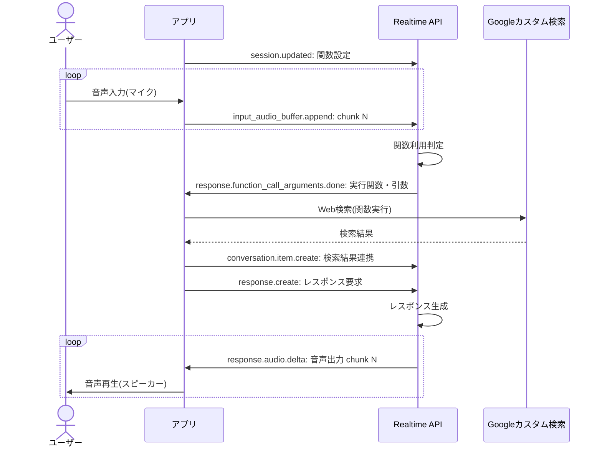

つい先日OpenAIのRealtime APIを利用した以下の記事を書きました。

- [新登場の OpenAI の Realtime API でAIと音声会話する](/blogs/2024/10/07/openai-realtime-api-intro/)

ここではCLIベースの超簡単会話ツールを作成しました。

Realtime APIはChat Completion API同様にFunction callingにも対応しています。これを利用すると音声でも任意のAPIを実行できるようになります。
今回はこれを試してみます。

基本的な構成は前回記事と同じですので、セットアップや音声の入力や出力についての記述は省略します。必要に応じて前回記事をご参照ください。

本記事のソースコードは以下より確認可能です。

- [Realtime API with Function calling(CLI)サンプルコード](https://gist.github.com/kudoh/a76e83482f49ecc811e9a08be6118d9c)

:::info
本サイトでもChat Completion APIの方のFunction callingは以下の記事でご紹介してます。
興味があればご参照ください。

- [OpenAIのChat APIに追加されたFunction callingを使ってみる](/blogs/2023/06/14/gpt-function-calling-intro/)
:::

## Function callingで実行する関数を用意する

Realtime APIから実行する関数を用意します。ここでは最新の情報をWeb検索するAPIを作成します。
今回はGoogleが提供する以下のカスタム検索APIを使います。

- [Programmable Search Engine - Custom Search JSON API](https://developers.google.com/custom-search/v1/introduction)

Googleカスタム検索API自体は本題ではありませんので、詳細なセットアップ手順は省略します(手順通りやればできます)[^1]。
[^1]: もちろんもっと高機能な[SerpAPI](https://serpapi.com/)でもいいですし、Function callingを使うだけであればダミー関数でも構いません。

NPMプロジェクトに必要なAPIを依存関係に追加しておきます。

```shell
npm install @googleapis/customsearch
```

ここでは以下の関数を用意しました。

```typescript
import { customsearch } from '@googleapis/customsearch';

const API_KEY = process.env.CSE_API_KEY ?? '';
const ENGINE_ID = process.env.CSE_ENGINE_ID ?? '';

export async function webSearch({ query }: { query: string }) {
  console.log('Web Search:', query);
  const api = customsearch({
    auth: API_KEY,
    version: 'v1'
  });
  // https://developers.google.com/custom-search/v1/reference/rest/v1/cse/list
  const result = await api.cse.list({
    q: query,
    cx: ENGINE_ID
  });
  return (result.data.items ?? []).map(item => ({
    title: item.title,
    link: item.link,
    snippet: item.snippet
  }));
}
```

検索クエリを受け取って、Google検索した結果を返すシンプルなものです。

## Realtime APIに実行可能な関数を設定する

作成した関数をRealtime APIに指定します。これはRealtime APIの`session.update`イベントを使います。

```typescript
import WebSocket from 'ws';
import { spawn } from 'child_process';
import { webSearch } from './google-search.js';

const url = 'wss://api.openai.com/v1/realtime?model=gpt-4o-realtime-preview-2024-10-01';
const ws = new WebSocket(url, {
  headers: {
    'Authorization': 'Bearer ' + process.env.OPENAI_API_KEY,
    'OpenAI-Beta': 'realtime=v1'
  }
});

const instructions = `あなたは物知りなAIアシスタントです。
ユーザーの質問には、webSearch関数をこっそり使って、驚きや笑いを交えた答えを返してください。
技術的な裏側は内緒にして、親しみやすくユニークな会話を楽しみましょう。
ユーザーを楽しませつつ、役立つ情報も忘れずに！`;

// セッション作成
ws.on('open', () => {
  // Realtime APIの基本設定
  ws.send(JSON.stringify({
    type: 'session.update',
    session: {
      voice: 'shimmer',
      instructions: instructions,
      input_audio_transcription: { model: 'whisper-1' },
      turn_detection: { type: 'server_vad' }
    }
  }));

  // Function callingで実行する関数を指定
  ws.send(JSON.stringify({
    type: 'session.update',
    session: {
      tools: [{
        type: 'function',
        // 関数名
        name: 'webSearch',
        // 関数説明(AIの実効判断材料)
        description: 'Performs an internet search using a search engine with the given query.',
        // JSONスキーマでパラメータを指定
        parameters: {
          type: 'object',
          properties: {
            query: {
              type: 'string',
              description: 'The search query'
            }
          },
          required: ['query']
        }
      }],
      tool_choice: 'auto' 
    }
  }));
})
```

ここでは音声種類や会話検知モード等の基本的な設定に続いて、Function callingの指定をしています。
`session.tools`配下にChat Completion APIと同じように、関数名やパラメータ(JSONスキーマ)を指定します(複数可)。

`session.tool_choice`には`auto`を指定しています。これは関数実行可否をAIが自動判定するモードです。
関数実行を必須とする場合は`required`を指定します。現段階ではChat Completion APIのように実行する関数自体は指定できないようです。

Function callingは他の設定と一緒に1つの`session.update`イベントで指定してもいいですし、後から別途指定しても構いません(同一セッション内で関数の変更や削除もできるようです)。


## 関数を実行して結果を連携する

関数実行が必要と判定された場合に、Realtime APIは以下のイベントで関数の引数を送信してきます。
ざっと調べた感じだと、関数の引数は以下のイベントから取得できそうです。

- [response.function_call_arguments.delta](https://platform.openai.com/docs/api-reference/realtime-server-events/response/function_call_arguments/delta)
- [response.function_call_arguments.done](https://platform.openai.com/docs/api-reference/realtime-server-events/response/function_call_arguments/done)
- [response.output_item.done](https://platform.openai.com/docs/api-reference/realtime-server-events/response/output_item/done)
- [response.done](https://platform.openai.com/docs/api-reference/realtime-server-events/response/done)

いろいろなイベントがあって悩まされますね。。。
公開されている[リファレンス実装](https://github.com/openai/openai-realtime-api-beta)を確認すると、`response.function_call_arguments.delta`イベントでストリーミングされてくる引数を溜めて、`response.output_item.done`イベントで関数の実行をしていました。

ここでは、わざわざストリーミングされてくる引数を組み立てる理由もないので、`response.output_item.done`イベントで引数取得と関数実行の両方をやってしまおうと思います。
イベントのペイロードは以下の通りです。

```json
{
  "type": "response.output_item.done",
  "event_id": "event_AGIfARbBn3ieWo305yKxR",
  "response_id": "resp_AGIfAftaxFnAnGbovPFbW",
  "output_index": 0,
  "item": {
    "id": "item_AGIfAEWj1dZyY3EbCt4re",
    "object": "realtime.item",
    "type": "function_call",
    "status": "completed",
    "name": "webSearch",
    "call_id": "call_swWIenO6JtScDTOw",
    "arguments": "{\"query\":\"2024 Nobel Prize winners\"}"
  }
}
```

このイベントはFunction calling以外でも使われているので、`item.type`が`function_call`のものを見るのが良さそうです。
以下のように実装してみました。

```typescript
ws.on('message', (message) => {
  const event = JSON.parse(message.toString());
  console.log(event.type);
  switch (event.type) {
    case 'response.audio.delta':
      // Realtime APIからの音声出力はスピーカーから再生
      audioStream.write(Buffer.from(event.delta, 'base64'));
      break;
    case 'response.output_item.done':
      const { item } = event;
      // 1. 関数実行依頼判定(function_call)
      if (item.type === 'function_call') {
        if (item.name === 'webSearch') {
          // 2. 関数実行
          webSearch(JSON.parse(item.arguments)).then(output => {
            // 3. 実行結果連携
            ws.send(JSON.stringify({
              type: 'conversation.item.create',
              item: {
                type: 'function_call_output',
                call_id: item.call_id,
                output: JSON.stringify(output)
              }
            }));
            // 4. レスポンス生成要求
            ws.send(JSON.stringify({ type: 'response.create', }));
          });
        }
      }
      break;
    case 'response.audio_transcript.done':
    case 'conversation.item.input_audio_transcription.completed':
      console.log(event.type, event.transcript);
      break;
    case 'error':
      console.error('ERROR', event.error);
      break;
  }
});
```
`item.name`に`session.update`で指定した関数名、`item.arguments`に実行する引数(JSON文字列)が設定されてきますので、これをもとに関数を実行(Google検索)します。
関数実行結果は[conversation.item.createイベント](https://platform.openai.com/docs/api-reference/realtime-server-events/conversation/item/created)でRealtime APIに連携します。

注意点として、実行結果の連携後にレスポンス生成([response.createイベント](https://platform.openai.com/docs/api-reference/realtime-server-events/response/created))を要求する必要があります(これをしないと何も応答してくれません)。
こうすると、関数実行結果をもとに回答が生成されて音声としてレスポンスが送信されてきます。このイベント([response.audio.delta](https://platform.openai.com/docs/api-reference/realtime-server-events/response/audio/delta))は音声ストリーミングとしてサブスクライブしてますので、そのままスピーカーから再生されることになります([前回記事](/blogs/2024/10/07/openai-realtime-api-intro/#realtime-apiからのレスポンス音声を再生する)参照)。

ここでの実行の流れを整理すると以下の通りです(送信・購読しているイベントのみ表示)。



## まとめ
今回はRealtime APIのFunction callingを使った外部API実行にチャレンジしてみました。
Chat Completion APIのFunction callingの経験があれば、それほど難しいものではありませんね。

AIが会話ベースでいろんな外部タスクをお願いできる頼もしい存在になってくれる日も近いのかもしれませんね。
