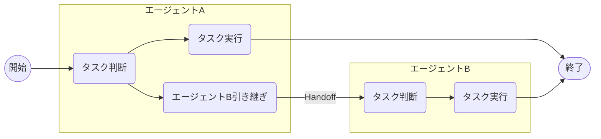
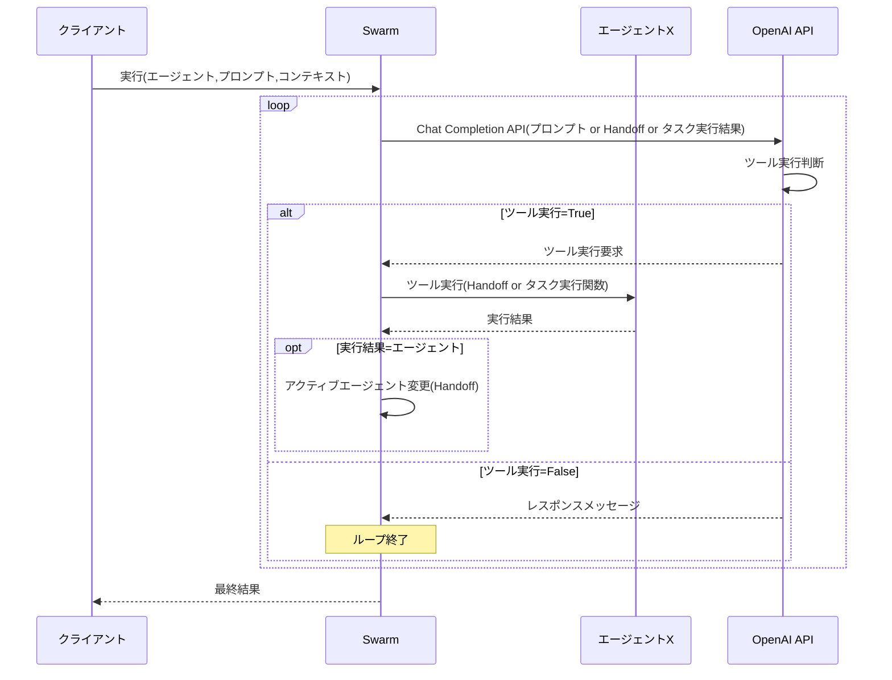
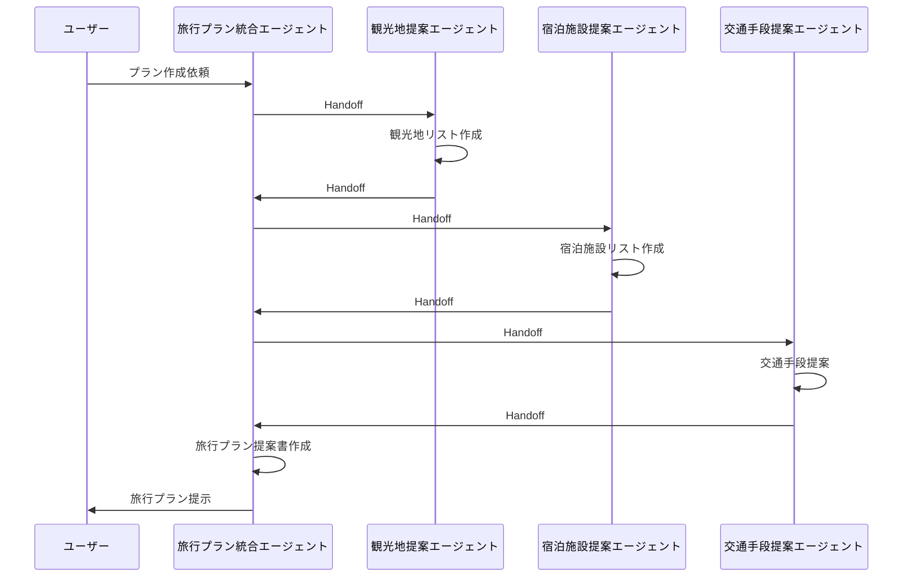

これは[豆蔵デベロッパーサイトアドベントカレンダー2024](/events/advent-calendar/2024/)第4日目の記事です。

2025年に飛躍しそうなAI注目技術と言えば、エージェント機能が代表格です[^1]。

最近でも、Anthropicが[Computer Use](https://docs.anthropic.com/en/docs/build-with-claude/computer-use)と呼ばれるAIでPCを直接操作するAIエージェントを公開(ベータ版[^2])して話題を集めました。
一方で、追随するOpenAIやGoogle等のAIベンダーでも自律型のエージェント機能を順次リリースする予定で大きな期待(と倫理的な懸念)を集めています。

[^1]: エージェント機能の定義ははっきりとしていませんが、ここではAIが人間に代わって目的を達成するまでタスクを再起的に実行してくれるものとします。
[^2]: 現時点ではベータ版ですが、Anthropic APIの他、AWS BedrockやGoogle Cloud Vertexからも利用できます(Claude 3.5 Sonnetモデル)。

今回は、そんな期待のAIエージェントが協調して1つの目的を実行する(エージェントオーケストレーション)仕組みを学びたいと思います。
これを実現する方法は色々と考えられますが、今回はOpenAI Cookbookの以下記事で言及している方法を深掘りしてみます。

@[og](https://cookbook.openai.com/examples/orchestrating_agents)

本記事のタイトルで使っているSwarmは、この記事で言及しているエージェントオーケストレーションのサンプル実装としてGitHubで公開されているものです(筆者は名前を見てDocker Swarmを思い出しました[^3])。

[^3]: Docker Swarmとは全く別物ではありますが、Docker Swarmはコンテナ、OpenAIのSwarmはエージェントを協調動作させるものなので、対象が違うだけで意味合いは同じですね。

@[og](https://github.com/openai/swarm/tree/main)

本レポジトリは公式プロダクトではなくサンプルですが、エージェントオーケストレーションの考え方を学ぶ上で有用なものになっています。

## Swarmのコンセプト

Swarmはの考え方は非常にシンプルで、以下2つのコンセプトで構成されています。

## Routines / Agent

Cookbookの方ではRoutinesと言われていますが、SwarmのREADMEではAgentと言われています。本記事ではエージェントに統一します。

以下Cookbook記事からの引用です。

> The notion of a "routine" is not strictly defined, and instead meant to capture the idea of a set of steps. Concretely, let's define a routine to be a list of instructions in natural langauge (which we'll represent with a system prompt), along with the tools necessary to complete them.

このようにエージェントは自然言語で記述した指示と、それを実行するツールで構成されます。

実装レベルで見ると、エージェントは関数呼び出し(Function calling)を利用するChat Completion APIです。
以下SwarmのAgentクラスの型定義です。

```python
class Agent(BaseModel):
    name: str = "Agent"
    model: str = "gpt-4o"
    instructions: Union[str, Callable[[], str]] = "You are a helpful agent."
    functions: List[AgentFunction] = []
    tool_choice: str = None
    parallel_tool_calls: bool = True
```

ここでは、`instructions`(システムメッセージ)と`functions`(Function calling)が重要なプロパティです。
`instructions`に該当エージェントの責務とそれを達成するための指示を、`functions`に実際にそれを遂行する関数を設定します。

また、複数エージェントを対象としていますので、`name`でエージェントを識別できるようにしています。

このようにSwarmのエージェントの定義は非常にシンプルで、最低限必要なもののみにフォーカスしたものになっていると言えそうです。

## Handoff

エージェントオーケストレーションの肝がHandoffです。
以下Cookbookからの引用です。

> Let's define a handoff as an agent (or routine) handing off an active conversation to another agent, much like when you get transfered to someone else on a phone call. Except in this case, the agents have complete knowledge of your prior conversation!

電話を他の人に転送するイメージとのことです。

エージェントオーケストレーションのコンテキストで言うと、実行すべきタスクが自分の責任範囲を超えると判断したら、適切なエージェントにバトンタッチ(引き継ぎ)することがHandoffと言えそうです。

エージェントA -> エージェントBへのタスク引き継ぎの場合は以下のようなイメージです。



次々にHandoffでエージェント間を繋いでいけば、より大きなエージェントオーケストレーションのネットワークを構築できます。

Swarmでは、エージェント引き継ぎ用の関数をツールに加えることでHandoffを実現します。
Handoff関数は以下のようなものになります。

```python
# 引き継ぎ先エージェント
refund_agent = Agent(...)

# Handoff関数
def transfer_to_refunds():
    """ユーザーが返金に関する要求した場合に実行してください"""
    return refund_agent
```

戻り値として次のエージェントを返すのがHandoff関数のルールです。
また、Handoff関数は`transfer_to_XXX`(XXX:エージェント名)というネーミングにすることで、LLMが適切に実行可否を判断してくれるとのことです。

このHandoff関数を引き継ぎ元のエージェントのツール(`functions`)として指定しておきます。

```python
triage_agent = Agent(
    name="Triage Agent",
    instructions=triage_instructions,
    # Handoff関数を設定
    functions=[transfer_to_flight_refunds, transfer_to_xxxx],
)
```

このエージェントはHandoff関数のみを設定していますが、もちろん通常の関数と組み合わせても構いません。
このような形で指定しておくと、エージェント(LLM)は適切な次のエージェントを選択して、現在のタスクを引き継ぐことになります。

## Swarmの実行シーケンス

Swarmの大まかな実行シーケンスを整理してみました(細かい制御は省略してます)。



LLMがツール実行不要と判断する(つまりメッセージを生成する)まで、Chat Completion APIを実行し続けるシンプルなものになっています。
その中でHandoff関数が実行された場合にアクティブエージェントを切り替えていきます。
また、上図には表していませんが、Handoff発生時はメッセージの履歴やコンテキスト情報も引き継ぎ、後続エージェントが過去の情報やユーザーコンテキストを参照できる仕組みになっています。

なお、全自動ではなくユーザー・エージェント間で対話しながらタスクを実行する場合は、このシーケンスをループするだけで実現可能です。Swarmでは[run_demo_loop関数](https://github.com/openai/swarm/blob/main/swarm/repl/repl.py#L60)として用意されています。

## Swarmを動かしてみる

エージェントオーケストレーションの仕組みが理解できたので、最後にSwarmを動かしてみます。
今回は旅行プラン作成機能と題して、以下エージェントの協調動作を組み立ててみます。

- 旅行プラン統合エージェント: 各エージェントから情報を収集して顧客に旅行プランを立案をする
- 観光地提案エージェント: 目的地に応じて観光地リストを提案
- 宿泊施設提案エージェント: 目的地付近の宿泊施設を提案
- 交通手段提案エージェント: 出発地と目的地に基づき最適な交通手段を選定

ここでは旅行プラン統合エージェントがユーザーの窓口になって、各エージェントから情報を収集して(Handoff)、最終的な旅行プラン提案書を作成する構成とします。



早速コードを書いていきます。
まず、SwarmはGitHubから直接インストールします。

```shell
pip install git+https://github.com/openai/swarm.git
```

まずは各エージェントの実行結果を受けて最終的な旅行プランを立案する旅行プラン統合エージェントです。

```python
from swarm import Agent, Swarm


# Handoff関数
def transfer_to_tourist_spot():
    """観光地提案エージェントに引き継ぐ時に実行する"""
    return tourist_spot_agent


def transfer_to_accommodation():
    """宿泊施設提案エージェントに引き継ぐ時に実行する"""
    return accommodation_agent


def transfer_to_transportation():
    """交通手段提案エージェントに引き継ぐ時に実行する"""
    return transportation_agent


# 旅行プラン統合エージェント
def planner_instructions(context_variables):
    # エージェント間で引き継がれるコンテキストから顧客名を取得
    customer_name = context_variables.get("name")
    return (
        "旅行プランを作成するために、以下のツールを使用して情報を収集してください：\n"
        "- 観光地提案: transfer_to_tourist_spot\n"
        "- 宿泊施設提案: transfer_to_accommodation\n"
        "- 交通手段提案: transfer_to_transportation\n"
        "必要な情報を取得後、統合して旅行プランを作成してください。\n"
        "プラン作成時のプロセスはユーザーに共有しないでください。\n"
        "提案する旅行プランの冒頭でお客様からプラン立案のご依頼をいただいたことに対する感謝の意を伝えてください。"
        f"お客様の名前は`{customer_name}`です。\n"
    )

travel_planner_agent = Agent(
    name="Travel Planner Agent",
    model="gpt-4o",
    instructions=planner_instructions,
    functions=[transfer_to_tourist_spot, transfer_to_accommodation, transfer_to_transportation],
    parallel_tool_calls=False, # 並列ツール実行はしない(Swarmでは並列でのエージェントHnadoffに未対応)
)
```

ここでは各エージェントへのHandoff関数を作成して設定します。旅行プラン立案タスク自体は生成AIのテキスト生成能力を活用するため特定の関数は指定していません。
`instructions`に具体的な指示を書かないと、エージェントに引き継ぎせず自分勝手なレスポンスを生成してしまうことが多かったので、Handoff関数(ツール)の実行指示を明確に記述しました。

続いて、残りのエージェントの実装です。

```python
# 再起用のHandoff関数
def transfer_to_travel_planner():
    """旅行プラン統合エージェントに引き継ぐ場合に実行する"""
    return travel_planner_agent


# 観光地提案エージェント
def suggest_spots(destination: Literal["東京", "京都", "大阪"]):
    spots = {
        "東京": ["東京タワー", "浅草寺", "原宿", "秋葉原"],
        "京都": ["清水寺", "金閣寺", "嵐山"],
        "大阪": ["道頓堀", "ユニバーサル・スタジオ", "大阪城"]
    }
    return spots.get(destination, ["観光地データがありません。"])


tourist_spot_agent = Agent(
    name="Tourist Spot Agent",
    model="gpt-4o-mini",
    instructions=(
        "suggest_spotsを使って旅行先でおすすめの観光地を提案してください。\n"
        "提案後はtransfer_to_travel_planner関数で旅行プラン統合エージェントに引き継いでください。"
    ),
    functions=[suggest_spots, transfer_to_travel_planner]
)


# 宿泊施設提案エージェント
def suggest_accommodations(destination: str):
    accommodations = {
        "東京": ["ホテルニューオータニ", "リッチモンドホテル東京"],
        "京都": ["京都ホテルオークラ", "ウェスティン都ホテル京都"],
        "大阪": ["ヒルトン大阪", "ザ・リッツ・カールトン大阪"]
    }
    return accommodations.get(destination, ["宿泊施設データがありません。"])


accommodation_agent = Agent(
    name="Accommodation Agent",
    model="gpt-4o-mini",
    instructions=(
        "suggest_accommodationsツールを使って目的地付近でおすすめの宿泊施設を提案してください。\n"
        "提案後はtransfer_to_travel_plannerツールで旅行プラン統合エージェントに引き継いでください。"
    ),
    functions=[suggest_accommodations, transfer_to_travel_planner]
)


# 交通手段提案エージェント
def suggest_transportation(start: str, destination: str):
    if start == "東京" and destination == "京都":
        return "新幹線（約2時間半）"
    elif start == "京都" and destination == "大阪":
        return "電車（約30分）"
    elif start == "東京" and destination == "大阪":
        return "飛行機または新幹線"
    return "交通手段データが見つかりませんでした。"


transportation_agent = Agent(
    name="Transportation Agent",
    model="gpt-4o-mini",
    instructions=(
        "suggest_transportationツールを使って出発地と目的地を基に、最適な交通手段を提案してください。\n"
        "提案後はtransfer_to_travel_plannerツールで旅行プラン統合エージェントに引き継いでください。"
    ),
    functions=[suggest_transportation, transfer_to_travel_planner],
)
```

ここでは、各エージェントはその責務に応じたダミーのタスク実行関数に加えて、旅行プラン統合エージェントへのHandoff関数(`transfer_to_travel_planner`)も設定しています。
これにより、タスク実行後はその結果を持って再度旅行プラン統合エージェントに制御を戻すようにしています。

最後にmain関数です。

```python
def main():
    context_variables = {
        "name": "豆香"
    }
    client = Swarm()
    response = client.run(
        agent=travel_planner_agent,
        messages=[{"role": "user", "content": "出発地:東京、目的地:大阪"}],
        context_variables=context_variables,
        debug=True # LLMへの入出力をログ出力
    )
    print(response.messages[-1]["content"])

if __name__ == "__main__":
    main()
```

初期エージェントとして旅行プラン統合エージェント(`travel_planner_agent`)を指定し、ユーザーの入力(出発地、目的地)を指定しています。

また、メッセージとは別にコンテキスト(`context_variables`)を指定しています。
コンテキストは任意のエージェントの指示(`instructions`)やツール(`functions`)内で使用可能です。先ほど旅行プラン統合エージェントの`instructions`設定時ではこの情報を使って動的にエージェントへの指示を生成していました。

以上で終了です。これをCLIで実行すると、以下のレスポンスが得られました。

```
豆香様、この度は旅行プランのご依頼をいただき、誠にありがとうございます。以下に、大阪旅行のプランをご提案いたします。

### 旅行プラン

**出発地:** 東京  
**目的地:** 大阪  

#### 交通手段
東京から大阪へは、飛行機または新幹線をご利用いただけます。それぞれの利便性に応じてご選択ください。

#### 観光地
1. **道頓堀**: 大阪のグルメとショッピングを楽しめる人気観光地です。
2. **ユニバーサル・スタジオ**: アトラクションを楽しみたい方におすすめです。
3. **大阪城**: 歴史を感じることができる観光名所です。

#### 宿泊施設
1. **ヒルトン大阪**
2. **ザ・リッツ・カールトン大阪**

宿泊施設は、快適で贅沢な滞在をお求めの方におすすめのお宿をご提案しております。

以上が大阪旅行の基本プランとなります。ご要望や調整が必要な点がございましたら、どうぞご遠慮なくお知らせください。楽しい旅行になりますように！
```

内容を見ると、各エージェントのタスク実行結果がいい感じに統合されてプランとして提案されている様子が分かりますね。

## 最後に
Swarmを通じて、エージェントオーケストレーションの仕組みを簡単に見てきました。
Swarmは教育目的で設計されているため、シンプルさが重視されていますが、この基本的な考え方を理解しておけば、エージェントの並列実行や超大規模なオーケストレーションにも応用できると思います。

さらに、Assistants APIと組み合わせることで、File SearchやCode Interpreter等より実用的なツールの活用が可能となり応用の幅が広がりそうです。

将来的には、Kubernetesのようなエージェントオーケストレーションを支えるプロダクトが登場するかもしれません（もしかしたら、もう存在しているのかもしれませんね）。

また、マルチエージェント時代においては、エージェントの粒度をどう設計するかという新たな課題が生まれそうだなとも思いました。
マイクロサービスならぬ「マイクロエージェント」のような設計思想が注目されるかもしれません。
すべてを1つにまとめた「ゴッドエージェント」を避けるため、適切な分割と設計のバランスが求められると感じました。

