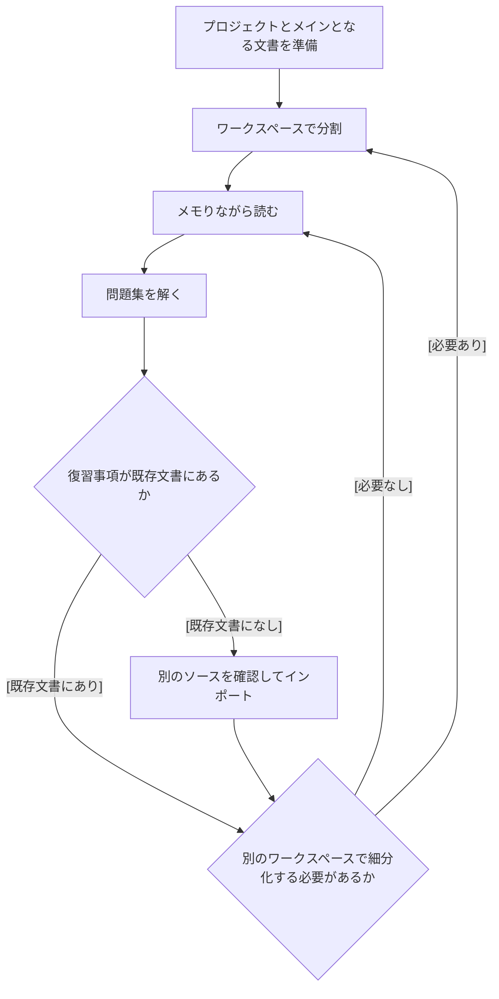

これは[豆蔵デベロッパーサイトアドベントカレンダー2024](/events/advent-calendar/2024/)第13日目の記事です。

## はじめに
ビジネスソリューション事業部の山下です。今回はLiquidTextというドキュメント管理ツールについて、AWS認定資格と関連させて紹介させていただきます。
本記事で話す内容とそうでないものは以下の通りです。
### 話すこと
- LiquidTextの紹介
- AWS認定資格の学習とLiquidTextとの相性
- 自身の活用例
### 話さないこと
- 特定のAWS認定資格の攻略法
- LiquidTextの細かい機能

## LiquidTextとは
近年注目を集めているドキュメントツールです。文章中のテキストや図を抽出してストックできるなど、ドキュメントそのものにとどまらず知識体系の効率的な管理が可能です。
[公式ページ](https://www.liquidtext.net/)では次のような特徴が紹介されています。
- 柔軟なPDFアノテーション機能：ドラッグ＆ドロップで簡単にハイライトやメモを追加可能
- 直感的な文書比較：複数のPDFを同時に開いて横断的に参照・比較が可能
- インタラクティブなワークスペース：重要な部分を抽出してリンクやグループ化が可能
- マルチデバイス対応：iPadやWindowsなど、様々なデバイスで同期して利用可能

文章だけだとわかりづらい部分もあるため、以下に使用例を掲載いたします。
### プロジェクトの一例
サンプルで提供されているワークスペースからの引用となります。
以下のようなイメージを見てもらえれば雰囲気は掴めると思います。

デフォルトの設定では、左半分にドキュメントが右半分にワークスペース（メモ欄）が配置されます。
ワークスペースには文書からそのまま文字や画像を引っ張ってこれるほか、別の書き込みを追加できます。また、ワークスペースに引っ張ったテキストから元の文書のテキストをすぐに参照できます。

## AWS認定資格とLiquidTextとの相性
AWS認定資格には概ね以下の特性があります。
- 対象とするサービスについて包括的な知識が問われる
- 定番の（アーキテクチャ）パターンなどについて理解しておく必要がある
	- S3をオリジンとするCloudFrontの設定
	- Lambda、API Gateway、DynamoDBを組み合わせたサーバレスアーキテクチャ
	- etc…
- 一部YAMLテンプレートなどの理解も必要
	- CloudFormationのスタック
	- S3バケットポリシー
	- etc…
- 理論に対する一定の理解も必要
	- Route53であればDNSサーバに対する理解
	- MEA限定ではあるが、機械学習に関する知識
	- etc…

といった具合に広く深く知識を仕入れる必要があります。しかしながら、恐れる必要はありません。
有償無償問わず、これらの粒度に対応するドキュメントは必ず存在します。
先ほどの特性に照らし合わせてみれば、次のような対応関係が想像できます。

- 対象とするサービスについて包括的な知識が問われる
	→ 資格対策講座のドキュメント
- 定番の（アーキテクチャ）パターンなどについて理解しておく必要がある
	→ 講座のドキュメントやAWS公式ドキュメント、場合によってはネット記事
- 一部YAMLテンプレートなどの理解も必要
	→ AWS公式のドキュメントなど
- 理論に対する一定の理解も必要
	→ その他ドキュメント

必要なドキュメントを複数で保存しつつ、幅広く情報を集約・管理できれば学習を有利に進められます。
そこで、前述のLiquidTextをドキュメント管理ツールとして選定しました。
以下、実際に自分が使っている様子を軽く紹介するので、イメージを深めていただければ幸いです。

## AWS認定試験勉強における活用例
### 活用フロー
概ねLiquidTextを次のように使っています。

基本的には初期のプロジェクト作成時と見直しのタイミングでLiquidTextを使っています。
初めのタイミングではメインになるドキュメントを用意してインポートします。このタイミングでワークスペースを分割しておくと見通しは立てやすいかもしれません。
また、ワークスペースを分割するタイミングで文書を俯瞰できるため、個人的には割とおすすめです。
次に見直しのタイミング時には、検索機能を駆使してドキュメント上に記述されているかどうかを確認します。
ドキュメントに含まれていれば詳しく確認し、無ければ外部のソースを持ってきて読み込むといった使い方をしています。
また、教科書などの表現がわかりづらければ、解説記事などの別ソースを読み込んでおきます。
話が抽象的すぎるので、以下に特定のAWSサービス（Route53）を題材とした場合のシナリオを挙げます。
- 初期段階においては、Route53の理解を概要程度で済ます
- 一応、Route53というワークスペースは準備する
- 文書内の章タイトルをワークスペースにドラッグして、ワークスペースと文書を紐づける
- 問題集を解く
- 問題集の結果からRoute53の理解が不十分であると判明する
- 講座の教科書を確認して、さらにサブの概念(ホストゾーン, Resolver)でワークスペースを分割する
- 作ったワークスペースと文書を紐づけておく
- 特定のシナリオについて問われる
	- 他のAWSアカウントで使っているprivate hosted zoneと自分のVPCを紐づける等
- 別のドキュメントをインポートして、ワークスペースと紐づける
- 問題を解く
- etc…

少し恥ずかしいですが、実際のイメージを見せると以下のようになります。

### 例1: AWS Budgets

- 章のタイトルのほか、重要な表現はワークスペースに退避させています
- 右側にあるメモからPDFの記述に飛ぶことも可能です
### 例2: CloudHSM

- コアとなる教材になっていないものについては、解説記事から別途インポートしています
- 不明な表現や注意すべきポイントがあれば、ドラッグしてメモ欄に退避させています
### 例3: 階層構造を持つワークスペースの例

- ワークスペースで階層構造をとることも可能です

## その他気づいたことやメモ
- 大容量のPDFは処理できない
	ファイルサイズの制限があり、大容量のPDFファイルや大量のドキュメントを一度にインポートすると動作が不安定になったり、クラッシュする可能性があります。50MB/fileを超えるようなら分割を検討してください。
- 効率的なワークスペース管理方法
	AWSのサービスごとに分けてもいいと思いますが、細部のトピックがあればさらに分けるという具合になっています。いずれにせよ1つのワークスペースにまとめると見通しが悪くなるようです。
- インデックスライクな整理は不向き
	検索機能を駆使しても、特定のカテゴリがどこに書かれているのかを瞬時に把握する方法は今のところなさそうです。別のツールを併用していました。
- 複数のドキュメントのインポートには課金が必要
	買い切りor月額プランの契約が必要になります[^1]。詳しくは[料金に関するリンク](https://www.liquidtext.net/pricing-features)を参照してください
- ドキュメントの読み込みだけで試験は突破できない
	いかにLiquidTextを使おうと、ドキュメントだけで試験を突破するのは困難です。あくまでドキュメントの管理にとどめてください。
	
	[^1]: 2024年12月現在、買い切りで49.99ドル、月額払いで7.99ドル～となっています

## まとめ
今回は、AWS認定資格勉強を焦点にあてて、LiquidTextの活用方法について紹介しました。
現在学習中の身ではありますが、AWS認定資格の学習に大いに重宝しています。
資格勉強に関係なくドキュメントを読む際の補助ツールとしてかなり使いやすいツールですので、少しでも興味のある方は使ってみてもいいかもしれません。

