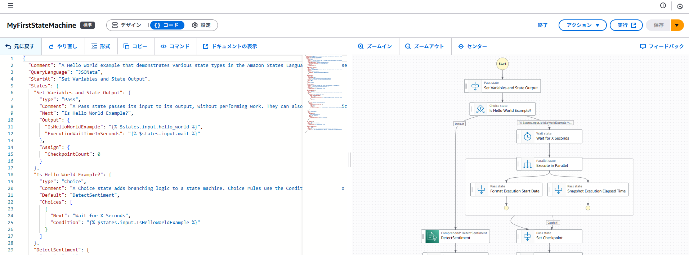

Bedrock
いくつかのモデルが選択できる
Claudeの場合、標準的なモデルパラメーター（Temperture, Top Kなど）に加えて「Maximum length (max_tokens_to_sample)」が存在する
Amazon Bedrock には、推論用に 2 つの主要なモデル呼び出し API オペレーションがあります。
InvokeModel – 単一のプロンプトを送信し、そのプロンプトに基づいてレスポンスを生成します。
Converse – 単一のプロンプトまたは会話を送信し、それらのプロンプトに基づいてレスポンスを生成します。コンテキストとして以前のプロンプトやレスポンスを含めることができるため、InvokeModel よりも柔軟性があります。
これらの API オペレーションのストリーミングバージョンである InvokeModelWithResponseStream と ConverseStream を使用して、レスポンスをストリーミングすることもできます。
できることとしては推論（プロファイル（パラメータの値とか）を設定して複数モデルで利用する）、プロンプトの管理、RAG（ナレッジベース）、エージェント構築、フロー構築、セッションなどがある
初めに簡単に使うには、プレイグラウンドでモデルを選択してプロンプトを投げればおｋ
パラメーターの調整とかもプレイグラウンド上でできる

推論用APIについて
・Converseは統一されたフォーマットを提供し、InvokeModelはモデル固有のフォーマットを要求します。 今後、新しいモデルが登場するたびにフォーマットを調べる手間を省きたい場合は、Converse APIを利用するのがおすすめです。
・boto3を使って実行ができた

ストリーミング版API


生成AIアプリの構成要素は？
基本的には

この図に含まれる要素で成り立つ

そもそもFM(founded model)って？
FMs are models trained on data at scale from different domains that can be adapted to various downstream tasks.
過去のMLモデルとFMの違い


FMにアクセスするためのAPIは、基本的にはAWSが構築しているインフラ上で動いているけど、
自分自身で管理しているインフラ上でFMと一緒に管理することもできる

embeddingとは
Embedding is the process by which text, images, and audio are given numerical representation in a vector space

embeddingするためのモデルが提供されている（この図のML models=embeddingモデル）
embeddingしたあとにそのデータを保存するDBが vector databases 
・Amazon OpenSearch Service (provisioned)
・Amazon OpenSearch Serverless
・pgvector extension in Amazon Relational Database Service (Amazon RDS) for PostgreSQL
・pgvector extension in Amazon Aurora PostgreSQL - Compatible Edition
とかがある

FMモデルのRAG化とFine-tuning（比較）



LangChaneとは
フレームワーク
どんなフレームワーク？
大規模言語モデル（LLM）を用いたアプリケーション開発を効率化するためのオープンソースのフレームワークです。LLMを様々なデータソースや計算リソースに接続するためのツールやコンポーネントを提供し、複雑なタスクをこなすAIアプリケーションを開発できます。PythonとJavaScriptで利用可能

AWS CLIでBedrockを実行する
・Claudeモデル
・単一リージョン（東京）
・コマンド
```

```
↓
上記は基礎的な内容
簡単だけど、S3→Glue→S3の構成でBedrockをロジックに組み込んで使ってみた内容をひとまずまとめる
    
  


# 概要
せっかくオライリーのコースがあったから、やってみてその内容や学びをまとめていく

以下のようなフローに沿って生成AIについての基礎やビジネスへ活用するための方法、セキュリティや倫理観などの内容を含めた導入的な学びができる構成になっているようです。

# 「GenAI Essentials for Everyone」で学べる事
有料のコンテンツ（オライリーのサブスクリプション契約が必要）になっているため、詳細については載せることができませんが、  
- 生成AIでできること
- 生成AIをどのように自分のタスクに落とし込めるか
- 生成AIに入力する効率的なプロンプトとは
- 倫理的に考慮すべきことや発生する制限
- 生成AIの将来について
上記の内容が各ステップに沿って学べるような構成になっています。

また、初回のステップで生成AIを使うにあたって意識すべき３つの点について述べられており、重要な内容だと感じたため自分なりにかみ砕いて以下にまとめておきます。
- どの領域、タスク、場面においても生成AIを活用する方法がないかを模索すること
- AIが出した答えを鵜呑みにしないこと（人が最終的に選択し、決断すること）
- 生成AIに役割を与えてあげること

生成AIを積極的に活用することを薦めはしつつ、AIが提示する回答についてはしっかりと吟味して受け入れていくスタンスには自分も同意見ですね。

自分の周りやバラエティ番組でのインタビューなどでchatGPTやGemini、画像・音楽生成AIを仕事や私生活で利用している人はどんどん増えている印象です。将来的にAIを使わずに生活することは難しい状況になりつつあるのと感じています。しかし、あくまでAIはデータに基づいて推論・生成を行っていることを理解し、結果に対して人間が選択をしていくスタイルをとっていかなければ、危惧されているような未来に…

# ざっくりと生成AIを理解したい人向け
ある程度「機械学習って何」「数式が出てきても大丈夫」人向けのさらい方になってしまいますが、以下の流れでリンクに貼ってある参考サイトをたどると  
生成AIが人工知能の中でもどういうくくりなのか、そもそも背景にあるモデルは何なのか、このあたりを把握することができると思います。  
  
おおまかでもいいのでイメージをもっておくと今回のコンテンツも理解が進むかなと思い自分なりにさらったので、もし同じように進めたい方は参考にしていただければ幸いです。  
  
**[生成AIをざっくり理解する]**

# What Is Generative AI?
33ページほどの生成AIの基礎に関する電子書籍をまずは読む流れになっている
この書籍の内容をざっくりと整理すると、
- 生成AIの歴史について
- 生成AIの皮切りになったモデル「GAN」と「VAE」、そして「Transformer」（他にもモデルの事例が挙がっている）
- テキスト生成AIの紹介
- テキスト生成AIが抱える課題（倫理と著作権、ハルシネーション、データの安全性など）
- 画像生成AIの紹介
- 画像生成AIが抱える課題
  
上記の内容について、細かい箇所までは深入りせず、概観をとらえる程度にとどめられたものになっています。

自分なりに簡単にまとめると、  
ハードウェアの進化によって計算資源がリッチになり、それによって深層学習という手法が扱えるようになったことで、深層学習の中でも特にテキスト生成AIと画像生成AIのモデルが次々に登場している。
これらのモデルの特徴や使用例の概観を抑えていくと、やはりまだまだ課題も多いのが現実である。  
というような内容が書かれていると思います。  

# 実際にテキスト生成AIを使ってみる
生成AIがどんなものかを軽く抑えた後、早速使ってみるステップに移る構成になっています。
  
  
よく見る誘導型のメッセージを読み進めながら、UIを触って体験していく感じですね。  
誘導される中で入力してほしいプロンプトの例がでてくるので、指示に従い入力し、出力の結果を見ます。  
  
はじめに「文章の内容を向上するためのアイデアを出して」のように、ざっくりとした指示を出して様子をみます。  
  
続いて、以下のような制限（条件）を加えたプロンプト内容で指示を出してみます。  
- 自分が置かれている状況や背景を加える
- 特定の制約があれば指示として与える
- 出力形式を指定する
  
そして、出力の中の特定の内容について質問を重ね、深堀をしていくことをします。  


