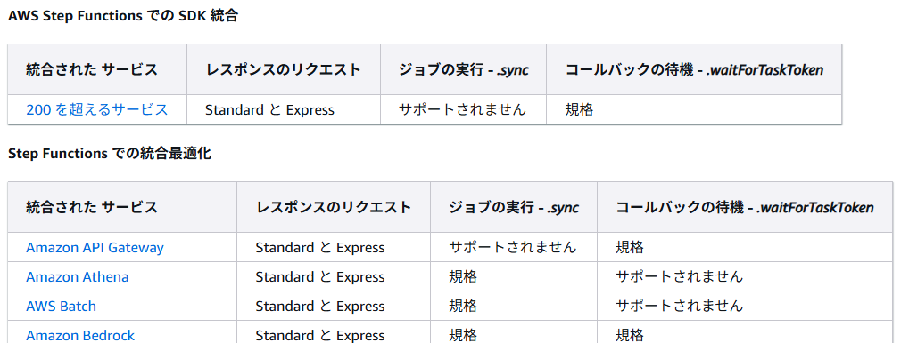
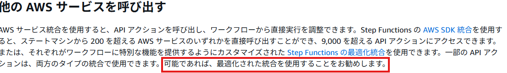

# 概要
業務において生成AIツールの開発プロセスへの導入について携わることになりそうなため、事前にキャッチアップもかねて調査した内容を整理しておこうと思う。  
使用するツールとして「Claude Code」というAnthropic社が開発しているコード支援ツールを使う予定なので、これについて実際に使ってみながらまとめていく。  
  
# 導入方法
「Claude Code」を利用する場合の導入方法は[Claude Codeのセットアップ](https://docs.anthropic.com/ja/docs/claude-code/setup)に記載されている。  
標準インストールとしてはnpmを使った方法があげられています。その他にもWindows WSL上へのインストール方法やAWS、GCP上で使う方法なども記載されている。  
  
今回は標準インストールして使っていきたいと思います。  
公式に記載の通り、npmが実行できる環境を整えて以下のコマンドをたたきます。
```
npm install -g @anthropic-ai/claude-code
```
インストール後は、  
```
cd <your-awesome-project>
claude
```  
で任意のディレクトリでclaudeコマンドを実行しClaude Codeを立ち上げていきます。
  
# Claude Codeの料金体系
上記の通りにclaudeコマンドを実行すると、claude consoleが表示されるまでいくつかインタラクティブに操作を進めますが、その中で「Claudeサブスクリプション」か「コンソールAPIアカウント」のどちらで認証をするか選択する操作があります。  
  
私もclaudeは使ったことがなかったのでアカウントの種類と料金体系を整理してみました。  
  
Geminiを使ってまとめてもらい、公式の情報と照らし合わせてみて若干修正してまとめています。  
  
２つのアカウントについてWeb UIや操作感もやはり違うっぽいので別々の製品として扱うのがいいのかもしれません。  
- サブスクリプションアカウントのUI  

  
- コンソールアカウントのUI  

  
一番の違いとしては課金体系ですね。  
サブスクリプションの場合は月額or年間購入になりますが、コンソールアカウントの場合は事前にクレジットを購入して、それを消費する形でAPIが実行できます。  
もしAPIの実行途中で事前購入したクレジットがなくなった場合は、自動で追加クレジットを購入する設定もできるみたいです。  
この辺りをどのようにするかは予算を踏まえて設定や購入を考えていく必要がありそうですね。  
  
# Claude Codeの実行
さて、料金体系に触れたところで「claude」コマンドを実行した後の流れを見ていきたいと思います。  
事前にサブスクリプションかコンソールアカウントのどちらかのアカウントを用意しておいてください。  
私は今回はコンソールアカウントを用意して認証をしています。  
  
- claudeコマンド実行後  
  
コンソールのデザインを選べます。ここはお好みで。  
  
- 認証コード発行のURL表示  
  
画像の赤枠にあるURLへ遷移して認証コードを発行します。 
  
- URLの遷移先  
  
Authorizeをクリックします。  

- 認証コードコピー  
  
認証コードをコピーし、先ほどの認証コード発行のURLが表示されているターミナルに戻り、「Paste Code here if prompted >」のところにペーストします。  
  
  
- ログインの成功  
  
ログインに成功したメッセージが表示されればオッケーです。  

その後指示に従いながら進むと、以下のようなセキュリティやプロジェクトフォルダの信頼についての案内が表示されます。  
  
  
  
  
最後に以下のプロンプトが表示されれば使用開始できる状態です！  
  

# 実際に使ってみる  
さて、ひとまず使えるようになったので細かい設定とかはいったん置いといて何か作らせてみようと思います！  
今回は簡単な五目並べをpythonのflaskで作っていきたいと思います。  
  
環境としては、  
- WSL2
- pyenv(3.12.11を利用)とvenvで仮想環境構築済み  
です。  

以下のようにターミナルに表示されているプロンプトに指示を与えます。  
日本語対応しているのはうれしいですね。  
与えた指示
```
シンプルな五目並べをflaskをバックエンドにして作成したいです。フロントエンドとしてはHTML/CSS、javascriptを想定しています。
```  
このように指示を出すと必要なコードを自動で書き始めてくれます。  
スクリプト単位で確認を挟みながら進めるか、確認も自動で実施していくか選択できるので、今回は初めてなのでスクリプト単位で確認を挟みながら進めるようにしました。  
  
スクリプト単位というのは、app.pyが出来上がったらコードの内容をざっとみてこれでよければEnterで次のスクリプト作成、というイメージをしていただければと思います。  
  
この粒度の指示でも結構まともな内容を出してくれるのでびっくりしました。。  
簡易的な内容であればもはや人の手は…  
  


