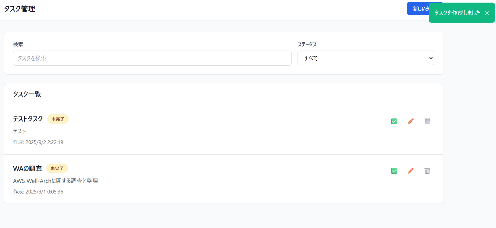

## 1. はじめに
AWSアーキテクチャの設計って、どうすれば正しく評価できるか悩むことってありませんか？たくさんのサービスが絡みあって、どこをどう見ればいいのか迷ってしまいますよね。（少なくとも私はよく迷います。）  
  
この記事は、そんな悩みを解決する手助けになる「AWS Well-Architected Framework（以降WAと呼称）」という、AWSに触り始めたころに必ず出会うであろう基本的な設計原則と、それに沿ったアーキテクチャの評価方法についてまずは整理をします。  

そして、今回はそこから一歩だけ踏み込んで、生成AIツールの「Kiro」を使ってWAに準拠したアーキテクチャが作れるかどうかを試してみたいと思います。  
生成AIがどれくらいWAの原則を理解してアーキテクチャに反映できるのか一緒に見ていきましょう！  

## 2. 記事の前提
この先の内容では、WAの一般的な設計原則や6つの柱の詳細には深く立ち入りません。WAの公式ドキュメントがとても充実しているので、詳細を知りたい方はそちらをご覧ください。  
[【公式ドキュメント】AWS Well-Architected フレームワーク](https://docs.aws.amazon.com/ja_jp/wellarchitected/latest/framework/welcome.html)  
  
この記事でメインとなる内容は「生成AIツールを使って、WAに沿ったアーキテクチャが作れるのか？」というものです。  
私が実際にKiroを使いながら感じたことや、ツールの特徴も交えながら、その可能性を探っていきます。  
  
## 3. 一般的な設計原則と6つの柱  
### 3.1 一般的な設計原則  
詳細には深入りしないと言ったものの、WAってなんだったっけという方もいると思うので簡単にまとめておきたいと思います。  

WAには、クラウド上で高品質なアーキテクチャを設計するための以下のような一般的な設計原則があります。これらは普遍的な設計の指針となります。
  - 容量の推測が不要: クラウドの柔軟性を活かせば、必要な時に必要なだけリソースを使えます。  

  - 本稼働スケールでテストする: 実際のユーザー負荷をかけたテスト環境を簡単に用意できるので、本稼働での問題を事前に見つけられます。

  - 自動化による実験: アーキテクチャをコードとして管理することで、実験や改善を繰り返すハードルがぐっと下がります。

  - アーキテクチャを常に進化させる: ビジネスの変化に合わせて、システムも柔軟にアップデートしていくことが重要です。

  - データドリブンな意思決定: 勘や経験だけでなく、データに基づいて設計の良し悪しを判断します。

  - ゲームデーで訓練する: 障害をあえて起こす訓練を通じて、万が一の時にチームがどう動くべきかを学びます。

### 3.2 6つの柱とベストプラクティス
そして、一般的な設計原則を土台として、アーキテクチャを評価するための6つの「柱」からWAは成り立っています。

  1. 優れた運用: 効率的な運用プロセスと継続的な改善に焦点を当てます。

  1. セキュリティ: データの保護、アクセス管理、インシデント対応など、システムの安全性を高めるためのものです。

  1. 信頼性: 障害が発生しても、サービスが正常に機能し続ける能力です。

  1. パフォーマンス効率: 変化する需要に合わせ、リソースを効率的に使うための考え方です。

  1. コスト最適化: 最低限のコストで最大のビジネス価値を生み出すことに着目します。

  1. 持続可能性: 環境への影響を最小限に抑える、長期的な視点での設計です。

3.1 と 3.2 をイメージでまとめるとこんな感じだと思います。


## 4. 評価の仕方
簡単にWAの概要を整理しましたが、この内容を見たときに「AWSリソース構築時の指針になるのはわかるけど、どうやって評価をするの？」という疑問が湧きました。  
そこで調べていくうちに、構築したAWSアーキテクチャがWAにどれぐらい沿っているかを知りたい場合の1つの方法として、「AWS Well-Architected Tool」というサービスがあることをしり、実際に使ってみました。  

  
↓  
  
↓  
  
  
このToolの使い方の流れとしては図のように、  
- 6つの柱のそれぞれに用意されているベストプラクティスを満たすための質問（選択肢）から、構築したアーキテクチャがそれらを満たしているかを選ぶ
- 改善すべき項目をリストアップしてくれる
- 「推奨される改善項目」から必要と感じる改善項目のリンクに飛ぶ
- 「Implementation guidance」に従って改善していく
という流れを6つの柱のベストプラクティスごとに繰り返す。  
  
もちろん、すべてのベストプラクティス（質問数でいうと300弱ある）を完全に満たすことはできないので（コストを安くしたいのに高可用性は維持したい、のようなトレードオフが起こる）、その時のアーキテクチャの要件に合わせて柔軟に評価をしていく必要がありますね。
  
AWS上に構築済みのアーキテクチャをこのツールで評価することで、「どこがWAの基準に達しているか」「どこを改善すべきか」が明確になります。  
しかし、WA Toolを使ってみると以下のようの点でやや微妙だと感じてしまいました。  
- アーキテクチャの改善点を洗い出しはできるが、評価と改善はあくまで手動（質問に答える→改善）
- 選択肢をポチポチしていく作業の手間がかかる  

これらの手間がかかる作業の負担を減らす方法がないかなーと色々調べていたところ、「Kiro」というツールが話題に挙がっていたので、このツールを使って
- 「そもそもWAに準拠したAWSアーキテクチャを作らせる」
- 「作らせたアーキテクチャが本当にWAに準拠しているかをチェックさせる」   
ということをしていきたいと思います。  
  
## 5. Kiroについて簡単に
簡単に「Kiro」について紹介しますが、一言でまとめれば「仕様駆動型で開発支援ができるAI IDE」です。  
AWSの公式ブログ「[Introducing Kiro](https://aws.amazon.com/jp/blogs/news/introducing-kiro/)」にも紹介されている通り、普段使っている自然言語で指示を出すだけで、要件の定義、設計のデザイン、タスクリストの作成を行い、タスクリストに従って成果物を作ってくれます。  
  
詳しくは「Introducing Kiro」や、弊社デベロッパーサイトに投稿されている以下の記事を見ていただければKiroの特徴や使い方がわかると思います！  
[KiroでAI開発革命!? アルバムアプリをゼロから作ってみた【その1:要件定義・設計・実装計画】](https://developer.mamezou-tech.com/blogs/2025/08/19/kiro-album-app-1/)  
  
## 6. WAに沿ったアーキテクチャを作ってみよう  
では早速、Kiroを使ってWAに沿ったAWSアーキテクチャを作ってみましょう。  
以下は私がKiroを使った際の環境です。  
- **環境**： Windows 11、Powershell
- **Kiro(0.2.13)**: [Windows版をインストール](https://kiro.dev/downloads/)して利用。  
※もしWSL2上で使う場合はこちらの記事を参照してみるといいかもです。（[KiroでWSLに接続する方法](https://zenn.dev/beagle/articles/f1774d19cefd1b)）  
  
前提として、WAに含まれる「組織や文化的な観点」の評価項目は除外し、「技術的な観点」の評価項目に沿ったアーキテクチャを生成させています。  
また、「テスト用の簡易的なアプリ」と「アプリを動かすためのWAに準拠したAWSアーキテクチャ」をKiroに作ってもらっていますが、作成過程やすべての成果物（仕様書、設計書、タスクリスト、コードなど）、アプリケーションの詳細については触れないのであしからず。（上記で紹介した記事などでこのあたりの詳細な内容は知ることができると思うので）  
  
あくまでこの記事では「WAに準拠したAWSアーキテクチャが作れるか」に焦点を絞り、Kiroの挙動などは最小限の紹介にとどめたいと思いますがご了承くださいｍｍ  
  
### 6.1 出来上がったAWSアーキテクチャ
Kiroとの対話を通じて、以下の図に示すAWSアーキテクチャがCloudFormationテンプレート形式でできあがりました。  
  
  
簡単に使用したリソースと構成について説明をすると、  
**[使用したリソース]**
**コンピューティング**
- **Amazon EC2**: アプリケーションサーバー（Auto Scaling Group）
- **Application Load Balancer (ALB)**: 負荷分散とHTTPS終端
- **Auto Scaling**: 需要に応じた自動スケーリング

**ネットワーク**
- **Amazon VPC**: プライベートネットワーク環境
- **サブネット**: パブリック、プライベート、データベース用に分離
- **NAT Gateway**: プライベートサブネットからのインターネットアクセス
- **Internet Gateway**: パブリックサブネットのインターネット接続

**データベース**
- **Amazon RDS (PostgreSQL)**: Multi-AZ構成のマネージドデータベース
- **RDS Parameter Group**: データベース設定の最適化
- **RDS Subnet Group**: データベース専用サブネット

**セキュリティ**
- **AWS KMS**: データベース暗号化用のキー管理
- **Security Groups**: ネットワークレベルのファイアウォール
- **IAM Roles**: 最小権限の原則に基づくアクセス制御

**監視・ログ**
- **Amazon CloudWatch**: メトリクス監視とアラート
- **CloudWatch Logs**: アプリケーションとシステムログ
- **CloudWatch Dashboard**: 統合監視ダッシュボード
- **Amazon SNS**: アラート通知
  
**[構成について]**  
**高可用性設計**
- **Multi-AZ構成**: 2つのアベイラビリティゾーンにリソースを分散
- **冗長化**: ALB、NAT Gateway、RDSがMulti-AZ対応
- **自動復旧**: Auto Scaling Groupによる障害インスタンスの自動置換

**セキュリティ設計**
- **ネットワーク分離**: VPC内でパブリック/プライベート/データベースサブネットを分離
- **暗号化**: RDS、EBS、S3の保存時暗号化を実装
- **アクセス制御**: IAMロールとセキュリティグループによる最小権限アクセス
- **HTTPS通信**: ALBでSSL/TLS終端（証明書は別途設定）
  
という感じです。  
    
### 6.2 どうやって作成させたか（プロンプトの内容について）
<details><summary>プロンプト指示</summary>

```
#指示
・disire-app.mdに記載されている内容のアプリケーションをAWS上で構築したい。
・well-arch.mdで定義されている観点をなるべく満たすようにアーキテクチャを定義してください。

#条件
・well-arch.mdの観点をすべて満たす必要はないです。
・作成するアプリケーションとアーキテクチャは最小構成としてください。
```
</details>  
  
上記の指示内容で指定している「well-arch.md」がWAの評価観点を整理したドキュメントになっています。  
<details><summary>well-arch.md</summary>

```
# AWS Well-Architected フレームワークの概要

## 1. 一般的な設計原則
システムを設計・運用する際に重要な6つの考え方です。

* **容量の予測は不要にする**: クラウドの柔軟性を活かし、必要な時に必要な分だけリソースを増減できるように設計しましょう。
* **本番と同じ規模でテストする**: 本番環境と同等のテスト環境を簡単に構築し、リスクを減らしながらコストを抑えて検証しましょう。
* **自動化で色々な設計を試す**: インフラや設定をコードで管理し、自動化することで、迅速かつ安全に様々な設計を試すことができます。
* **常に進化する設計を考える**: 常に変化するビジネスや技術に合わせて、継続的に改善できる柔軟なシステムを構築しましょう。
* **データに基づいて判断する**: 感覚ではなく、システムから得られる具体的なデータ（性能やコストなど）に基づいて、改善策を決定しましょう。
* **「ゲームデー」で練習して改善する**: 障害発生を想定した訓練を定期的に実施し、実際のトラブル発生時に迅速に対応できる体制を整えましょう。

---

## 2. 6つの柱とベストプラクティス
AWS Well-Architected フレームワークは、以下の6つの柱に基づいてシステムの品質を評価・改善します。

### ① オペレーショナルエクセレンス（運用の優秀性）
システムを効率的に実行し、継続的に改善する能力です。

* **組織**: チーム全員が共通の目標を理解し、協力し合える体制を構築します。
* **準備**: 問題発生時の対応計画を立て、訓練を通じてチームの準備状況を高めます。
* **運用**: 日常的な運用を効率化し、問題に迅速に対応できる仕組みを整備します。
* **進化**: 運用から得た教訓を活かし、システムとプロセスを継続的に改善します。

---

### ② セキュリティ（安全性）
データやシステムを脅威から保護し、セキュリティを強化する能力です。

* **ID およびアクセス管理**: 厳格なアクセス制御で、誰が何にアクセスできるかを管理します。
* **検出**: ログやメトリクスを活用し、不審な動きを常に監視して迅速に検出します。
* **インフラストラクチャの保護**: ネットワークやサーバーなどの基盤を多重に保護します。
* **データ保護**: データの分類、暗号化、バックアップで大切な情報を守ります。
* **インシデントへの対応**: セキュリティ問題発生時の対応手順を事前に準備し、被害を最小限に抑えます。
* **アプリケーションのセキュリティ**: アプリケーション開発の全段階でセキュリティ対策を組み込みます。

---

### ③ 信頼性（安定性）
システムが期待通りに一貫して動作し続ける能力です。

* **基礎**: サービス制限を適切に管理し、安定したシステム基盤を構築します。
* **ワークロードアーキテクチャ**: マイクロサービスなどの設計で、一部の障害が全体に影響しないようにします。
* **変更管理**: システム変更を自動化し、影響を最小限に抑え、迅速なロールバックを可能にします。
* **障害管理**: 障害は発生するものと想定し、自動復旧や定期的なバックアップテストを行います。

---

### ④ パフォーマンス効率（性能効率）
クラウドを効率的に利用し、システムの性能要件を満たす能力です。

* **アーキテクチャの選択**: ワークロードに最適なリソースと設計方法を選び、性能を最大化します。
* **コンピューティングとハードウェア**: アプリケーションの特性に最適なコンピューティングサービスを選択します。
* **データ管理**: データの種類やアクセス方法に合わせた効率的な管理方法を選びます。
* **ネットワークとコンテンツ配信**: ネットワーク設定やCDNを利用し、応答速度を改善します。
* **プロセスと文化**: チーム全体でパフォーマンスを継続的に改善する文化を育みます。

---

### ⑤ コスト最適化（費用対効果）
システムを最低価格で実行し、最大のビジネス価値を実現する能力です。

* **クラウド財務管理を実践する**: コストを管理するチームとプロセスを整備します。
* **経費支出と使用量の認識**: コストを明確に可視化し、無駄な支出を特定します。
* **費用対効果の高いリソース**: 料金モデル（オンデマンド、リザーブドなど）を考慮して、最適なリソースを選びます。
* **需要を管理しリソースを供給する**: 需要に合わせてリソースを自動で増減させ、無駄をなくします。
* **継続的最適化**: 新しい技術やサービスを定期的に見直し、コスト効率を改善します。

---

### ⑥ 持続可能性（環境への配慮）
エネルギー消費を最小限に抑え、環境への影響を継続的に改善する能力です。

* **リージョンの選択**: 環境への影響を考慮して、サービス提供地域を選定します。
* **需要に合わせた調整**: 必要な時だけリソースを稼働させ、エネルギー消費を抑えます。
* **ソフトウェアとアーキテクチャ**: 電力消費を抑える設計やプログラミングを工夫します。
* **データ管理**: 効率的なデータ保存方法を選び、不要なデータは削除します。
* **ハードウェアとサービス**: 高効率な機器やマネージドサービスを活用します。
* **プロセスと文化**: チーム全体で環境に優しいシステム運用文化を築きます。

```
</details>  

※「desire-app.md」については触れません。
ざっくり作成しようとしたアプリケーションですが、「Flaskを使った簡易的なタスク管理アプリ」です。  
どんな感じの挙動なのかだけ画像で載せておきます。  

トップ


タスク追加


タスクリスト



### 6.3 評価項目の生成と実際のチェック
6.2で述べた内容で、WAに沿った、タスク管理アプリを動かすためのAWSアーキテクチャが作成されました。  
ここでは、このアーキテクチャが「実際にWAの評価観点に沿っているのか」をチェックするために行った内容を整理します。  
  
1. 「well-arch.md」をもとにチェックリストを作ってもらう
   <details><summary>初期チェックリスト</summary>

   ```
   AWS Well-Architected フレームワーク チェックリスト
    1. オペレーショナルエクセレンス（運用の優秀性）
    組織
    [ ] チーム全員が共通の目標を理解し、協力し合える体制を構築
    [ ] 運用責任の明確化
    準備
    [ ] 問題発生時の対応計画を立案
    [ ] 訓練を通じてチームの準備状況を向上
    [ ] Infrastructure as Code の実装
    [ ] 自動化による設計の試行
    運用
    ・・・
   ```  
   </details>
  
1. 「well-arch.md」に記載されていない内容が含まれていたため修正  

   **<修正の方向性>**  
   - 原文（「well-arch.md」）にない項目の追加 - 独自解釈による項目追加はしない
   - 評価範囲の混同 - CloudFormationで評価できない組織・文化項目は含めない
   - 「well-arch.md」ではなく、6つの柱がもつそれぞれのベストプラクティスを満たすための質問リストを直接作らせる
   - 以下のイメージ
     <details><summary>質問リストの例</summary>  
       
     ```
     （例）コスト最適化

      - 費用対効果の高いリソース
        - COST 5. サービスを選択するときは、どのようにコストを評価するのですか?
          [ ] COST05-BP01 組織のコスト要件を特定する
          [ ] COST05-BP02 ワークロードのすべてのコンポーネントを分析する
          [ ] COST05-BP03 各コンポーネントの詳細な分析を実行する
          [ ] COST05-BP04 コスト効率の高いライセンスを提供するソフトウェアを選択する
          [ ] COST05-BP05 組織の優先順位に従ってコストが最適化されるようにこのワークロードのコンポーネントを選択する
          [ ] COST05-BP06 異なる使用量について経時的なコスト分析を実行する
     ```
     </details>
  
1. 出来上がった「チェックリスト」
   <details><summary>チェックリスト</summary>  

   ```  
   # AWS Well-Architected フレームワーク チェックリスト
   ## CloudFormationテンプレート技術評価項目

   ---

   ## オペレーショナルエクセレンス

   ### 準備
   - OPS 4. オブザーバビリティをワークロードに実装するにはどうすればよいでしょうか?
    - [ ] OPS04-BP01 主要業績評価指標を特定する
    - [ ] OPS04-BP02 アプリケーションテレメトリを実装する
    - [ ] OPS04-BP04 依存関係のテレメトリを実装する
    - [ ] OPS04-BP05 分散トレースを実装する

   - OPS 5. どのようにして欠点を減らし、修正を簡単にし、本番環境へのフローを改善しますか?
    - [ ] OPS05-BP01 バージョン管理を使用する
    - [ ] ・・・
   ```  
   </details>

1. 評価の様子  
   <details><summary>実際に評価した様子</summary>  

   ```
   ## セキュリティ

   ### セキュリティ基盤
   - SEC 1. ワークロードを安全に運用するにはどうすればよいですか。
    - [○] SEC01-BP01 アカウントを使用してワークロードを分ける - VPC、サブネット分離実装
    - [○] SEC01-BP06 標準的なセキュリティ統制のデプロイを自動化する - セキュリティグループ、IAMロール自動化

   ### Identity and Access Management
   - SEC 2. 人とマシンの認証の管理はどのようにすればよいですか?
    - [○] SEC02-BP02 一時的な認証情報を使用する - IAMロール、インスタンスプロファイル使用
    - [×] SEC02-BP03 シークレットを安全に保存して使用する - Secrets Manager未使用（パラメータで直接指定）

   ・・・

   ## 総合評価

   | 柱 | 評価 | 割合 |
   |---|---|---|
   | オペレーショナルエクセレンス | 11/12 | 92% |
   | セキュリティ | 12/14 | 86% |
   | 信頼性 | 18/19 | 95% |
   | パフォーマンス効率 | 10/10 | 100% |
   | コスト最適化 | 10/15 | 67% |
   | 持続可能性 | 10/10 | 100% |

   **総合評価: 71/80 (89%)**

   ## 主な改善点

   ### 優先度高
   1. **SEC02-BP03** - AWS Secrets Managerによる認証情報管理
   2. **COST02-BP05** - AWS Budgetsによるコスト制御
   3. **COST03-BP05** - Cost Explorerによるコスト監視

   ### 優先度中
   4. **OPS04-BP05** - AWS X-Rayによる分散トレース
   5. **SEC06-BP01** - Amazon Inspectorによる脆弱性管理
   6. **REL01-BP04** - Service Quotasモニタリング

   ### 優先度低
   7. **COST07-BP02** - リージョン選択最適化
   8. **COST08-BP03** - CloudFrontによるCDN実装
   ```
   </details>  
  
### 6.4 アーキテクチャのチェックへの考察
6.3で、生成したAWSアーキテクチャがWA評価観点を満たしているかを整理しました。  
やや工夫が必要になる箇所がありますが、おおむね「生成AIでWAを満たしたAWSアーキテクチャの構築」はできそうな手ごたえを感じたと思います。  
  
マネコン上でのAWS WA Toolに比べれば、手動でのチェック作業が不要になるので負担はだいぶ減るのではないかと思いました。  
また、今回は行いませんでしたが、チェックを実施した際に出力されている「改善点」を利用してプロンプトで指示を出せば、CloudFormationテンプレートの改善も自動で行うことは容易かと思います。  
この点もマネコン上のAWS WA Toolより優れている点かなと感じています。  
  
ただ、あらかじめ「チェックリスト」を用意したり、プロンプトでの条件を考えたりする工夫は必要になるので、完全自動化まではまだまだ壁があるのかなというのが所感ですね。
  
## 7. まとめ
今回の記事では、AWS Well-Architected Frameworkの基本と、生成AIツール「Kiro」を使ったアーキテクチャの生成と評価についてご紹介しました。  
KiroがWAのベストプラクティスを理解し、それを反映したアーキテクチャを生成できるという事実は、今後のクラウド設計における生成AIの可能性を強く示唆していると思います。  
今後は「WAを満たした汎用的なAWSアーキテクチャ」をより効率的に作る方法について、さらに探求していきたいと考えています。  
  
生成AIは、単にコードを書くためのツールではなく、専門知識を持ったメンターのように、私たちの設計プロセスをサポートしてくれる存在です。適切な要件定義と、生成AIとの対話によって、もっと質の高いアーキテクチャを、もっとスピーディーに作っていける時代が来るのは間違いありませんね！


