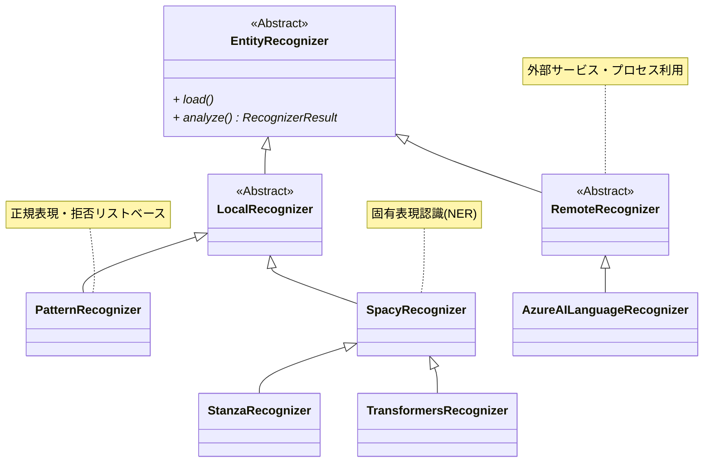

近年、個人情報の保護に対する意識がますます高まっていると感じます。
その背景には、大規模言語モデル(LLM)の導入と普及があります。LLMはさまざまな場面で活用されていますが、取り扱うデータの中に個人情報が含まれる可能性があるため、適切な管理が求められています。

そんな状況の中で、今回Microsoftが提供するオープンソースツール Presidio に注目しました。

@[og](https://github.com/microsoft/presidio/)

Presidioは、個人を特定できる情報(PII: Personally Identifiable Information)を検出し、匿名化するために設計されたフレームワークです。
これにより、企業や開発者はLLMや他のシステムで安全にデータを活用することが可能になります。

Presidioの特徴としては、非構造化データの中から個人情報を高精度で検出できる点が挙げられます。
その後、検出された情報に対してマスキングや置換処理を行うことで、データの機密性を確保しつつ、実用的な形でのデータ活用を実現します。

また、Presidioはモジュール化された設計が特徴で、カスタムエンティティの追加や処理ロジックの変更が容易です。
これにより、国や組織ごとに異なる要件にも対応できる柔軟性を備えています。

:::info
Presidioには、画像データや構造化データ内の個人情報を対象としたパッケージも含まれています(執筆時点ではベータ版またはアルファ版として提供)。
本記事ではこれらの機能には触れませんので、興味がある方は以下公式ドキュメントをご覧ください。

- [Presidio Doc - Presidio Image Redactor](https://microsoft.github.io/presidio/image-redactor/)
- [Presidio Doc - Presidio structured](https://microsoft.github.io/presidio/structured/)
:::

## Presidioをセットアップする

Presidioのセットアップは非常にシンプルです。
ここでは、個人情報を検出するPresidio Analyzerと、それを匿名化するPresidio Anonymizerを使用するための基本的なインストール手順を説明します。

まずは必要なPresidioのパッケージをインストールします。

```shell
pip install presidio-analyzer presidio-anonymizer
```

Presidioでは、自然言語解析フレームワーク(以下NLPエンジン)を使用して主に2つのタスクを実行します。
1つは、固有表現認識(NER: Named Entity Recognition)に基づいた個人情報(PII)の識別、もう1つは、コンテキストを活用した高度な検出を可能にするルールベースの特徴抽出です。

今回はNLPエンジンとして[spaCy](https://spacy.io/)の日本語モデル([ja_core_news_trf](https://spacy.io/models/ja#ja_core_news_trf))を使います。
これをspaCyのdownloadコマンドで個別にダウンロードします。


```shell
python -m spacy download ja_core_news_trf
# ダウンロードしたモデルを確認(Pipelines)
python -m spacy info
# ============================== Info about spaCy ==============================
# 
# spaCy version    3.8.3                         
# Location         /path/to/presidio-trial/.venv/lib/python3.12/site-packages/spacy
# Platform         macOS-15.1.1-arm64-arm-64bit  
# Python version   3.12.4                        
# Pipelines        en_core_web_lg (3.8.0), ja_core_news_trf (3.8.0)
```

他にも[stanza](https://stanfordnlp.github.io/stanza/)、[Huggingface Transformers](https://huggingface.co/docs/transformers/en/index)がNLPエンジンとして利用可能です。

- [Presidio Doc - Customizing the NLP engine in Presidio Analyzer](https://microsoft.github.io/presidio/analyzer/customizing_nlp_models/)

## 基本的な使い方

ここでは、Presidioを使ってサンプルテキストから個人情報を検出し、匿名化する手順を説明します。
以下の例では、人名(PERSON)と電話番号(PHONE_NUMBER)を含む日本語テキストを使用します。

### 個人情報の検出(Presidio Analyzer)

Presidio Analyzerを使用して、テキスト中の個人情報を検出します。

```python
from presidio_analyzer import AnalyzerEngine
from presidio_analyzer.nlp_engine import NlpEngineProvider

# NLPエンジンセットアップ。ダウンロードした日本語モデルを指定
configuration = {
    "nlp_engine_name": "spacy",
    "models": [
        {"lang_code": "ja", "model_name": "ja_core_news_trf"}
    ],
}
provider = NlpEngineProvider(nlp_configuration=configuration)
nlp_engine = provider.create_engine()

analyzer = AnalyzerEngine(nlp_engine=nlp_engine, supported_languages=["ja"])

sample_text = "豆蔵太郎の電話番号は080-1234-5678です。"

# 個人情報検出
results = analyzer.analyze(
    text=sample_text,
    entities=["PERSON", "PHONE_NUMBER"],
    language="ja"
)
for result in results:
    print(f"entity: {result.entity_type}, start: {result.start}, end: {result.end}")
```

このコードの実行結果は以下です。

```
(出力結果)
entity: PERSON, start: 0, end: 4, score: 0.85
entity: PHONE_NUMBER, start: 10, end: 23, score: 0.4
```

- entity: 検出されたエンティティのタイプ (PERSON, PHONE_NUMBER)。
- start/end: テキスト内の検出位置。
- score: 検出の信頼度スコア(0〜1の範囲)。

人名、電話番号といった個人情報が正しく検出されていることが分かります。

:::info
個人情報検出時に閾値`score_threshold`を指定することで、そのスコア以下で検出されたものを除外できます。

```python
results = analyzer.analyze(
    text=sample_text,
    entities=["PERSON", "PHONE_NUMBER"],
    language="ja",
    score_threshold=0.5 # スコア閾値指定
)
```

この例で上記のようにを指定すると、スコア0.4の電話番号は検出結果から除外されます。
:::

### 個人情報の匿名化(Presidio Anonymizer)

次に、個人情報を匿名化してみます。以下先ほどの個人情報の検出に続けて記述します。

```python
from presidio_anonymizer import AnonymizerEngine

anonymizer = AnonymizerEngine()
# 個人情報の検出結果を渡してサンプルテキストを匿名化
anonymized_text = anonymizer.anonymize(text=sample_text,analyzer_results=results)

for item in anonymized_text.items:
    print(f"entity: {item.entity_type}, start: {item.start}, end: {item.end}, text: {item.text}, operator: {item.operator}")
print(f"匿名化結果: {anonymized_text.text}")
```

このコードの実行結果は以下です。

```
entity: PHONE_NUMBER, start: 14, end: 28, text: <PHONE_NUMBER>, operator: replace
entity: PERSON, start: 0, end: 8, text: <PERSON>, operator: replace
匿名化結果: <PERSON>の電話番号は<PHONE_NUMBER>です。
```

検出した個人情報が匿名化(ここではエンティティ名に置換)されていることが分かります。

## 個人情報識別(Recognizer)のカスタマイズ

Presidioはデフォルトの状態でも一定の精度で個人情報を検出できます。しかし、実運用では日本特有の情報や組織独自のフォーマットを正確に検出する必要があり、カスタマイズがほぼ必須になります。


Presidioはデフォルトの状態でも一定の精度で個人情報を検出できることが分かります。
ただ、実運用では日本特有の情報や組織独自のフォーマットを正確に検出する必要があり、カスタマイズがほぼ必須になると思います。

Presidioでの個人情報識別ルールのカスタマイズにおいて中心的な役割を果たすのがRecognizerです。

各Recognizerは、異なる手法を用いて1つまたは複数のエンティティ(人名、電話番号、住所等)を検出します。
その実現には以下の手法が活用されます。

- 正規表現/拒否リスト: 固定のパターンに基づく効率的な検出。
- 固有表現認識(NER): 文脈を考慮した機械学習モデルを使用し、高度な検出を実現。NLPエンジン(spaCyやstanza等)を利用。
- カスタムロジック: 特定業務やプロジェクト要件に基づいた独自のルールを適用。

これらを柔軟に組み合わせることで、精度の高い検出を実現します。

以下はPresidioの主要なRecognizerを示すクラス図です。



EntityRecognizerを頂点とする階層構造になっています。
Recognizerをカスタマイズする場合にチェックするクラスは以下です。

- [EntityRecognizer](https://github.com/microsoft/presidio/blob/main/presidio-analyzer/presidio_analyzer/entity_recognizer.py)
  - Recognizer全体の基底クラス。loadメソッドとanalyzeメソッドが拡張ポイント。
- [LocalRecognizer](https://github.com/microsoft/presidio/blob/main/presidio-analyzer/presidio_analyzer/local_recognizer.py)
  - ローカルプロセスで使用されるRecognizer。
- [PatternRecognizer](https://github.com/microsoft/presidio/blob/main/presidio-analyzer/presidio_analyzer/pattern_recognizer.py)
  - 正規表現・拒否リストベースのRecognizer。バリデーションや文脈に基づくスコア加算(Context Enhancement)もサポート
- [RemoteRecognizer](https://github.com/microsoft/presidio/blob/main/presidio-analyzer/presidio_analyzer/remote_recognizer.py)
  - 外部サービスを含むリモートプロセスで使用されるRecognizer。

要件にもよりますが、一般的にはLocalRecognizerまたはPatternRecognizerをカスタマイズすることが多くなるかと思います。

また、Presidioには多くの組み込みRecognizerが用意されています。

- [GitHub microsoft/presidio - /presidio-analyzer/presidio_analyzer/predefined_recognizers](https://github.com/microsoft/presidio/tree/main/presidio-analyzer/presidio_analyzer/predefined_recognizers)

まずはこの中のRecognizerをカスタマイズできるか確認し、できない場合に自作するのが良いかと思います。自作する場合は組み込みRecognizerのソースコードが大いに参考になるはずです。

### 組み込みRecognizerのカスタマイズ

今回は、Presidioに組み込まれているRecognizerの設定を少し変えてみました。

#### 電話番号の日本対応

さきほどの例では、080-1234-5678という携帯電話番号が検出されましたが、これは日本独自の番号体系を意識していたわけではありませんでした。
実際には、デフォルトで設定されている他の地域(インド(IN)のフォーマット)と一致していただけです。

これを確認するために、電話番号を080-1234-5678から固定電話の03-1234-5678に変更して試してみます。以下は実行結果です。

```
entity: PERSON, start: 0, end: 4, score: 0.85
```

この結果では、人名(PERSON)は検出されていますが、電話番号(PHONE_NUMBER)は検出されていません。

これを日本の電話番号フォーマットでも検出するように変えてみます。
以下のように、組み込みの[PhoneRecognizer](https://github.com/microsoft/presidio/blob/main/presidio-analyzer/presidio_analyzer/predefined_recognizers/phone_recognizer.py)を日本対応に設定して追加します。

```diff-python
# (前略)

+ from presidio_analyzer.predefined_recognizers import PhoneRecognizer

provider = NlpEngineProvider(nlp_configuration=configuration)

nlp_engine = provider.create_engine()
+ phone_recognizer = PhoneRecognizer(
+     supported_regions=["JP"],
+     supported_language="ja",
+     context=["電話"]
+ )
+ analyzer = AnalyzerEngine(nlp_engine=nlp_engine, supported_languages=["ja"])
+ analyzer.registry.add_recognizer(phone_recognizer)

+ # サンプルテキスト -> 固定電話を識別
+ sample_text = "豆蔵太郎の電話番号は03-1234-5678です。"

# 個人情報検出
results = analyzer.analyze(
    text=sample_text,
    entities=["PERSON", "PHONE_NUMBER"],
    language="ja"
)
for result in results:
    print(f"entity: {result.entity_type}, start: {result.start}, end: {result.end}, score: {result.score}")
```

PhoneRecognizerのコンストラクタで地域(`supported_regions`)に`JP`を指定して日本固有の電話番号に対応させています[^1]。

[^1]: PhoneRecognizerは内部で[phonenumbers](https://pypi.org/project/phonenumbers/)を使って各地域に対応した電話番号フォーマットを識別しています。

また、ここで`context`に`電話`を指定しています。
これはPresidioのContext Enhancement機能を利用して、文脈に基づいてスコアを調整する仕組みです。エンティティの前後[^2]に電話という単語が含まれている場合、電話番号である可能性が高いと判断し、スコアを加算[^3]します。
加算スコアや文脈の範囲は自由に調整可能です。詳しくは公式ドキュメントをご覧ください。

[^2]: デフォルト設定だと前5トークンにコンテキストの単語が含まれているかを確認します。利用しているEnhancerのソースコードは[こちら](https://github.com/microsoft/presidio/blob/main/presidio-analyzer/presidio_analyzer/context_aware_enhancers/lemma_context_aware_enhancer.py)です。
[^3]: デフォルトでは、コンテキストが一致した場合に0.35が加算されます。また、さらに加算後のスコアが0.4を下回らないよう補正されます。

- [Presidio Doc - Leveraging context words](https://microsoft.github.io/presidio/tutorial/06_context/)

これを実行すると以下の結果が得られます。

```
entity: PERSON, start: 0, end: 4, score: 0.85
entity: PHONE_NUMBER, start: 10, end: 22, score: 0.75
```

今度は電話番号として検出されていることが分かります。またスコアも0.75と先ほどの0.4から増えています。
これはContext Enhancementによる文脈一致(ここでは`電話`)に応じたスコア加算が効いているためです。

#### クレジットカード番号の識別

いろいろ試している中で、日本語を指定した場合にクレジットカード番号が個人情報として識別されないことに気づきました。これは大問題です。

ただ、Presidioにはクレジットカード番号は組み込みRecognizer([CreditCardRecognizer](https://github.com/microsoft/presidio/blob/main/presidio-analyzer/presidio_analyzer/predefined_recognizers/credit_card_recognizer.py))が用意されています。
このRecognizerは正規表現のパターンマッチングに加えて、チェックサムのバリデーションもします。
とはいえ、ソースコードをよく読んでみると、このRecognizerは英語、スペイン語等の一部の言語のみ対応していて日本語にはサポートされていません[^4]。

[^4]: 単語の区切り(\b)が必要だったり、全角数字やハイフンにも対応していません。この辺りの問題があるのでデフォルトでは設定されていないのかもしれません。

CreditCardRecognizerを日本向けにカスタマイズして追加します。
以下のように記述しましました。
なお、ここで使っている正規表現はほぼテストしていません。**そのままコピペして使わないでください**(責任は負いません)。

```diff-python
# (前略)

+ from presidio_analyzer.predefined_recognizers import CreditCardRecognizer

provider = NlpEngineProvider(nlp_configuration=configuration)

nlp_engine = provider.create_engine()

+ pattern = Pattern(
+     name="credit_card_ja",
+     score=0.3,
+     regex=r"(?:[４4][0-9０-９]{3}|[５5][1-５0-５][0-9０-９]{2}|[３3][0-9０-９]{3}|[６6][0-9０-９]{3}|[１1][0-9０-９]{3})[ー－\- 　]?(?:[0-9０-９]{4}[ー－\- 　]?){2}[0-9０-９]{4}"
+ )
+ credit_card_recognizer = CreditCardRecognizer(
+     patterns=[pattern],
+     supported_language="ja",
+     replacement_pairs=[("-", ""), (" ", ""),("　", ""),("ー", ""), ("－", "")]
+ )
+ analyzer.registry.add_recognizer(credit_card_recognizer)

+ # クレジットカード番号(全角)を追加
+ sample_text = "豆蔵太郎の電話番号は03-1234-5678です。クレジットカード番号は４５００ー１２３４ー５６７８ー９０１２です。"

# 個人情報検出
results = analyzer.analyze(
    text=sample_text,
+   entities=["PERSON", "PHONE_NUMBER", "CREDIT_CARD"],
    language="ja"
)
for result in results:
    print(f"entity: {result.entity_type}, start: {result.start}, end: {result.end}, score: {result.score}")
```

手順には電話番号(PhoneRecognizer)と同じです。CreditCardRecognizerのインスタンスを生成してレジストリに追加します。
CreditCardRecognizer生成時には、全角フォーマットを考慮した正規表現(`pattern`)や置換条件(`replacement_pairs`)をカスタマイズします。

以下は実行結果です。

```
entity: CREDIT_CARD, start: 36, end: 55, score: 1.0
entity: PERSON, start: 0, end: 4, score: 0.85
entity: PHONE_NUMBER, start: 10, end: 22, score: 0.75
```

全角フォーマットのクレジットカード番号が正しく検出されています。
CreditCardRecognizerは正規表現一致後にチェックサム検証を通過するとスコアが1.0に補正されます。

:::info
ここではコードベースで設定していますが、YAMLファイルでの指定も可能です。
これついては以下公式ドキュメントに説明があります。

- [Presidio Doc - Customizing recognizer registry from file](https://microsoft.github.io/presidio/analyzer/recognizer_registry_provider/)

また、デフォルトの設定は以下より確認できます。

- [GitHub microsoft/presidio - /presidio-analyzer/presidio_analyzer/conf/default_recognizers.yaml](https://github.com/microsoft/presidio/blob/main/presidio-analyzer/presidio_analyzer/conf/default_recognizers.yaml)

見ていただくと分かりますが、現時点(`2.2.356`)では日本を意識した設定はありません。
ここで実施しているようにソースコードベースで変更するよりも、あらかじめ専用の設定ファイルを用意した方が良いかもしれませんね。
:::

### 自作Recognizerの作成

次に、Recognizerを自作してみます。
例として、組織固有の社員番号を識別するRecognizerを作成します。社員番号のフォーマットは以下と仮定します。

- `MZ-`(固定値) + 数字4桁(入社年-西暦) + `-`(固定値) + 数字6桁(連番)
  - 例）MZ-2000-000001
- 入社年は19xxまたは20xxのみ有効
- 全角文字も識別可能

このRecognizerを自作してみます。ここでは正規表現で社員番号を識別するPatternRecognizerを作成します。

```python
from presidio_analyzer import AnalyzerEngine, Pattern, PatternRecognizer
from presidio_analyzer.nlp_engine import NlpEngineProvider

configuration = {
    "nlp_engine_name": "spacy",
    "models": [
        {"lang_code": "ja", "model_name": "ja_core_news_trf"}
    ],
}
provider = NlpEngineProvider(nlp_configuration=configuration)

nlp_engine = provider.create_engine()

# 社員番号の正規表現
pattern = Pattern(
    name="mz_emp_number",
    regex=r"[MＭ][ZＺ][\-－ー](?:[１1][９9][0-9０-９]{2}|[２2][０0][0-9０-９]{2})[\-－ー][0-9０-９]{6}",
    score=0.5
)
emp_number_recognizer = PatternRecognizer(
    supported_entity="MZ_EMP_NUMBER",
    name="mz_emp_number",
    supported_language="ja",
    patterns=[pattern],
    context=["社員"]
)
analyzer.registry.add_recognizer(emp_number_recognizer)

# サンプルテキスト
sample_texts = [
    "MZ-2001-000001",
    "ＭＺー２００１ー０００００１", # 全角
    "社員番号: MZ-1990-000001", # 文脈補強
    "MZ-3001-000001", # 不正
    "MZ-2001-000000", # 連番がオールゼロ
    "MZ-2001-999999", # 連番がオール9
    "MZ-2099-000001", # 不正な西暦(未来)
    "MZ-1900-000001"  # 不正な西暦(遠い過去)
]
# 検出
for sample_text in sample_texts:
    results = analyzer.analyze(
        text=sample_text,
        entities=["MZ_EMP_NUMBER"],
        language="ja"
    )
    print(f"text: {sample_text}, score:{results[0].score if len(results) > 0 else 'None'}")
```

まず、社員番号の正規表現と一致スコアを設定したPatternを作成し、それをもとにPatternRecognizerのインスタンスを生成します。
新規エンティティのため、コンストラクタで`supported_entity`にエンティティ名(MZ_EMP_NUMBER)を指定しました。
また、電話番号の例と同様に、文脈によるスコア補強のためコンテキスト(`社員`)も設定しています。
最後に、このRecognizerをレジストリに追加すれば完了です。

これを実行すると以下のようになります(コメント追記してます)。

```
text: MZ-2001-000001, score:0.5 # OK
text: ＭＺー２００１ー０００００１, score:0.5 # OK
text: 社員番号: MZ-1990-000001, score:0.85 # OK(文脈補強)
text: MZ-3001-000001, score:None # OK(19xx/20xxのみ有効)
text: MZ-2001-000000, score:0.5 # OK??連番がオールゼロ
text: MZ-2001-999999, score:0.5 # OK??連番がオール9
text: MZ-2099-000001, score:0.5 # OK??(未来)
text: MZ-1900-000001, score:0.5 # OK??(遠い過去)
```

概ね期待通りの結果です。
全角対応やコンテキスト(`社員`)によるスコア加算(0.85)、西暦上2桁のチェックも期待通りです。

ただし、正規表現としてはマッチしていますが、実際にはあり得ないパターンもあります。
ここで、正規表現のマッチに加えて以下のルールを新たに追加します。

- 連番がオールゼロまたはオール9は無効
- 西暦部分が未来年の場合は無効
- 西暦部分が過去50年以内の場合は社員番号の可能性が高い

これを実現するために、もう一歩踏み込んで自作Recognizerを設定してみます。
今度はPatternRecognizerを継承して、バリデーションロジックを追加実装します。

```python
class MyEmpNumberRecognizer(PatternRecognizer):
    REGEX = r"[MＭ][ZＺ][\-－ー](?<year>[１1][９9][0-9０-９]{2}|[２2][０0][0-9０-９]{2})[\-－ー](?<seq>[0-9０-９]{6})"
    PATTERNS = [
        Pattern(
            name="mz_emp_number",
            regex=REGEX,
            score=0.3 # 正規表現一致だけだと低スコア
        )
    ]
    CONTEXT = ["社員"]

    def __init__(self):
        super().__init__(
            supported_entity='MZ_EMP_NUMBER',
            patterns=self.PATTERNS,
            context=self.CONTEXT,
            supported_language="ja",
        )

    def validate_result(self, pattern_text: str) -> Optional[bool]:
        match = self.PATTERNS[0].compiled_regex.search(pattern_text)

        seq = int(match.group("seq"))
        if seq == 0 or seq == 999999:
            return False

        year = int(match.group("year"))
        current_year = datetime.now().year
        if year > current_year:
            return False # 未来日:スコア0.0
        if current_year - 50 <= year <= current_year:
            return True # 適切な範囲内:スコア1.0
        else:
            return None # スコア変更なし(遠い過去)

emp_number_recognizer = MyEmpNumberRecognizer()
analyzer.registry.add_recognizer(emp_number_recognizer)
```

基本的には先ほどと同じですが、ここではPatternRecognizerを継承した新規クラスとして定義しました。機能的な違いは以下です。

- スコア0.5 -> 0.3として、正規表現一致のみはスコアを低めにする
- validation_resultメソッドをオーバーライドして追加ルールを実装する。
  - PatternRecognizerではTrueを返すと1.0、Falseを返すと0.0(その結果個人情報として検出しない)でスコアを上書きする。

こうすることで正規表現に加えて、個別のバリデーションによって検出精度を調整します。
先ほどと同じテキストで実行すると、今度は以下の結果になりました。

```
text: MZ-2001-000001, score:1.0 # 過去50年以内: 0.3 -> 1.0
text: ＭＺー２００１ー０００００１, score:1.0 # 同上
text: 社員番号: MZ-1990-000001, score:1.0 # 1.0は最大値なのでコンテキスト加算は無視
text: MZ-3001-000001, score:None # OK(19xx/20xxのみ有効)
text: MZ-2001-000000, score:None # OK(連番がオールゼロ) 
text: MZ-2001-999999, score:None # OK(連番がオール9)
text: MZ-2099-000001, score:None # OK(未来日のため非検出)
text: MZ-1900-000001, score:0.3  # OK(入社年が遠い過去なので低スコア)
```

追加したルールが適用されて、より実態に近い検出精度になりました。

## 匿名化(Anonymizer)のカスタマイズ

これまで個人情報の検出(Analyzer)に焦点を当ててきましたが、最後に匿名化(Anonymizer)についても簡単に見ていきます。
Presidioのデフォルト設定では、以下のように検出した個人情報をエンティティ名(PERSONやPHONE_NUMBERなど)で置換します。

```
豆蔵太郎の電話番号は03-1234-5678です。クレジットカード番号は４５００ー１２３４ー５６７８ー９０１２です。"
↓
<PERSON>の電話番号は<PHONE_NUMBER>です。クレジットカード番号は<CREDIT_CARD>です。
```

匿名化のカスタマイズは基本的にAnonymizerの引数operatorsを指定するだけで実現可能です。
組み込みのオペレータやそのパラメータの詳細については、以下の公式ドキュメントを参照してください。

- [Presidio Doc - Presidio Anonymizer](https://microsoft.github.io/presidio/anonymizer/)


本記事では試していませんが、オペレータは自作も可能です。こちらは以下の公式ドキュメントを参照してください。

- [Presidio Doc - Developing PII anonymization operators](https://microsoft.github.io/presidio/anonymizer/adding_operators/)

ここでは、実際によく使われそうな匿名化パターンをいくつか試してみます。

### 固定値に置換

まず、検出した個人情報をエンティティ名ではなく固定値にしてみます。

```python
from presidio_anonymizer.entities import OperatorConfig

anonymized_text = anonymizer.anonymize(
    text=sample_text,
    analyzer_results=results,
    operators={
        "DEFAULT": OperatorConfig(operator_name="replace", params={"new_value": "<SECRET>"})
    })
print(anonymized_text.text)
```

`operators`引数のキーはエンティティ名または`DEFAULT`(指定がない場合のデフォルト)です。
ここではデフォルトルールとして`<SECRET>`への置換(`replace`オペレータ)としました。
結果は以下です。

```
<SECRET>の電話番号は<SECRET>です。クレジットカード番号は<SECRET>です。
```

全ての個人情報が<SECRET>に置換されています。

### マスキング

次に、電話番号とクレジットカード番号をマスキングします。

```python
from presidio_anonymizer.entities import OperatorConfig

anonymized_text = anonymizer.anonymize(
    text=sample_text,
    analyzer_results=results,
    operators={
        "PHONE_NUMBER": OperatorConfig(operator_name="mask", params={"masking_char": "*", "chars_to_mask": 8, "from_end": False}),
        "CREDIT_CARD": OperatorConfig(operator_name="mask", params={"masking_char": "*", "chars_to_mask": 14, "from_end": True})
    })
print(anonymized_text.text)
```

今回はデフォルトルール(`DEFAULT`)でなく、エンティティごとに設定しています。
`operator_name`を`mask`としてパラメータを指定します。

- masking_char: マスクに使用する文字(`*`)。
- chars_to_mask: マスクする文字数。
- from_end: マスクを末尾から適用するか否か。

結果は以下の通りです。

```
<PERSON>の電話番号は********5678です。クレジットカード番号は４５００ー**************です。
```

電話番号とクレジットカード番号がそれぞれ部分的にマスクされています。
一方で、人名はルールを指定しませんでしたので、デフォルトのエンティティ名置換が適用されています。

### カスタム関数

任意の関数を指定して匿名化処理を実行します。

```python
def replacer(entity: str):
  katakana = "アイウエオカキクケコサシスセソタチツテトナニヌネノハヒフヘホマミムメモヤユヨラリルレロワヲン"
  return ''.join(random.choices(katakana, k=len(entity)))

anonymized_text = anonymizer.anonymize(
  text=sample_text,
  analyzer_results=results,
  operators={
    "PERSON": OperatorConfig(operator_name="custom", params={"lambda": replacer}),
  })
print(anonymized_text.text)
```

`custom`オペレータに匿名化用関数(`replacer`)を指定しています。
ここで指定した関数は元のエンティティ文字数分のランダムなカタカナを返するものです。

匿名化の結果は以下です。

```
タルフワの電話番号は<PHONE_NUMBER>です。クレジットカード番号は<CREDIT_CARD>です。
```

`豆蔵太郎`が`タルフワ`とランダムなカタカナ文字列に置換されています。

## まとめ

本記事では、Microsoft Presidioの基本的な使い方から、AnalyzerやAnonymizerのカスタマイズまでを簡単にご紹介しました。
Presidioはフレームワークとして拡張性を重視して設計されており、ここで紹介したもの以外にも多くの拡張ポイントが用意されています。

Presidioは、さまざまなユースケースで役立つ可能性を秘めています。
少し考えるだけでも、以下のようなものが思い付きます。

- LLMのファインチューニングに使用する学習データからの個人情報の匿名化
- RAG (Retrieval-Augmented Generation) における個人情報の除去
- LLMプロンプトに個人情報が含まれていないかのチェック
- 商用データをテストデータとして活用する際の匿名化
- データ分析時の個人情報のマスキング
- ログファイルやその他の記録に個人情報が含まれていないかのチェック

Presidioはこれらのユースケースに柔軟に対応できるうえ、オープンソースソフトウェア(OSS)として提供されています。

プライバシー保護がますます重要視されるこの時代において、Presidioは強力なツールとなるでしょう。
導入を検討する価値ある選択肢として、ぜひ試してみてください！
