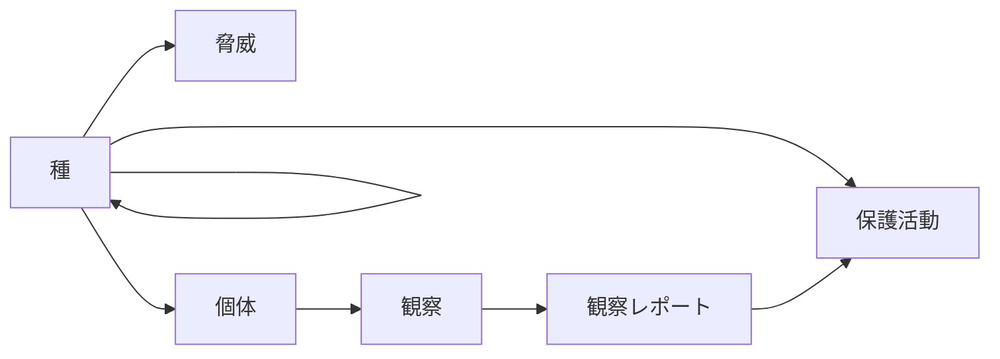

## 初めに
ビジネスソリューション事業部の山下です。今回はPostgreSQL実装されているCYCLE句を紹介しようと思います。
CYCLE句は再帰クエリを安全に実行するための機能です。
具体的には循環参照による無限ループを検出し防止できます。

## 再帰クエリ
本記事では細かい説明は省きますが、再帰クエリについて軽く触れておきます。
再帰クエリとは、クエリの中で**クエリ結果自身**を参照できる特殊なSQLクエリです。
WITH RECURSIVE句を使用して実装され、以下のような構造を持ちます。

- 非再帰項：最初の結果セットを生成する基本クエリ
- 再帰項：前回の結果を使用して次の結果を生成するクエリ
- UNION ALL：両者の結果を結合

具体的な構文は次のとおりです。
```sql
WITH RECURSIVE recursive_table AS (
    -- 非再帰項
    SELECT columns FROM table WHERE condition
    UNION ALL
    -- 再帰項
    SELECT columns FROM table 
    JOIN recursive_table ON condition
)
SELECT * FROM recursive_table;
```

一般に再帰クエリは木構造やネットワーク構造を表現するデータモデルに対して有効とされています。
ただ、循環とは切っても切り離せないのが再帰表現の宿命です。
再帰表現の深さに制限を設けるなど色々な対処法がありますが、PostgreSQLではCYCLE句という回避手段が実装されています。
CYCLE句を使用することで循環参照が起こる可能性を意識せずとも、安全なクエリを実行できます。

## CYCLE句を用いた循環検出
CYCLE句は、PostgreSQLのver14から導入された機能であり、再帰クエリと併用されます。
再帰クエリの末尾に次のような文言を追加するだけで循環検知と防止が達成できます[^1]。

```sql
CYCLE dst SET is_cycle USING path
```

[^1]: バージョン次第では、CYCLE句を使わないで循環に対処できます。詳しくは[リンク](https://www.postgresql.jp/document/16/html/queries-with.html#QUERIES-WITH-CYCLE)をご覧ください。

次のサンプルを実行してみましょう。
このクエリは一時テーブルで定義されたsrcとdstを繋ぎ合わせてパスを検出するクエリです。
パスを繋ぎ合わせると循環が発生するようになっています。

```sql
DROP TABLE IF EXISTS tmp_connectivity;

CREATE TEMPORARY TABLE tmp_connectivity AS
SELECT * FROM (
  VALUES 
      ('a', 'b')
    , ('b', 'c')
    , ('c', 'd')
    , ('b', 'e')
    , ('e', 'f')
    , ('f', 'g')
    , ('f', 'a') -- これによりパスがループする
    , ('h', 'i')
) AS _(src, dst);

WITH RECURSIVE full_connetivity AS (
  -- 非再帰項
  SELECT 
    *
  FROM tmp_connectivity
  WHERE src = 'a'
  UNION ALL
  -- 再帰項
  SELECT 
    fc.src
    , c.dst
  FROM full_connetivity AS fc
  JOIN tmp_connectivity AS c ON (fc.dst = c.src)
) CYCLE dst SET is_cycle USING path -- dstの履歴をpathに保存して、無限ループを検出する

SELECT * FROM full_connetivity;
```

CYCLE句のみをピックアップします。
```sql
CYCLE dst SET is_cycle USING path
```

この部分のみを分解して説明すると次のようになります。
- dstカラムの値を監視する
- 同じ値が再度出現することを検知する
- is_cycleカラムにtrueがセットされる
- pathカラムには通過したパスの履歴が常時記録される

先ほどのクエリを実行すると以下のような結果が得られるはずです。

```sql
 src | dst | is_cycle |         path          
-----+-----+----------+-----------------------
 a   | b   | f        | {(b)}
 a   | c   | f        | {(b),(c)}
 a   | e   | f        | {(b),(e)}
 a   | d   | f        | {(b),(c),(d)}
 a   | f   | f        | {(b),(e),(f)}
 a   | g   | f        | {(b),(e),(f),(g)}
 a   | a   | f        | {(b),(e),(f),(a)}
 a   | b   | t        | {(b),(e),(f),(a),(b)}
```

「a → b → e → f → a → b」 という経路があり、経路内でループが検出されていることが結果から読み取れます。

## サンプルモデルの解説
サンプルとして、野生生物を取り巻く生態系っぽいデータモデルを設計しました[^2]。
[^2]: データモデルの設計は生成AIに任せてしまっています。

サンプルは以下のリポジトリをご確認ください。
[https://github.com/shohei-yamashit/Go_concurrent_with_git](https://github.com/shohei-yamashit/Go_concurrent_with_git)

:::info
このサンプルにおいてはリポジトリ直下のcompose.ymlからDBコンテナを立ち上げることができます。
定義済みのデータが入ったPostgreSQLコンテナを立ち上げられるようになっていますので、追加のSQLを実行する必要はありません。
:::

今回登場するテーブルは次のとおりです。
```
- ConservationStatus（保全状況）
    テーブル内の生物種の保全状態を管理します。保全状態の説明を含みます。
- Species（種）
    生物種の基本情報を管理します。種の名前や保全状況、他の種との関連（自己参照）を持ちます。
- WeatherPattern（気象パターン）
    気象パターンの情報を管理します。パターンの説明を含みます。
- Ecosystem（生態系）
    生態系の基本情報を管理します。生態系の名前を含みます。
- Habitat（生息地）
    生物の生息地情報を管理します。生息地名と所属する生態系との関連を持ちます。
- Region（地域）
    地理的な地域情報を管理します。地域名と気象パターンとの関連を持ちます。
- Animal（動物）
    個々の動物の情報を管理します。種、地域、生息地との関連を持ちます。
- Event（イベント）
    観察や保全に関するイベント情報を管理します。イベントの説明を含みます。
- Threat（脅威）
    種に対する脅威情報を管理します。脅威の説明と影響を受ける種との関連を持ちます。
- PlantSpecies（植物種）
    植物種の情報を管理します。植物種の名前と生息地との関連を持ちます。
- AnimalSighting（動物目撃）
    動物の目撃情報を記録します。動物ID、タイムスタンプ、関連イベントとの関連を持ちます。
- Researcher（研究者）  
    研究者の基本情報を管理します。研究者名を含みます。
- ObservationReport（観察報告）
    動物目撃に関する詳細な報告を管理します。目撃情報との関連を持ちます。
- ConservationAction（保全活動）
    種の保全活動に関する情報を管理します。活動の説明、対象種、担当研究者との関連を持ちます。
```

これだけだと全貌が掴めないのでER図も示します。
主キー制約があればこのER図をそのまま利用できそうですが、今回は制約に頼らないものとします。


## サンプルへのCYCLE句の適用
それでは以下の要件を満たすクエリを導出します。
```sql
前述のテーブル群から、〇〇idというカラム名を辿って種(species)に関連するテーブルを導出する
```

まずはCYCLE句を用いずに関連を取得するため、information.columnを対象にした再帰クエリを用意します。

```sql
WITH RECURSIVE species_relative AS (
    SELECT 
        * 
    FROM 
        has_species_id
    UNION ALL
        SELECT
            cl_info.table_name AS name
            , CONCAT(cl_info.table_name,'id') AS id_with_table
            , cl_info.column_name
            , cl_info.data_type
            FROM species_relative AS ir, information_schema.columns AS cl_info
        WHERE 
            cl_info.column_name = ir.id_with_table
            AND
            table_schema = 'public'            
)
,  has_species_id AS (
    SELECT 
        table_name
        , CONCAT(table_name,'id') AS id_with_table
        , column_name
        , data_type
    FROM information_schema.columns AS cl_info
    WHERE 
        table_schema = 'public'
        AND
        column_name = 'speciesid'
)
SELECT * FROM species_relative
```

:::info
他のDBMSと同様、DBのシステム情報をで管理するテーブルがPostgreSQLには備わっています。
具体的には情報スキーマと呼ばれるスキーマにメタデータが収容されています。
詳細：[https://www.postgresql.jp/document/16/html/information-schema.html](https://www.postgresql.jp/document/16/html/information-schema.html)
今回はカラム名を参考にテーブルの関連を調べたいので、information.columnテーブルに着目しています。
:::

無限ループが発生するため、実行が延々に終わらない等の事象が発生するはずです。
このままでは埒が開かないので、CYCLE句を追加してみましょう。
実行すべきクエリは次のようになります。

```sql
WITH RECURSIVE species_relative AS (
    SELECT 
        * 
    FROM 
        has_species_id
    UNION ALL
        SELECT
            cl_info.table_name AS name
            , CONCAT(cl_info.table_name,'id') AS id_with_table
            , cl_info.column_name
            , cl_info.data_type
            FROM species_relative AS ir, information_schema.columns AS cl_info
        WHERE 
            cl_info.column_name = ir.id_with_table
            AND
            table_schema = 'public'
            
) CYCLE table_name SET is_cycle USING path_cycle -- 追加

,  has_species_id AS (
    SELECT 
        table_name
        , CONCAT(table_name,'id') AS id_with_table
        , column_name
        , data_type
    FROM information_schema.columns AS cl_info
    WHERE 
        table_schema = 'public'
        AND
        column_name = 'speciesid'
)
SELECT table_name, column_name, is_cycle, path_cycle FROM species_relative;
```

このクエリを実行すると、次のような結果が出力されるはずです。

```sql
     table_name     |   column_name    | is_cycle |                        path_cycle                         
--------------------+------------------+----------+-----------------------------------------------------------
 species            | speciesid        | f        | {(species)}
 animal             | speciesid        | f        | {(animal)}
 threat             | speciesid        | f        | {(threat)}
 conservationaction | speciesid        | f        | {(conservationaction)}
 species            | speciesid        | t        | {(species),(species)}
 animal             | speciesid        | f        | {(species),(animal)}
 threat             | speciesid        | f        | {(species),(threat)}
 animalsighting     | animalid         | f        | {(animal),(animalsighting)}
 conservationaction | speciesid        | f        | {(species),(conservationaction)}
 animalsighting     | animalid         | f        | {(species),(animal),(animalsighting)}
 observationreport  | animalsightingid | f        | {(animal),(animalsighting),(observationreport)}
 observationreport  | animalsightingid | f        | {(species),(animal),(animalsighting),(observationreport)}
```
speciesが自分自身を参照しており、CYCLE句がなければ安全に再帰クエリが実行できませんでした。

## （おまけ）Mermaidによる可視化
記事の本題はすでに終わっているのですが、最後に今回の目的である関連するテーブルの洗い出しは済ませようと思います。
先ほどの結果におけるtable_nameとcolumn_nameに着目します。
重複がある上、"id"という表現が付加されているので結果を整えてみます。

```sql
SELECT DISTINCT
    table_name,
    REPLACE(column_name,'id','') AS relative_table_name 
FROM species_relative ORDER BY table_name;
```

あとはMermaid形式で出力してあげれば、テーブルの関連を明記できそうです。
細かいコードの説明は省きますが、サンプルのツールを実行すると、次のような図が出力できます。

```text
graph LR
        species[種]
        conservationaction[保護活動]
        threat[脅威]
        animal[個体]
        animalsighting[観察]
        observationreport[観察レポート]
        species --> conservationaction
        species --> threat
        species --> animal
        species --> species
        animal --> animalsighting
        animalsighting --> observationreport
        observationreport --> conservationaction
```


このようにして、無限ループを避けつつ、再帰クエリを使って関連を導出できました。

## まとめ
本記事では、PostgreSQLにおけるCYCLE句を用いた再帰クエリの安全な実行方法について解説しました。
バージョンなどの制約はありますが、無限ループが発生しうる再帰クエリを実行する際には、ぜひ検討してみてください。
