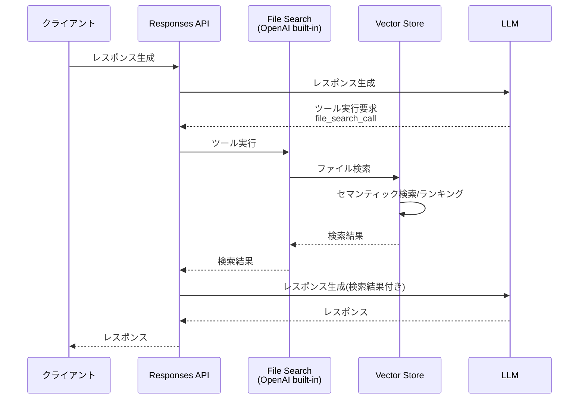

先日、OpenAIからAPIに関する以下のリリースがありました。

- [OpenAI News - New tools for building agents](https://openai.com/index/new-tools-for-building-agents/)

AIエージェント構築向けのプリミティブAPIであるResponses APIや各種ビルトインツール、Agent SDKなど、多くのデベロッパーにとって非常に魅力的な発表でした。

本記事では、まずこの中からFile Searchを検証します。
File Search自体は従来、Assistants APIでのみ利用可能なベータ版でしたが、多くのユーザーが使用しているChat Completion APIでは利用できないという制約がありました。
今回、新たにResponses APIの導入とともに、File Searchがビルトインツールとして利用可能になりました（ただし、Chat Completion APIのツールとしては依然として利用できません）。
機能面でも、メタデータフィルタリングの追加により、従来のFile Searchより強化されています。

File Searchツールを使ったフローは以下のようになります。



:::info
従来のFile Searchを利用可能だったAssistants APIは、Responses APIへの互換機能が導入され次第（2026年前半を目処に）、非推奨となることが発表されています。

- [OpenAI Docs - What this means for existing APIs - Assistants](https://platform.openai.com/docs/guides/responses-vs-chat-completions#assistants)

結局Assistants APIが正式版となることはありませんでした。
:::

## OpenAIのVector Storeを利用する

File Searchツールを検証する前に、そのデータソースとなるVector Store関連のAPIを確認します。
今回の発表で、Vector Store APIもベータ版から正式版になりました。

- [OpenAI Docs - Platform - Retrieval](https://platform.openai.com/docs/guides/retrieval)
- [OpenAI API Reference - Vector Stores](https://platform.openai.com/docs/api-reference/vector-stores)

### Vector Storeの作成

まず、Vector Storeを作成します。これについてはベータ版の時から変更はありません。

```python
from openai import OpenAI

client = OpenAI()

vector_store = client.vector_stores.create(
    name='Tech Blog Articles',
    expires_after={'anchor': 'last_active_at', 'days': 1}
)
```

パラメータはすべて任意です。上記の例では名前のみを指定しています。

Vector Storeに登録するファイルのチャンク化に関する設定を行う場合は、`chunking_strategy`を指定します[^1]。
以下は、固定のチャンクサイズとオーバーラップサイズを指定する例です。

[^1]: <https://platform.openai.com/docs/guides/retrieval#chunking>

```python
vector_store = client.vector_stores.create(
    name='Tech Blog Articles',
    chunking_strategy={
        'type': 'static',
        'static': {
            'max_chunk_size_tokens': 1600, # デフォルトは800
            'chunk_overlap_tokens': 800 # デフォルトは400
        }
    }
)
```

:::column:Vector Storeの課金に注意
Vector Storeは最初の1GBは無料ですが、それ以降はサイズに対して日単位で課金(現時点では$0.1/1GB)されます。
検証目的等で使う場合は、検証後に削除するか、作成時に有効期限を指定しておくことをお勧めします。

```python
vector_store = client.vector_stores.create(
    name='Tech Blog Articles',
    # 1日未使用だったら有効期限切れ
    expires_after={'anchor': 'last_active_at', 'days': 1}
)
```

Vector Storeは、API（`vector_store.delete`）のほか、OpenAI APIのダッシュボードからも削除できます。
:::

### ファイルアップロード(チャンク化・ベクトル化)

先ほど作成したVector Storeにファイルをアップロードします。
ファイルアップロードは、汎用のFileオブジェクトとVector StoreのAPIを組み合わせて行います。

- [OpenAI API Reference - Files](https://platform.openai.com/docs/api-reference/files)
- [OpenAI API Reference - Vector store files](https://platform.openai.com/docs/api-reference/vector-stores-files)

ここでは、本サイトの今年のブログ記事（マークダウンファイル）をアップロードします。

```python
article_dir = '/path/to/blogs'
file_names = [name for name in os.listdir(article_dir) if name.endswith('.md')]

for file_name in file_names:
    file_path = os.path.join(article_dir, file_name)
    with open(file_path, 'r', encoding='utf-8') as f:
        content = f.read()
        # マークダウンに含まれるメタデータを取得
        metadata = {line.split(': ')[0]: line.split(': ')[1] for line in content.split('\n') if ': ' in line}
        author = metadata.get('author', 'Unknown')
        title = metadata.get('title', 'Untitled')
        date = int(datetime.strptime(metadata['date'], '%Y-%m-%d').timestamp())
        attributes = {'title': title, 'author': author, 'date': date}
        # Fileオブジェクト作成
        file = client.files.create(
            file=(file_name, content, 'text/markdown'),
            purpose='assistants'
        )
        # VectorStoreにFileを登録(チャンク化)
        client.vector_stores.files.create(
            vector_store.id,
            file_id=file.id,
            attributes=attributes
        )
        # VectorStoreでの準備が終わるまで待機(任意)
        client.vector_stores.files.poll(file.id, vector_store_id=vector_store.id)
```

まず、Files APIを使用してOpenAIの汎用Fileオブジェクトを作成します（client.files.create）。
FileオブジェクトをFile Searchで使用する場合は、`purpose`に`assistant`を指定する必要があります

次に、作成したFileオブジェクトをVector Storeにアップロードします(client.vector_stores.file.create)。
ここでファイルのチャンク化やベクトル化が行われて、Vector Storeに登録されます。

また、この時に`attributes`パラメータに、メタデータフィルタリングで利用可能な任意の属性（キー・バリューのペア）を指定できます。
ここでは、マークダウンファイルのヘッダ（フロントマター）に含まれる一部の情報をメタデータとして登録しています。

なお、ファイルの作成（create）とポーリング（poll）の両方を行うcreate_and_pollメソッドも用意されていますが、現時点のSDK（openai-1.66.5）ではattributes（メタデータ）の登録ができませんでした。
そのため、上記のコードでは、それぞれのメソッドを順次実行しています（バックグラウンド実行で問題ない場合はpollは不要です）。

:::column:複数のファイルをまとめてアップロードする
OpenAIのSDKの中には、複数のファイルに対してFileとVector StoreのAPIをまとめて実行してくれるメソッドも用意されています。
必要に応じてこちらを使うとスッキリします。

```python
for file_name in file_names:
    file_path = os.path.join(article_dir, file_name)
    with open(file_path, 'r', encoding='utf-8') as f:
        content = f.read()
        files.append((
            file_name,
            content,
            'text/markdown'
        ))
# File作成とVector Store登録をまとめて実施
client.vector_stores.file_batches.upload_and_poll(
    vector_store.id, files=files)
```

ただし、現時点のSDKではファイル単位でのメタデータ(attributes)の登録ができないようです。
:::

### Vector Store内のファイル検索
正式バージョンとなったVector Searchは、単独でベクトル検索機能を提供します。
この機能は、従来のベータ版のVector Search APIには存在しませんでした。

まず、シンプルに検索を実行します。

```python
import json

# ファイル検索実行
response = client.vector_stores.search(
    vector_store.id,
    query='PostgreSQL', # 検索クエリ
    max_num_results=3   # 最大検索結果数
)
# ベクトル検索結果出力
for data in response.data:
    print((
        '-' * 30 + '\n'
        f'file_id:{data.file_id}, filename:{data.filename}\n'
        f'score:{data.score}\n'
        f'attributes:{json.dumps(data.attributes, indent=2, ensure_ascii=False)}\n'
        f'content:{''.join(content.text for content in data.content)[:100]}...(省略)'
    ))
```

この検索の実行結果は、以下のとおりです。

```
------------------------------
file_id:file-7EpzUrFMAKQfF1wRHTrTo1, filename:0117_cycle-postgres.md
score:0.8612917666665437
attributes:{
  "title": "PostgreSQLで安全な再帰クエリ！CYCLE句の使い方徹底解説",
  "author": "shohei-yamashita",
  "date": 1737039600.0
}
content:
---
title: PostgreSQLで安全な再帰クエリ！CYCLE句の使い方徹底解説
author: shohei-yamashita
date: 2025-01-17
tags: [Postg...(省略)
------------------------------
file_id:file-L1RAexWnvr419K7PC9qgMe, filename:0312_langmem-aurora-pgvector.md
score:0.807569386941522
attributes:{
  "title": "LangMemの長期記憶をPostgreSQL(pgvector)に永続化する",
  "author": "noboru-kudo",
  "date": 1741705200.0
}
content:
---
title: LangMemの長期記憶をPostgreSQL(pgvector)に永続化する
author: noboru-kudo
date: 2025-03-12
tags: [長期記憶,...(省略)
------------------------------
file_id:file-7EpzUrFMAKQfF1wRHTrTo1, filename:0117_cycle-postgres.md
score:0.7830848428325007
attributes:{
  "title": "PostgreSQLで安全な再帰クエリ！CYCLE句の使い方徹底解説",
  "author": "shohei-yamashita",
  "date": 1737039600.0
}
content:
具体的な構文は次のとおりです。
```sql
WITH RECURSIVE recursive_table AS (
    -- 非再帰項
    SELECT columns FROM table...(省略)
```

検索結果には、属性（attributes）や信頼度スコア（score）も含まれていることが確認できます。
同一ファイルが複数回検索結果に含まれているのは、検索がファイル単位ではなく、チャンク単位で行われるためです。

なお、検索結果に適用されるRankerは、`ranking_options`パラメータで調整できます。`
以下は、一定のスコアに満たないチャンクを検索結果から除外する例です。

```python
response = client.vector_stores.search(
    vector_store.id,
    query='PostgreSQL LangMem',
    max_num_results=3,
    # ランキングオプションの設定
    ranking_options={
        'ranker': 'auto', # 現時点で選択できるものはautoまたはdefault-2024-11-15のみ
        'score_threshold': 0.8 # 0.8未満は検索結果より除外
    },
)
```

これを指定することで、検索結果の精度を調整できます。
続いて、正式版で新たに追加されたメタデータ（属性）フィルタリングの機能を試します。

メタデータ検索は、`query`パラメータに指定します。

```python
from datetime import datetime, timedelta

one_month_ago = datetime.now() - timedelta(days=30)
unix_time = int(one_month_ago.timestamp())
response = client.vector_stores.search(
    vector_store.id,
    query='PostgreSQL',
    max_num_results=3,
    # メタデータフィルタリング条件
    filters={
        'type': 'and',
        'filters': [
            {
                'type': 'gte',
                'key': 'date',
                'value': unix_time

            },
            {
                'type': 'eq',
                'key': 'author',
                'value': 'noboru-kudo'
            }
        ]
    })
for data in response.data:
    print((
        '-' * 30 + '\n'
        f'file_id:{data.file_id}, filename:{data.filename}\n'
        f'score:{data.score}\n'
        f'attributes:{json.dumps(data.attributes, indent=2, ensure_ascii=False)}\n'
        f'content:{''.join(content.text for content in data.content)[:100]}...(省略)'
    ))
```

ここでは、直近30日以内に作成された特定の著者の記事のみに限定して検索を行っています。

指定可能な条件の詳細については、以下の公式ガイドおよびリファレンスを参照してください。

- [OpenAI Doc - Retrieval - Attribute filtering](https://platform.openai.com/docs/guides/retrieval#attribute-filtering)
- [OpenAI API Reference - Search Vector store](https://platform.openai.com/docs/api-reference/vector-stores/search)

ここでの検索結果は以下のようになりました。

```
------------------------------
file_id:file-L1RAexWnvr419K7PC9qgMe, filename:0312_langmem-aurora-pgvector.md
score:0.807569386941522
attributes:{
  "title": "LangMemの長期記憶をPostgreSQL(pgvector)に永続化する",
  "author": "noboru-kudo",
  "date": 1741705200.0
}
content:
---
title: LangMemの長期記憶をPostgreSQL(pgvector)に永続化する
author: noboru-kudo
date: 2025-03-12
tags: [長期記憶,...(省略)
------------------------------
file_id:file-L1RAexWnvr419K7PC9qgMe, filename:0312_langmem-aurora-pgvector.md
score:0.6644617795244542
attributes:{
  "title": "LangMemの長期記憶をPostgreSQL(pgvector)に永続化する",
  "author": "noboru-kudo",
  "date": 1741705200.0
}
content:
### 2. **量子コンピューティング**
- 現在の計算機では困難な問題を高速に解ける次世代技術。  
- 暗号解読、分子シミュレーション、金融最適化など、特定分野での大革命を期待される。  
-...(省略)
------------------------------
file_id:file-L1RAexWnvr419K7PC9qgMe, filename:0312_langmem-aurora-pgvector.md
score:0.6606991798904742
attributes:{
  "title": "LangMemの長期記憶をPostgreSQL(pgvector)に永続化する",
  "author": "noboru-kudo",
  "date": 1741705200.0
}
content:
```python
    # 3. LangGraph Functional APIのワークフロー
    @entrypoint(store=store)
    def ...(省略)
```

メタデータフィルタリングによって、特定の属性を持つファイルのみが検索対象となっているのが分かります。

:::column:Chat Completion APIでVector Storeを使う
従来のChat Completion APIは、ツールとしてFile Searchはサポートしていませんが、この検索機能と組み合わせることでOpenAIのVector Storeを使ったRAGシステムを構築できます。
公式ガイドにも、その実装例が掲載されていますので興味のある方はご参考ください。

- [OpenAI Doc - Retrieval - Synthesizing responses](https://platform.openai.com/docs/guides/retrieval#synthesizing-responses)
:::
 
## File Searchツールを利用する（Responses API）

Vector Store APIの使い方を理解したところで、File Searchツールを確認します。
新しく導入されたResponses APIでは、File Searchがビルトインツールとして利用できます。

- [OpenAI Docs - Built-in Tools - File search](https://platform.openai.com/docs/guides/tools-file-search)

基本的な使い方はAssistants APIの時と同じですが、Vector Store APIに追加されたメタデータフィルタリングも利用可能になっています。

:::alert
Assistants APIとは違い、File Searchツールは、ストレージ料金($0.1/1GB/1日)に加えて呼出回数に応じた課金が発生します。
現時点では $2.5/1000回 が適用されます。最新の料金は公式ガイドを参照してください。

- [OpenAI Doc - Pricing - Built-in tools](https://platform.openai.com/docs/pricing#built-in-tools)
:::

### File Searchの基本的な使い方

まずはシンプルに使ってみます。
前述のとおり、File Searchはビルトインツールとして、新しく導入されたResponses APIで使用できます（Chat Completion APIでは利用できません）。

```python
response = client.responses.create(
    model='gpt-4o-2024-11-20',
    input='GitHubの記事を簡単に紹介して',
    instructions='You are an excellent tech leader.',
    tools=[{
        'type': 'file_search',
        'vector_store_ids': [vector_store.id],
        'max_num_results': 3, # 使用する検索結果数(任意)
    }]
)
# レスポンスメッセージ
print(response.output_text)
print('-' * 30)
# ファイル検索結果
if hasattr(response.output[1], 'content') and response.output[1].content:
    for annotation in response.output[1].content[0].annotations:
        print(annotation)
```
`tools`に指定している部分がポイントです。`type`に`file_search`、`vector_store_ids`にVector StoreのIDを指定することで、File Searchが有効になります。
File SearchはOpenAIのビルトインツールのため、特別な関数を用意する必要はありません。

File Searchの結果は、レスポンスメッセージと一緒に `annotations`に含まれています。

このコードの実行結果は以下でした。

```
以下は、提供されたGitHubに関する記事の簡単な紹介です。

1. **GitHub Issues の Sub-issues による進捗管理 (2025-01-22)**  
   GitHub Issues における Sub-issues 機能を用いた進捗管理について解説。Sub-issues機能が公開プレビューとなり、Issueの親子関係を活用した進捗可視化方法が大幅に向上しました。親のIssueの進捗状況が棒グラフなどで確認でき、プロジェクト管理がさらに便利になります。

2. **GitHub Copilot のエージェントモードを試してみる (2025-02-16)**  
   GitHub Copilotの新しいエージェントモード（パブリックプレビュー）の試用体験レポート。VS CodeのInsiders版を利用し、AIの補助でファイルの編集や自律的な指示遂行が可能なモードを活用した手順を紹介しています。

3. **GitHub Copilot Edits でのコードリファクタリング (2025-02-15)**  
   AIアシスタントを利用したコードリファクタリング機能「GitHub Copilot Edits」に焦点を当て、自動修正や複数ファイル編集の操作手順を解説。一連のプロンプトを通じて簡単にファイルを編集・改善できる点に注目。

これらの記事は、それぞれGitHub上でのプロジェクト管理やAI支援機能の最新アップデートに関心があるユーザーに役立つ内容となっています。
------------------------------
AnnotationFileCitation(file_id='file-SBuL8BmxQZ2PUp3MxorgJZ', index=240, type='file_citation', filename='0122_github-issues-sub-issue-progress.md')
AnnotationFileCitation(file_id='file-1BTgs1Cu5Y8NmPNc337kSZ', index=415, type='file_citation', filename='0216_try-github-copilot-agent.md')
AnnotationFileCitation(file_id='file-QFb3gSHt6mvmTUc1FVKYgR', index=587, type='file_citation', filename='0215_refactor-code-with-github-copilot-edits.md')
以下は、アップロードされたファイルから抽出したAI関連の記事の概要です。
```

File SearchがVector Storeから検索した結果をLLMに連携し、それに基づいてメッセージが生成されていることが分かります。
また、`annotations`を確認することで、LLMがどのファイルに基づいてメッセージを生成したのかを把握できます[^2]。

[^2]: Assistants APIは引用先のテキスト内の注釈マーク(`【4:10†foo】`というようなマーク)に対応する形で引用元を取得できたのですが、Responses APIはindexで判断するように変わったようです。

### メタデータフィルタリングの利用

続いて、メタデータフィルタリングの利用方法を紹介します。基本的な使い方は、先ほどVector Store APIで紹介したファイル検索機能と同じです。
Responses APIで使用する場合は、以下のように指定します。

```python
one_month_ago = datetime.now() - timedelta(days=30)
unix_time = int(one_month_ago.timestamp())
response = client.responses.create(
    model='gpt-4o-2024-11-20',
    input='AI関連の記事を簡単に紹介して',
    instructions='You are an excellent tech leader.',
    tools=[{
        'type': 'file_search',
        'vector_store_ids': [vector_store.id],
        # メタデータフィルタリング条件
        'filters': {
            'type': 'and',
            'filters': [
                {
                    'type': 'gte',
                    'key': 'date',
                    'value': unix_time
                },
                {
                    'type': 'eq',
                    'key': 'author',
                    'value': 'noboru-kudo'
                }
            ]
        },
        'max_num_results': 3,
    }]
)
print(response.output_text)
print('-' * 30)
if hasattr(response.output[1], 'content') and response.output[1].content:
    for annotation in response.output[1].content[0].annotations:
        print(annotation)
```

File Searchの`filters`パラメータに、メタデータフィルタリングの条件を指定します。
ここでは、先ほどと同じように直近30日以内に作成された特定の著者のファイルに限定しています。
なお、指定するフィルタリング条件の仕様は、Vector Storeのメタデータフィルタリングと同じです。

- [OpenAI Doc - Retrieval - Attribute filtering](https://platform.openai.com/docs/guides/retrieval#attribute-filtering)
- [OpenAI API Reference - Search Vector store](https://platform.openai.com/docs/api-reference/vector-stores/search)

実行結果は以下のとおりです。

```
以下は、アップロードされたファイルから抽出したAI関連の記事の概要です。

---

1. **Article: OpenAI Responses API の新しい File Search (Vector Stores) 機能**
   - 日付: 2025年3月19日
   - 内容: OpenAIがResponses APIに新しいFile Search機能を導入しました。この機能は元々Assistants APIで提供されていましたが、Responses APIを通じて、より強化されたメタデータフィルタリング機能を持つ形で正式リリースされました。また、今回の発表では、Vector Store APIも同時に正式版としてリリースされています。このツールはAIエージェントを活用する開発者にとって非常に有用です。

2. **Article: LangMemによるLLMの長期記憶の概要**
   - 日付: 2025年2月26日
   - 内容: LangChainからリリースされたLangMem SDKは、AIエージェントが長期記憶を効率的に管理するためのツールです。このSDKにより、スレッドをまたぐユーザー情報や会話履歴を保持することが可能となり、従来のLLMの問題点を解決します。また、長期記憶はSemantic（意味）、Episodic（経験）、Procedural（手続き）の3種類に分類され、より人間的な会話を実現します。

3. **Article: PostgreSQLを活用したLangMemの長期記憶永続化**
   - 日付: 2025年3月12日
   - 内容: 上記で紹介されたLangMemの長期記憶を、AWS Aurora Serverless v2上のPostgreSQLデータベースに永続化する方法について説明されています。このアプローチにより、高度な記憶管理を実現し、ユーザー好みのデータを長期的に保存・活用することが可能になります。設定やコード例も記載されています。

---

これらの記事は、AIエージェントや生成AI技術の最新動向について詳しく触れています。詳細が必要であればお知らせください！
------------------------------
AnnotationFileCitation(file_id='file-BxKNswrMUzunztT8VuByjQ', index=360, type='file_citation', filename='0319_openai-responses-api-filesearch.md')
AnnotationFileCitation(file_id='file-WbfBb3njxVkGnUkcotUbgh', index=624, type='file_citation', filename='0226_langmem-intro.md')
AnnotationFileCitation(file_id='file-L1RAexWnvr419K7PC9qgMe', index=860, type='file_citation', filename='0312_langmem-aurora-pgvector.md')
```

### 検索結果の詳細分析

先ほどは引用元のファイルを特定できましたが、Vector Store APIのように信頼度スコアやチャンク本文の詳細までは確認できませんでした。

この機能は従来のAssistants APIにもありましたが、Responses APIのFile Searchツールでも詳細な検索結果を取得できます。

```python
response = client.responses.create(
    model='gpt-4o-2024-11-20',
    input='GitHubの記事を簡単に紹介して',
    instructions='You are an excellent tech leader.',
    # 検索結果を含める
    include=['output[*].file_search_call.search_results'],
    tools=[{
        'type': 'file_search',
        'vector_store_ids': [vector_store.id],
        'max_num_results': 3,
    }]
)
if hasattr(response.output[0], 'results') and response.output[0].results:
    for result in response.output[0].results:
        print((
            '-' * 30 + '\n'
            f'file_id:{result.file_id}, filename:{result.filename}\n'
            f'score:{result.score}\n'
            f'attributes:{json.dumps(result.attributes, indent=2, ensure_ascii=False)}\n'
            f'content:\n{result.text[:100]}...(省略)'
        ))
```

先ほどとの違いは、`include`パラメータに`output[*].file_search_call.search_results`を指定するだけです。
これにより、ファイル検索結果（ここでは`response.output`の最初の要素）に`results`プロパティが追加され、検索結果の詳細が取得できます。

出力結果は以下のとおりです。

```
------------------------------
file_id:file-SBuL8BmxQZ2PUp3MxorgJZ, filename:0122_github-issues-sub-issue-progress.md
score:0.6980376676922656
attributes:{
  "title": "GitHub Issues で Sub-issues による進捗状況把握ができます",
  "author": "masahiro-kondo",
  "date": 1737471600.0
}
content:
---
title: GitHub Issues で Sub-issues による進捗状況把握ができます
author: masahiro-kondo
date: 2025-01-22
tags: [...(省略)
------------------------------
file_id:file-1BTgs1Cu5Y8NmPNc337kSZ, filename:0216_try-github-copilot-agent.md
score:0.6593310562728306
attributes:{
  "title": "GitHub Copilot のエージェントモード(パブリックプレビュー)を試す",
  "author": "masahiro-kondo",
  "date": 1739631600.0
}
content:
---
title: GitHub Copilot のエージェントモード(パブリックプレビュー)を試す
author: masahiro-kondo
date: 2025-02-16
tags: [A...(省略)
------------------------------
file_id:file-QFb3gSHt6mvmTUc1FVKYgR, filename:0215_refactor-code-with-github-copilot-edits.md
score:0.6533722189166723
attributes:{
  "title": "VS Code の Copilot Edits で効率的にリファクタリングを行う",
  "author": "masahiro-kondo",
  "date": 1739545200.0
}
content:
@[og](https://github.blog/news-insights/product-news/github-copilot-the-agent-awakens/)

Copilot Edi...(省略)
```

Vector Store APIの検索結果と同様に、スコア、チャンクテキスト、属性などの詳細を確認できます。

## まとめ

本記事では、正式版となったFile Search APIの機能を詳しく検証しました。
従来のベータ版に比べ、メタデータフィルタリングなどの新機能が追加され、より柔軟で実用的なツールへと進化しています。

正式版となったVector Storeは、引き続き1GBまでの無料枠が提供されており、一般的なVectorデータベースのマネージドサービスに比べてコストを抑えながら運用できる点も魅力です。

現在、社内のリソースとLLMを接続する用途でAssistants APIを活用していますが、今後はResponses APIと正式版のFile Searchへ移行し、より効率的な運用を目指していきたいと考えています。
