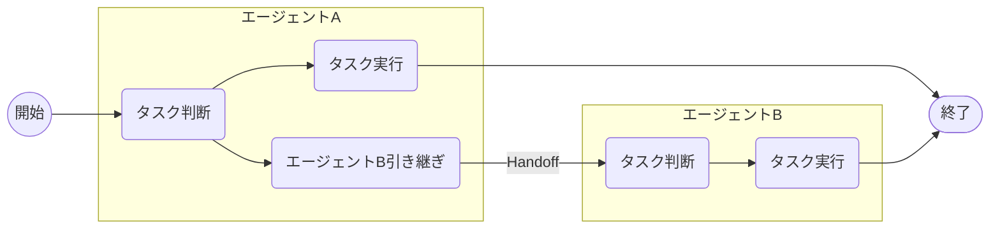

少し前に、OpenAIからAIエージェントに関する興味深い発表がありました。

- [OpenAI News - New tools for building agents](https://openai.com/index/new-tools-for-building-agents/)
 
Responses APIや各種ビルトインツールの発表も話題になりましたが、特に注目を集めたのはAIエージェントの構築フレームワークであるAgents SDKではないでしょうか。

本記事では、このAgents SDKの概要と使い方を整理します。

@[og](https://github.com/openai/openai-agents-python)

- [ドキュメント - OpenAI Agents SDK](https://openai.github.io/openai-agents-python/)


Agents SDKはPythonベースのOSSで、昨年OpenAIが公開した[Swarm](https://github.com/openai/swarm/tree/main)を基に開発されています。
Swarmは主に教育や実験用途を目的としていましたが、今回リリースされたAgents SDKはResponses APIへの対応だけでなく、AIエージェントをより簡単かつ柔軟に開発できるよう機能が大幅に強化されています。
さらに、トレーシングやガードレールといった運用に関わる機能も追加され、プロダクションレベルでの利用を前提とした設計になっています。

:::info
Swarmについては、昨年本サイトでも紹介記事を書いています。
Agents SDKの仕組みの基礎となっているため、興味のある方はぜひご覧ください。

@[og](/blogs/2024/12/04/openai-swarm-multi-agent-intro/)
:::

## セットアップ

Agents SDKはPythonの[パッケージ](https://pypi.org/project/openai-agents/)として提供されています。
自分の環境に合わせた方法でインストールしておきます。

```shell
pip install openai-agents
```

本記事では、現時点で最新バージョンである0.0.6を使用しています。

## エージェントを作成する

まずは、Agents SDKを使ったシンプルなエージェントの作り方を確認します。

```python
from agents import Agent

agent = Agent(
    name='simple agent', # 必須
    instructions='入力された文章をそのまま返してください',
    model='gpt-4o-mini' # 現時点では未指定の場合`gpt-4o`
)
```

基本的な方法はSwarmとほぼ同じです。

Agents SDKが提供するAgentクラスのインスタンスを作成することで、エージェントを構築できます。
この際、エージェント名（name）やシステム/デベロッパーメッセージ（instructions）等を指定します。

他にも多くのパラメータが用意されていますので、詳しくは公式リファレンスを確認してください。

- [OpenAI Agents SDK - API Reference - Agents](https://openai.github.io/openai-agents-python/ref/agent/)

早速このエージェントを実行してみます。

```python
import asyncio
from agents import Runner

async def main():
    result = await Runner.run(agent, 'おはよう!!')
    print(result)

if __name__ == '__main__':
    asyncio.run(main())
```

Agents SDKが提供するRunnerクラスのrunメソッドを使用して、最初に実行するエージェントや入力テキストを指定します。

このrunメソッドによりエージェントが実行されます。エージェントはレスポンスが取得できるまでLLMとのやり取りやツール実行を繰り返し、必要に応じてタスクを他のエージェントへ引き継ぎ（Handoff）します（デフォルトでは最大10回ループします）。
今回の例ではツールやHandoffを指定していないため、ループは1回のみ実行されます。

この実行結果は以下のようになります。

```
RunResult:
- Last agent: Agent(name="simple agent", ...)
- Final output (str):
    おはよう!! 今日はどんな予定ですか？
- 1 new item(s)
- 1 raw response(s)
- 0 input guardrail result(s)
- 0 output guardrail result(s)
(See `RunResult` for more details)
```

最後に実行されたエージェント（Last agent）や、結果の出力（Final output）等が確認できます。

なお、runメソッドは非同期処理ですが、同期版のrun_syncやストリーミングに対応したrun_streamedも用意されています。
詳しくは公式リファレンスをご覧ください。

- [OpenAI Agents SDK - API Reference - Runner](https://openai.github.io/openai-agents-python/ref/run/)

## ツールを使う

先ほどのエージェントはLLMとのチャットのみで、決められたタスクを自律的に遂行するエージェントとは言えませんでした。
ここではツールを活用して、よりエージェントらしい動作に改良していきます。

### ビルトインツール

まずはビルトインツールを利用してみます。今回、Agents SDKと一緒に公開されたビルトインツールは以下の3つです。

- [OpenAI Doc - Built-in tools - Web Search](https://platform.openai.com/docs/guides/tools-web-search?api-mode=responses)
- [OpenAI Doc - Built-in tools - File Search](https://platform.openai.com/docs/guides/tools-file-search)
- [OpenAI Doc - Built-in tools - Computer Use](https://platform.openai.com/docs/guides/tools-computer-use)

ちょうど少し前に、File Searchツールの仕組みについて紹介しました。

@[og](/blogs/2025/03/19/openai-responses-api-filesearch/)

せっかくなので、このFile Searchツールを利用するエージェントを作成してみます。

```python
import asyncio
from agents import Agent, Runner, FileSearchTool
agent = Agent(
    name='file search agent',
    instructions='あなたはテックブログ運営者です。file_searchツールを使ってブログファイルを検索してください',
    model='gpt-4o-mini',
    tools=[FileSearchTool(
        # Vector StoreオブジェクトのID
        vector_store_ids=['vs_xxxxxxxxxxxxxxx'],
        max_num_results=3, # 最大の検索結果数(任意)
        # 検索結果の詳細(スコア、テキスト)を含める場合は以下を有効にする
        # include_search_results=True
        # メタデータフィルタリングを指定する場合は以下に記述
        # filters={...}
    )]
)

async def main():
    result = await Runner.run(
        agent,
        'AI関連の記事を簡単に紹介して'
    )
    print(result)
    
if __name__ == '__main__':
    asyncio.run(main())
```

ツールを使う際は、エージェント作成時にtoolsパラメータで指定します。
ビルトインツールは、Agents SDKに対応するクラスが含まれているため、そのインスタンスを指定するだけです。
ここではFileSearchToolクラスにVector StoreのIDを指定しています。

実行すると、以下のような結果になりました。

```
RunResult:
- Last agent: Agent(name="file search agent", ...)
- Final output (str):
    以下はAI関連の記事の簡単な紹介です。
    
    1. **オンライン検索×AI：Perplexity新API Sonarの概要と基本的な使い方**
       - **日付**: 2025年1月22日
       - **内容**: Perplexityが新しく導入したSonar APIについての概要。生成AIやLLMを活用した検索機能を提供し、リアルタイム情報と引用を利用してアプリに組み込むことができます。新しい料金体系やモデルについても紹介されています。
    
    2. **OpenAI Responses API の新しい File Search (Vector Stores) 機能**
       - **日付**: 2025年3月19日
       - **内容**: OpenAIのResponses APIにFile Search機能が新たに追加され、メタデータフィルタリングが強化されました。この機能はAIエージェントの開発者にとって有用なツールとなります。
    
    3. **LangMemによるLLMの長期記憶の概要**
       - **日付**: 2025年2月26日
       - **内容**: LangChainが開発したLangMem SDKが紹介されており、AIエージェントがユーザー情報や会話履歴を保持する方法について述べられています。これにより、より人間的な会話が実現可能になります。
    
    これらの記事は、最新のAI技術やツールの活用に関する洞察を提供しています。興味がある方は詳細をぜひご覧ください。
- 2 new item(s)
- 1 raw response(s)
- 0 input guardrail result(s)
- 0 output guardrail result(s)
```

Vector Storeに保存された記事が検索されている様子が確認できます。

他のビルトインツールについても、それぞれ対応するクラスがAgents SDKに用意されているため、手軽に利用可能です。

### カスタムツール(Function calling)

ビルトインツールはOpenAI側でホストされているため、クライアント側での制御はパラメータ範囲内に限られてしまいます。
そこで、もっと自由に機能を拡張したいときは、自分で関数を定義して「カスタムツール(Function calling)」としてエージェントに使ってもらいます。

次は、顧客情報を取得する関数を例に、カスタムツールを作ってみます。

```python
from dataclasses import dataclass, asdict
import json
from agents import Agent, RunContextWrapper, Runner, function_tool
import asyncio

@dataclass
class LoginUser:
    id: str

@dataclass
class Customer:
    id: str
    location: str
    name: str

@function_tool
def fetch_customer(ctx: RunContextWrapper[LoginUser], customer_id: str) -> str:
    """顧客情報を取得します。

    Args:
        customer_id (str): 取得する顧客のID。
    Returns:
        str: 顧客情報(JSON)。
    """
    print(f'[audit]fetched by {ctx.context.id}')
    user = Customer(
        id=customer_id,
        location='東京都新宿区西新宿二丁目1番1号 新宿三井ビルディング34階',
        name='株式会社豆蔵'
    )
    return json.dumps(asdict(user), ensure_ascii=False)
```

通常のPython関数ですが、@function_toolでデコレートすることで、Agents SDKが関数シグニチャやdocstringからFunction callingのスキーマを自動的に生成します。
今回の関数では、以下のスキーマが生成されました。

```json
{
  "name": "fetch_customer",
  "parameters": {
    "properties": {
      "customer_id": {
        "description": "取得する顧客のID。",
        "title": "Customer Id",
        "type": "string"
      }
    },
    "required": [
      "customer_id"
    ],
    "title": "fetch_customer_args",
    "type": "object",
    "additionalProperties": false
  },
  "strict": true,
  "type": "function",
  "description": "顧客情報を取得します。"
}
```
LLMはこの情報を基に引数を生成し、関数の実行を要求します。

また、関数の第1引数(ctx)では任意のコンテキスト情報を取得できます。このコンテキストは一連のエージェントワークフロー全体で共有されるもので、ここでは顧客情報を取得したユーザーIDを監査ログとして出力しています。
第2引数以降は、LLMが生成するFunction callingの引数に該当します。引数の型としてはプリミティブ型の他に、TypedDictやPydanticモデルにも対応しています。

あとは、ビルトインツールと同じようにエージェント作成時のtoolsパラメータにこの関数を追加するだけです。

```python
agent = Agent(
    name='customer agent',
    instructions='fetch_customerツールで顧客情報を取得してください',
    # カスタムツールを追加
    tools=[fetch_customer],
    model='gpt-4o-mini'
)
```

最後に、このエージェントを実行します。今回はログインユーザーの情報を実行コンテキストとして渡します。

```python
async def main():
    result = await Runner.run(
        agent,
        '顧客の住所を教えて。\nID:CUSTOMER_0001',
        # ワークフローで共有する実行コンテキスト
        context=LoginUser('MZ0001'))
    print(result)

if __name__ == '__main__':
    asyncio.run(main())
```

実行結果は以下の通りです。

```
[audit]fetched by MZ0001
RunResult:
- Last agent: Agent(name="customer agent", ...)
- Final output (str):
    顧客の住所は以下の通りです：
    
    **住所**: 東京都新宿区西新宿二丁目1番1号 新宿三井ビルディング34階  
    **会社名**: 株式会社豆蔵
- 3 new item(s)
- 2 raw response(s)
- 0 input guardrail result(s)
- 0 output guardrail result(s)
(See `RunResult` for more details)
```

カスタムツールとしてFunction callingが正常に実行されていることが分かります。
また、コンテキスト情報としてログインユーザーの情報(MZ0001)もツール内で取得できています(監査ログ)。

:::info
今回はPython関数をそのままツールとして使用しましたが、FunctionToolクラスを使用するとより細かい制御が可能になります。
詳細については公式リファレンスを参照してください。

- [OpenAI Agents SDK - Docs - Custom function tools](https://openai.github.io/openai-agents-python/tools/#custom-function-tools)
- [OpenAI Agents SDK - API Reference - FunctionTool](https://openai.github.io/openai-agents-python/ref/tool/#agents.tool.FunctionTool)
:::
 
:::column:Agent as tools
ここでは割愛しましたが、もう1つのツールの使い方として、エージェント自体をツールとして使うという方法も紹介されています。

- [OpenAI Agents SDK - Docs - Tools - Agents as tools](https://openai.github.io/openai-agents-python/tools/#agents-as-tools)

エージェントのワークフロー制御を他のエージェントに引き継ぐ(Handoff)のではなく、ツールとしてエージェントにタスクを実行させる方法です。
中央集権的なエージェントが配下のエージェントを統括する場合に適した方法です。
:::

## ガードレールで入力・出力をチェックする

Agents SDKには、エージェントの入力や出力をチェックするためのガードレールという仕組みが用意されています。

ここでは旅行プランを立案するエージェントを例に、ガードレールを適用してみます。
まず、以下のような旅行プラン立案エージェントを作成しました。

```python
import asyncio
from pydantic import BaseModel
from agents import Agent, Runner

class TripPlan(BaseModel):
    """エージェントの出力スキーマ"""
    departure_location: str
    destination: str
    days: int
    schedule: str
    budget: int

agent = Agent(
    name='trip planner',
    instructions='指定された出発地と行き先、日数から旅行プランを日本語で提案してください',
    output_type=TripPlan,
)


async def main():
    result = await Runner.run(agent, '出発地:東京\n行き先:沖縄\n日数:3')
    # final_output_asで出力スキーマにタイプキャスト
    print(result.final_output_as(TripPlan).model_dump_json(indent=2))

if __name__ == '__main__':
    asyncio.run(main())
```

今回のエージェントでは、出力スキーマをoutput_typeで指定しています。

実行すると、以下のような結果が得られます。

```
{
  "departure_location": "東京",
  "destination": "沖縄",
  "days": 3,
  "schedule": "\n\n1日目:\n- 出発: 午前中に羽田空港から沖縄那覇空港へ\n- 昼食: 空港近くの地元レストランでアグー豚を堪能\n- 那覇市内観光: 首里城や国際通りを散策\n- 夕食: 国際通り周辺の居酒屋で沖縄料理を楽しむ\n- ホテルチェックイン: 那覇市内\n\n2日目:\n- 朝食: ホテルでの朝食\n- 美ら海水族館: 沖縄の海洋生物を見学\n- 昼食: 水族館周辺のレストランで昼食\n- 古宇利島観光: 古宇利大橋やティーヌ浜（ハートロック）を訪問\n- 夕食: 地元の海鮮料理を味わう\n- ホテル: 名護市内\n\n3日目:\n- 朝食: ホテルでの朝食\n- 首里城: もう一度観光（希望があれば）\n- 昼食: 空港周辺で軽食\n- 帰路: 那覇空港から羽田空港へ",
  "budget": 80000
}
```

次に、このエージェントの入力に日数が含まれていることをチェックする入力ガードレールを追加します。

```python
from agents import Agent, RunContextWrapper, input_guardrail, GuardrailFunctionOutput

@input_guardrail
def validate_trip_input(context: RunContextWrapper[None], agent: Agent, user_input: str):
    '''入力ガードレール'''
    days_match = re.search(r'日数[:：]\s*(\d+)', user_input)

    if not days_match:
        return GuardrailFunctionOutput(
            tripwire_triggered=True,
            output_info='日数をちゃんと指定してね！（例：日数:3）'
        )
    return GuardrailFunctionOutput(
        tripwire_triggered=False,
        output_info='OK'
    )

agent = Agent(
    name='trip planner',
    instructions='指定された出発地と行き先、日数から旅行プランを日本語で提案してください',
    output_type=TripPlan,
    # 入力ガードレール指定
    input_guardrails=[validate_trip_input]
```

入力ガードレールは@input_guardrailでデコレートしたPython関数です。

ガードレール関数は引数として実行コンテキスト(context)、対象エージェント(agent)、ユーザーの入力値(user_input)を受け取り、[GuardrailFunctionOutput](https://openai.github.io/openai-agents-python/ref/guardrail/#agents.guardrail.GuardrailFunctionOutput)を返却します。このとき、tripwire_triggeredにTrueを指定すると、Agents SDKはワークフロー内でエラーを発生させます。

その後に、この関数をエージェント作成時のinput_guardrailsパラメータに指定します。

今回は以下のように実行して、意図的にガードレールによるエラーを発生させます。

```python
from agents import InputGuardrailTripwireTriggered, Runner

async def main():
    try:
        result = await Runner.run(agent, '出発地:東京\n行き先:沖縄')
        print(result.final_output_as(TripPlan).model_dump_json(indent=2))
    except InputGuardrailTripwireTriggered as e:
        # 入力ガードレール違反
        print(e.guardrail_result.output)
```

意図的にガードレールに違反するよう、入力から日数を除いています。
入力ガードレールに違反した場合は、[InputGuardrailTripwireTriggered](https://openai.github.io/openai-agents-python/ref/exceptions/#agents.exceptions.InputGuardrailTripwireTriggered)が発生します。

ここでの実行は以下のようになります(読みやすく整形してます)。

```
GuardrailFunctionOutput(
  output_info='日数をちゃんと指定してね！（例：日数:3）', 
  tripwire_triggered=True
)
```

このように、入力ガードレールのチェックが動作していることが分かります。

出力ガードレールについても、基本的な追加方法は同じです。
ここでは、立案した旅行プランの予算が10万を超える場合にエラーとなるようにします。

```python
from agents import Agent, InputGuardrailTripwireTriggered, OutputGuardrailTripwireTriggered, RunContextWrapper, Runner, input_guardrail, output_guardrail, GuardrailFunctionOutput

# 前略(出力スキーマ、入力ガードレール)

@output_guardrail
def validate_trip_output(context: RunContextWrapper[None], agent: Agent, agent_output: TripPlan):
    '''出力ガードレール'''
    if agent_output.budget > 200000:
        return GuardrailFunctionOutput(
            tripwire_triggered=True,
            output_info=f'予算オーバーだよ！もう少し手頃なプランをお願い！ 予算:{agent_output.budget}'
        )
    return GuardrailFunctionOutput(
        tripwire_triggered=False,
        output_info='OK'
    )


agent = Agent(
    name='trip planner',
    instructions='指定された出発地と行き先、日数から旅行プランを日本語で提案してください',
    output_type=TripPlan,
    # 入力ガードレールと出力ガードレールを指定
    input_guardrails=[validate_trip_input],
    output_guardrails=[validate_trip_output]
)

async def main():
    try:
        # 出力ガードレール違反になるよう指定（予算オーバー）
        result = await Runner.run(agent, '出発地:東京\n行き先:ニューヨーク\n日数:14')
        print(result.final_output_as(TripPlan).model_dump_json(indent=2))
    except InputGuardrailTripwireTriggered as e:
        # 入力ガードレール違反
        print(e.guardrail_result.output)
    except OutputGuardrailTripwireTriggered as e:
        # 出力ガードレール違反
        print(e.guardrail_result.output)

if __name__ == '__main__':
    asyncio.run(main())
```

出力ガードレールの場合は、@output_guardrailでデコレートした関数を用意します。
それ以外は入力ガードレールとほとんど同じですが、出力値に対するチェックなので、引数としてユーザー入力値でなく対象エージェントの出力結果を受け取ります。
後は、対象エージェントのoutput_guardrailsに関数を指定すれば完成です。

出力ガードレールの違反時に発生するエラーは[OutputGuardrailTripwireTriggered](https://openai.github.io/openai-agents-python/ref/exceptions/#agents.exceptions.OutputGuardrailTripwireTriggered)です。ここでは、入力に加えてこのエラーも捕捉して出力するようにしています。

ここでの実行は以下のようになります(読みやすく整形してます)。

```
GuardrailFunctionOutput(
  output_info='予算オーバーだよ！もう少し手頃なプランをお願い！ 予算:300000', 
  tripwire_triggered=True
)
```

出力ガードレールのチェックが正常に動作していることが分かります。

なお、複数エージェントに跨るワークフローの場合は、全てのエージェントのガードレールが実行される訳ではありません。
入力ガードレールは最初のエージェント、出力ガードレールは最後のエージェントにのみ適用されます。

## Handoffを使ったマルチエージェント構成

ここでは、Handoffを利用したAgents SDKのマルチエージェントの仕組みについて確認します。

- [OpenAI Agents SDK - Docs - Handoffs](https://openai.github.io/openai-agents-python/handoffs/)

HandoffはAgents SDKの元ネタになっているSwarmの考え方と同じです。
[Swarmの紹介記事](/blogs/2024/12/04/openai-swarm-multi-agent-intro/#handoff)からHandoffのイメージを再掲します。



このように、エージェントはタスクの遂行に他のエージェントが適していると判断した場合、対象エージェントにタスクを引き継ぎます（Handoff）。
このHandoffを連鎖させることで、スケール可能なマルチエージェントワークフローが構築可能です。

ここでは、題材としてホテル予約を行うワークフローをHandoffを使って書いてみます。


### 実行コンテキストの定義

まず、ホテル予約に必要な顧客情報を実行コンテキストとして定義します。
このコンテキストは、全エージェントのinstructionsやカスタムツール等で参照でき、エージェント間の引き継ぎが発生しても失われることはありません。

```python
from pydantic import BaseModel

class Customer(BaseModel):
    '''仮想の顧客情報(実行コンテキスト)'''
    id: str
    name: str
```

### 各エージェントの実装

以下は、ホテル予約ワークフローを構成する各エージェントです。
各エージェントは、担当するタスクに対応するツール（Function calling）を持ち、必要に応じて次のエージェントへ引き継ぎを行います。

#### 1. 支払い処理エージェント

支払い処理を行うエージェントでは、make_payment関数をカスタムツールとして定義し、実行コンテキストの顧客情報を利用して支払いを完了させます。
また、payment_instructions関数を利用して、動的にinstructionsを生成しています。

```python
from agents import Agent, RunContextWrapper, Runner, function_tool
from agents.extensions.handoff_prompt import prompt_with_handoff_instructions

@function_tool
def make_payment(ctx: RunContextWrapper[Customer], payment_info: str) -> str:
    print('[Payment Processing agent]: make_payment')
    return json.dumps({
        'payment': 'ok',
        'details': payment_info,
        'name': ctx.context.name
    })

def payment_instructions(ctx: RunContextWrapper[Customer], agent: Agent) -> str:
    return prompt_with_handoff_instructions((
        '予約情報に基づいて支払いを完了してください。\n'
        '完了後に顧客への案内のために、予約情報と支払い情報を出力してください。\n'
        'その際に安全のためにカード番号はマスキングしてください。\n'
        f'顧客ID/顧客名: {ctx.context.id} / {ctx.context.name}'
    ))

payment_agent = Agent(
    name='Payment Processing',
    # 実行コンテキストを使った動的なinstructions生成(関数も指定可能)
    instructions=payment_instructions,
    tools=[make_payment]
)
```

#### 2. 予約処理エージェント 

予約処理エージェントは、make_booking関数をツールとしてホテルの予約を実行します。
このエージェントは、支払い処理エージェントへの引き継ぎを行うため、handoffsパラメータにpayment_agentを指定しています。

```python
@function_tool
def make_booking(ctx: RunContextWrapper[Customer], booking_info: str) -> str:
    print('[Booking Processing agent]: make_booking')
    return json.dumps({
        'booking': 'ok',
        'hotel': booking_info,
        'customer_id': ctx.context.id
    })

booking_agent = Agent(
    name='Booking Processing',
    instructions=prompt_with_handoff_instructions(
        '提供されたユーザー情報を使用してホテルの予約を行ってください。'),
    tools=[make_booking],
    # 支払い処理エージェントへ引き継ぎ
    handoffs=[payment_agent]
)
```
#### 3. 空室確認エージェント

空室確認エージェントは、check_availability関数を用いてホテルの空室状況を確認します。
このエージェントは、予約処理エージェントへの引き継ぎを行うため、handoffsパラメータにbooking_agentを指定しています。

```python
@function_tool
def check_availability(ctx: RunContextWrapper[Customer], user_input: str) -> str:
    print('[Availability Check agent]: check_availability')
    return json.dumps({
        'availability': 'ok',
        'details': user_input
    })

availability_agent = Agent(
    name='Availability Check',
    instructions=prompt_with_handoff_instructions(
        'ユーザーのリクエストに基づいてホテルの空室状況を確認してください。'),
    tools=[check_availability],
    # 予約処理エージェントへ引き継ぎ
    handoffs=[booking_agent]
)
```

### Handoffsの仕組みとポイント

各エージェント作成時のhandoffsパラメータにより、引き継ぎ可能なエージェントが指定されます。
この指定により、Agents SDKはエージェント情報から引き継ぎ用のカスタムツール（Function calling）を自動生成します。
例えば、予約処理エージェントへのHandoffとして、以下のようなツールが追加されます。

```json
  {
    "name": "transfer_to_booking_processing_agent",
    "parameters": {
      "additionalProperties": false,
      "type": "object",
      "properties": {},
      "required": []
    },
    "strict": true,
    "type": "function",
    "description": "Handoff to the Booking Processing agent to handle the request. "
  }
```

これにより、LLMはタスクの引き継ぎが必要かどうかを判断し、必要に応じてこのツールを実行要求して対象エージェントにワークフローを委譲します。

また、各エージェントのinstructionsでは、[prompt_with_handoff_instructions](https://openai.github.io/openai-agents-python/ref/extensions/handoff_prompt/#agents.extensions.handoff_prompt.prompt_with_handoff_instructions)を利用して、Handoffが適切に処理されるようにする推奨プロンプトを自動挿入しています。

なお、ここではhandoffsパラメータに直接エージェントを指定していますが、Agents SDKが提供するhandoffs関数を使用することで、ツール名や説明、Handoff発生時のイベントフック、入力履歴のフィルタリング、入力スキーマ定義など、より詳細な設定も可能です。
詳細は以下の公式ドキュメントやAPIリファレンスを参照してください。

- [OpenAI Agents SDK - Doc - Handoffs - Customizing handoffs via the handoff() function](https://openai.github.io/openai-agents-python/handoffs/#customizing-handoffs-via-the-handoff-function)
- [OpenAI Agents SDK - API Reference - Handoffs](https://openai.github.io/openai-agents-python/ref/handoffs/#agents.handoffs.handoff)

### ワークフローを実行する

最後に、上記のエージェント群を用いてホテル予約ワークフローを実行します。
実行時には、ユーザー入力と実行コンテキスト（顧客情報）を指定します。

```python
async def main():
    user_input = (
        '2025-06-01に東京でホテルを予約したいです。\n'
        '部屋はシングルで、禁煙希望です。\n'
        '決済は以下でお願いします。\n'
        'カード番号:4500-0000-0000-0000\n'
        '有効期限(MM-YY):07-28\n'
        'セキュリティコード:123'
    )
    result = await Runner.run(
        availability_agent,
        user_input,
        context=Customer(id='MZ0001', name='豆蔵太郎') # 実行コンテキスト(顧客情報)
    )
    print(result)

if __name__ == '__main__':
    asyncio.run(main())
```

実行結果例は以下の通りです。

```
[Availability Check agent]: check_availability
[Booking Processing agent]: make_booking
[Payment Processing agent]: make_payment
RunResult:
- Last agent: Agent(name="Payment", ...)
- Final output (str):
    予約と支払いが完了しました。
    
    ### 予約情報
    - 日付: 2025年6月1日
    - 場所: 東京
    - 部屋のタイプ: シングル（禁煙）
    
    ### 支払い情報
    - 顧客名: 豆蔵太郎
    - カード番号: 4500-****-****-****
    - 有効期限: 07-28
    
    その他ご不明点があればお知らせください。
- 11 new item(s)
- 4 raw response(s)
- 0 input guardrail result(s)
- 0 output guardrail result(s)
(See `RunResult` for more details)
```

各エージェントが連携し、一連のタスクを自律的に遂行していることが確認できます。

:::column:マルチエージェントパターン
マルチエージェントを使ったパターンは、ここで紹介しているHandoffだけではありません。
エージェント同士をコードベースで連携させる方法や、前述の「Agent as Tools」を利用する方法も存在します。

詳細は以下のドキュメントやGitHubリポジトリのサンプルコードを参考にしてください。

- [OpenAI Agents SDK - Doc - Orchestrating multiple agents](https://openai.github.io/openai-agents-python/multi_agent/)
- [GitHub openai/openai-agents-python - Common agentic patterns](https://github.com/openai/openai-agents-python/tree/main/examples/agent_patterns)
:::

## トレーシング

マルチエージェントを用いたワークフローは、システムが大規模になるにつれてデバッグが難しくなることが容易に想像できます。
特にHandoffを利用した場合、タスクの引き継ぎ判断をLLMが行うため、正確な予測が困難となるケースが多いかと思います。
これに対応するために、Agents SDKはトレーシング機能が備わっており、デフォルトで有効になっています[^1]。

[^1]: 無効にする場合は、[tracing_disabled](https://openai.github.io/openai-agents-python/ref/run/#agents.run.RunConfig.tracing_disabled)または環境変数(OPENAI_AGENTS_DISABLE_TRACING)を指定します。

デフォルトではOpenAIのダッシュボードのトレース機能が利用可能です。
例えば、先ほどのHandoffを利用したマルチエージェントの例では、以下のようなトレーシングの様子が確認できます。


このダッシュボードでは、LLMやツールコールのリクエスト・レスポンスの詳細、さらにHandoffによるエージェントの引き継ぎ等、必要十分なトレース情報が確認できます。
何も追加設定を行わなくても、このような情報が自動的に取得できるのは大きな魅力ですね。

明示的にトレーシング情報を取得することも可能です。
以下は、先ほどのワークフローにおいて、複数回の実行を1つのトレース情報にまとめて取得する例です。

```python
from agents import trace, Runner

async def main():
    customers = [
        Customer(id='CUSTOMER_0001', name='豆蔵太郎'),
        Customer(id='CUSTOMER_0002', name='豆蔵花子')
    ]
    with trace('豆蔵予約ワークフロー'): # トレーシング範囲
        results = []
        for customer in customers:
            user_input = (
                '2025-06-01に東京でホテルを予約したいです。\n'
                '部屋はシングルで、禁煙希望です。\n'
                '決済は以下でお願いします。\n'
                'カード番号:4500-0000-0000-0000\n'
                '有効期限(MM-YY):07-28\n'
                'セキュリティコード:123'
            )

            result = await Runner.run(
                availability_agent,
                user_input,
                context=customer
            )
            results.append((customer, result))
```
trace関数はwith句とともに使用することで、そのブロック内の処理を自動的にトレース情報として記録します。
実行すると、1つのトレース情報に複数のエージェントワークフローが集約され、以下のようにダッシュボード上に表示されます。


:::info
トレース情報に加え、`span_`から始まるAPIを使用することで、内部のセグメント（スパン）をカスタムで取得することも可能です。
詳細はAPIドキュメントをご参照ください。

- [OpenAI Agents SDK - API Reference - Creating traces/spans](https://openai.github.io/openai-agents-python/ref/tracing/create)
:::

Agents SDKのトレーシング機能は、OpenAI以外のサードパーティが提供するプラットフォームにも連携可能になっています。
以下公式ドキュメントを見ると、既に多くのプロバイダでAgents SDKの対応が進んでいるのが分かります。

- [OpenAI Agents SDK - Doc - Tracing - External tracing processors list](https://openai.github.io/openai-agents-python/tracing/#external-tracing-processors-list)

## まとめ

今回はAgents SDKの機能をザッと調査・検証してみました。
その結果、AIエージェントシステムの構築が非常にシンプルかつ迅速に実現できることが確認できました。
また、トレーシングやデバッグ、ライフサイクルフックなどの機能も充実しており、実際の運用シーンも具体的にイメージしやすくなっています。

さらに、記事作成中にもオーディオ対応のリリースが行われるなど、今後の拡張性も大いに期待できる状況です。
今後は、さまざまなパターンを試しながらエージェントオーケストレーションの仕組みをさらに深く習得していきたいと思います。
