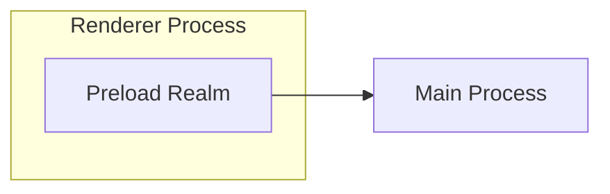
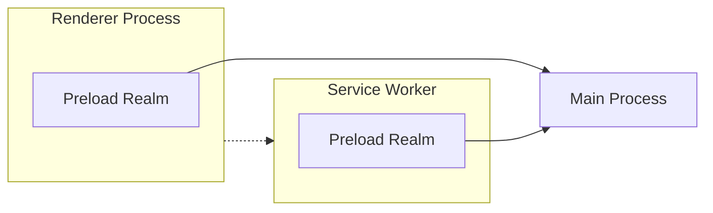
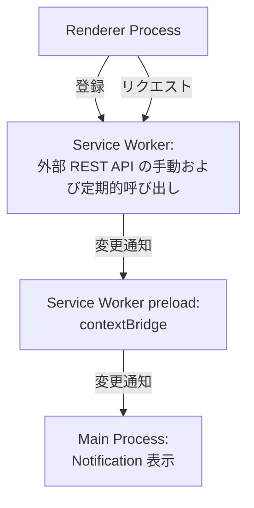

## はじめに
今月初めに Electron 35.0.0 がリリースされました。

- [Electron 35.0.0 | Electron](https://www.electronjs.org/blog/electron-35-0)

このリリースで Service Worker に Preload スクリプトをアタッチできる機能が追加されました。従来の Renderer プロセスの Preload スクリプトが、Web ページと Main プロセス(Node.js) の環境をブリッジする役割を果たしていたのと同様、Service Worker の Preload スクリプトは、Service Woker と Main プロセスのブリッジ機能を提供します。

:::info
Chrome 88 以降でサポートされる Manifest V3 拡張機能では Chrome 拡張のパフォーマンスを低下させる可能性があるコードがメインスレッドではなく Service Worker で実行されるようになっており、Manifest V3 への移行が促進されています。

[Manifest V3 に移行する  |  Chrome Extensions  |  Chrome for Developers](https://developer.chrome.com/docs/extensions/develop/migrate?hl=ja)

Service Worker Preload Scripts の追加は Electron アプリで Manifest V3 に移行した Chrome 拡張のサポートをしやすくする狙いがあるようです。
:::

## Service Worker Preload Scripts の意義
Service Worker に Preload スクリプトをアタッチできることは、Chrome と Electron アプリ両方で動作する拡張を書く開発者への恩恵が大きいのだろうと思います。ただ、それにとどまらず Electron のプログラミングパラダイムを変革する可能性を秘めていると筆者は感じました。

従来の Preload スクリプトは Web ページを実行する Renderer プロセスにブリッジを提供し、Node.js 環境である Main プロセスとの通信を可能にしています。


Service Worker Preload Scripts がサポートされたことで、Service Worker でも Renderer プロセスと同様の方法で Main プロセスとの通信を実装できるようになります。



Service Worker を登場させることで、肥大しがちな Main プロセスの責務を分割したり、UI 操作を妨げるような重い処理を Service Worker にオフロードすることが可能です。

:::info
35.0.0 のリリースノートには、Service Worker 間、Preload Scripts 間の IPC 通信も可能ということが記載されています。目的別の Service Worker を立て、Service Worker 同士を連携させるようなマイクロサービス的なアーキテクチャも考えられます。

> Furthermore, IPC is now available between Service Workers and their attached preload scripts via the ServiceWorkerMain.ipc class.

Service Worker Preload Realm の RFC は以下にあります。導入のモチベーションや提案する API でアプリコードがどのように書かれるかなどが説明されています。

@[og](https://github.com/electron/rfcs/blob/main/text/0008-preload-realm.md)
:::

:::info
Electron のプログラミングモデルに関しては以下の記事もご参照ください。

@[og](/blogs/2022/02/14/history-of-electron-quick-start/)

@[og](/blogs/2024/08/28/electron-webcontentsview-app-structure/)
:::

## Service Worker Preload Scripts による Hello World

今回は、以下のようなメッセージパイプラインの構築を目指しました[^1]。
- Electron アプリの起動時に、Renderer プロセスから Service Worker を登録
- Renderer プロセスから Service Worker への呼び出しも実装
- Service Worker では外部の REST API を呼び出し結果を保持
  - REST API の呼び出しはメッセージ受信時、定期的の2つのトリガーで実行
  - REST API の呼び出し結果が前回結果と異なる場合は Preload の contextBridge 経由で Main プロセスに変更通知
- Main プロセスでは変更通知を受けて Notification をデスクトップに表示

[^1]: 従来 Renderer プロセスや Main プロセスで実行されていた外部サービスへのポーリング処理を Service Worker にオフロードするようなシナリオを想定しています。




以下のようなプロジェクト構成となります。

```shell
.
├── index.html
├── main.mjs              # Main プロセス
├── package.json
├── preload-sw.js         # Service Worker preload スクリプト
├── preload.js            # Renderer preload スクリプト
├── renderer.js           # Renderer プロセス
└── service-worker.js     # Service Worker
```

:::alert
Service Worker Preload Scripts の RFC で提示されているサンプルコードで使われている API は提案時のものであり、v35 で実装されているものとは異なります。現状、公式のドキュメントやサンプルもほぼない状態なので、VS Code で JSDoc をホバーさせたりして API を確認しながら構築を進めました。そのため、本記事のコードスニペットは API の使い方などが適切でない可能性がありますのでご注意ください。
:::

なお、今回作成したソースコードの全量は以下のリポジトリにあります。

[electron-study/serviceworker-notification-example at master · kondoumh/electron-study](https://github.com/kondoumh/electron-study/tree/master/serviceworker-notification-example)

### Service Worker の登録 (Renderer プロセス)
Renderer プロセスでは、起動時に Service Worker を登録します。

```javascript:renderer.js
onload = () => {
  navigator.serviceWorker.register('service-worker.js')
    .then(() => console.log('Service Worker registered'))
    .catch((err) => console.error('Service Worker registration failed:', err));
}
```

### Service Worker Preload スクリプトの登録 (Main プロセス)
Session クラスの registerPreloadScript メソッドを利用して、Preload スクリプトを登録します。35.0.0 で `type` に `service-worker` が追加されましたのでこれを指定します。

```javascript
app.whenReady().then( async () => {
  session.defaultSession.registerPreloadScript({
    type: 'service-worker',
    id: 'worker-preload',
    filePath: path.join(__dirname, 'preload-sw.js'),
  });
  // ウィンドウ作成など
}
```

### Service Worker Preload での API 定義
従来の Renderer プロセスの Preload スクリプト同様、contextBridge と ipcRenderer を使用して Main プロセスへの通信 API を実装します。この例では、`NOTIFY_TEXT` という識別子で Main プロセスにテキスト情報を送信する API を実装、Service Worker に公開しています。

```javascript:preload-sw.js
const { contextBridge, ipcRenderer } = require('electron');

if (process.type == 'service-worker') {
  exposeApi();
}

function exposeApi() {
  const api = {
    notify: (text) => {
      ipcRenderer.invoke("NOTIFY_TEXT", text);
    },
  };

  contextBridge.exposeInMainWorld("myElectronApi", api);
}

```

### Service Worker の実装
外部の REST API を呼び出して、結果を Preload で定義した myElectronApi を用いて送信します。10秒間隔でこの処理を実行します[^2]。

[^2]: setInterval を Service Worker で使用するのは不具合の原因になりがちですが、ここでは簡易的な実装としました。

```javascript:service-worker.js
let lastStatus = null;

function checkStatus() {
  fetch('https://jsonplaceholder.typicode.com/todos/1') // Fake API for testing
    .then(res => res.json())
    .then(data => {
      if (data && data.title !== lastStatus) {
        lastStatus = data.title;
        myElectronApi.notify(data.title);
      }
    })
    .catch(err => console.error('[Service Worker] API error:', err));
}

checkStatus();
setInterval(checkStatus, 10000); // Check every 10 seconds
```

### Main プロセスでの Service Worker IPC ハンドリング
Service Worker からの IPC リクエストは、Renderer からの IPC リクエストと違って ipcMain によるハンドリングはできません。ServiceWorker クラスの ipc プロパティ (IpcMainServiceWorker クラス) の handle メソッドにより処理する必要があります。Service Worker Preload Scripts を登録したのと同じ app.whenReady() コンテキストで session オブジェクトの API を使ってハンドリングを実装します。

```javascript
app.whenReady().then( async () => {
  // ・・・
  session.defaultSession.serviceWorkers.on("running-status-changed", details => {
    if (details.runningStatus === "running") {
      const sw = session.defaultSession.serviceWorkers.getWorkerFromVersionID(details.versionId);
      if (!sw) return;
      sw.ipc.handle("NOTIFY_TEXT", (event, text) => {
        // Show a notification
        const notification = {
          title: 'Service Worker Notification',
          body: text,
        };
        new Notification(notification).show();
      });
    }
  }

  // Window 作成処理
}
```
Service Worker のライフサイクルイベント `running-status-changed` の受信時に、Service Worker の runningStatus を判定し `running` の場合は、getWorkerFromVersionID メソッドで ServiceWorker インスタンスを取得し、ipc.handle メソッドでイベント処理を行います。ここでは、Notification API を使って IPC リクエストで送られてきたテキストをデスクトップ通知で表示しています。

:::info
Service Worker での  console.log 出力は `console-message` イベントをハンドリングすることにより、Main プロセス側でキャプチャーすることができます。Service Worker との通信処理のデバッグで役立ちます。

```javascript
  session.defaultSession.serviceWorkers.on(
    "console-message",
    (event, messageDetails) => {
      // Listen for console messages from the service worker
      console.log('Service Worker: %d console message: %s', messageDetails.versionId, messageDetails.message);
    }
  )
```
:::

### Renderer プロセスから Service Worker 呼びだし
ここまで、Service Worker → Main プロセスへの通信は実現できましたが、UI (Renderer プロセス) から Service Worker を呼び出すのはやっていませんでした。

UI 側に Service Worker を呼び出すためのボタンを追加します。

```html:index.html
<!DOCTYPE html>
<html>
  <head>
    <meta charset="UTF-8">
    <meta http-equiv="Content-Security-Policy" content="default-src 'self'; script-src 'self'; style-src 'self' 'unsafe-inline'">
    <title>Hello World!</title>
  </head>
  <body>
    <!-- ボタンを追加 -->
    <p>
      <button id="service-worker">Call Service Worker</button>
    </p>
    <script src="./renderer.js"></script>
  </body>
</html>
```

Web 標準の ServiceWorkerContainer の API を使用することで、Renderer プロセスから Service Worker にメッセージを送信できます。ボタンの EventListener を追加して、Service Worker 呼び出しを実装します。

```javascript:renderer.js
document.querySelector("#service-worker").addEventListener("click", () => {
  navigator.serviceWorker.getRegistration().then((registration) => {
    if (registration) {
      registration.active.postMessage("Hello from the renderer process!");
    } else {
      console.error("No active service worker found.");
    }
  });
});
```
最後に Service Worker 側でリスナーを登録し、Preload で定義された myElectronApi を使用して Main プロセスへの送信処理を追加します。

```javascript:service-worker.js
// 省略

globalThis.addEventListener('message', (event) => {
  myElectronApi.notify(event.data);
});
```

### 実行の様子
ここまで実装してきたアプリを DevTools 表示付きで実行してみました。


定期実行によるイベントとボタンクリックによるイベントの両方が通知され、Notification が表示されました。


:::info
macOS の場合、Electron アプリ開発時にデスクトップ通知を有効にするには、システム設定で Electron の通知を有効化する必要があります。


:::

## さいごに
以上、Electron 35.0.0 で導入された Service Worker Preload Scripts を試してみました。公式からさらなる情報が出てくるのを待ち、有用なユースケースを発見できたらまた記事にしたいと思います。
