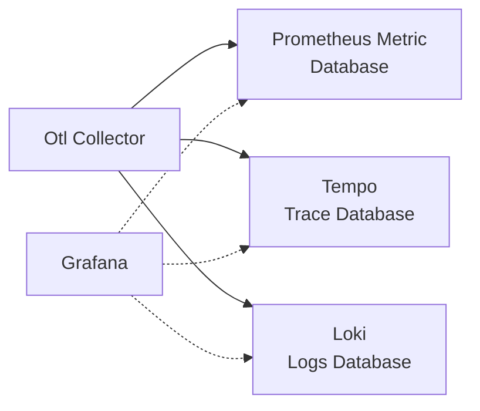
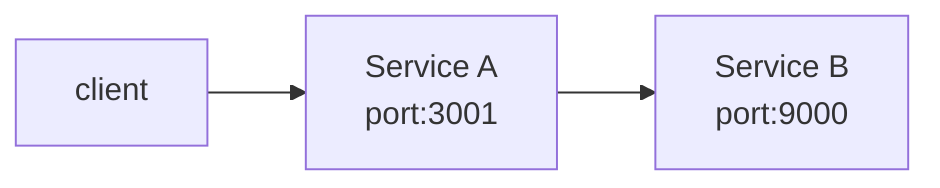

## はじめに
もう2ヶ月近く前ですが、Deno 2.2 のリリース時に OpenTelemetry の統合が目玉として発表されていました。

[Deno 2.2: OpenTelemetry, Lint Plugins, node:sqlite](https://deno.com/blog/v2.2)

メトリクス、トレース、ログなどテレメトリー情報の収集は、アプリケーションの可観測性を実現する上で欠かせない要素となっています。テレメトリー情報のやりとりが OpenTelemetry の仕様として標準化されたことで、各言語・ランタイムの対応が進んでおり、Deno もランタイム機能として搭載することになりました。

Deno の OpenTelemetry のドキュメントはこちらになります。

@[og](https://docs.deno.com/runtime/fundamentals/open_telemetry/)

今回は Deno 2.2.8 の環境で試しました。

:::info
OpenTelemetry によるメトリクス収集・分散トレーシングについては、当サイトにいくつか詳細な記事がありますので、ご参照ください。

@[og](/containers/k8s/tutorial/ops/opentelemetry/)
@[og](/containers/k8s/tutorial/ops/jaeger/)
@[og](/containers/k8s/tutorial/ops/awsxray/)
@[og](/msa/mp/cntrn16-mp-tracing/)
:::

## OTLP endpoint / Grafana の起動
ローカルで試す場合、公式のブログにあるように、Grafana Labs の docker-otel-lgtm を使うと OpenTelemetry(以下 Otel) の Collector のエンドポイントや Grafana が起動し、ダッシュボードで観測可能となります。

@[og](https://github.com/grafana/docker-otel-lgtm)

Otel Collector が収集したデータが Prometheus Metric / Tempo Trace / Loki Logs の各データベースに蓄積され、Grafana のダッシュボードから監視可能になります。



docker run で簡単に起動できます。

```shell
docker run --name lgtm -p 3000:3000 -p 4317:4317 -p 4318:4318 --rm -ti \
    -v "$PWD"/lgtm/grafana:/data/grafana \
    -v "$PWD"/lgtm/prometheus:/data/prometheus \
    -v "$PWD"/lgtm/loki:/data/loki \
    -e GF_PATHS_DATA=/data/grafana \
    docker.io/grafana/otel-lgtm:0.8.1
```

以下のように、gRPC と HTTP のエンドポイント、および Grafana が起動します。

```
The OpenTelemetry collector and the Grafana LGTM stack are up and running. (created /tmp/ready)
Open ports:
 - 4317: OpenTelemetry GRPC endpoint
 - 4318: OpenTelemetry HTTP endpoint
 - 3000: Grafana. User: admin, password: admin
```

## 複数サービスの連携でトレースを試す: サービスの実装
以下のように、REST API のサービス(A)がさらに別の REST API のサービス(B)を呼び出すような構成でトレーシングを試みます。



Service A のコード。ポート3001で起動し、Service B を呼び出した結果をクライアントに返します。

```typescript:service_a.ts
Deno.serve({ port: 3001 }, async (req) => {
  console.log("Service A Recieved request for", req.url);
  const res = await fetch("http://localhost:9000");
  const text = await res.text();
  console.log("Service A Recieved response from Service B", text);
  return new Response(`Service A got: ${text}`);
});
```

Service B のコード。ポート9000で起動し、クライアント(この場合は Service A)に単純なメッセージを返します。

```typescript:service_b.ts
Deno.serve({ port: 9000 }, (req) => {
  console.log("Service B Recieved request for", req.url);
  return new Response("Hello world");
});
```

Service A の起動。環境変数 `OTEL_DENO` に true を設定することで、OTel が有効化されます。`OTEL_SERVICE_NAME` でサービス名をつけて起動することで、トレースの結果が見やすくなります。ここでは、`svs-a` というサービス名をつけました。


```shell
OTEL_DENO=true OTEL_SERVICE_NAME=svc-a deno run --unstable-otel --allow-net service_a.ts
```
:::info
Deno の OpenTelemetry インテグレーション API はまだ unstable であり、今後変更される可能性があるため `--unstable-otel` フラグを指定する必要があります。
:::

同様に Service B も起動します。サービス名は `svc-b` としています。

```shell
OTEL_DENO=true OTEL_SERVICE_NAME=svc-b deno run --unstable-otel --allow-net service_b.ts
```

## 複数サービスの連携でトレースを試す: Grafana で可視化
ここまでで、サービスを連携させる準備ができましたので、Service A を呼び出してトレーシングを Grafana で観察してみたいと思います。

`localhost:3000` にアクセスすると、Grafana の画面が表示されます。


メニューから `Explore` を選択。デフォルトのデータソースが Prometheus になっているので、Tempo を選択します。


Tempo のクエリー画面が表示されます。


curl で Service A を呼び出します。

```shell
curl - http://localhost:3001
```

更新ボタンをクリックすると、Tempo のクエリー画面に呼び出しの Trace ID、時刻、サービス名、HTTP メソッド、応答時間が表示されました。


Trace ID は、Deno の Otel Exporter 側で採番されているようです。この Trace ID をクリックするとトレース情報の詳細が表示されます。svc-a → svc-b という実行順序で表示されています。


Node graph を展開すると呼び出し関係が可視化されます。


クエリー画面の Service Graph でもサービス間の関係が可視化されています。


Trace ID はリクエストヘッダーに埋め込まれるようです。Service B でヘッダーを表示するコードを追加しました。

```typescript:service_b.ts
Deno.serve({ port: 9000}, (req) => {
  // ヘッダー表示
  for (const [key, value] of req.headers.entries()) {
    console.log(key, value);
  }
  console.log("Service B Recieved request for", req.url);
  return new Response("Hello world");
});
```

`traceparent` というキーで Trace ID が設定されています。

```
accept */*
accept-encoding gzip,br
accept-language *
host localhost:9000
traceparent 00-34ea2fccfa0ce81bc8855043682b2810-895a8a6b4e02df52-01
user-agent Deno/2.2.8
```

アプリコードには手を加えず Otel を有効化するだけで、分散トレーシングが実現できそうですね。

## メトリクスの表示
メトリクスは、ダッシュボードの Metrics から表示できます。Prometheus をデータソースとしています。


otel_ プレフィクスでフィルターしたところ。Otel により使用されるリソースの状況を表しているようです。


v8js_ プレフィクスでフィルターしたところ。Deno ランタイムのベースとなる V8 JavaScript エンジンのメトリクスを表示しています。


:::info:Otel 関連の追加機能

v2.2.0 以降のリリースでも Otel 関連の機能が続々追加されています。

v2.2.4 では Context propagation のサポートが入りました。

@[og](https://github.com/denoland/deno/pull/28460)

v2.2.5 では Span Events のサポートが入りました。

@[og](https://github.com/denoland/deno/pull/28552)

v2.2.7 では V8 JS Engine Runtime metrics のサポートが入りました。これにより Grafana で v8js_ プレフィクスのメトリクスが取得できているものと思われます。

@[og](https://github.com/denoland/deno/pull/28592)

V8 JS engine runtime metrics 仕様は以下にあります。

@[og](https://opentelemetry.io/docs/specs/semconv/runtime/v8js-metrics/)
:::

## ログの表示
ダッシュボードの Logs から閲覧可能です。サービス毎に時系列とログが表示されます。


## さいごに
以上、Deno 2.2 で実装された OpenTelemetry インテグレーションを簡単なコードで試してみました。Kubernetes 環境で利用する場合も、サイドカーコンテナを立てたりが不要で、環境変数を指定するだけなので楽ですね。Deno 以外の言語・ランタイムが混在する環境での分散トレーシングも可能になっていくことでしょう。

最後は Grafana の画面紹介みたいになってしまいましたが、アラートやクエリを使って実運用に活かせるダッシュボードを作れると需要ありそうです。
