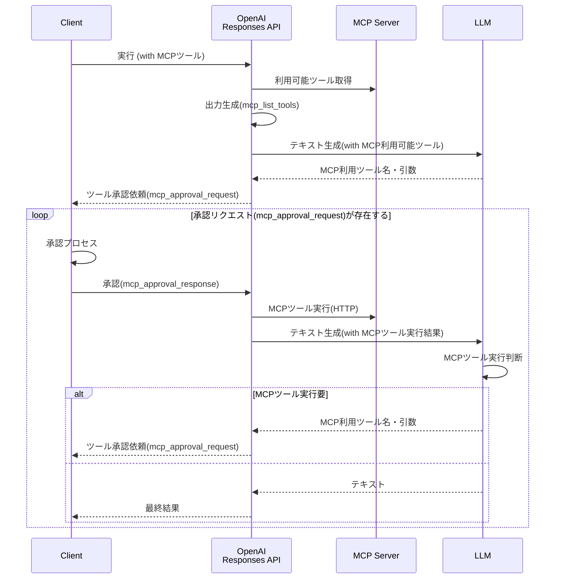

つい先月ですが、OpenAIのAPIに新しい組み込みツールの追加が発表されました。

<blockquote class="twitter-tweet"><p lang="en" dir="ltr">Introducing support for remote MCP servers, image generation, Code Interpreter, and more in the Responses API. <a href="https://t.co/EMZOutvV2a">pic.twitter.com/EMZOutvV2a</a></p>&mdash; OpenAI Developers (@OpenAIDevs) <a href="https://twitter.com/OpenAIDevs/status/1925214114445771050?ref_src=twsrc%5Etfw">May 21, 2025</a></blockquote> <script async src="https://platform.twitter.com/widgets.js" charset="utf-8"></script>

今回の発表で特に注目を集めているのがリモートMCPツールの追加ですね。同時にMCPのステアリングコミッティーへの参画も発表され、これまで他のプラットフォームに遅れをとっていたOpenAIも、ようやくMCPエコシステムへの本格的な対応を開始した感がありますね。

ここでは、そんなMCP含めて新しく追加された各ツールの使い方を調べてみましたのでご紹介します。

- [リモートMCP](#リモートmcp)
- [イメージ生成](#イメージ生成)
- [コードインタープリター](#コードインタープリター)

## リモートMCP

[OpenAI Doc - Tools - Remote MCP](https://platform.openai.com/docs/guides/tools-remote-mcp)

リモートMCPツールは、外部にホストされたMCPサーバーのツールをResponses API経由で利用できる新機能です。
OpenAI側で利用可能なツールの検索から最適なツール選択、実行まで一貫して処理してくれるため、開発者はツール実行に関連する実装を書く必要がありません。

今回は、公式ドキュメントでも紹介されているDevinの[DeepWiki](https://docs.devin.ai/work-with-devin/deepwiki-mcp)MCPサーバーを使ってテストしてみました。

OpenAIの[Codex CLI](https://github.com/openai/codex)の事前条件や使い方を要約してもらう例で実装してみます。

```python
from openai import OpenAI

client = OpenAI()

response = client.responses.create(
    model='gpt-4.1-mini',
    input='システム要件と利用手順をマークダウンで200文字程度でまとめて。 GitHub Repository: openai/codex',
    # MCPツール指定
    tools=[{
        'type': 'mcp',
        'server_label': 'deepwiki',
        'server_url': 'https://mcp.deepwiki.com/mcp',
        # 承認なしで実行する場合
        # 'require_approval': 'never',
    }],
)

while any(entity.type == 'mcp_approval_request' for entity in response.output):
    # 承認プロセス
    approval_inputs = []
    for entity in response.output:
        if entity.type == 'mcp_approval_request':
            print((
                '*' * 10 + ' 実行ツール ' + '*' * 10 + '\n'
                f'リクエストID: {entity.id}\n'
                f'ツール: {entity.name}\n'
                f'引数: {entity.arguments}\n'
                f'ラベル: {entity.server_label}\n'
            ))
            approval_inputs.append({
                'type': 'mcp_approval_response',
                'approval_request_id': entity.id,
                'approve': True
            })
    # 承認 & MCPツール実行
    response = client.responses.create(
        model='gpt-4.1-mini',
        previous_response_id=response.id, # コンテキストを維持
        tools=[{
            'type': 'mcp',
            'server_label': 'deepwiki',
            'server_url': 'https://mcp.deepwiki.com/mcp',
        }],
        input=approval_inputs
    )

print('*' * 10 + ' 最終実行結果 ' + '*' * 10)
print(response.output_text)
```

上記のコードで特徴的なのがMCPツール実行前の承認プロセスです。

`require_approval`を`never`に設定すればこの承認プロセスをスキップできますが、セキュリティの観点から信頼できるMCPサーバー以外では承認プロセスを挟むことが推奨されています。

実行時には、Responses APIから`mcp_approval_request`として利用するツール名や引数の詳細が提示されます。
クライアント側ではその内容を確認し、問題なければ`mcp_approval_response`で承認を行います。

今回の検証では、ツールの詳細を出力して自動承認するように実装しました。

このコードを実行したところ、以下のような結果が得られました。

```
********** 実行ツール **********
リクエストID: mcpr_6836d85f88108191af93f624edf62e83032c59875e6c1154
ツール: read_wiki_structure
引数: {"repoName":"openai/codex"}
ラベル: deepwiki

********** 実行ツール **********
リクエストID: mcpr_6836d86e63d0819180d4b1ca6b839828032c59875e6c1154
ツール: read_wiki_contents
引数: {"repoName":"openai/codex"}
ラベル: deepwiki

********** 最終実行結果 **********
以下はOpenAI Codex CLIのシステム要件と利用手順の概要です。

---

## システム要件
- 対応OS: macOS 12以上、Ubuntu 20.04以上、Debian 10以上、Windows 11（WSL2経由）
- Node.js 22以上（LTS推奨）
- Git 2.23以上（PRヘルパー利用時）
- メモリ: 最低4GB（推奨8GB）

## 利用手順
1. Codex CLIをインストールし、OpenAI APIキーを設定
2. ターミナルで `codex` コマンドを実行し自然言語で操作
3. コードの解析・修正、コマンド実行は承認モードに従い動作
4. モードは「Suggest（提案）」「Auto Edit（自動編集）」「Full Auto（完全自動）」から選択可能
5. セキュリティのためコマンドはsandbox環境で実行される（macOSはApple Seatbelt等）

---

必要に応じてAPIキー設定やコンフィグファイルを用いて詳細設定も可能です。
```

MCPツールが2回実行され(`read_wiki_structure`と`read_wiki_contents`)、それぞれの結果を踏まえたレスポンスが生成されています。
LLMが自律的に必要なツールを判断・実行している様子がよく分かります。

今回の検証を通じて理解したリモートMCPの実行フローを図にまとめてみました



外部のMCPエコシステムとOpenAI APIの連携が格段に簡単になりそうです。

## イメージ生成

[OpenAI Doc - Tools - Image generation](https://platform.openai.com/docs/guides/tools-image-generation)

OpenAIには従来から専用の[イメージAPI](https://platform.openai.com/docs/api-reference/images)が存在していましたが、今回新たにResponses APIのツールとしてもイメージ生成機能が追加されました。

Responses APIのツールとして使うことで、従来のワンショット生成とは異なり、マルチターンでの画像生成やストリーミング対応が可能になります。
これにより、より柔軟で対話的な画像生成ワークフローを構築できそうです。

もちろん、既存のイメージAPIも引き続きサポートされるため、シンプルな画像生成であれば従来通りの方法も選択できます。
両APIの使い分けについては、[公式ガイド](https://platform.openai.com/docs/guides/image-generation)で解説されていますのでご参考ください。

### 新規生成

まずは基本的な画像生成から試してみました。架空のイベントバナーを作成する例で実装してみます。

```python
from openai import OpenAI
import base64

client = OpenAI()

response = client.responses.create(
    model='gpt-4.1-mini',
    input=(
        '豆蔵デベロッパーイベント「Mamezou Tech Fest 2025」の告知バナーを作成してください。\n'
        '- 明るく楽しい雰囲気\n'
        '- 豆のキャラクターたちが集まっている様子\n'
        '- イベント名と日付「2025年7月20日」入り\n'
        '- アニメスタイル、カラフルな配色\n'
    ),
    # イメージ生成ツール指定
    tools=[{
        'type': 'image_generation',
        'size': '1024x1536',
        'quality': 'medium',
        'output_format': 'webp',
        'model': 'gpt-image-1', # Responses APIは現状これのみ(DALL-Eは不可)
    }],
    tool_choice={'type': 'image_generation'}
)

images = [
    output.result for output in response.output
    if output.type == 'image_generation_call'
]

if images:
    with open('banner.webp', 'wb') as f:
        f.write(base64.b64decode(images[0]))
```

ツールのパラメータでは、サイズや品質、出力フォーマットなど、細かい設定が可能です。
利用可能なパラメータの詳細については、以下公式ドキュメントで確認できます。

- [OpenAI Doc - Image Generation - Customize Image Output](https://platform.openai.com/docs/guides/image-generation#customize-image-output)

実行してみたところ、以下のような画像が生成されました。


良し悪しはともかく、それっぽいバナー画像(もちろん架空のイベントです)ができあがりました。

### 編集

続いて、既存画像の編集機能も検証してみました。弊社の専属マスコットキャラクター(？)である豆香(mameka)の歌手バージョンを作成してみます。

以下がオリジナル画像です。


サンプルコードは以下のようになりました。

```python
from openai import OpenAI
import base64

client = OpenAI()

# オリジナル画像
with open("mameka.png", "rb") as image_file:
    base64_image = base64.b64encode(image_file.read()).decode('utf-8')

response = client.responses.create(
    model='gpt-4.1-mini',
    input=[{
        'role': 'user',
        'content': [{
            'type': 'input_text',
            'text': '笑顔で歌っているように編集してください'
        },
        # 編集対象の画像
        {
            'type': 'input_image',
            'image_url': 'data:image/png;base64,' + base64_image
        }],
    }],
    tools=[{'type': 'image_generation'}],
    tool_choice={'type': 'image_generation'}
)

images = [
    output.result for output in response.output
    if output.type == 'image_generation_call'
]

if images:
    with open('singer-mameka.webp', 'wb') as f:
        f.write(base64.b64decode(images[0]))
```

編集対象の画像は、プロンプトと一緒にResponses APIに渡します。
今回はBase64エンコードで画像データを埋め込みましたが、[File API](https://platform.openai.com/docs/api-reference/files)を使ってファイルをアップロードする方法も選択できます。

画像編集の結果がこちらです。


オリジナル画像の特徴を保ちつつ、歌っているような表情に自然に変更されています。
なかなか素晴らしい仕上がりですね💖

ここでは試していませんが、マスキングしたオリジナル画像をわたしてその部分のみを書き換えるような編集も可能です[^1]。

[^1]: <https://platform.openai.com/docs/guides/image-generation?image-generation-model=gpt-image-1&api=responses#edit-an-image-using-a-mask-inpainting>

## コードインタープリター

[OpenAI Doc - Tools - Code Interpreter](https://platform.openai.com/docs/guides/tools-code-interpreter)

最後にコードインタープリター機能を試してみます。
この機能はAssistants APIでは既に提供されていましたが、今回Responses APIでも利用できるようになりました。

Responses APIでのコードインタープリターでは、コンテナという新しい概念が導入されています。
これはPythonのサンドボックス実行環境を表すもので、Assistants APIとは使い方が少し異なります。

今回は、サンプルのCSVファイルを分析してグラフを生成する例で検証してみました。
コードが少し長くなるため、2つの部分に分けて説明します。

### コンテナ作成とResponse API実行

まずはコードインタープリターを使用してResponses APIを実行する部分です。

```python
from openai import OpenAI

client = OpenAI()

# 分析対象のCSVファイル
with open('sales.csv', 'rb') as data_file:
    file_response = client.files.create(
        file=data_file,
        purpose='user_data'
    )
# 日本語フォントのアップロード
# https://fonts.google.com/share?selection.family=Noto+Sans+JP:wght@100..900
with open('NotoSansJP-Regular.ttf', 'rb') as font_file:
    font_response = client.files.create(
        file=font_file,
        purpose='user_data'
    )

# コンテナを作成
container = client.containers.create(
    name='sales_data', file_ids=[file_response.id, font_response.id]
)

response = client.responses.create(
    model='gpt-4.1-mini',
    input=[{
        'role': 'user',
        'content': [{
            'type': 'input_text',
            'text': 'カテゴリ別の売上構成比（円グラフ）を作成してください。フォントはNoto Sans JPを適用してください。'
        }],
    }],
    # コードインタプリタツール指定
    tools=[{
        'type': 'code_interpreter',
        'container': container.id,
    }],
    tool_choice={'type': 'code_interpreter'}
)

```

まず、分析に必要なファイルを[File API](https://platform.openai.com/docs/api-reference/files)でアップロードします。
今回は分析対象のCSVファイルとグラフで日本語が利用できるようにフォントファイルを用意しました。

次に、新しく追加された[Containers API](https://platform.openai.com/docs/api-reference/containers)を使ってコンテナオブジェクトを作成します。
ここでアップロードしたファイルのIDを指定することで、サンドボックス環境にファイルがマウントされる仕組みのようです。

なお、コンテナ作成には現時点で1つあたり$0.03の費用が発生します。
最新の料金については[公式情報](https://platform.openai.com/docs/pricing)をご確認ください。

そして最後に、コードインタープリターツールを指定してResponses APIを実行しています。ここで先ほど作成したコンテナのIDをツールパラメータ(`container`)に指定します。

:::column:コンテナ生成を自動でする
コンテナは手動で作成する方法のほか、Responses API実行時に自動生成することも可能です。

この場合、コンテナにマウントするファイルはResponses API実行時のツールパラメータとして指定します。

```python
response = client.responses.create(
    model='gpt-4.1-mini',
    input=[{
        # (省略)
    }],
    tools=[{
        'type': 'code_interpreter',
        # 自動でコンテナを作成する場合
        'container': {
            'type': 'auto',
            'file_ids': [file_response.id, font_response.id],
        }
    }],
    tool_choice={'type': 'code_interpreter'}
)
```
:::

### 出力ファイル取得

続いて、後半部分のソースコードです。
ここで、Responses APIのレスポンスからコードインタープリターの出力ファイルを取り出します。

```python
annotations = [
    annotation for annotation in response.output[-1].content[0].annotations
    if annotation.type == 'container_file_citation'
]

if annotations:
    output_response = client.containers.files.content.with_raw_response.retrieve(
        container_id=annotations[0].container_id,
        file_id=annotations[0].file_id,
    )
    if output_response.status_code == 200:
        with open('sales_summary.png', 'wb') as f:
            f.write(output_response.content)
    else:
        print(
            f'Error retrieving file: {output_response.status_code} - {output_response.text}')
```

コードインタープリターが生成したファイルは、コンテナから取得する必要があります。

Responses APIの出力の`annotations`に含まれる`container_file_citation`から、ファイルIDとコンテナIDを取り出します。
そして、新しく導入された[Containers File API](https://platform.openai.com/docs/api-reference/container-files/retrieveContainerFileContent)を使って実際のファイルデータを取得します。

### サンプルファイルと実行結果

最後にコードインタープリターを実行してみます。

今回の検証では、以下のようなサンプルCSVファイルを用意しました。

**CSVファイル(sales.csv)**
```csv
注文ID,注文日,商品名,カテゴリ,数量,単価（円）
1001,2025-05-01,りんご,果物,10,120
1002,2025-05-01,バナナ,果物,8,90
1003,2025-05-02,メロン,果物,1,800
1004,2025-05-02,キャベツ,野菜,5,150
1005,2025-05-03,牛乳,飲料,3,180
1006,2025-05-04,トマト,野菜,6,130
1007,2025-05-04,オレンジ,果物,7,100
1008,2025-05-05,ヨーグルト,乳製品,4,200
1009,2025-05-06,にんじん,野菜,10,80
1010,2025-05-06,コーヒー,飲料,2,250
```

実行した結果、以下のようなグラフが生成されました。


日本語フォントも正しく適用され、カテゴリ別の構成比が分かりやすい円グラフが作成されました。

今回はCSVファイルの分析のみ検証しましたが、ChatGPTと同様に様々なファイル形式やデータ処理タスクに対応できそうです。

## まとめ

今回、Responses APIに新しく追加された各種ツール機能を一通り検証してみました。

これらの機能は単体でも十分に価値がありますが、組み合わせることでさらに強力なAIエージェントの構築が可能になりそうです。

実際、OpenAIの[Agents SDK](https://openai.github.io/openai-agents-python/tools/)でも既にこれらのツールがサポートされており、AIエージェント開発のエコシステムが急速に発展していることを感じます。

今回の検証を通じて、Responses APIがAI活用の新たなステージに入ったことを実感できました。これからどのような活用事例が生まれてくるのか、とても楽しみですね。
