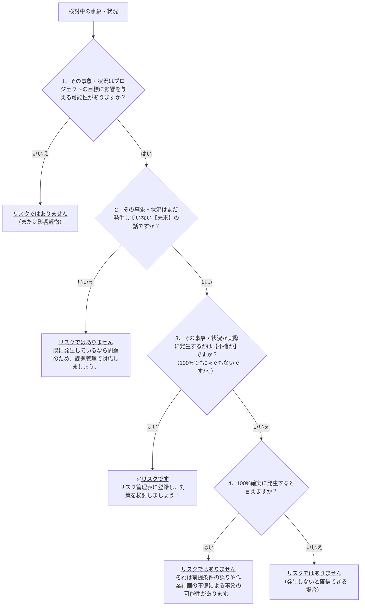

# はじめに

[以前の記事](https://developer.mamezou-tech.com/blogs/2025/06/06/from_problem_to_action_issue_management_for_rookies/)では、「問題」と「課題」の違いから課題管理の進め方についてお話ししました。
今回はその続編として、「リスク」と「問題」の違いを軸に、**リスク管理の第一歩**をわかりやすく解説します。

こんな悩みを抱えていませんか。

- 「リスクって“危なそうなこと全部”を指すのだろうか。」
- 「問題とどう違うのだろうか。」
- 「そもそも何から手をつければよいのだろうか。」

この記事を読めば、
- 「問題」と「リスク」の違いが明確にわかります。
- なぜ「リスク」として捉え、管理することが大切なのか、その理由が理解できます。
- 明日から使えるリスク管理の基本的な進め方をステップごとに学べます。
- プロジェクト運営に「先を見通す力」が加わるでしょう。

一緒に「なんとなく不安」を「具体的な対応」に変えるスキルを身につけましょう。

:::info
この記事は新人プロジェクトマネージャー向けシリーズ記事の一部です。

1. [第1回：「問題」と「課題」の違いから始めよう（課題管理入門）](https://developer.mamezou-tech.com/blogs/2025/06/06/from_problem_to_action_issue_management_for_rookies/)
2. [第2回：探偵型マネジメント ― 真実をどう見抜くか？（思考法・観察編）](https://developer.mamezou-tech.com/blogs/2025/06/13/fact_vs_truths_conan_inspired_pm_guide_for_rookies/)
3. **第3回：「問題」と「リスク」の違いから始める（リスク管理入門）**

👉 初めて読む方は [第1回から読む](https://developer.mamezou-tech.com/blogs/2025/06/06/from_problem_to_action_issue_management_for_rookies/) のがおすすめです。
:::

# まずは思考実験！どちらが「リスク」でしょう？

ウォーミングアップとして、こんな状況を想像してみてください。  
キッチンで料理中、大事な生卵をうっかり落としてしまうかもしれない場面です。

* **【A】卵をキッチンカウンターから固い床に落としてしまう**  
    この場合、卵が床に叩きつけられて割れてしまうことは避けられないでしょう。

* **【B】卵をまな板の上からシンクに落としてしまう**  
    この場合、卵が割れてしまう可能性もあります。  
    しかし、高低差は少ないため、運よくヒビが入るだけで済むかもしれません。

さて、どちらが **「リスク」** としてより適切でしょうか？

---

### 回答と解説

答えは **【B】** です。

リスクとは、「結果がどうなるかわからない」という **不確実性** を伴う事象のことです。  
ここでのポイントは、「起こるかどうか」だけでなく、**「起きたときにどうなるのか」も確定していない**という点です。

【A】は、 **ほぼ確実に「卵が割れる」** と予想できるため、不確実性がありません。  
したがって、これは「既知の危険」や「問題」に近く、リスクとは言えません。

一方【B】は、落ちたとしても **割れるかどうかは不確か** です。  
このように、将来起こるかもしれない事象に対して、**結果が確定しておらず、良くも悪くもブレる**可能性があるとき、それを「リスク」として捉えるのです。

つまり、リスクとは「結果の不確かさ」に備えるためのもの。  
だからこそ、【B】のような事象こそがリスク管理の対象となるのです。

---

# リスクと問題の違いとは？新人でも分かる見分け方

思考実験で「不確実性」がポイントだと感じていただけたでしょうか。
それでは、あらためて「問題」と「リスク」の定義を確認し、その違いを整理しましょう。

## 「問題」の定義（おさらい）

**問題とは、「あるべき姿」と「現実の姿」のギャップであり、すでに発生している困った状態** です。

たとえば納期遅延やバグの顕在化など、すでに現れているトラブルは「問題」として、すぐに対処が必要です。

## 「リスク」の定義

**リスクとは、目標に対する“不確かさ”の影響** です。（ISO 31000 / PMBOK®ガイド）

図のように、順調に見えても「成果が出ないかもしれない」という下方ブレの可能性があります。
これがリスクのイメージです。

つまり、「まだ起きていないが、起きるかもしれないこと」が目標に悪影響を与える可能性をリスクと呼びます。
※この記事では主に悪影響をもたらす「ネガティブリスク」に焦点を当てます。

## 「問題」と「リスク」の主な違い まとめ

| 特徴         | 問題 (Problem/Issue)                           | リスク (Risk)                                              |
| :----------- | :----------------------------------------------- | :---------------------------------------------------------- |
| **発生時期** | 既に発生している                                 | まだ発生していない（将来起こるかもしれない）               |
| **確実性** | 確実に起きている                                 | 起きるかどうかは不確か                                    |
| **対応の焦点** | 発生後の解決（課題化して対処）                   | 発生前の予防・発生後の影響軽減（予防策・軽減策）           |

顕在化した「問題」は課題管理で対応し、未発生の「リスク」はリスク管理で扱います。これが基本です。

# これはリスク？迷ったときのYES/NOチャート

「リスクか、単なる心配事か、それとも問題か。」と悩んだときの判断チャートを用意しました。

# リスク管理が重要な3つの理由とは？「Slack（余白）」が成功の鍵
リスク管理とは単に「危ないことを洗い出して回避する」作業ではありません。
ソフトウェア工学者トム・デマルコは、著書 *SLACK: Getting Past Burnout, Busywork, and the Myth of Total Efficiency* [^1]の中で、次のように述べています。

> *"Risk management is about planning for failure."* [^2]

つまり、リスク管理とは「失敗を前提に計画すること」なのです。
さらにデマルコはこうも述べています。

> *"Slack is what helps organizations cope with risk. It's the buffer that allows for the unexpected."* [^3]

[^1]: Tom DeMarco, *SLACK: Getting Past Burnout, Busywork, and the Myth of Total Efficiency*, Broadway Business, 2001.
[^2]: Tom DeMarco, *SLACK*, (2001).
[^3]: Tom DeMarco, *SLACK*, (2001).

スラック（ゆとり）こそが、変化や予期せぬ事態に対応する「バッファ（余白）」であることを示しています。
効率性ばかりを追い求めると、組織は柔軟性を失い、少しの変化や想定外で破綻しがちです。

逆に「Slack＝保険」をあえて設けることで、変化に強いしなやかな運営が可能になります。
このように、リスク管理は「起きるかもしれない未来」に備え「あえて余白を残す」マネジメント判断なのです。

この考え方は、リスク管理が正しく機能しているかどうかを判断する、１つの興味深い視点を提供してくれます。
もしあなたのプロジェクトに予算やスケジュール、人員の面で全く「遊び」がない場合を想像してみてください。

常にギリギリの状態で運営されているとしたら、それは非常にリスクの高い状態と言えるでしょう。
一見すると非効率に思える「無駄」な作業や費用があるかもしれません。

しかし、それこそが実は予期せぬ変化に対応するため計画的に設けられた『Slack（ゆとり）』なのです。
そして、それはリスク管理がうまく機能している証拠とも言えます。

その「余白」を無駄と見るか、未来への保険と捉えるか。
その判断がプロジェクトマネージャーの力量を示します。

# 新人PM向け｜まず作るべきリスク管理表の書き方とサンプル

リスクを特定できたら、可視化・対応するために「リスク管理表」に登録しましょう。
最初はExcelやGoogleスプレッドシートで、下記のようなシンプルなフォーマットで十分です。

## まずはコレ！リスク管理表の作り方【サンプル付き】

| ID    | リスク登録日 | リスク内容（～かもしれない）                               | 発生確率 (高/中/低) | 影響度 (大/中/小) | リスクスコア (発生確率×影響度) | 対応方針（予防策・軽減策）                                     | 担当者 | 期限       | 状況     | 備考         |
| :---- | :----------- | :------------------------------------------------------- | :-------------------- | :---------------- | :-------------------------------- | :----------------------------------------------------------- | :----- | :--------- | :------- | :----------- |
| R-001 | 2025/06/06   | 主要メンバーAさんが急遽退職し、開発スケジュールが遅延するかもしれない | 中 (2)             | 大 (3)           | 6 (高)                        | Aさんの業務をドキュメント化し、Bさんと共有。引き継ぎ計画を準備。 | PM高橋 | 2025/06/20 | 対策検討中 |              |
| R-002 | 2025/06/06   | 導入予定の外部APIの仕様が大幅に変更され、手戻りが発生するかもしれない | 低 (1)             | 中 (2)           | 2 (低)                        | API提供元の更新情報を定期確認し、影響範囲を事前に検討。         | 鈴木   | 検討中     | 未対応   | AWS障害時に備え |
| R-003 | 2025/06/07   | テスト環境の準備が計画より遅れ、テスト開始が遅延するかもしれない     | 中 (2)                | 中 (2)            | 4 (中)                            | 必要リソースを再確認しIT部門へ早期依頼。進捗を週次でフォロー。   | 佐藤   | 2025/06/15 | 対応済   | IT部門に依頼済み |

## サンプルの項目説明

* `ID`: リスクを識別する一意なIDを振りましょう（例：R-001）。
* `リスク登録日`: そのリスクをいつ特定したかを記録します。
* `リスク内容`: 将来起こりうる「困ったこと」を具体的に、「～かもしれない」という形で記述します。
* `発生確率`: そのリスクが実際に起こる可能性を評価します。最初は「高(3)・中(2)・低(1)」のような3段階評価で十分です。チームの知見や過去の経験に基づいて判断しましょう。
* `影響度`: もしそのリスクが発生した場合、プロジェクトの目標（QCDなど）にどれくらいの悪影響があるかを評価します。「大(3)・中(2)・小(1)」などで評価します。
* `リスクスコア`: 発⽣確率と影響度の点数を掛け合わせて算出します。このスコアが高いものほど、優先的に対策を検討すべきリスクです。
* `対応方針（予防策・軽減策）`:
    * **予防策**: リスクの発生確率そのものを下げるための具体的なアクション。
    * **軽減策**: もしリスクが発生してしまった場合に、その影響を最小限に抑えるための具体的なアクション。
* `担当者`: そのリスクの対応策を実施する責任者を明確にします。個人名を指定するのがポイントです。
* `期限`: 対応策をいつまでに実施するのか、またはいつまでそのリスクを重点的に監視するのか、といった目安となる日付を設定します。
* `状況`: リスクの現在のステータスを記録します（例：未対応、対策検討中、対応中、対応済、監視中、発現済み（問題化）など）。
* `備考`: その他、特記事項や関連情報があれば記録します。

:::info:【用語解説】QCDとは
**QCD**は、**Quality（品質）**・**Cost（コスト）**・**Delivery（納期）**の頭文字を取ったプロジェクト管理の基本概念です。
これら3つの要素は互いに影響し合うため、1つを優先すると他へ影響が出る可能性があります。  
PMはQCDのバランスを意識し、全体最適の視点で意思決定することが求められます。
:::
### 発生確率と影響度で優先度を判断する「リスクスコア」とは？
リスクの「発生確率」と「影響度」を数値化・掛け合わせることで、漠然とした「危なそう」を**客観的な数値**で評価できます。
これによりチームで共通認識を持ちやすくなり、優先的な対応検討や効果的な議論が可能になります。

### 予防と軽減、どちらを優先すべき？
基本的には、**予防策を優先して検討**することが望ましいです。
リスク発生の可能性を減らせれば、その後のコストや影響を大きく抑えられるためです。
ただし、予防が困難な場合や高コストになる場合は、軽減策の準備が重要になります。
両方をバランス良く考えるのがプロジェクトマネージャーの腕の見せ所です。

### 「発現済み（問題化）」について
リスクが実際に発生し、プロジェクトに影響を与え始めた状態です。
この場合、リスクはもはや「リスク管理」の対象外となり、**「問題」として「課題管理」のプロセスに移行**し、速やかな対処が必要です。
リスク管理の目的の１つは、この「発現済み」となることを極力防ぐことにあります。

# 放置NG！リスク管理表を継続的に使う運用ルール

せっかく作ったリスク管理表も、放置すればすぐに形骸化します。
ポイントは「**定期的に見直し、更新**」──それだけで、リスク管理表は未来予測レーダーとして機能します。

## リスク管理表メンテナンスの基本アクション

- **新しいリスクはすぐ登録**
    - 誰かが「気になるかも」と感じた時点で候補に入れる。
- **週次・定例で全体チェック**
    - 優先度の高いリスクは状況を最新化。未対応なら理由も記録。
- **対応が完了したリスクは整理**
    - 状況欄を「対応済」などに更新して明示。
- **不要になったリスクは“アーカイブ”**
    - 別シートや下部に移動し、履歴として残すのも有効。

## なぜメンテナンスが重要なのか？

プロジェクトは日々変化します。昨日は低リスクだったことが、明日には重大リスクになるかもしれません。
定期的な更新こそが、“リスクに備えている”という状態そのものなのです。

# プロジェクトチームで使えるリスク管理チェックリスト10項目

リスク管理はプロジェクトマネージャーだけの仕事ではありません。
リスク管理はメンバー全員の協力が必要です。
気づき、共有し、対策に協力する意識が、実効性ある対応を可能にします。
以下のチェックリストを使って、チームで定期的にリスク管理の状態を確認してみましょう。

| 項目                 | 確認事項                                                                               |
| :------------------- | :------------------------------------------------------------------------------------- |
| **プロジェクト開始時** | キックオフ時に「リスクとは何か」「問題との違い」について共通認識を持ったか。               |
|                      | 想定される主要リスクを洗い出したか。（過去の類似プロジェクトを参考にしたか。）             |
|                      | リスク管理表を作成し、チームで共有したか。                                               |
|                      | プロジェクト計画に、予算、スケジュール、人員の面で計画的な「ゆとり（Slack）」を設けているか。 |
| **プロジェクト進行中** | 定期的（例：週次）にリスクをレビューする時間を設けているか。                               |
|                      | 「リスクか、単なる心配事か、それとも問題か。」と悩んだとき、フローチャートで確認しているか。 |
|                      | 新しいリスクが発生したら、速やかにリスク管理表に登録しているか。                           |
|                      | 登録済リスクの「状況」や「期限」が更新されているか。                                     |
| **チーム運営の観点** | チーム内で「不安」や「懸念」を共有しやすい雰囲気があるか。                                 |
|                      | 「リスクに気づいたら報告する」という文化が根付いているか。                                 |
|                      | 各リスクの対応方針について、関係者の役割分担が明確になっているか。                         |
| **プロジェクト完了後** | 実際に発生したリスクと対応履歴を振り返ったか。                                           |
|                      | 想定外のリスクがなぜ見逃されたのかを分析したか。                                         |
|                      | 今後に活かすための「リスク対応の教訓」をナレッジとして残したか。                           |

# まとめ：リスク管理は転ばぬ先の杖！

- **リスクは「未来の不確実な影響」であり、「問題」とは別物。**
- **「確実に悪いことが起きる」はリスクではなく“前提”または“問題”。**
- **不確実性こそがリスクの本質。**
- スコアリングと分類を用いれば、極端な事象（例：⽇本消滅レベルの隕⽯衝突）も冷静に優先順位づけできます。
    例えば「日本消滅レベルの隕石衝突」も、発生確率が天文学的に低いため優先度は下がります。
- 最初はシンプルなリストでOK。
    大切なのは、**継続的に見直し、更新し続けること**です。

「問題」発生後に対応する課題管理も大切です。
しかし、そもそも問題が起きないように先手を打つリスク管理も欠かせません。

この両輪が、プロジェクトを成功に導くためには不可欠です。
リスク管理は、未来を予測し、コントロールしようとする行為です。

最初は難しく感じるかもしれませんが、「もしかしたらこんな困ったことになるかもしれないな。
じゃあ、今のうちに何ができるかな。」と想像力を働かせることが第一歩です。

この記事で紹介した考え方やツールは、あくまで基本的なもの。
あなたのプロジェクトの状況に合わせて、どんどんカスタマイズしていってください。

そして何より、一人で抱え込まず、チームみんなでリスクについて話し合う文化を作ることが大切です。
「あの時、ちゃんとリスクを洗い出しておいてよかった。」と思える日がきっと来るはずです。
