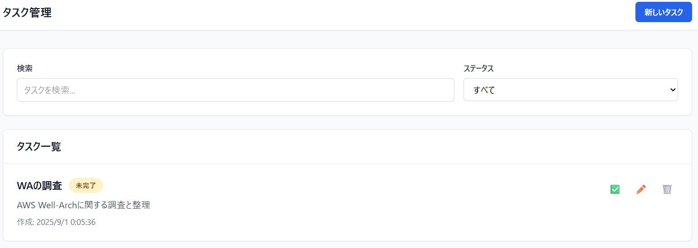

---
 title: AWS Step Functionsを使ってみよう
 author: hirokazu-niwa
 # 公開日として設定されますので、それを考慮した日付にするようにしてください
 date: (記事の作成日)
 # 以下のタグは任意です。つけるものあれば追加してください。まず既存タグ(トップページにあります)に使えるものがあるかを確認してください。なければ新規に作成してもらって大丈夫です
 tags: [mamezou, AWS, AWS認定, step-functions]
 ---

 ## 概要
 重い腰を上げてAWS資格コンプリートを目指そうと動きだしたので、対象試験に関連する内容を知識のみでなく実際に手を動かしながら理解を深めていこうと思います。
 その際に、躓いたところだったりわかりにくかった概念などを備忘録としてまとめておき、後から見返せるような内容にしたいと思います。

 ひとまずAWS DVAの取得を目指しているため今回の記事はそれに関連する内容になっており、試験の範囲にも含まれているAWS Step Functions(以降Step Functions)について
 普段あまり触ることのなかったサービスだったので使ってみていこうと思います！

## AWS Step Functionsとは
細かい部分や言葉の定義などは[公式]()に譲るとして、簡単にどんなサービスかを表現すると、
**AWSサービス用オーケストレーションツール**
が適切なのかなと思います（間違ってたらすみません^^;

具体的にStep Functionsを使ってどのようなことができるのかというと、
- データ処理フロー
- 機械学習ワークフロー
- マイクロサービスのオーケストレーション
- セキュリティオートメーション
このあたりのことが少ない負担でできるみたいですね。
記事の中でも後半で一部取り上げて試してみたいと思います。

## 手始めに「Getting started tutorial」
[公式チュートリアル](https://docs.aws.amazon.com/step-functions/latest/dg/getting-started.html)
基本的に公式チュートリアルに沿って手を動かせばStep Functionsの特徴や使い方はイメージできるので、ここではポイントだったり良いと思った点のみ残しておきます。

**ポイント**
- ワークフロー(ステートマシンと同義)設定の仕方は２種類
Workflow StudioでGUIベース設定 or ASLというJSON ベースの構造化言語を使ってコードベースで設定
特にこだわりがなければWorkflow StudioでGUIベースで設定していけば問題ないと思います。
GUIベースで設定したとしても平行してASLでの定義もされているので、後から別の環境やメンバーに同じ設定を共有したくなっても手間がかからないようになっていると感じました。

ワークフローの大枠をGUIでちゃちゃっと定義しておいて、細かい部分をASLで作りこむ、みたいなやり方も使いやすそうかなと思いました。
（特にChoiceやMapフローをASLで最初から定義しようとするとぱっと見わかりにくいと感じたので）

- ワークフローの実行がリアルタイムでグラフィカルに確認できる

各ステートが成功・失敗しているかが一目でわかりますし、ステートへの入出力や定義内容も見えるので
どういう失敗が起きてて、どこの定義が間違っているのかが見つけやすいなと思いました。

ここで少しわかりにくいと感じたのが「イベント」という概念です。
これは、ステートの中で行われている詳細なタスク内容にあたると理解しました。
この内容を「イベントビューワー」で見ることができます。

## ちょっと応用してみる

## 所感

## 今後の抱負

