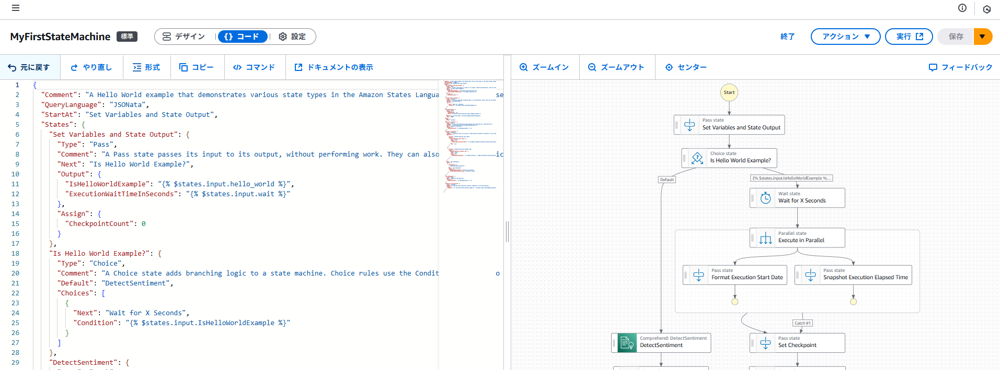
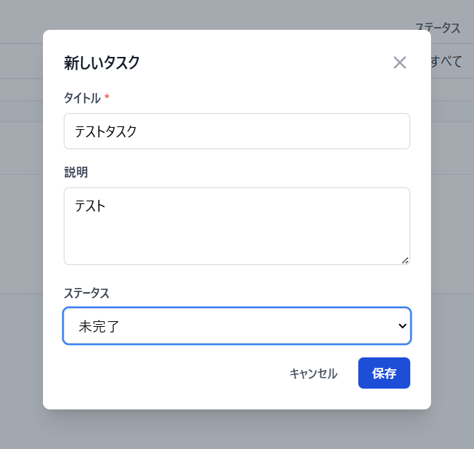
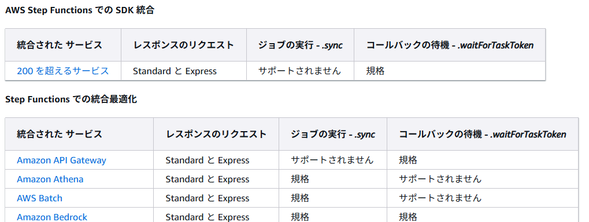

---
 title: AWS Step Functionsを使ってみよう
 author: hirokazu-niwa
 # 公開日として設定されますので、それを考慮した日付にするようにしてください
 date: (記事の作成日)
 # 以下のタグは任意です。つけるものあれば追加してください。まず既存タグ(トップページにあります)に使えるものがあるかを確認してください。なければ新規に作成してもらって大丈夫です
 tags: [mamezou, AWS, AWS認定, step-functions]
 ---

 ## 概要
 重い腰を上げてAWS資格コンプリートを目指そうと動きだしたので、対象試験に関連する内容を知識のみでなく実際に手を動かしながら理解を深めていこうと思います。
 その際に、躓いたところだったりわかりにくかった概念などを備忘録としてまとめておき、後から見返せるような内容にしたいと思います。

 ひとまずAWS DVAの取得を目指しているため今回の記事はそれに関連する内容になっており、試験の範囲にも含まれているAWS Step Functions(以降Step Functions)について
 普段あまり触ることのなかったサービスだったので使ってみていこうと思います！

## AWS Step Functionsとは
細かい部分や言葉の定義などは[公式]()に譲るとして、簡単にどんなサービスかを表現すると、
**AWSサービス用オーケストレーションツール**
が適切なのかなと思います（間違ってたらすみません^^;

具体的にStep Functionsをどの場面で使うのかというと、
- データ処理フロー
- 機械学習ワークフロー
- マイクロサービスのオーケストレーション
- セキュリティオートメーション
これらのユースケースが公式でも挙げられていました。
記事の中でも後半で一部取り上げて試してみたいと思います。


## 手始めに「Getting started tutorial」
[公式チュートリアル](https://docs.aws.amazon.com/step-functions/latest/dg/getting-started.html)
まずは公式チュートリアルに沿って手を動かし、Step Functionsの特徴や使い方をイメージしようと思います。  
チュートリアル内容自体はあまり取り上げず、進める中で重要そうな概念だと思ったことや疑問に感じ点を残しておこうと思います。

**ポイント**
- ワークフロー(ステートマシンと同義)設定の仕方は２種類
Workflow StudioでGUIベース設定 or ASLというJSON ベースの構造化言語を使ってコードベースで設定
特にこだわりがなければWorkflow StudioでGUIベースで設定していけば問題ないと思います。  
GUIベースで設定したとしても平行してASLでの定義もされているので、後から別の環境やメンバーに同じ設定を共有、なんてこともできますね。





ワークフローの大枠をGUIでちゃちゃっと定義しておいて、細かい部分をASLで作りこむ、みたいなやり方も使いやすそうかなと思いました。
（特にChoiceやMapフローをASLで最初から定義しようとするとぱっと見わかりにくいと感じたので）

- ワークフローの実行がリアルタイムでグラフィカルに確認できる

各ステートが成功・失敗しているかが一目でわかりますし、ステートへの入出力や定義内容も見えるので
どういう失敗が起きてて、どこの定義が間違っているのかが見つけやすいなと思いました。

ここで少しわかりにくいと感じたのが「イベント」という概念です。
これは、ステート（「イベントビューワー」の中だと「Step」カラムに表記されている）の中で行われている詳細なタスク内容にあたると理解しました。
この内容を「イベントビューワー」で見ることができます。



- タスクの種類
[タスクタイプ](https://docs.aws.amazon.com/ja_jp/step-functions/latest/dg/state-task.html#task-types)で記載がある通り、4種類のタスクタイプが存在しているようです。
どうやって定義するかも公式に記載の通りですが、ここにどのタイプを指定するかでStep Functionsで行う内容が決まると思うのでポイントとして挙げておきました。
HTTP APIを利用してStripe や Salesforce などのサードパーティーSaaS アプリケーションもワークフローに組み込めるので、この点もメリットになりそうですね。

- サービスの統合について
タスクタイプとして[サポートされたサービスの API アクション](https://docs.aws.amazon.com/ja_jp/step-functions/latest/dg/state-task.html#state-task-connector)を選択した場合の話になります。
これは少しややこしいと感じた概念で、Step Functionsから様々なAWSサービスを呼び出すことを「サービスの統合」という概念として扱っています。  
その「サービスの統合」にも種類があり、「AWS SDK 統合」「最適化された統合」「クロスアカウントアクセス」の３種類が存在しています。
（クロスアカウントアクセスについては省略）
さらに、それぞれの種類において「レスポンスのリクエスト (デフォルトの挙動) 」「ジョブの実行 (.sync) 」「コールバックの待機 (.waitForTaskToken)」の3パターンの挙動が存在しています。
これをまとめている表が公式のページに記載されている内容になってます。



見てもらえればわかりますが、各種類の中でもサポートしていないパターンがあったりするので、使う際には確認が必要になると思います。
また、簡単に「AWS SDK 統合」「最適化された統合」の違いを述べておくと、

引用表現
■AWS SDK統合
AWS SDK を使用した標準 API コールとまったく同じように機能

■最適化された統合
Step Functions によってカスタマイズされているAPIコール

という理解になり、公式的には「最適化された統合」を使うことを薦めています。

といっても、圧倒的に「AWS SDK 統合」で使えるサービスのほうが多いので、ワークフローで定義したいサービスが「AWS SDK 統合」と「最適化された統合」の両方でサポートされているのであれば  
「最適化された統合」側を利用する感じでいいのかなと思いました。

補足
この[3種類のグループ](https://docs.aws.amazon.com/ja_jp/step-functions/latest/dg/integrate-services.html)について説明されているページがリンクの通りで、
[3パターンの挙動](https://docs.aws.amazon.com/ja_jp/step-functions/latest/dg/integrate-optimized.html)はこのリンクに記載があります。
いつものごとく公式ページ内での表記ブレがあったりするので理解するのにやや苦労しました。。

ASLでの定義がわかりやすいかも
GUI上での表示も一応あるっちゃある

- 並列処理ができる
- Lambdaでの管理に比べて手間が少ない

## ちょっと応用してみる
[AWS Step Functionsとは](#aws-step-functionsとは)でも挙げていたユースケースの１つ「データ処理」について、簡単な例で試してみたいと思います。
やることとしてはシンプルに、「」です。

定義したASLは以下になります。
<details>
<summary>ASL</summary>

```
```
</details>


## 所感

## 今後の抱負

