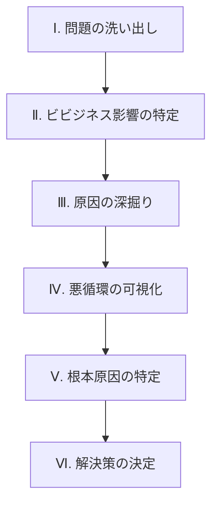
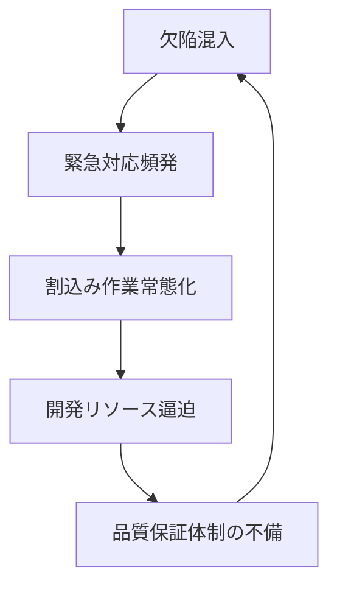
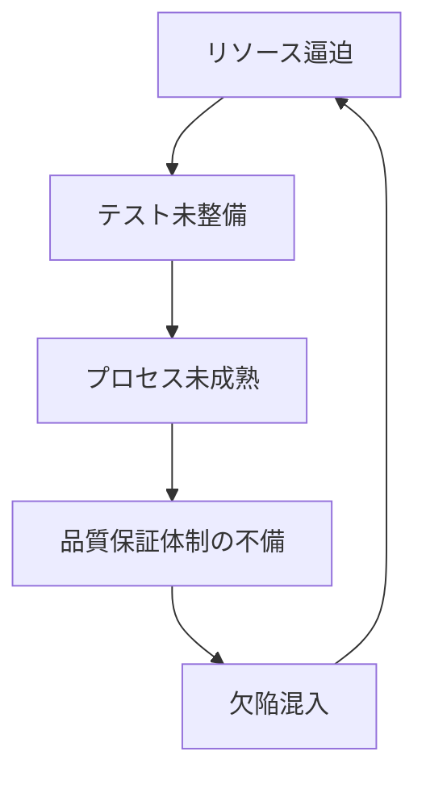

# はじめに
以前の記事「[「問題解決」と「課題達成」どう使い分ける？─新人プロジェクトマネージャー向け：“守り”と“攻め”の思考法](https://developer.mamezou-tech.com/blogs/2025/06/30/problem_solving_vs_task_achieving_pm_thinking_for_rookies/)」では、プロジェクトマネジメント（PM）における「問題解決型」と「課題達成型」の2つの思考スタイルをご紹介しました。

本記事では、「問題解決型」アプローチに焦点を当て、PMの現場で直面する課題や問題を構造的に理解し、因果関係図を活用して根本原因から効果的に解決する手法を解説します。
特に、継続的なプロセス改善につなげる視点を重視しています。

※ 因果関係図とは、「原因」と「結果」の関係を矢印で表した図のことです。
　 初心者の方もぜひ気軽に試してみてください。

# 問題解決型と課題達成型の違いを図解で整理
「あるべき姿（To Be）」と「現状（As Is）」を比較し、以下のようにアプローチを使い分けます。

- **問題解決型**：現状が「あるべき姿」より悪い → 原因を特定して解消
- **課題達成型**：現状から「ありたい姿」に進みたい → 達成手段を計画

今回は **「問題解決型」** の進め方を紹介します。  
具体的なフレームワークも交えながら、実践的に解説していきます。

# 因果関係図を使った問題解決の6ステップで現場改善を加速する
問題の特定から解決策の導出までを整理した「6つのステップ」の全体像です。

## ステップ1：問題の洗い出し（プロジェクトの振り返りから）
まずは計画書や週報、成果物を使い、発生した問題をリストアップしましょう。
付箋などを使ってプロセスごとに視覚化すると、全体を俯瞰しやすくなります。

📌 **プロジェクト問題を俯瞰で把握する例**

問題をリストアップするときは、「どんな小さなことでも書き出す」ことが重要です。
初心者は最初から完璧を目指さず、思いつくまま記録しましょう。

## ステップ2：問題がもたらすビジネスへの悪影響を明らかにする
本記事ではPM現場でよくある問題の一例として、「本番環境への欠陥混入頻発」を選びます。
次に、この問題がビジネスにどう影響するかを明確にします。

ポイントは、 **問題が最終的にどんな「目に見える損害」につながるかを因果関係で遡って図示する** ことです。

たとえば、次のようなビジネス損害が浮かび上がります。
- コスト増（運営の非効率化）
- 顧客離れ（満足度の低下）

もし「問題と影響のつながり」がうまく描けないと感じたら、発想を少し変えてみましょう。

たとえば、
**「本番環境へ欠陥混入が頻発している。その次に何が起きるだろう？」**

このように問いかけてみると、
・サービス停止
・顧客からのクレーム
・復旧作業の負担
といったビジネスへの影響や連鎖的な出来事が自然と見えてきます。

図のように「ビジネス損害」の付箋は、他の要素と区別できるように、色分けしておくのがおすすめです。

🟡 起点：分析対象として選定した問題  
🔴 中間：因果の途中で現れる直接的・構造的な要因  
⚫ 結果：最終的に顕在化するビジネス損害（例：コスト増、顧客離れ）

たとえば「サービス停止」や「復旧作業の負担」などは、🔴中間的な要因として扱います。  
それによってもたらされる「顧客離れ」や「コスト増」が、⚫ビジネス損害に該当します。

ビジネス損害の付箋を置いたら、次は因果関係が成立しているかをチェックします。  
下から上へ、「もし【原因】ならば【結果】」という形式で読み上げてみましょう。

たとえば、
- もし「本番環境へ欠陥が混入した」ならば、「サービス機能が一部停止する」
- もし「問題修正・リカバリー作業が発生する」ならば、「事業運営コストが増加する」

このように、因果関係を読み上げて確認することで、**論理の整合性が取れているか**を見極めることができます。  
つながりが不自然であれば、文言や配置を調整しましょう。

## ステップ3：原因を突き止める
ビジネス影響がわかったら、問題の原因を掘り下げます。
「なぜ起きたのか？」を繰り返し問い、因果関係を下流へたどりましょう。

上図では、「欠陥混入」という直接的な原因からスタートします。
そして、プロセスの未成熟、開発リソースの逼迫、変更管理の混乱といった構造的な背景へと掘り下げています。

このステップでは、問いの質と深さがカギです。
「なぜ、そうなったのか？」を繰り返しながら、本質に近づいていきましょう。

## ステップ4：問題を繰り返す“悪循環ループ”を可視化する
多くの現場では、 **一つの結果が次の原因となり、同じ問題を繰り返す“悪循環ループ”**があります。
これを見抜くことで、根深い問題の本質に迫れます。

上図では、ステップⅢで作成した因果関係図の中から、**悪循環を形成しているループ**を太い矢印で強調しています。

🔁 Aループの例（緊急対応と品質劣化のループ）

緊急対応が常態化し、リソースが逼迫、結果的に品質保証体制も崩壊─。
このループにより、「欠陥混入」が再び起きる構造です。

🔁 Bループの例（未整備プロセスが招く欠陥ループ）

こちらは、テスト不足やプロセス未整備が主因となり、欠陥混入を再び呼び込む構造です。

悪循環のループ構造を見抜くには、多少の時間がかかるかもしれません。
ループを見つけるには、因果図全体を眺め、「ぐるりと一周して戻ってくる」流れがあるかを確認しましょう。
時間はかかりますが、この構造を見抜ければ、問題解決の突破口が見えてきます。

## ステップ5：根本原因を特定する
次に、悪循環の“起点”となっている**根本原因**を探します。
根本原因は問題が何度も起きる「本当の原因」で、以下の特徴があります。

- 他の要素から矢印が入っていない（= それ自体が原因の源）
- これ以上掘り下げる必要がないと感じる
- 対処が現実的であり、解決によって広範な影響が見込まれる

上図では、以下の2つが根本原因として挙げられています。

- テストの専門知識・スキルが不足している  
- 無理な計画と納期を設定している

このように、問題の「発生源」となる本質的な要因を特定していきます。

図のように「根本原因」の付箋は、他の要素と区別できるように、色分けしておくのがおすすめです。

🟡 起点：分析対象として選定した問題  
🟣 原因：中間に位置する要因（構造的・直接的な原因）  
⚫ 根本原因：再発を招く本質的な要因（悪循環の起点となる）

たとえば「変更管理の混乱」「品質保証体制の不備」などは🟣原因として扱い、
それを引き起こしている「無理な計画と納期」「スキル不足」などが⚫根本原因になります。

これらが解消されれば、**一度に複数の問題を改善できる可能性が高い**─。
その“てこ”となるポイントを見極めるのが、このステップです。

## ステップ6：根本原因をどうやって解決するかを決める
根本原因を特定したら、どう変えるか考えます。
ここでは、ネガティブな原因を「望ましい状態」に言い換えることが大切です。

たとえば、

「無理な計画と納期を設定している」
→ 「計画と納期を状況に応じて調整できる」

「テストの専門知識・スキルが不足している」
→ 「テストの専門知識・スキルを持ったメンバーがいる」

というように、**「どうなっていたら理想的か？」という視点で言い換えます**。

次に、それを実現する**具体的な解決策**を検討します。

たとえば、

「計画と納期を状況に応じて調整できる」
→ 「早期かつ継続的なリスク評価と共有を行う」

といったように、現実的かつ実行可能な施策を用意しましょう。

解決策を考えるときは、「望ましい状態」をイメージしましょう。
初めての場合は、小さな改善から始めるのがおすすめです。焦らず一歩ずつ進めましょう。

最後に、望ましい未来像から逆算して、全体像を組み立てます。

この「未来実現ツリー」では、3段階で「未来へのストーリー」を描いていきます。

- 原因を望ましい現象に置き換える
- 問題を理想的なゴールに反転させる
- それぞれが論理的につながるかを検証する

これで、因果関係図を活用した「問題解決の型」が完成です。

# 因果関係図のメリット
因果関係図の作成には多くのメリットがあります。
* **チーム全体の共通理解が深まる**: チーム内だけでなく、組織外への説明にも役立ちます。
* **ビジネス影響と技術的問題をつなげて説明できる**: ビジネス上の損害へと至る問題の流れを、視覚的に示すことができます。
* **根本原因が明らかになる**: 表面的な問題だけでなく、その奥に潜む真の根本原因を特定しやすくなります。
* **悪循環を断ち切る戦略が見える化される**: 問題を永続させている悪循環を特定し、それを断ち切るための介入ポイントを見つけることができます。
* **解決策の妥当性を検証しやすくなる**: 根本原因と悪循環を理解することで、最も効果的な解決策を導き出し、選択することが可能になります。

# 因果関係図を描くときの注意点と失敗しないコツ
因果関係図作成時の注意点です。
* ❌ **矢印・要素が多すぎる** → 不要なものは削除しましょう
* ⚠️ **簡略化しすぎない** → 作成者が説明できる範囲で明記
* ⚠️ **問題領域を広げすぎない** → フォーカスを絞る
* 🚫 **個人攻撃に発展しないよう配慮する**

# まとめ：因果関係図で“構造的問題”にアプローチするポイント
本記事では現場改善に役立つ、因果関係図を使った問題解決の具体的なステップを解説しました。
問題の根本原因を特定し、再発防止と業務プロセス改善の視点を持つことが重要です。

因果関係図は初心者でも取り組みやすい問題解決ツールです。
まずは小さな問題から試し、経験を積むことで、現場改善が着実に進みます。ぜひ挑戦してみてください。

次回は、この未来実現ツリーを活用し、目標設定から計画立案へとつなげる手法を紹介します。

:::info
**この記事は「デキるPMシリーズ」の一部です**
👉 [チェックリストの形骸化を防ぐ！デキるPMの再構築術と7つの改善策](https://developer.mamezou-tech.com/blogs/2025/07/10/pm_checklist_rebuild_and_improve/)
👉 [形骸化しない定例会議の進め方｜デキるPMの7つの改善ステップ](https://developer.mamezou-tech.com/blogs/2025/07/18/pm_meeting_rebuild_and_improve/)
👉 [課題が消化されるリスト運用｜デキるPMの脱・形骸化テクニック12選](https://developer.mamezou-tech.com/blogs/2025/07/24/issue_list_rebuilding_and_practical_tips_for_pms/)
👉 [プロセス改善の実践ステップ｜デキるPMが使うIDEALモデルと成功の秘訣](https://developer.mamezou-tech.com/blogs/2025/08/08/pm_process_improvement_ideal_model_and_practical_steps/)
:::
