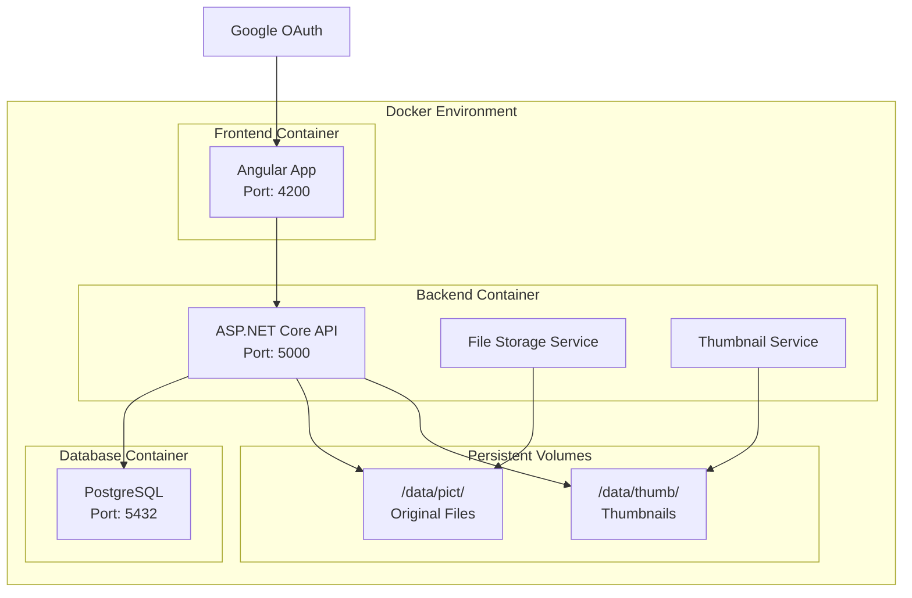
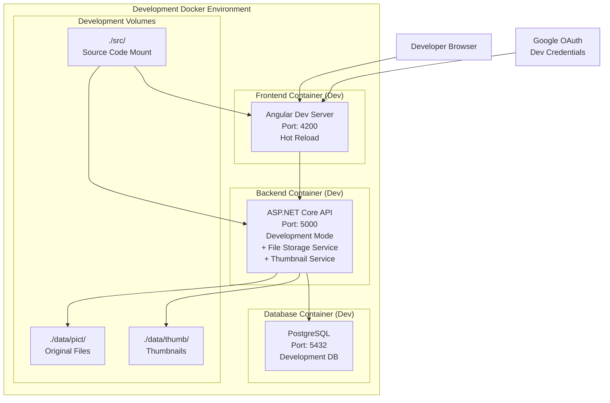
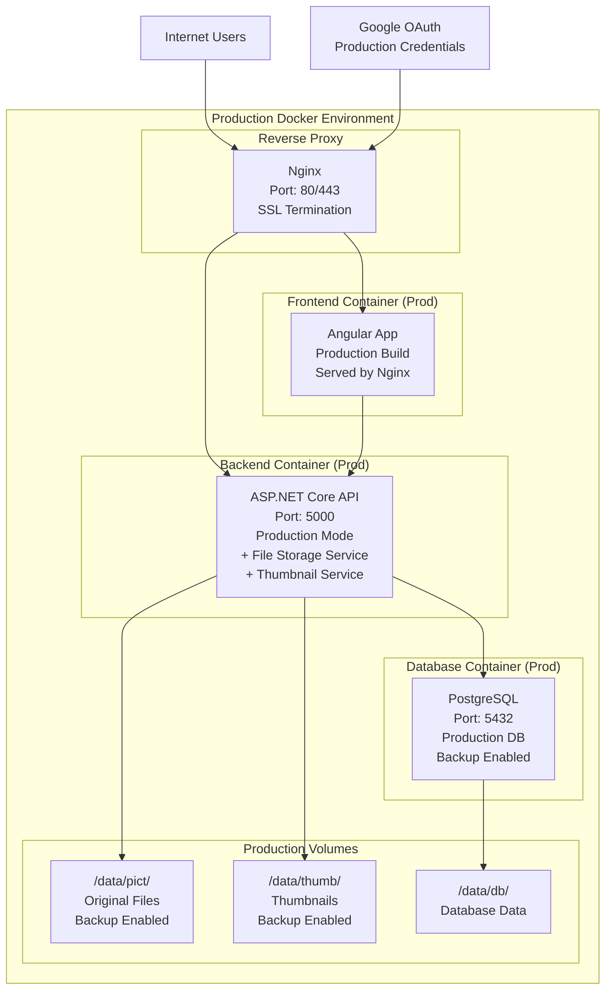

先月、AWSからAIエージェント型IDEである[Kiro(https://kiro.dev)](https://kiro.dev)が発表されました。
プレビュー期間中は無料とのことで、使ってみました。

筆者はプレビュー期間中のKiroを使い、自宅サーバーでの稼働を想定したアルバムアプリを作ってみました。
これから数回に分けて、実際にKiroを使っての開発の記録を公開したいと思います。

:::info
使用したKiroのバージョンは0.1.25になります。
:::

## 1. 初手のプロンプト

Kiroを起動し空のフォルダを開くと、下図のような画面が表示されます。

  

初手として、「Spec」モードを選択し、下記の指示を与えました。

```text:筆者
アルバムアプリを作りたい。
フロントエンドはAngular、バックエンドはASP.NET Coreで。
実行環境と開発環境はDockerコンテナ上で動くこと。
```

レビューしやすいように筆者の慣れているフレームワークを指定しました。
Kiroが対応しているかどうかは分かりませんが。

Kiroの返答です。

```text:Kiro
アルバムアプリの開発ですね。Angular フロントエンドと ASP.NET Core バックエンド、Docker 環境での構成という素晴らしいアイデアです。

まず、この機能のための要件文書を作成しましょう。
Created requirements.md

要件文書を作成しました。この文書では、アルバムアプリの主要な機能を6つの要件に分けて整理しています：
1. ユーザー認証とアカウント管理 - 安全なログイン・登録機能
2. 写真のアップロードと管理 - 画像ファイルの処理と管理
3. アルバムの作成と整理 - 写真のグループ化と整理
4. アルバムの共有とプライバシー - 他ユーザーとの共有機能
5. Docker環境での開発・実行 - コンテナ化された環境
6. レスポンシブUIとユーザビリティ - 様々なデバイス対応

各要件にはユーザーストーリーと具体的な受け入れ基準（EARS形式）を含めています。

要件は適切に見えますか？もしそうであれば、設計に進むことができます。
```

[要件定義書(requirements.md)](https://github.com/NoriyukiYagi/kiro-album-app/blob/v0.0.1/.kiro/specs/album-app/requirements.md)が作成されました。

一部抜粋したものを下図に示します。

  

アルバムアプリというキーワードから一般的なユーザーストーリーを出力し、それに必要な機能をリスト化してくれました。

受け入れ基準もあり、これはそのまま受け入れテストとして使用できそうです。

## 2. 要件の追加・修正

次に、下記の指示を与え、要件の追加・修正をしました。

```text:筆者
ユーザー認証はGoogleアカウントを使用すること。
管理者権限のあるユーザーのみ、ログイン可能なユーザーを追加・削除ができること。
管理者権限のあるユーザーは、バックエンドアプリケーションの設定ファイルで可能なこと。
写真だけでなく、動画もアップロード可能であること。
アップロード可能なファイルの上限は100MBであること。
アップロード可能なファイルの拡張子はJPG, PNG, HEIC, MP4, MOVであること。
ファイルのメタ情報から日付を取得し、『/data/pict/<YYYYMMDD>』というパターンのディレクトリを作成し、その中にファイルを保存すること。
ファイルのサムネイル画像を作成し、『/data/thumb/<YYYYMMDD>』というパターンのディレクトリを作成し、その中にサムネイル画像を保存すること。
写真の一覧はサムネイル画像を表示すること。
サムネイル画像のサイズは縦幅、横幅が300ピクセル以下となること。
```

Kiroの返答です。

```text:Kiro
アルバムアプリの仕様を理解しました。Angular フロントエンド、ASP.NET Core バックエンド、Docker 環境での写真・動画管理アプリですね。

まず要件定義書を作成します。
Accepted edits to requirements.md

要件定義書を作成しました。Angular フロントエンド、ASP.NET Core バックエンド、Docker 環境での写真・動画アルバムアプリの要件を EARS 形式で整理しています。

主な要件は以下の通りです：
・Google OAuth 認証とユーザー管理
・写真・動画のアップロード（100MB制限、特定拡張子のみ）
・メタデータベースの日付別ファイル整理
・サムネイル画像の自動生成（300px以下）
・サムネイル一覧表示
・Docker コンテナでの動作環境

要件定義書の内容は適切でしょうか？修正が必要な箇所があれば教えてください。問題なければ、設計フェーズに進みます。
```

[要件定義書(requirements.md)](https://github.com/NoriyukiYagi/kiro-album-app/blob/v0.0.2/.kiro/specs/album-app/requirements.md)が修正されました。

一部抜粋したものを下図に示します。

  

内容ががらりと変わりましたが、特に問題がないように見えます。

設計へ進んでみましょう。

## 3. 設計

プロンプトにある『Move to design phase』ボタンを押して設計フェーズに進みます。

Kiroの返答です。

```text:Kiro
要件が承認されました。次に設計フェーズに進みます。

まず、技術スタックと実装に必要な情報を調査します。
Searched workspace
Angular と ASP.NET Core の統合パターンを調査
Read file(s) requirements.md

要件を基に設計文書を作成します。技術スタックの選定と各コンポーネントの設計を行います。
Created design.md

設計文書を作成しました。主要な設計決定事項：
アーキテクチャ:
・Docker コンテナベースのマイクロサービス構成
・Angular フロントエンド + ASP.NET Core バックエンド + PostgreSQL
・永続化ボリュームによるファイル管理
技術選定:
・画像処理: ImageSharp（.NET ネイティブ）
・動画処理: FFMpegCore（FFmpeg ラッパー）
・認証: Google OAuth 2.0
・データベース: PostgreSQL（Docker 対応）
セキュリティ:
・JWT トークンベース認証
・管理者権限の設定ファイル管理
・ファイルサイズ・拡張子検証
ファイル管理:
・メタデータベースの日付別ディレクトリ構造
・サムネイル自動生成（300px制限）
・永続化ボリュームによるデータ保護

設計文書の内容は適切でしょうか？技術選定やアーキテクチャについて修正が必要な箇所があれば教えてください。問題なければ、実装タスクの作成に進みます。
```

[設計文書(design.md)](https://github.com/NoriyukiYagi/kiro-album-app/blob/v0.1.0/.kiro/specs/album-app/design.md)が作成されました。

Mermaid記法で記述されたシステム構成図が文法エラーになっていたので手直ししました。→[修正した設計文書(design.md)](https://github.com/NoriyukiYagi/kiro-album-app/blob/v0.1.1/.kiro/specs/album-app/design.md)

一部抜粋したものを下図に示します。

  

技術調査してから要件をベースに設計しています。
人間が設計するのと変わらないステップを踏んでいるところが面白いと思いました。

システム構成図はそれっぽいですが、違和感があります。



『File Storage Service』『Thumbnail Service』はバックエンドコンポーネントなのでASP.NET Coreと同列にあるのはおかしいです。

また、『Nginx (リバースプロキシ、本番環境用)』と記載があり、本番環境用のシステム構成も考えられているのだから、システム構成図は開発環境と本番環境で分けてもらいたかったです。

システム構成図以外は問題無さそうに見えます。

## 4. システム構成図の修正依頼

開発環境のシステム構成図と本番環境のシステム構成図を分けてもらいたいので、Kiroに依頼してみました。

```text:筆者
開発環境のシステム構成図と本番環境のシステム構成図を分けて描いて。
```

Kiroの返答です。

```text:Kiro
設計文書を更新して、開発環境と本番環境のシステム構成図を分けて記載します。
Error(s) while editing design.md
Unable to replace text, trying a different approach...

設計文書の該当箇所を確認して正確に置換します。
Read file(s) design.md 10 - 51
Accepted edits to design.md

開発環境と本番環境のシステム構成図を分けて更新しました。
開発環境の特徴:
・Angular Dev Server でホットリロード対応
・ソースコードのボリュームマウント
・開発用 Google OAuth 認証情報
・ローカルディレクトリへのファイル保存
本番環境の特徴:
・Nginx リバースプロキシによる SSL 終端
・Angular プロダクションビルド
・データベースとファイルのバックアップ機能
・本番用 Google OAuth 認証情報

更新された設計文書の内容は適切でしょうか？開発環境と本番環境の構成図について、他に修正が必要な箇所があれば教えてください。問題なければ、実装タスクの作成に進みます。
```

[設計文書(design.md)](https://github.com/NoriyukiYagi/kiro-album-app/blob/v0.1.2/.kiro/specs/album-app/design.md)が修正されました。

本番環境のシステム構成図が文法エラーとなっていたため手直ししました。→[修正した設計文書(design.md)](https://github.com/NoriyukiYagi/kiro-album-app/blob/v0.1.3/.kiro/specs/album-app/design.md)

『File Storage Service』、『Thumbnail Service』の件に関しても直して欲しいので、Kiroに指摘しました。

```text:筆者
システム構成図の『File Storage Service』、『Thumbnail Service』は、ASP.NET Core APIに含まれるのであれば、不要なのでは？
```

Kiroの返答です。

```text:Kiro
おっしゃる通りです。File Storage Service と Thumbnail Service は ASP.NET Core API 内のサービスクラスなので、別のコンテナとして表示する必要はありません。構成図を修正します。
Error(s) while editing design.md
Unable to replace text, trying a different approach...

現在のファイル内容を確認して正確に置換します。
Read file(s) design.md 10 - 81　
3 edits to file design.md
Read file(s) design.md 65 - 86
Accepted edits to design.md

システム構成図を修正しました。File Storage Service と Thumbnail Service は ASP.NET Core API 内のサービスクラスとして表現し、独立したコンテナではなく API の一部として明記しました。

修正された設計文書の内容は適切でしょうか？他に修正が必要な箇所があれば教えてください。問題なければ、実装タスクの作成に進みます。
```

[設計文書(design.md)](https://github.com/NoriyukiYagi/kiro-album-app/blob/v0.1.4/.kiro/specs/album-app/design.md)が修正されました。

最終的にシステム構成図は下図になりました。

#### 開発環境構成


#### 本番環境構成


良い感じになりました。次のステップに進んでみましょう。

## 5. 実装計画

プロンプトにある『Move to implementation plan』ボタンを押して実装計画に進みます。

Kiroの返答です。

```text:Kiro
設計が承認されました。次に実装タスクを作成します。
Read file(s) requirements.md design.md

要件と設計を基に実装タスクを作成します。
Created tasks.md

実装計画を作成しました。20のタスクに分けて、段階的に機能を実装していく計画です。
主な実装の流れ：
基盤構築（タスク1-2）:
・Docker 環境設定
・データベース・エンティティ設定
認証機能（タスク3-4）:
・Google OAuth 実装
・ユーザー管理機能
ファイル管理（タスク5-9）:
・アップロード機能
・メタデータ抽出・整理
・サムネイル生成
・API 実装
フロントエンド（タスク10-16）:
・Angular プロジェクト設定
・各種コンポーネント実装
品質・デプロイ（タスク17-20）:
・エラーハンドリング
・本番環境設定
・テスト実装
・統合・文書化
各タスクは要件定義の受け入れ基準に対応しており、テスト駆動開発を意識した段階的な実装が可能です。

実装タスクの内容は適切でしょうか？タスクの分割や順序について修正が必要な箇所があれば教えてください。問題なければ、仕様作成は完了です。
```

[実装タスク(task.md)](https://github.com/NoriyukiYagi/kiro-album-app/blob/v0.2.0/.kiro/specs/album-app/tasks.md)が作成されました。

一部抜粋したものを下図に示します。

  

問題無さそうなので、プロンプトの『Finalize task list』ボタンを押します。

Kiroの返答です。

```text:Kiro
実装タスクが承認されました！

アルバムアプリの仕様作成が完了しました。以下の成果物が作成されています：
・要件定義書 (.kiro/specs/album-app/requirements.md): 7つの主要要件を EARS 形式で定義
・設計文書 (.kiro/specs/album-app/design.md): システム構成、技術スタック、データモデル、API 設計
・実装計画 (.kiro/specs/album-app/tasks.md): 20の段階的な実装タスク
これで Angular + ASP.NET Core + Docker による写真・動画アルバムアプリの開発準備が整いました。

実装を開始する場合は、tasks.md ファイルを開いて、各タスクの横にある「Start task」ボタンをクリックすることで、段階的に機能を実装していくことができます。最初のタスク「Docker 環境とプロジェクト構造の設定」から始めることをお勧めします。
```

実装の準備が整いました。次回からは実装フェーズに入ります。

## ここまでの感想

まず、要件定義書、設計書をちゃんと記述してくれるのが素晴らしいと思いました。
内容を確認してから次のフェーズに移行できるため、安心感があります。

特定の業務に特化したアプリケーションであっても、要件リストやユーザーストーリーを与えることで要件定義書の作成が可能かもしれません。

自動生成される要件定義書や設計書の内容に関しても、システム構成図以外は問題ありませんでした。

実際の業務でも活躍できそうな感じです。
