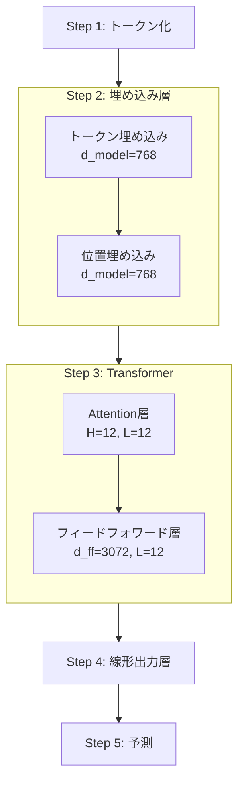
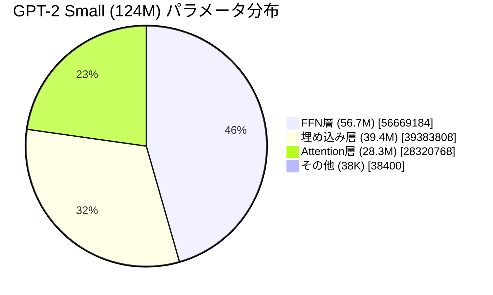

この記事は夏のリレー連載2025 3日目の記事です。

:::check

本記事は、次のような読者層を想定しています。

* パラメーター数とLLM性能の関係を直感的に理解したい方
* Transformerの仕組みを概観し、学習の足がかりを得たい方

詳細な理論解説ではなく **「全体像の把握」** を目的としています。より深い学習を希望される場合は、本文中で紹介する[参考文献](https://book.mynavi.jp/ec/products/detail/id=146901)をご参照ください。

:::

# 1.導入

## パラメータ数への本質的な疑問

大規模言語モデルでは、パラメータ数がしばしば主要な指標として示されます。
たとえば2025年8月5日にOpenAIが発表[^1]した「gpt-oss-20b」と「gpt-oss-120b」も、モデル名にパラメータ規模を含めています。これは必要メモリ量の目安であると同時に、性能水準を暗示するための数字と解釈されます。

けれども、**なぜパラメータ数が多いと性能が良くなる**と言えるのでしょうか？ その理由を理解するには、各パラメータが実際にどのように働いているかを分解して見る必要があります。

## 調査手法と参考文献

この疑問に答えるため、『[つくりながら学ぶ！LLM自作入門（マイナビ出版）](https://book.mynavi.jp/ec/products/detail/id=146901)』を参考とし、実際にGPT-2 smallで用いられている124Mパラメータを分解し、各パラメータがどのような役割を果たしているのかを実測してみました。

@[og](https://book.mynavi.jp/ec/products/detail/id=146901)

本書籍は、**LLMの理論をソースコードとともにステップバイステップで解説**している点が大きな特徴です。[原著者が作成したGitHubリポジトリ](https://github.com/rasbt/LLMs-from-scratch)も参考になり、その情報量には驚かされます。

@[og](https://github.com/rasbt/LLMs-from-scratch)

本記事では、これらのリソースを用いてパラメータの働きを実際に確かめました。パラメーター数を単なる数字の羅列ではなく、それぞれのパラメータがどのように協調して「理解」や「生成」を実現しているのか、2章で詳しく見ていきましょう。

# 2.実測 - GPT-2 small (124M)の解剖

:::alert
本章の説明は、著者(私)の書籍理解と実測結果をもとに整理した内容です。説明は理解しやすさを優先して一部を簡略化しています。より厳密な理論や完全な数式展開を求める方は、[参考文献](https://book.mynavi.jp/ec/products/detail/id=146901)をご参照ください。内容に誤りや不足があれば、ぜひフィードバックをお寄せいただければ幸いです。
:::

## 2-1. 処理ステップ全体像

GPT-2がテキストを処理する流れを、Githubで公開されている書籍第4章の図表[^2-1]をもとに、簡潔に5Stepにまとめました。（残差接続やドロップアウトなど、かなり省略しています）


また、フローの中に記述されている、d_model=768、H=12、L=12、d_ff=3072の4つは調整可能なパラメーターを指します。調整可能なパラメーターはそれ以外にも存在しますが、PyTorch公式のTransformerドキュメント[^2-2]の上から順に選んだ4つを本記事では追跡することとします。この4つの調整可能なパラメーターについては、後の3-2章で後述します。



### 処理の概要

例えば、「Hello, I am」という入力が入った場合、以下のように処理され、次に続く出力（「student」など）が確定するイメージです。

**Step 1: トークン化**
* テキストをトークンID列に変換：`"Hello, I am" → [15496, 11, 314, 716]`

**Step 2: 埋め込み層**
* トークン埋め込み - 各トークンIDを768次元ベクトルに変換
* 位置埋め込み - トークンの位置情報を768次元で付加

**Step 3: Transformerブロック（×12層）**
* Attentionモジュール - トークン間の関係性を計算
* フィードフォワードネットワーク - 情報の変換と圧縮

**Step 4: 線形出力層**
* 最終正規化
* 重み共有による出力投影

**Step 5: 予測**
* Softmaxで確率計算
* 50,257候補から選択

## 2-2. ステップごとのパラメータ使用量（読み飛ばしOK！）
この章では、各ステップごとのパラメーター使用量を説明します。

正確な説明のため、[原著者のGithubリポジトリで公開しているソースコード](https://github.com/rasbt/LLMs-from-scratch/blob/main/ch04/01_main-chapter-code/gpt.py)を生成AIで解析しステップ別に整理しました。ただし、生成AIは正確な数字の計算が不得手ですので、パラメータ数については以下検証用コードを実行した結果を用います。

<details>
<summary>パラメータ数検証用コード（クリックで開く）</summary>

> ```python:check_param.py
> # GPT-2 124M parameter calculation based on gpt.py implementation
> 
> # GPT-2 124M configuration from gpt.py
> vocab_size = 50257
> context_length = 1024
> emb_dim = 768
> n_heads = 12
> n_layers = 12
> qkv_bias = False  # No bias in Q,K,V projections
> 
> print("=" * 60)
> print("GPT-2 124M Parameter Count (based on gpt.py)")
> print("=" * 60)
> 
> # 1. Embedding layers
> token_emb = vocab_size * emb_dim
> pos_emb = context_length * emb_dim
> emb_total = token_emb + pos_emb
> 
> print("\n1. Embedding Layers:")
> print(f"   Token embedding: {token_emb:,}")
> print(f"   Position embedding: {pos_emb:,}")
> print(f"   Subtotal: {emb_total:,}")
> 
> # 2. Transformer block (per layer)
> print("\n2. Transformer Block (per layer):")
> 
> # MultiHeadAttention
> # From gpt.py: W_query, W_key, W_value with qkv_bias=False
> qkv_weights = emb_dim * emb_dim * 3  # No bias
> # From gpt.py: out_proj has bias by default
> out_proj = emb_dim * emb_dim + emb_dim  # Weight + bias
> attention_total = qkv_weights + out_proj
> 
> print(f"   a) MultiHeadAttention:")
> print(f"      Q,K,V weights (no bias): {qkv_weights:,}")
> print(f"      Output projection (with bias): {out_proj:,}")
> print(f"      Attention total: {attention_total:,}")
> 
> # FeedForward
> # From gpt.py: nn.Linear(emb_dim, 4*emb_dim) with bias
> ffn_fc = emb_dim * (4 * emb_dim) + (4 * emb_dim)
> # From gpt.py: nn.Linear(4*emb_dim, emb_dim) with bias
> ffn_proj = (4 * emb_dim) * emb_dim + emb_dim
> ffn_total = ffn_fc + ffn_proj
> 
> print(f"   b) FeedForward:")
> print(f"      First layer (768->3072): {ffn_fc:,}")
> print(f"      Second layer (3072->768): {ffn_proj:,}")
> print(f"      FFN total: {ffn_total:,}")
> 
> # LayerNorm (2 per block: norm1 and norm2)
> # From gpt.py: scale and shift parameters
> ln_params = emb_dim * 2 * 2  # 2 params (scale, shift) × 2 LayerNorms
> 
> print(f"   c) LayerNorm x2: {ln_params:,}")
> 
> # Total per block
> block_total = attention_total + ffn_total + ln_params
> print(f"   Total per layer: {block_total:,}")
> 
> # 3. All transformer layers
> transformer_total = block_total * n_layers
> print(f"\n3. All Transformer Layers ({n_layers} layers):")
> print(f"   Total: {transformer_total:,}")
> 
> # 4. Final layers
> # From gpt.py: final_norm (LayerNorm)
> final_ln = emb_dim * 2  # scale and shift
> # From gpt.py: out_head shares weights with token embedding
> # nn.Linear(emb_dim, vocab_size, bias=False)
> # Weight is shared with token_emb, so we don't count it again
> 
> print(f"\n4. Final Layers:")
> print(f"   Final LayerNorm: {final_ln:,}")
> print(f"   Output head: Weight shared with token embedding (not counted)")
> 
> # 5. Total
> total_params = emb_total + transformer_total + final_ln
> 
> print(f"\n" + "=" * 60)
> print(f"TOTAL PARAMETERS: {total_params:,}")
> print(f"=" * 60)
> 
> # Verify the calculation
> print(f"\nExpected (GPT-2 124M): 124,412,160")
> print(f"Calculated: {total_params:,}")
> print(f"Match: {total_params == 124412160}")
> 
> # Breakdown summary
> print(f"\nParameter Distribution:")
> print(f"  Embeddings: {emb_total:,} ({emb_total/total_params*100:.1f}%)")
> print(f"  Transformer: {transformer_total:,} ({transformer_total/total_params*100:.1f}%)")
> print(f"  Output: {final_ln:,} ({final_ln/total_params*100:.1f}%)")
> ```

</details>

:::check
ソースコードベースの説明ですので、結論だけを知りたい読者は次の章に進んでください。
:::

### Step 1: トークン化

**使用パラメータ：0個**

テキストを数字に変換
* BPE（Byte Pair Encoding）による辞書ベースの変換
* 学習済み語彙（50,257トークン）に基づく

### Step 2: 埋め込み層（39,383,808個）

**トークン埋め込み：38,597,376個**
* 50,257語彙 × 768次元 = 38,597,376個のパラメータ（参考：GPT-3では埋込サイズは12,288次元）
* 各トークンIDに対応する768次元ベクトルを埋め込み表から取得

**位置埋め込み：786,432個**
* 1,024位置 × 768次元 = 786,432個のパラメータ
* 各位置に対応する768次元ベクトルを埋め込み表から取得

**埋め込み加算（パラメータなし）**
* トークン埋め込み + 位置埋め込み（要素ごと）
* Dropout(0.1)を適用

### Step 3: Transformerブロック（12層、計85,026,816個）

各層で7,085,568個のパラメータを使用：

**MultiHeadAttention（2,360,064個）**

12ヘッド並列処理（各ヘッド64次元）：
* Query投影：`nn.Linear(768, 768, bias=False)` → 589,824個
* Key投影：`nn.Linear(768, 768, bias=False)` → 589,824個  
* Value投影：`nn.Linear(768, 768, bias=False)` → 589,824個
* 出力投影：`nn.Linear(768, 768)` → 590,592個（bias含む）

処理の流れ：
1. 入力ベクトル [B(Batch size), T(Sequence length), 768] を受け取る
2. Q, K, V を線形変換で生成し、12ヘッドに分割 [B, 12, T, 64]
3. Attentionスコアを計算：scores = (Q · Kᵀ) / √64
4. 因果マスクを適用後、softmaxで正規化して Attentionの重み を得る [B, 12, T, T]
5. コンテキストベクトルを計算：context = weights · V [B, 12, T, 64]
6. 12ヘッドを結合し、出力投影で [B, T, 768] に戻す

**FeedForward（4,722,432個）**

4倍の次元拡張と圧縮：
* 第1層：`nn.Linear(768, 3072)` → 2,362,368個（weight+bias）
* GELU活性化（パラメータなし）
* 第2層：`nn.Linear(3072, 768)` → 2,360,064個（weight+bias）

**LayerNorm（3,072個）**

残差接続の前後で正規化：
* norm1（Attention前）：1,536個（scale:768 + shift:768）
* norm2（FFN前）：1,536個（scale:768 + shift:768）

**残差（ショートカット）接続とDropout**
* パラメータなし、勾配の流れを改善

### Step 4: 出力層（1,536個）

**最終LayerNorm：1,536個**
* `LayerNorm(768)`：scale(768) + shift(768)

**出力投影（重み共有）**
* `nn.Linear(768, 50257, bias=False)`
* トークン埋め込みの転置を使用（38,597,376個を節約）

### Step 5: 予測（パラメータなし）

**Softmax確率計算**
* 50,257語彙から次トークンを選択
* 温度サンプリングやTop-k/Top-p手法を適用可能

## 2-3. 124Mパラメータの全体像

解析の結果、GPT-2 smallの124,412,160個のパラメータは、以下のように配分されていることがわかりました。

```
Step 1: トークン化               0個（0%）
Step 2: 埋め込み層        39,383,808個（31.7%）
  ├─ トークン埋め込み   38,597,376個（31.0%）
  └─ 位置埋め込み          786,432個（0.6%）
Step 3: Transformer層     85,026,816個（68.3%）
  ├─ Attention (12層分、12ヘッド)   28,320,768個（22.8%）
  ├─ FFN (12層分)         56,669,184個（45.5%）
  └─ LayerNorm (12層分)       36,864個（0.03%）
Step 4: 出力層               1,536個（0.001%）
  └─ 最終LayerNorm（投影は重み共有）
Step 5: 予測                    0個（0%）
────────────────────────────────
合計：                 124,412,160個
                       ≈ 124.4M（1億2400万）

※重み共有により38,597,376個を節約
（共有しない場合は163,009,536個になる）
```

# 3.結論と考察 - パラメータ数が性能を決める理由

## 3-1. パラメータ数の面で、Attentionは全体の22.8%を占める

前章で得られたGPT-2のパラメータ数の内訳を円グラフで示します：



Attention層は22.8%にすぎず、むしろFFN層が45.5%を占めています。埋め込み層も3割を超えており、**大部分のパラメーターはAttention以外に割かれている**ことがわかりました。

この結果は興味深いものでした。というのも、「Attention Is All You Need」という論文タイトル[^3]から、著者は モデルの大部分のパラメータはAttention層に使われているはず だと考えていたからです。

## 3-2. パラメータ数の増加がもたらす4つの効果：解像度・多様性・特徴理解・推論の深さ

では次に、それぞれの層のパラメーターをどのように調整すればLLMの性能が伸びるのか考えていきましょう。本記事では、2-1章で定義した4つの調整可能なパラメータについて考察します。


**埋め込み次元 (d_model)**
各トークンを何次元のベクトルで表現するかを決めるパラメータです。次元数が大きいほど文脈の情報を細かく保持でき、単語の意味やニュアンスを精緻に捉えられます。

直感的なたとえとしては「質問数を増やすことで対象を正確に特定できる二十の質問ゲーム[^4]」に近いと感じましたが、ここでは「次元数が多いほど単語を精密に区別できる」というイメージを掴んでいただければ十分です。

→ **単語の解像度** を高めるパラメータ。

**Attentionヘッド数 (H)**
入力を複数の視点で並列的に処理するパラメータです。ヘッド数を増やすことで文脈を多角的に捉えられるようになります。

直感的な例を挙げると、「bank」という英単語は、「銀行」と「川の土手」の両方の意味を持ちますが、そのどちらの意味を指すのかは文脈によって異なります。複数のヘッドを使うことで、それぞれの意味を同時に追跡でき、文脈に応じて最も適切な解釈を選択できるイメージです。
→ **解釈の多様性** を広げるパラメータ。

**FFN中間層 (d_ff)**
Attentionで得た情報を非線形に変換する層です。値を大きくすると、単純な平均処理では表せない複雑な特徴を再構成でき、モデルの表現力が高まります。

比喩的に言えば、画像処理の非線形フィルタが線形フィルタ（平均フィルタ）より高精度にノイズを除去できる[^5]のと似ています。
※処理原理は異なりますが、「より複雑な変換が可能になる」という点をイメージする比喩として紹介します。
→ **複雑な特徴理解力** を強化するパラメータ。

**層数 (L)**
Transformerブロックをいくつ積み重ねるかを示すパラメータです。層を深くすることで推論を段階的に繰り返せるようになり、長距離依存や複雑な関係性を捉えやすくなります。
→ **推論の深さ** を増すパラメータ。

結論として、**パラメータ数を増やすことで、単語の解像度・多様性・特徴理解・推論の深さが向上することで、LLMの性能向上が期待できる**といえそうです。

# おわりに

この記事を通じて、次のような視点を得ていただけたのではないでしょうか。

- 「アテンションがすべて」ではなく、パラメーター全体のバランスが重要であること
- 「パラメーター数＝性能向上」という単純な理解を超えた新しい視点を持てること

著者自身も、2025年8月の社内ハッカソンをきっかけに[参考文献](https://book.mynavi.jp/ec/products/detail/id=146901)を学び直す中で、Transformerの仕組みを改めて整理できました。本記事が読者の皆さまにとっても、学習を進める一助となれば幸いです。


[^1]:[OpenAI:オープンウェイトリーズニングモデルの限界を押し広げる gpt-oss-120b と gpt-oss-20b](https://openai.com/ja-JP/index/introducing-gpt-oss/)

[^2-1]:[Chapter 4: Implementing a GPT model from Scratch To Generate Text](https://github.com/rasbt/LLMs-from-scratch/blob/main/ch04/01_main-chapter-code/ch04.ipynb)

[^2-2]:[PyTorch公式ドキュメント（Transformer）](https://docs.pytorch.org/docs/stable/generated/torch.nn.Transformer.html)

[^3]:[Attention Is All You Need (Vaswani et al., 2017)](https://arxiv.org/abs/1706.03762)

[^4]:[Wikipedia 二十の質問](https://ja.wikipedia.org/wiki/%E4%BA%8C%E5%8D%81%E3%81%AE%E8%B3%AA%E5%95%8F)

[^5]:[画像フィルタ～より容易な欠陥検出のために（前編）
](https://www.visco-tech.com/newspaper/column/detail19/?utm_source=chatgpt.com)
