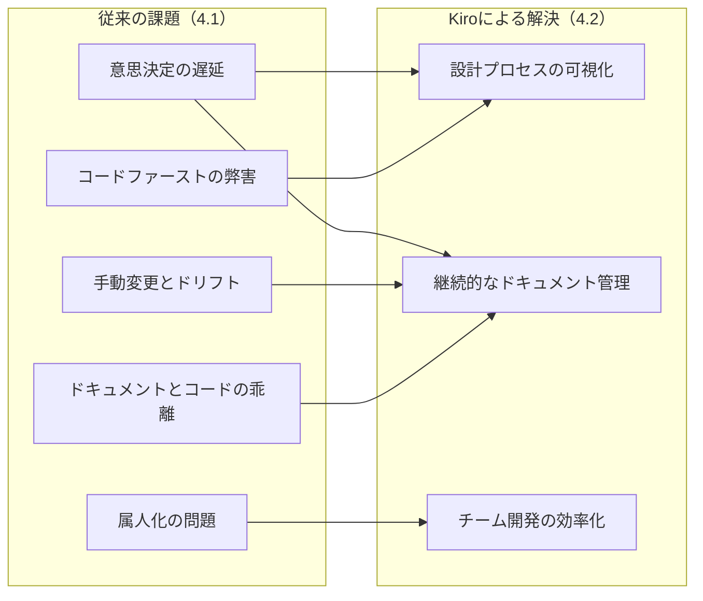
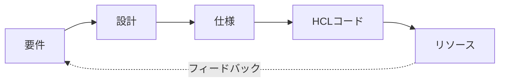

## 1. はじめに
業務で利用しているインフラの仕様を正確に把握できていますか？

個人開発や小規模なシステムであれば、インフラの全体像を把握することは比較的容易です。しかし、組織のシステムが大規模化するにつれて、基盤や利用プロダクトの数は増加し、すべての仕様を把握している人は少なくなります。

重要なのは、すべてを網羅的に理解することではなく、担当領域の仕様を正確に把握し、適切な意思決定に活用できることです。

### インフラ仕様把握が困難な理由
なぜインフラリソースの仕様把握が難しいのでしょうか。さまざまな要因がありますが、筆者は「情報の分散と欠如」が根本原因だと考えています。

- **ドキュメントの点在**：設計書、運用手順、変更履歴が異なる場所に散らばっている
- **仕様の不明**：リソースの要件や制約、設計根拠が記録されていない
- **暗黙知の蓄積**：設定の意図や依存関係が担当者の記憶にのみ存在し、担当者の離脱とともに失われる

### 発生する課題とその影響
これらの問題は、DevOpsにおいて以下の課題を引き起こします。

- 変更時の影響範囲が予測できない
- 障害対応時に原因特定に時間がかかる
- 関係者間で共通理解を維持するのが困難
- 技術的負債の蓄積とリスクの増大

その結果、意思決定が遅れ、変更や改善の着手が後ろ倒しになってしまいます。

### 解決手段としてのKiro
この課題を解決する手段として注目したのが「Kiro」です。ソフトウェア開発に関するKiroの記事は既に多数ありますが、インフラ視点での活用事例はまだ少ない状況です。

本記事では、KiroのSpecモードを活用してTerraformワークフローに仕様駆動開発を組み込み、ドキュメント起点のIaCにおけるDevOpsの可能性を考察します。

## 2. 記事の概要
### 対象読者
- TerraformによるIaC経験者
- IaCの仕様・ドキュメント管理を強化したい開発・運用者

### 前提条件
- Kiroバージョン: `0.2.13`
- HCL/Terraformの基礎知識
- AWSリソース構築の基本的な理解

### 本記事で扱わない範囲
- TerraformやHCLの基礎文法
- Kiroの内部AIモデルの仕組み
- 高度なTerraformモジュール設計
- AWS各サービスの詳細な設定方法

## 3. Kiroとは？

::: alert
本記事の内容は執筆時点のパブリックプレビュー版に基づいています。最新情報は公式ドキュメントをご確認ください。
:::

[Kiro](https://kiro.dev/)はAWSが開発するAIエージェント統合型IDEです。
従来のIDEとは異なり、自然言語でのやり取りを通じてコード生成を行える点が特徴です。

プレビュー公開直後に招待制のWaitlistに移行しており、注目度の高さがうかがえます。

Kiroの基本的な操作は[公式Docs](https://kiro.dev/docs/)や、以下弊社ディベロッパーサイトの記事をご参照ください。
- [KiroでAI開発革命!? アルバムアプリをゼロから作ってみた【その1:要件定義・設計・実装計画】](https://developer.mamezou-tech.com/blogs/2025/08/19/kiro-album-app-1/)


### 3.1 Kiroの基本概念
Kiroは開発プロセスを以下の3段階に構造化します。

1. **Requirements（要件）**: 作りたい内容を自然言語のプロンプトで提示し、KiroがEARS（Easy Approach to Requirements Syntax）形式へ自動変換したうえで、その形式に沿って要件を定義。
2. **Design（設計）**: 要件を満たすための技術的な構成を定義。
3. **Spec（仕様）**: 設計を具体的な実装仕様として確定。

EARSは6つの基本型の定型句で要件を簡潔かつ一貫して表現し、曖昧さを減らすテンプレートです。詳細は本稿の範囲外ですが、概要は以下が参考になります。
- [見える化する要求仕様 〜 EARS（Easy Approach to Requirements Syntax）を活用したシステム要求の書き方 〜](https://www.bgarage.co.jp/news/946/)

この段階的なアプローチにより、人またはAIの性格や好みによる「感覚的なコーディング」から厳格な「仕様駆動開発」へのシフトを支援します。
また、RequirementsとDesignは直接要件や設計を記載することで、Specを変更することもできます。

### 3.2 SpecモードとIaCの親和性
特にSpecモードは、要件・設計を文書として整理しつつ、それを直接HCLコードに落とし込む点でIaCとの相性が非常に高い機能です。

 IaCの特性を考えると、この親和性の高さは以下の理由によるものです。
- インフラ構成は明確な要件と制約に基づいて設計される
- リソース間の依存関係が明示的である必要がある
- 変更時の影響範囲を事前に把握する必要がある
- 長期的なDevOpsを見据えた設計が求められる

さらに、仕様や要件をプロンプトとドキュメントビューで確認でき、AIと人が要件・設計・仕様を対話的に磨き込み、コード生成までを一貫できます。

## 4. 従来のIaC開発の課題とKiroによる解決

### 4.1 従来のIaC開発における問題点
多くの組織でTerraformを使ったIaC開発を行っていますが、以下のような課題に直面することが多いです。

**コードファーストの弊害**
- コードから書き始めるため、設計意図が曖昧になりやすい
- 後からドキュメントを書こうとしても、当時の判断基準を思い出せない
- コードレビュー時に「なぜこの構成にしたのか」が分からなくなる

**ドキュメントとコードの乖離**
- ドキュメント（設計・仕様を含む）とTerraformコードを別管理しがちで、コード変更時の更新が後手となり、意思決定履歴と実装が乖離しやすい

**手動変更とドリフト**
- IaC管理外で手動作成してしまう
- 手で作成されたリソースの責任や管理が不十分で不要なリソースが残り続ける（いわゆるドリフトの恒常化）

**属人化の問題**
- 設定の背景や制約が担当者の記憶に依存
- 担当者の異動や退職により知識が失われる
- 新しいメンバーが参画時に理解に時間がかかる

その結果、意思決定が遅れ、変更や改善の着手が後ろ倒しになります。

### 4.2 Kiroによるドキュメント化のメリット
IaCの現場では、コードだけでは「なぜそのような仕様や実装になっているのか」が見えにくくなりがちです。KiroのSpecモードでドキュメント化することで、次のような利点があります。

**設計プロセスの可視化（対応: コードファースト）**
- 要件から設計、実装までの思考プロセスが記録される
- 意思決定の根拠と制約条件が明確になる
- 代替案の検討過程も残すことができる

**継続的なドキュメント管理（対応: 乖離）**
- 変更の履歴や背景が自動的に残る
- レビューや保守が容易になる
- 仕様変更時の影響範囲を事前に把握できる

**チーム開発の効率化（対応: 属人化）**
- チーム間で共有しやすいIaC仕様が作れる
- 関係者間の共通理解を早期に形成できる
- コードレビューの質が向上する

### 4.3 従来の課題とKiroによる解決の対応関係
従来の課題が、Kiroによる解決でどのように解消されるかを示します。


::: info
要件・設計・実装のトレーサビリティの仕組みを構築することが重要です。
Kiroの場合は、Requirements・Design・Specの3つのドキュメントで一貫管理し、
生成されるIaCコードとの整合性を保つことで従来の課題解決を実現していると言えます。
:::

## 5. 実践: KiroでLambdaを使った定期実行システムを構築する

### 5.1 要件の整理（Requirements）
まず、自然言語で要件を整理します。例として、定期的なバッチ処理システムを考えてみましょう。

```
【前提・制約】
- プラットフォーム: AWS
- IaC: Terraform（HCL）
- Terraform v1.13 を使用
- hashicorp/aws の 5.x を使用

【要件】
- 毎日決まった時刻にバッチ処理を自動実行したい
- バッチ処理ではデータの集計や整理を行いたい
- 処理中にエラーが発生した場合はCloudWatchアラームで通知したい
- サーバーレスでコスト効率よく実装したい
- スケジュールは柔軟に変更できるようにしたい
- 将来的に処理内容を拡張できるようにしたい
```

↓入力後のKiroの返答


*簡単な要件をプロンプトに入力後のKiroの返答。最後に内容に問題がないかを確認してから次のフェーズに進む*

### 5.2 設計の具体化（Design）
Kiroに要件を入力すると、以下のような設計案が得られます。
筆者は追加でDevOpsについての記載と、コードのコメント等を日本語で書くように追加しました。

↓入力後のKiroの返答
```
【設計】シンプルなサーバーレス構成
EventBridge Scheduler → Lambda → CloudWatch の直接的な流れ
毎日朝9時に自動実行（cron(0 9 * * ? *)）
エラー時はCloudWatchアラーム → SNS → Email通知

【主要コンポーネント】
EventBridge Scheduler: 毎日朝9時のスケジュール管理
Lambda関数: バッチ処理実行（タイムアウト5分）
CloudWatch Logs: ログ集約（30日保持）
CloudWatch Alarms: エラー監視・通知
SNS Topic: Email通知
SQS Dead Letter Queue: 障害時の再試行対応

【セキュリティ】
最小権限の原則: Lambda実行ロール（CloudWatch Logs書き込みのみ）、EventBridge Schedulerロール（Lambda実行のみ）
リソースタグ: 全リソースに統一タグ付与

【運用・DevOps】
Terraform: 完全なIaC管理
日本語対応: コメント、説明文、エラーメッセージを日本語で記述
監視: Lambda実行状況、エラー率の監視
コスト効率: サーバーレスで必要時のみ課金
```

### 5.3 仕様の確定とコード生成（Spec）
要件・設計が確定すれば、Specでコードを生成しています。
Kiroが生成したHCLコードです（抜粋）。
IAMロールやSNSトピックなど一部の補助リソース定義は簡潔さのため省略しています。

細かい箇所は筆者側から指示を出すことで修正しましたが、
要件と設計で指定した内容のリソースが作成されました。

```hcl
terraform {
  required_version = ">= 1.13.0"
  required_providers {
    aws = {
      source  = "hashicorp/aws"
      version = "~> 5.0"
    }
  }
}

# デフォルトタグ付きのプロバイダー設定
provider "aws" {
  region = "ap-northeast-1"

  default_tags {
    tags = {
      Project     = "batch-processing-system"
      Environment = "production"
      ManagedBy   = "Terraform"
    }
  }
}

# Lambda Function
resource "aws_lambda_function" "batch_processor" {
  filename         = "batch_processor.zip"
  function_name    = "daily-batch-processor"
  role            = aws_iam_role.lambda_role.arn
  handler         = "index.handler"
  runtime         = "python3.12"
  timeout         = 300
  description      = "毎日実行されるバッチ処理用のLambda関数"

  tags = {
    Name    = "daily-batch-processor"
    Purpose = "automated-batch-processing"
  }
}

# EventBridge Scheduler
resource "aws_scheduler_schedule" "batch_schedule" {
  name        = "daily-batch-schedule"
  group_name  = "default"
  description = "毎日午前9時にバッチ処理を実行するスケジュール（JST）"

  flexible_time_window {
    mode = "OFF"
  }

  schedule_expression = "cron(0 9 * * ? *)"
  schedule_expression_timezone = "Asia/Tokyo"

  target {
    arn      = aws_lambda_function.batch_processor.arn
    role_arn = aws_iam_role.scheduler_role.arn
  }
}

# SchedulerがLambda関数を実行できるように許可
resource "aws_lambda_permission" "allow_scheduler" {
  statement_id  = "AllowExecutionFromScheduler"
  action        = "lambda:InvokeFunction"
  function_name = aws_lambda_function.batch_processor.function_name
  principal     = "scheduler.amazonaws.com"
  source_arn    = aws_scheduler_schedule.batch_schedule.arn
}

# Lambda関数のエラーを監視するCloudWatchアラーム
resource "aws_cloudwatch_metric_alarm" "lambda_error_alarm" {
  alarm_name          = "lambda-batch-processor-errors"
  comparison_operator = "GreaterThanThreshold"
  evaluation_periods  = 1
  metric_name         = "Errors"
  namespace           = "AWS/Lambda"
  period              = 300
  statistic           = "Sum"
  threshold           = 0
  alarm_description   = "バッチ処理Lambda関数のエラーを監視するアラーム"
  alarm_actions       = [aws_sns_topic.alerts.arn]

  dimensions = {
    FunctionName = aws_lambda_function.batch_processor.function_name
  }

  tags = {
    Name    = "lambda-error-alarm"
    Purpose = "error-monitoring"
  }
}
```

### 5.4 ドキュメントからコードへの一貫した流れ
このプロセスにより、ドキュメント → HCL → インフラという一貫した流れが実現されます。

1. **要件定義**: ビジネス要件を自然言語で記述
2. **設計検討**: 技術的制約と要件を照らし合わせて構成を決定
3. **仕様確定**: 実装レベルの詳細を含む仕様として確定
4. **コード生成**: HCLコードとして出力
5. **インフラ構築**: Terraformでplan/apply実行

### 5.5 要件・設計を再利用して類似リソースを作る
5.1〜5.3で確定したRequirements/Design/Specを活用して、類似のリソースを簡単に作成できることを確認しました。

例えば「週次実行のバッチ処理を追加したい」という要件に対して、既存のSpecを複製し、以下の簡単な指示をKiroに与えるだけで新しいリソースが生成されました。

```
既存の日次バッチ処理の仕様をベースに、以下の差分で週次バッチ処理を作成してください：
- スケジュール: 毎週日曜日の午前10時
- リソース名: weekly-batch-processor
- 処理内容: 週次レポート生成
```

Kiroは既存の設計パターンを理解し、命名規約やタグ付け、IAM権限設定などを一貫して適用した新しいHCLコードを生成しました。

このように、一度確立したRequirements/Design/Specがあれば、類似リソースの作成が大幅に効率化されることが確認できました。

## 6. ドキュメントとHCLの親和性

### 6.1 HCLの特性とドキュメント化
HCLは抽象度が高く、構成要素や依存関係を明示的に記述する形式です。これは仕様ドキュメントと非常に親和性があります。

**宣言的な記述方式**
HCLは「何を作るか」を宣言的に記述します。これは要件や設計書の記述方法と本質的に同じです。

```hcl
# 設計書: "毎日決まった時刻にバッチ処理を自動実行する"
resource "aws_scheduler_schedule" "batch_schedule" {
  name                = "daily-batch-schedule"
  description         = "毎日午前9時にバッチ処理を実行するスケジュール"
  schedule_expression = "cron(0 9 * * ? *)"
}
```

**構成要素の明確な対応関係**
- ドキュメントで書いた構成要素が、そのままHCLのresourceやmoduleへ対応
- 仕様で定義した変数や要件が、そのままvariableやoutputへ展開
- 依存関係がコード上でも明示的に表現される

### 6.2 仕様駆動開発の実現
Kiroを使うことで、以下のような仕様駆動開発が実現できます。

:::: info
トレーサビリティ（traceability）の一般的な定義
- 要件・設計・実装・テストなどの成果物間の関係を双方向にたどれる性質
::::

**トレーサビリティの確保**
Kiroでは要件から実際のリソースまでの一連の流れが記録され、双方向の追跡が可能になります。



**変更管理の改善**
- 仕様変更時は要件レベルから見直し
- 影響範囲を設計段階で把握
- コード変更の妥当性を仕様で検証

仕様を残すことで、HCLコードの意味が曖昧にならない点が重要です。結果として、「コードは仕様から派生したもの」であることが保証され、設計と実装の乖離が起きにくい点が最大の価値です。


## 7. 今後の展望

**AIとの協調開発の進化**
KiroのようなAIエージェント統合型IDEは、今後さらに進化していくことが予想されます。
- より高度な設計パターンの提案
- 過去の実装例からの学習機能
- リアルタイムでの最適化提案

**IaC開発文化の変革**
仕様駆動開発の普及により、インフラ開発の文化自体が変わる可能性があります。
- 「なぜ」を重視する設計文化
- ドキュメントファーストな開発スタイル
- 継続的改善を前提としたDevOps

インフラ開発における「感覚的なコーディング」から「仕様駆動開発」への転換は、単なるツールの導入以上の価値をもたらします。組織全体でのインフラ管理能力の向上と、技術的負債の削減を通じて、より安定したDevOpsの実践を推進していきましょう。

## 8. まとめ
KiroのSpecモードを利用することで、HCLによるIaC管理に以下の新しい価値をもたらします。

**技術的価値**
- ドキュメントを基点にした一貫性の高い構成管理
- ドキュメントから直接コードを生成するシームレスな開発体験
- ドキュメントとHCLの高い親和性により、設計と実装の乖離を防止

**組織的価値**
- チーム内での知識共有とナレッジ蓄積の促進
- 関係者間の共通理解を継続的に促進
- 長期的なDevOps推進および保守にかかるコストの削減

**文化的価値**
- コードを書く前に仕様を整理する文化の定着
- 設計決定の背景と根拠を明文化する設計思考
- 継続的改善を前提とした開発プロセス

Terraformに慣れている方でも、Kiroを取り入れることで「コードを書く前に仕様を整理する」文化を自然に導入できます。これにより、長期的なDevOpsの実践しやすさとチーム開発の生産性を両立し、IaCにおけるDevOpsの持続可能性が高まるでしょう。

繰り返しになりますが、筆者が最も重要だと考えるのは、「感覚的なコーディング」から「仕様駆動開発」へシフトすることです。
これはインフラに限らず、ソフトウェアにおいても概ね同じことが言えると考えます。
これを意識して、これからのAI時代と共にDevOpsによる改善活動を考えていきたいと考えます。
