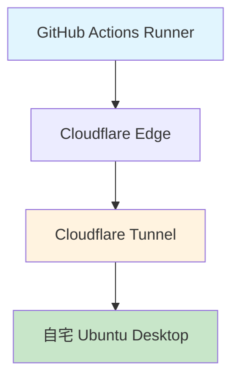
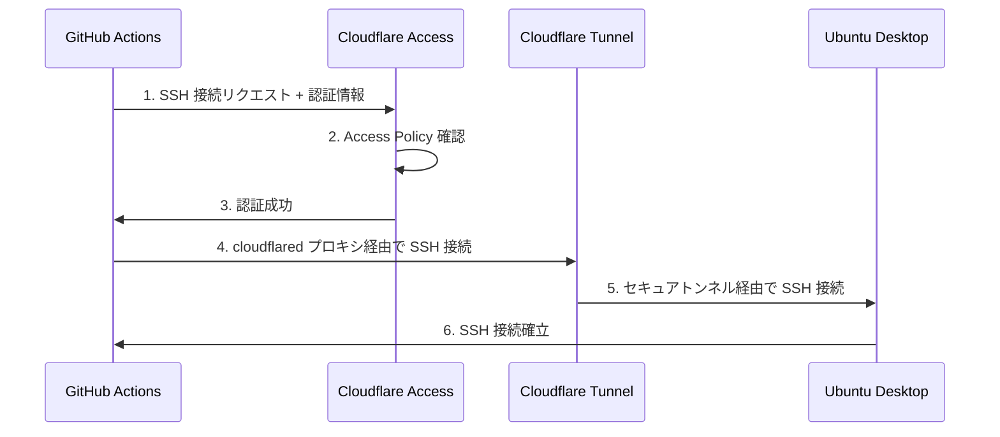
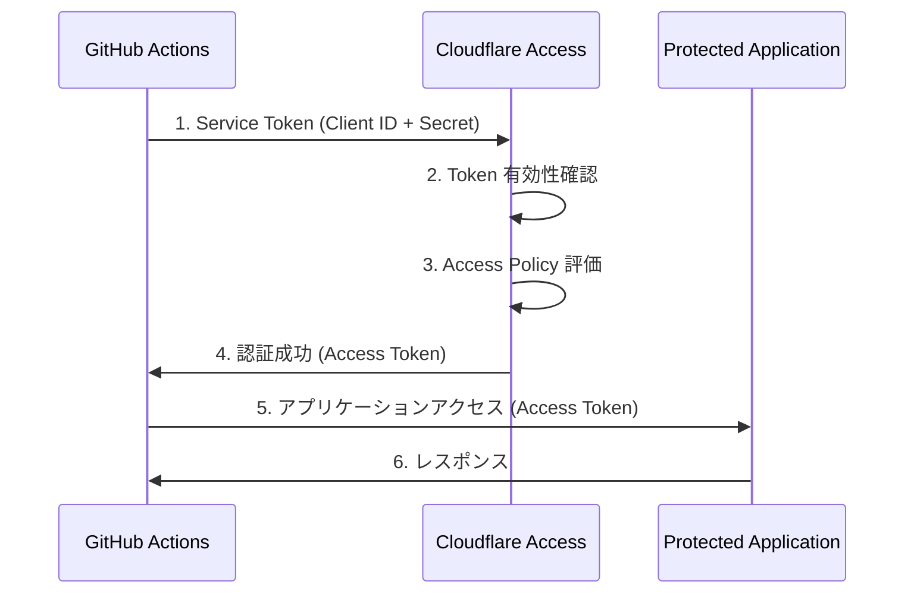
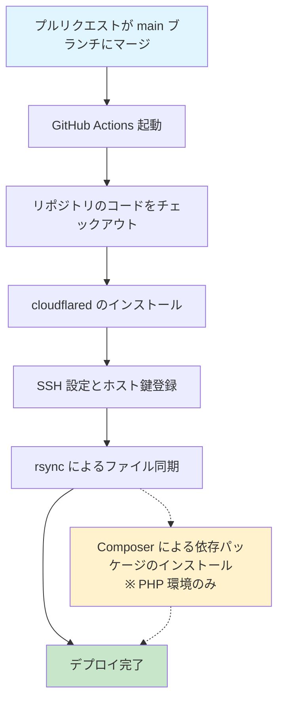
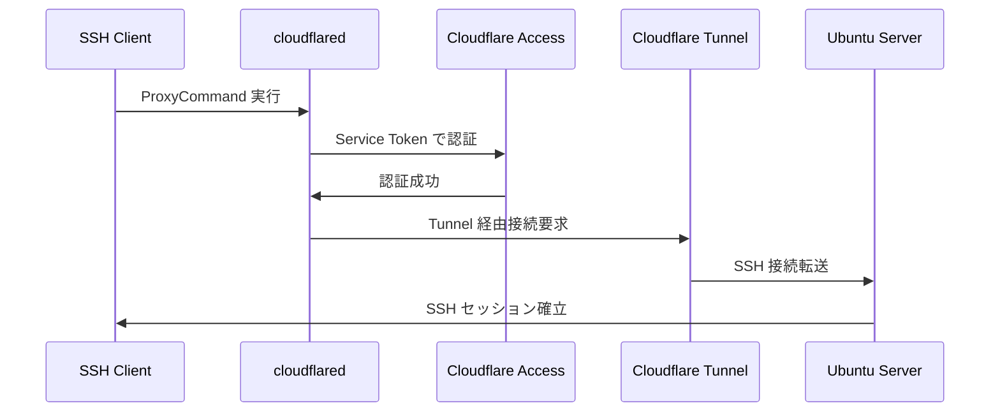

## はじめに

最近、Ubuntu Desktop 用にノートPCを購入しました。自宅で Web アプリケーションをホストしてみたいと思ったのがきっかけです。

購入後、早速 Apache Web サーバーをインストールし、`/var/www/html/index.html`を直接編集してブラウザからアクセスしてみました。思った通りに表示されるのを見て、「これは楽しい！」と感じたのを覚えています。

しかし、このままでは問題があります。**この状態で外部にページを公開すると、編集内容が即座に本番環境へ反映されてしまう**ということです。つまり、開発中の未完成なコードや、テスト用のデータが訪問者に見えてしまう可能性があります。

*「開発環境と本番環境を分けたい...！」*

そこで、Apache Web サーバーの公開ディレクトリとは別に開発用のディレクトリを作成し、そちらで開発を進めることにしました。同時に Git/GitHub を使ったバージョン管理も導入し、一般的な`dev`ブランチから`main`ブランチへのプルリクエスト・マージという開発フローも採用しました。

しかし、新たな問題が発生しました。この開発フローを取り入れたことで、開発が完了するたびに**開発ディレクトリから公開ディレクトリへの手動コピー&ペースト作業**が必要になったのです。GitHub 上でプルリクエストをマージさせつつ、手元のローカルリポジトリの`main`ブランチを基準にして、開発ディレクトリから公開ディレクトリへの手動コピー&ペーストを行う必要があります。流石にこれは面倒です。

*「プルリクエストをマージしたら、更新内容が自動的に Apache Web サーバーの公開ディレクトリに反映されてほしい...！」*

この面倒な手作業をなんとか自動化できないかと考えた結果、GitHub Actions による CD パイプラインを構築することにしました。

本記事では、GitHub Actions を用いて自宅 LAN 内の Ubuntu Desktop に対する継続的デプロイメント（CD）パイプラインの構築経験を、具体的な設定手順も併せて解説したいと思います。

## この記事の前提条件

本記事は以下の知識・環境をお持ちの方を対象としています。

### 必要な知識

- **GitHub Actions の基本**: workflow ファイルの書き方や基本的なアクションの使い方
- **Linux の基本操作**: コマンドライン操作、ファイル権限、SSH 接続の概念
- **Apache Web サーバーの基本**: DocumentRoot の概念、基本的な設定
- **Git の基本**: ブランチ、プルリクエスト、マージの概念

### 必要な環境

- **GitHub リポジトリ**: プライベート・パブリックは問いません
- **Ubuntu Desktop 環境**: 今回は Ubuntu 24.04.3 LTS を想定
- **Apache Web サーバー**: インストール・設定済み
- **Cloudflare アカウント**: Cloudflare Zero Trust の利用を想定
- **独自ドメイン**: ネームサーバーが Cloudflare に設定されているドメインであること

## 必要な技術概念と知識

パイプラインを構築する前に、関連する技術概念を整理します。

### GitHub Actions Workflows

GitHub Actions は、GitHub リポジトリ内で CI/CD パイプラインを実行するためのプラットフォームです。

@[og](https://docs.github.com/ja/actions/get-started/understand-github-actions)

#### 重要な概念

- **ワークフロー**: `.github/workflows/` 内のYAMLファイルで定義された1つ以上のジョブを実行するプロセス
- **イベント**: ワークフローをトリガーする、リポジトリ内の特定のアクティビティ（例えばプルリクエストのマージ）
- **ジョブ**: 同じランナーで実行される、ワークフロー内の一連のステップ
- **アクション**: ワークフロー内で特定のタスクを実行するコンポーネント (GitHub Actions で提供されるものや、自作のものを使用できる)
- **ランナー**: ワークフローを実行する仮想環境。各ランナーは一度に1つのジョブを実行できる。(今回は ubuntu-latest を使用します)

---

### SSH 接続とセキュリティ

#### SSH（Secure Shell）の基本

SSH は暗号化された通信路を使ってリモートサーバーに安全に接続するプロトコルです。

#### ホスト認証

SSH クライアント側で、接続先が**本物の SSH サーバー**であることを確認する。

##### **ホスト認証の仕組み**

SSH サーバーには`ホスト鍵(host key)`という固有の秘密鍵/公開鍵ペアが設定されている。  
SSH クライアント側でこの公開鍵を保存する先が、`~/.ssh/known_hosts`ファイル。

初回接続時に、SSH サーバーのホスト鍵 (公開鍵) を SSH クライアント側の`~/.ssh/known_hosts`ファイルに追加する。  
その後の接続時に、このファイルに登録されているホスト鍵 (公開鍵) と SSH サーバーのホスト鍵 (秘密鍵) を比較して、接続先が本物の SSH サーバーであることを確認する。

#### ユーザー認証

SSH サーバー側で、接続してきた SSH クライアントのユーザーが**本物のユーザー**であることを確認する。

##### **ユーザー認証の仕組み**

公開鍵認証方式を使用する。  
ざっくりなイメージは以下のとおり。

1. SSH サーバーは、許可された SSH クライアントの公開鍵を`~/.ssh/authorized_keys`ファイルに保持している。
2. SSH クライアントは、自身の秘密鍵を使用して署名を生成する。
3. SSH サーバーは、SSH クライアントの公開鍵を使用して署名を検証する。
4. 署名が検証された場合、SSH サーバーは SSH クライアントのユーザーとして接続を許可する。

@[og](https://qiita.com/whoami_priv/items/9f165f8dfd95edb169b7)

@[og](https://qiita.com/pyon_kiti_jp/items/f89b8fa9f5b7f8abac23)

::: info
**今回の SSH 接続における役割**

- **SSH クライアント**: GitHub Actions のランナー環境 (ubuntu-latest)
- **SSH サーバー**: 自宅の Ubuntu Desktop

**なぜこの関係になるのか？**

GitHub Actions のワークフローは GitHub のクラウド環境で実行されます。
したがって、クラウド環境からみて外部のサーバー(自宅の Ubuntu Desktop)にファイルをデプロイするには、GitHub Actions ランナーから自宅サーバーに向けて SSH 接続を開始する必要があります。
つまり、「クラウド → 自宅」という方向での接続となり、GitHub Actions ランナーが接続を開始する側(クライアント)、自宅 Ubuntu Desktop が接続を受ける側(サーバー)となります。
:::

---

### Cloudflare Tunnel

#### Cloudflare Tunnel とは

Cloudflare Tunnel は、**パブリック IP アドレスを公開することなく、ローカルサーバーを安全にインターネットに公開できるサービス**です。


@[og](https://developers.cloudflare.com/cloudflare-one/networks/connectors/cloudflare-tunnel/)

@[og](https://qiita.com/keke21/items/efaa2b2c35dfb646a43e)

<br>

#### 従来の自宅サーバー公開方法との違い

**従来の方法（ポートフォワーディング）：**

```text
インターネット → ルーター（ポート22開放） → 自宅 Ubuntu Desktop
                    ↑ セキュリティリスク
```

- ルーターで SSH ポート(22番)を開放する必要
- パブリック IP アドレスが直接露出
- DDoS 攻撃やブルートフォース攻撃の標的になりやすい
- 自宅の IP アドレスが特定される可能性

**Cloudflare Tunnel を使った方法：**

```text
GitHub Actions → Cloudflare Edge → Cloudflare Tunnel → 自宅 Ubuntu Desktop
                                       ↑
                               暗号化されたトンネル
```

- ルーターでポートを開放する必要がない
- パブリック IP アドレスを隠匿
- Cloudflare のセキュリティ機能を活用
- トラフィックが Cloudflare エッジを経由してフィルタリング

#### 今回の構成での役割



- **自宅 Ubuntu Desktop 側**：`cloudflared` デーモンが常時 Cloudflare に接続
- **GitHub Actions 側**：`cloudflared access ssh`コマンドでプロキシ経由接続
- **Cloudflare**：両者の間でセキュアなトンネルを提供

#### セキュリティ上のメリット

- **IP 隠匿**：自宅のパブリック IP アドレスが外部に露出しない
- **DDoS 保護**：Cloudflare のセキュリティインフラを活用
- **アクセス制御**：Cloudflare Access による詳細な制御

---

### Cloudflare Access

#### Cloudflare Access とは

Cloudflare Access は、**Zero Trust Network Access（ZTNA）を実現する Cloudflare のセキュリティサービス**です。従来の VPN に代わって、アプリケーションレベルでの認証・認可を提供します。

#### Zero Trust Network Access（ZTNA）の概念

@[og](https://www.cloudflare.com/ja-jp/learning/access-management/what-is-ztna/)

**従来の境界セキュリティモデル：**

```text
外部（危険） | ファイアウォール | 内部（安全）
```

- 社内ネットワークとインターネットの間に境界を引き、ファイアウォールで外部からの脅威をブロックする
- 「内部ネットワークは信頼できる」という前提
- 一度内部に侵入されると横展開のリスク

**Zero Trust アプローチ：**

```text
すべてのアクセスを検証 → 認証 → 認可 → アクセス許可
```

- 「信頼しない、常に検証する」（Never Trust, Always Verify）
- ネットワークの場所に関係なく、すべての接続を認証・認可

#### 今回の構成での Cloudflare Access の役割



#### セキュリティ上のメリット

- **細かいアクセス制御**：リソースごと、ユーザーごとの詳細な権限設定
- **監査ログ**：すべてのアクセス試行が記録される
- **MFA 対応**：多要素認証の強制が可能（人間のユーザーの場合）
- **リアルタイム制御**：ポリシー変更が即座に反映
- **セッション管理**：接続セッションの詳細な管理・監視

#### 従来の VPN との違い

| 項目 | 従来の VPN | Cloudflare Access |
|------|-----------|-------------------|
| **接続範囲** | ネットワーク全体 | アプリケーション単位 |
| **認証** | 接続時のみ | アクセス毎に検証 |
| **設定複雑さ** | 複雑 | 比較的シンプル |
| **スケーラビリティ** | 制限あり | 高い |
| **監査ログ** | 限定的 | 詳細 |

<br>

#### Service Token による自動認証

##### **Service Token とは**

Service Token は、**自動化システムやマシン間通信のための認証メカニズム**です。人間のユーザーによるインタラクティブな認証（OAuth、SAMLなど）とは異なり、完全にプログラマティックなアクセスを可能にします。

**従来のユーザー認証との違い：**

| 項目 | ユーザー認証 (OAuth/SAML) | Service Token |
|------|---------------------------|---------------|
| **対象** | 人間のユーザー | 自動化システム・アプリケーション |
| **認証フロー** | ブラウザベース・インタラクティブ | API ベース・プログラマティック |
| **認証情報** | ユーザー名・パスワード・MFA | Client ID・Client Secret |
| **有効期限** | セッション単位 (数時間) | 長期間 |

<br>

##### **GitHub Actions での役割**

###### **1. 自動化された SSH 接続の実現**

GitHub Actions のワークフローでは、人間による認証操作ができないため、Service Token が不可欠です。

```text
GitHub Actions Runner → Service Token 認証 → Cloudflare Access → SSH 接続
```

###### **2. CD パイプラインに最適な理由**

- **無人実行**: 人間の介入なしで24時間実行可能
- **スケーラビリティ**: 複数のワークフローから同時利用可能
- **信頼性**: セッション切れやタイムアウトの心配がない
- **セキュリティ**: GitHub Secrets での安全な管理

###### **3. 自動化ワークフローでのセキュリティ利点**

- **最小権限の原則**: 特定のアプリケーションのみへのアクセス
- **監査可能性**: すべてのアクセスがログに記録
- **中央管理**: Cloudflare ダッシュボードでの一元管理

##### **認証フローの概念**

**Service Token 認証プロセス：**



**Cloudflare Access による検証プロセス：**

1. **Token 有効性確認**: 提供された Client ID と Secret の検証
2. **Policy 評価**: 該当する Access Policy の条件確認
3. **アクセス許可判定**: すべての条件を満たした場合のみアクセス許可
4. **監査ログ記録**: 認証試行と結果の詳細ログ

この Service Token による認証機構により、セキュリティを損なうことなく、完全に自動化された CD パイプラインを実現できます。


---

## 完成形のパイプライン全体像

まずは最終的に完成したCDパイプラインの全体像を紹介します。

### deploy.yml ファイルの全容

```yaml
name: Deploy to Server

on:
  pull_request:
   types: [closed]
   branches:
     - main

jobs:
  deploy:
    runs-on: ubuntu-latest

    if: github.event.pull_request.merged == true

    env:
      REMOTE_HOST: ssh.your-domain.com
      REMOTE_USER: deploy-user
      REMOTE_DIR: /var/www/html
      SSH_PROXY_COMMAND: /tmp/cloudflared/cloudflared access ssh --id ${{ secrets.CLOUDFLARED_SSH_ID }} --secret ${{ secrets.CLOUDFLARED_SSH_SECRET }} --hostname %h

    steps:
      - name: Install cloudflared
        run: |
          latest_version=$(curl -s $GITHUB_API_URL/repos/cloudflare/cloudflared/releases/latest | jq -r '.tag_name')
          mkdir -p /tmp/cloudflared
          curl -sL -o /tmp/cloudflared/cloudflared $GITHUB_SERVER_URL/cloudflare/cloudflared/releases/download/$latest_version/cloudflared-linux-amd64
          chmod +x /tmp/cloudflared/cloudflared
          /tmp/cloudflared/cloudflared --version

      - name: Prepare .ssh/known_hosts from secrets
        run: |
          mkdir -p $HOME/.ssh
          chmod 700 $HOME/.ssh
          echo "${{ secrets.SSH_KNOWN_HOSTS }}" > $HOME/.ssh/known_hosts
          chmod 644 $HOME/.ssh/known_hosts

      - name: Set up SSH key
        run: |
          SSH_KEY_PATH=$HOME/.ssh/id_ed25519_github_actions
          echo "${{ secrets.SSH_PRIVATE_KEY }}" > "$SSH_KEY_PATH"
          chmod 600 "$SSH_KEY_PATH"

      - name: Checkout repository
        uses: actions/checkout@v4

      - name: Deploy application via rsync
        run: |
          SSH_KEY_PATH=$HOME/.ssh/id_ed25519_github_actions
          rsync -rvz --no-group --no-perms --omit-dir-times \
            -e "ssh -i \"$SSH_KEY_PATH\" -o StrictHostKeyChecking=yes -o ProxyCommand='$SSH_PROXY_COMMAND'" \
            --include='public/***' \
            --include='src/***' \
            --include='views/***' \
            --include='composer.json' \
            --include='composer.lock' \
            --exclude='*' \
            ./ \
            $REMOTE_USER@$REMOTE_HOST:$REMOTE_DIR/

      - name: Run composer install on remote
        run: |
          echo "Installing composer dependencies..."
          SSH_KEY_PATH=$HOME/.ssh/id_ed25519_github_actions
          ssh -i "$SSH_KEY_PATH" \
            -o StrictHostKeyChecking=yes \
            -o ProxyCommand="$SSH_PROXY_COMMAND" \
            $REMOTE_USER@$REMOTE_HOST "
              set -euo pipefail
              cd \"$REMOTE_DIR\"
              if command -v composer >/dev/null 2>&1; then
                COMPOSER_NO_INTERACTION=1 \
                composer install \
                  --no-dev \
                  --prefer-dist \
                  --no-interaction \
                  --no-progress \
                  --optimize-autoloader
                if sudo -n true 2>/dev/null; then
                  sudo chown -R www-data:www-data vendor
                  sudo chmod -R 755 vendor
                else
                  echo '⚠️ sudo権限がないため vendor の所有権/権限変更をスキップしました'
                fi
                echo '✅ Composer install completed.'
              else
                echo '❌ composer not found on remote host.'
                exit 1
              fi
            "
```

---

### パイプラインの動作フロー



---

### 各ステップの詳細

#### 1. トリガー条件

```yaml
on:
  pull_request:
    types: [closed]
    branches: [main]
```

- main ブランチへのプルリクエストがクローズされた際に実行
- `github.event.pull_request.merged == true` でマージされた場合のみ処理

#### 2. cloudflared のインストール

```bash
latest_version=$(curl -s $GITHUB_API_URL/repos/cloudflare/cloudflared/releases/latest | jq -r '.tag_name')
mkdir -p /tmp/cloudflared
curl -sL -o /tmp/cloudflared/cloudflared $GITHUB_SERVER_URL/cloudflare/cloudflared/releases/download/$latest_version/cloudflared-linux-amd64
chmod +x /tmp/cloudflared/cloudflared
/tmp/cloudflared/cloudflared --version
```

- GitHub APIから最新バージョンを動的に取得

#### 3. SSH 接続におけるホスト鍵の事前登録

```bash
mkdir -p $HOME/.ssh
chmod 700 $HOME/.ssh
echo "${{ secrets.SSH_KNOWN_HOSTS }}" > $HOME/.ssh/known_hosts
chmod 644 $HOME/.ssh/known_hosts
```

- 事前に登録したホスト鍵を使用して安全な SSH 接続を確立

::: alert
**セキュリティを重視した設計判断**

自動化システムで SSH 接続を行う際、`StrictHostKeyChecking=no` オプションを使用することで初回接続時のホスト確認を省略し、設定の簡素化も可能です。

```bash
# 簡単だがセキュリティリスクのあるアプローチ
ssh -o StrictHostKeyChecking=no user@hostname "command"
```

**しかし、このアプローチは以下のセキュリティリスクを抱えています：**

- **中間者攻撃（MITM）の危険性**: 悪意のあるサーバーが正規のサーバーになりすますことが可能
- **接続先の真正性確認不可**: 意図した正しいサーバーに接続しているかの保証がない  
- **セキュリティポリシーの妥協**: 自動化のために基本的なセキュリティチェックを無効化

**事前ホスト鍵登録によるメリット：**

```bash
# セキュアなアプローチ
echo "${{ secrets.SSH_KNOWN_HOSTS }}" > ~/.ssh/known_hosts
ssh -o StrictHostKeyChecking=yes user@hostname "command"  # デフォルト動作
```

- **接続先の検証**: 事前に登録した正規のホスト鍵との照合により接続先を確実に検証
- **中間者攻撃の防止**: 不正なサーバーへの接続を自動的に拒否  
- **自動化とセキュリティの両立**: 人間の介入なしに安全な接続を実現
- **監査適合性**: セキュリティ基準を満たした自動化システムの構築

このパイプラインでは、**自動化の利便性よりもセキュリティを優先**し、事前にホスト鍵を取得・管理する手間を承知で、より安全なアプローチを採用しました。

:::

@[og](https://io.cyberdefense.jp/entry/dangerous_ssh_sftp_usage/)

<br>

#### 4. ソースコードのチェックアウト

```yaml
- name: Checkout repository
  uses: actions/checkout@v4
```

- **actions/checkout@v4**: GitHub Actions の公式アクションを使用してリポジトリのソースコードを取得
- **デプロイ対象ファイルの準備**: rsync での転送前に、最新のマージされたコードをランナー環境に配置

#### 5. ファイル同期

```bash
SSH_KEY_PATH=$HOME/.ssh/id_ed25519_github_actions
rsync -rvz --no-group --no-perms --omit-dir-times \
  -e "ssh -i \"$SSH_KEY_PATH\" -o StrictHostKeyChecking=yes -o ProxyCommand='$SSH_PROXY_COMMAND'" \
  --include='public/***' \
  --include='src/***' \
  --include='views/***' \
  --include='composer.json' \
  --include='composer.lock' \
  --exclude='*' \
  ./ \
  $REMOTE_USER@$REMOTE_HOST:$REMOTE_DIR/
```

<br>

##### **rsync コマンドの詳細解説**

- **SSH_KEY_PATH 変数**: SSH 秘密鍵のパスを変数化して可読性と保守性を向上
- **ed25519 鍵タイプ**: RSA より高速で安全な楕円曲線暗号を使用
- **GitHub Actions 専用鍵**: デプロイ専用の識別しやすい鍵名

##### **rsync オプションの解説**

```bash
rsync -rvz --no-group --no-perms --omit-dir-times
```

| オプション | 説明 | 理由 |
|-----------|------|------|
| `-r` | **再帰的コピー** | ディレクトリ構造を保持して全ファイルを転送 |
| `-v` | **詳細出力** | 転送状況をログで確認可能 |
| `-z` | **圧縮転送** | ネットワーク帯域を効率的に利用 |
| `--no-group` | **グループ変更スキップ** | 権限エラーを回避 |
| `--no-perms` | **権限変更スキップ** | 既存のサーバー権限を保持 |
| `--omit-dir-times` | **ディレクトリタイムスタンプスキップ** | タイムスタンプ関連エラーを防止 |

@[og](https://log.dot-co.co.jp/rsync/)

<br>

##### **SSH 接続設定**

```bash
-e "ssh -i \"$SSH_KEY_PATH\" -o StrictHostKeyChecking=yes -o ProxyCommand='$SSH_PROXY_COMMAND'"
```

- **`-e` フラグ**: rsync が使用する SSH コマンドを明示的に指定
- **`-i "$SSH_KEY_PATH"`**: 指定した秘密鍵ファイルを使用してユーザー認証
- **`StrictHostKeyChecking=yes`**: ホスト鍵検証を強制（セキュリティ確保）
- **`ProxyCommand='$SSH_PROXY_COMMAND'`**: Cloudflare Access 経由で SSH 接続を確立

<br>

##### **SSH_PROXY_COMMAND の詳細**

```bash
SSH_PROXY_COMMAND: /tmp/cloudflared/cloudflared access ssh --id ${{ secrets.CLOUDFLARED_SSH_ID }} --secret ${{ secrets.CLOUDFLARED_SSH_SECRET }} --hostname %h
```

| パラメータ | 説明 | 役割 |
|----------|------|------|
| `/tmp/cloudflared/cloudflared` | **cloudflared バイナリパス** | 事前にインストールした cloudflared の実行ファイル |
| `access ssh` | **SSH アクセスモード** | Cloudflare Access 経由での SSH 接続を指定 |
| `--id ${{ secrets.CLOUDFLARED_SSH_ID }}` | **Service Token ID** | Cloudflare Access での認証に使用するクライアント ID |
| `--secret ${{ secrets.CLOUDFLARED_SSH_SECRET }}` | **Service Token Secret** | Service Token のクライアントシークレット（GitHub Secrets で管理） |
| `--hostname %h` | **動的ホスト名指定** | SSH 接続時のホスト名を動的に取得（`%h` は SSH の置換変数） |

<br>

SSH プロキシコマンドの動作フロー:



このプロキシコマンドにより、SSH クライアントは Cloudflare Access の認証とトンネルを経由して安全に自宅サーバーに接続できます。

<br>

##### **ファイル選択ロジック**

包含パターン（Include）:

```bash
--include='public/***'      # Web 公開ファイル
--include='src/***'         # アプリケーションソースコード  
--include='views/***'       # テンプレートファイル
--include='composer.json'   # PHP 依存関係定義
--include='composer.lock'   # 依存関係ロックファイル
```

除外パターン（Exclude）:

```bash
--exclude='*'              # デフォルトですべて除外
```

選択的同期の利点:

- **セキュリティ**: 機密ファイル（`.env`, `.git`等）の転送を防止
- **効率性**: 不要なファイル（`node_modules`, `vendor`等）を除外して高速転送
- **安全性**: 本番環境に影響を与える可能性のあるファイルを制御

<br>

###### **転送元・転送先の指定**

```bash
./ $REMOTE_USER@$REMOTE_HOST:$REMOTE_DIR/
```

- **`./`**: カレントディレクトリ（チェックアウトされたリポジトリのルート）
- **`$REMOTE_USER`**: リモートサーバーのユーザー名（例: `deploy-user`）
- **`$REMOTE_HOST`**: 接続先ホスト名（例: `ssh.your-domain.com`）
- **`$REMOTE_DIR`**: デプロイ先ディレクトリ（例: `/var/www/html`）

<br>

この設定により、**セキュアで効率的、かつ制御されたファイル同期**を実現しています。

この基本的な4ステップで、GitHub Actions から Cloudflare Access 経由で自宅サーバーへの安全なファイル同期が実現できます。

---

## 詳細な設定手順

実際に同じ環境を構築するための詳細な手順を説明します。

### 1. Cloudflare の設定

**参考**

[Cloudflare login](https://dash.cloudflare.com/login)

@[og](https://developers.cloudflare.com/cloudflare-one/networks/connectors/cloudflare-tunnel/get-started/create-remote-tunnel/)

@[og](https://zenn.dev/z4ck_key/articles/github-actions-to-cloudflare-tunnnel)

@[og](https://zenn.dev/greendrop/articles/2024-04-25-aacf4debe469e8)

@[og](https://dev.classmethod.jp/articles/use-service-tokens-to-authenticate-cloudflare-access-from-my-application/)

@[og](https://zenn.dev/takajun/articles/fbd783e459c722)

<br>

#### 1.1 Cloudflare Tunnel の作成

1. `Zero Trust` > `ネットワーク` > `Tunnels` に移動

2. `トンネルを作成する` をクリック


3. `Cloudflared` をクリック


4. トンネル名を入力

5. `トンネルを保存` をクリック


6. 表示されたインストールコマンドをコピー


7. 下記項目を入力し、`セットアップを完了する` をクリック

   | 項目 | 説明 |
   |------|------|
   | `サブドメイン` | (任意) `ssh` |
   | `ドメイン` | 取得済みの独自ドメイン |
   | `タイプ` | `SSH` |
   | `URL` | `localhost:22` |


#### 1.3 Cloudflare Access の設定

##### **1.3.1 Service Token の作成**

1. `Zero Trust` > `Access` > `サービス認証` に移動

2. `サービストークンを作成する` をクリック


3. 下記項目を入力し、`トークンを作成する` をクリック

   | 項目 | 説明 |
   |------|------|
   | `サービストークン名` | サービストークンの名前 |
   | `サービストークンの有効期間` | 任意の選択肢 |


4. 作成されたサービストークンの`クライアント ID`と`クライアントシークレット`をコピー (追って GitHub の Secrets に設定します)

5. `保存` をクリック


<br>

##### **1.3.2 Policy の作成**

1. `Zero Trust` > `Access` > `ポリシー` に移動

2. `ポリシーを追加する` をクリック


3. 下記項目を入力し、`保存` をクリック

   | 項目 | 説明 |
   |------|------|
   | `ポリシー名` | 任意の名前 |
   | `アクション` | `Service Auth` |
   | `セッション時間` | 任意の選択肢 |
   | `セレクター` | `Service Auth` |
   | `値` | [1.3.1 Service Token の作成](#131-service-token-の作成) で作成したサービストークン |


<br>

##### **1.3.3 Application の作成**

1. `Zero Trust` > `Access` > `アプリケーション` に移動

2. `アプリケーションを追加する` をクリック


3. `セルフホスト` をクリック


4. 下記項目を入力

    | 項目 | 説明 |
    |------|------|
    | `アプリケーション名` | 任意の名前 |
    | `セッション時間` | 任意の選択肢 |
    | `サブドメイン` | (任意) `ssh` |
    | `ドメイン` | 取得済みの独自ドメイン |
    
    > `パブリックホスト名` の入力欄は `パブリックホスト名を追加` をクリックすると表示されます。

5. `既存のポリシーを選択` をクリックし、 [1.3.2 Policy の作成](#132-policy-の作成) で作成したポリシーを選択

6. `次へ` をクリック


7. `エクスペリエンス設定` と `詳細設定` はデフォルトのまま、各自の環境に合わせて設定し、 `次へ`/`保存` をクリック


---

### 2. Ubuntu Desktop 側の設定

#### 2.1 SSH サーバーのインストールと設定

```bash
# OpenSSH Serverのインストール
sudo apt update
sudo apt install openssh-server

# SSH設定の編集
sudo nano /etc/ssh/sshd_config
```

設定項目：

```bash
# パスワード認証を無効化
PasswordAuthentication no

# 公開鍵認証を有効化
PubkeyAuthentication yes

# rootログインを無効化
PermitRootLogin no

# 空のパスワードを持つアカウントのログインを禁止
PermitEmptyPasswords no

# 最大認証試行回数
MaxAuthTries 6

# ホスト鍵の指定
HostKey /etc/ssh/ssh_host_rsa_key
HostKey /etc/ssh/ssh_host_ecdsa_key
HostKey /etc/ssh/ssh_host_ed25519_key
```

設定後の再起動：

```bash
sudo systemctl restart ssh.socket
sudo systemctl enable ssh.socket
```

<br>

#### 2.2 ファイアウォールの設定

```bash
# ファイアウォールの有効化
sudo ufw enable
# デフォルトポリシーで受信 (Incoming) を拒否
sudo ufw default deny incoming
# デフォルトポリシーで送信 (Outgoing) を許可
sudo ufw default allow outgoing
# SSHポートの開放
sudo ufw allow ssh
# SSH ブルートフォース攻撃の防止
sudo ufw limit ssh
# ファイアウォールの状態を確認
sudo ufw status
```

[セキュアなSSHサーバの構築と運用ガイド（Ubuntu上）](https://www.kkaneko.jp/tools/server/pubkey.html)

<br>

#### 2.3 デプロイ用ユーザーの作成

```bash
# デプロイ専用ユーザーを作成
sudo adduser deploy-user

# デプロイ用ユーザー用に公開鍵を配置するディレクトリを作成する
sudo mkdir -p /home/deploy-user/.ssh
# 公開鍵ファイルを作成する (今は空ファイル)
sudo touch /home/deploy-user/.ssh/authorized_keys
# ディレクトリの権限を設定する
sudo chmod 700 /home/deploy-user/.ssh
# 公開鍵ファイルの権限を設定する
sudo chmod 600 /home/deploy-user/.ssh/authorized_keys
# ディレクトリの所有者を設定する
sudo chown -R deploy-user:deploy-user /home/deploy-user/.ssh
```

<br>

#### 2.4 Apache Web サーバーの設定

```bash
# Apacheのインストール
sudo apt install apache2

# DocumentRootの権限設定
find /var/www/html -type d -exec chmod 750 {} \;
find /var/www/html -type f -exec chmod 640 {} \;
sudo chown -R www-data:www-data /var/www/html

# deploy-userがwww-dataグループで書き込み可能に
sudo usermod -aG www-data deploy-user
```

<br>

#### 2.5 パッケージマネージャーのインストール

::: info 
**この手順について**

パッケージマネージャーのインストールは今回の主題（CD パイプライン構築）とは別の内容のため、詳細は省略します。

今回は PHP 環境のため **Composer** をインストールしますが、開発言語に応じて適切なパッケージマネージャーを選択してください。

- **PHP**: Composer
- **Node.js**: npm / yarn / pnpm
- **Python**: pip / poetry / pipenv
- **Ruby**: gem / bundler
- **Go**: go mod
- **Rust**: cargo
- **Java**: Maven / Gradle

各言語の公式ドキュメントを参照してインストールを行ってください。
:::

<br>

#### 2.6 cloudflared のインストールと設定

[#1.1 Cloudflare Tunnel の作成](#11-cloudflare-tunnel-の作成)でコピーしたインストールコマンドを実行します。

```bash
# cloudflaredのインストール
# Add cloudflare gpg key
sudo mkdir -p --mode=0755 /usr/share/keyrings
curl -fsSL https://pkg.cloudflare.com/cloudflare-public-v2.gpg | sudo tee /usr/share/keyrings/cloudflare-public-v2.gpg >/dev/null

# Add this repo to your apt repositories
echo 'deb [signed-by=/usr/share/keyrings/cloudflare-public-v2.gpg] https://pkg.cloudflare.com/cloudflared any main' | sudo tee /etc/apt/sources.list.d/cloudflared.list

# install cloudflared
sudo apt-get update && sudo apt-get install cloudflared
```

サービス化：

```bash
sudo cloudflared service install [TOKEN]
sudo systemctl start cloudflared
sudo systemctl enable cloudflared
```

---

### 3. GitHub Secrets の設定

#### 3.1 SSH鍵ペアの生成

::: alert

##### この手順について

SSH 鍵の生成と公開鍵の配置は、[2.3 デプロイ用ユーザーの作成](#23-デプロイ用ユーザーの作成) で作成したユーザーのホームディレクトリで実施します。

:::

```bash
# ユーザー名を確認
$ whoami
deploy-user

# カレントディレクトリを確認
$ pwd
/home/deploy-user

# GitHub Actions用のSSH鍵を生成
ssh-keygen -t ed25519 -f ~/.ssh/id_ed25519_github_actions -C "GitHub Actions"

# 公開鍵をサーバーに配置
cat ~/.ssh/id_ed25519_github_actions.pub >> ~/.ssh/authorized_keys
```

<br>

#### 3.2 ホスト鍵の取得

Ubuntu Desktop の SSH サーバーに接続して、ホスト鍵を取得します。
下記コマンドの出力をコピーしておきます。

```bash
ssh-keyscan localhost 2>/dev/null | sed 's/localhost/ssh.your-domain.com/'
```

> `ssh-keyscan` コマンドで取得したホスト鍵に含まれる文字列 `localhost` を Cloudflare Tunnel のホスト名に置き換えるため、`sed` コマンドの `your-domain.com` を各自の環境に合わせて置き換えてください。

<br>

#### 3.3 GitHub Repository Settings での設定

**Settings** → **Secrets and variables** → **Actions** で `New repository secret` をクリックし、以下を設定する。

| Name | Value |
|------|-------|
| `SSH_PRIVATE_KEY` | `~/.ssh/id_ed25519_github_actions` の内容 |
| `SSH_KNOWN_HOSTS` | [3.2 ホスト鍵の取得](#32-ホスト鍵の取得) でコピーしたホスト鍵の内容 |
| `CLOUDFLARED_SSH_ID` | [1.3.1 Service Token の作成](#131-service-token-の作成) で作成したサービストークンの`クライアント ID` (ヘッダー部分を除いたものをそのまま貼り付け) |
| `CLOUDFLARED_SSH_SECRET` | [1.3.1 Service Token の作成](#131-service-token-の作成) で作成したサービストークンの`クライアントシークレット` (ヘッダー部分を除いたものをそのまま貼り付け) |

---

### 4. ワークフローファイルの配置

リポジトリに `.github/workflows/deploy.yml` を作成し、先ほど紹介した完成版のYAMLを配置します。

---

### 5. 動作確認

#### 5.1 プルリクエストでのテスト

1. 機能ブランチを作成
2. 何らかの変更をコミット
3. main ブランチに対するプルリクエストを作成
4. プルリクエストをマージ
5. GitHub Actions の実行ログを確認

## まとめ

本記事では、GitHub Actions を使って自宅の Ubuntu Desktop への継続的デプロイメント（CD）パイプラインを構築する方法を解説しました。

### 達成したこと

- **手動デプロイ作業の完全自動化**: プルリクエストのマージをトリガーに、開発ディレクトリから公開ディレクトリへのファイル同期を自動化
- **セキュアな接続**: Cloudflare Tunnel と Cloudflare Access を活用し、自宅のパブリック IP を公開せずに安全な SSH 接続を実現
- **Zero Trust アーキテクチャの実装**: Service Token による認証とアクセス制御により、セキュリティを損なわない自動化を構築

### 重要なポイント

1. **Cloudflare Tunnel の活用**: ルーターのポート開放不要で、セキュアに自宅サーバーを外部に公開
2. **Service Token 認証**: 人間の介入なしに、GitHub Actions からの自動アクセスを安全に実現
3. **ホスト鍵の事前登録**: `StrictHostKeyChecking=no` の安易な使用を避け、セキュリティを優先した設計

### このアプローチの利点

- **開発効率の向上**: デプロイ作業が自動化され、開発に集中できる
- **セキュリティの確保**: 複数のセキュリティレイヤーにより、自宅サーバーを安全に運用
- **スケーラビリティ**: 同じ仕組みを複数のプロジェクトやサーバーに適用可能
- **監査可能性**: すべてのデプロイが GitHub Actions と Cloudflare のログに記録

### 今後の発展

このパイプラインを基盤として、以下のような機能拡張も検討できます。

- デプロイ前の自動テスト実行
- 複数環境（ステージング/本番）への対応
- デプロイ失敗時の自動ロールバック
- Slack/Discord への通知連携

自宅サーバーでの Web ホスティングは、学習や実験に最適な環境だなぁと感じました。大変楽しかったです☺️

---