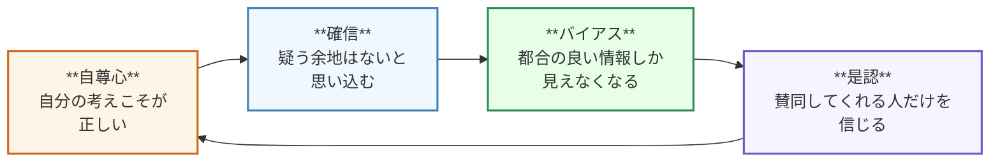
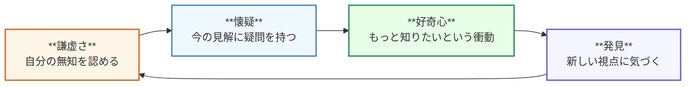

これは[豆蔵デベロッパーサイトアドベントカレンダー2025](/events/advent-calendar/2025/)第 2 日目の記事です！

## はじめに

@[og](https://amzn.asia/d/2cKy7p2)

**書籍 `Think Again`**

僕がとても好きな書籍です。

この書籍では、`考え直す`ことの重要性について書かれています。

本書の目次を以下に示しました。

- **Part1:** 自分の考えを再考する方法
- **Part2:** 相手に再考を促す方法
- **Part3:** 学び、再考し続ける社会・組織を創造する方法
- **Part4:** 結論

再考することの重要性を、`Part1`では自己に、`Part2`では他者に、`Part3`ではチーム・組織に焦点を当てて説明されています。

この記事では、`Part1`でとても印象的な下記内容について紹介したいです。

- 再考サイクルとは何か？
- 対比となる過信サイクルとは何か？
- 再考サイクルを継続するために必要なことは何か？

## 「化石化した知識」を後生大事にしていないか？

情報技術の進歩に伴い、人の知識もどんどん増加しています。
本書によると、

> 1950 年を見てみると、医療の知識は 1900 年から 50 年の歳月をかけて倍増した。
> それが 1980 年までには 7 年ごとのペースで、そして 2010 年までにはその半分の歳月で倍増するようになった。

とのこと。

従って、社会の変化に伴い、私たちは今まで当たり前と思っていたことをより頻繁に再考する必要があリます。
だけどなかなかそれができない。。

## 牧師、検察官、政治家 - 誰もが持つ 3 つの思考モード

なぜ自分の知識や見解を再考できないのか。

それは、無意識に切り替わる以下 3 つの思考モードが原因とのこと。

- **牧師モード:**
  - 自分の信念がぐらついている時、理想を守り確固としたものにするため、他者を説教しようとする。
- **検察官モード:**
  - 他者の推論に矛盾を感じれば、相手の間違いを明らかにするため論拠を探す。
- **政治家モード:**
  - 多くの人を味方につけたい時は、支持層の是認を獲得するためにキャンペーンやロビー活動を行う

そして、これらの思考モードは互いに**循環**してしまいます。
具体的なシチュエーションを考えると、こんな感じでしょうか 👇

::: info

**シチュエーション**
SNS 経由で知り合った「投資アドバイザー」から勧められた暗号資産投資。
「いま始めれば月利 20 %、限定枠あり」と言われ、初期資金を投入した男性。

_月利 20 % はヤバいですね。。相場を逸脱しています。。_
:::

### 牧師モード

**自尊心が確信を生む**

> これは自分が見つけた正しい投資法だ。
> 自分の考えが正しいことをちゃんと説明すれば、みんなも納得するはず。

- 真実はすでに見つかっていると考える。
- いかに正しいかを証明するために、他者を説得しようとする。

### 検察官モード

**確信がバイアスを生む**

> 仕組みを理解していない周りが間違っている。
> 現にこんなに利益が出ている。

- 相手の指摘を"無知"や"矛盾"として否定する。
- 自分の考えを肯定する情報しか見えなくなる。

### 政治家モード

**バイアスが是認を生む**

> みんながやっているから、間違いない。
> 反対している人は、仕組みを理解していない無知な人たちだ。

- 同じ考えの人たちに囲まれて安心する。
- 反対意見は"無知な人の意見"として無視する。

本書では、**この循環を`過信サイクル`と呼んでいます。**
過信サイクルは、以下に没頭するあまり**自分の見解が間違っているかもしれないと再考しなくなってしまう**点で危険です。

- 自分の信念を貫くこと
- 他者の間違いを指摘すること
- 多くの支持を獲得すること

## 仮説、実験、結果、検証 - 科学者の思考モード

では、暗号資産投資で過信サイクルに陥った男性は、どのように考えれば良かったのか。

例えば、

- 月利 20 % の根拠は何かと考えるべきだった。
- 暗号資産投資に関するより多くの見解を集めるべきだった。
- 多額の資金を投じる前に、少額で実験してみるべきだった。

などでしょうか。

抽象化すると、`科学者の思考モード`が必要だったということです。
`科学者の思考モード`は、以下の 4 つの要素で構成されています。

- **仮説:**
  - 自分の考えを言語化する。
    `例:` 暗号資産投資は、月利 20 % の利益を生む。
- **実験:**
  - 自分の考えを実験する。
    `例:` 少額で投資してみる。
- **結果:**
  - 実験から得られた結果を観察する。
    `例:` 投資額と利益額を記録する。
- **検証:**
  - 結果をもとに仮説を検証する。
    `例:` 月利 20 % の根拠は何か？ 他の投資法と比較してどうか？

この 4 つの要素を繰り返すことができれば、過信サイクルから抜け出して、  
自分の考えを再考できるようになるはずです。

## 再考プロセスの循環 - 再考サイクル

科学者の思考モードによる再考プロセスにも、過信サイクルと同じような循環があるそうです。
本書ではこの循環を**再考サイクル**と呼び、以下の 4 つの要素で整理しています。

- **謙虚さ:**
  - 知的に謙虚である。
  - 無知を自覚する。
- **懐疑:**
  - 自分の考えに疑問を持つ。
  - 「本当にこれで良いのか？」と問い直す。
- **好奇心:**
  - 自分が持たない情報を知りたいと思う。
  - 見えなかった視点や情報にワクワクする。
- **発見:**
  - 疑問の先に、新しい視点や情報を手にする。
  - 自分の想定より世界が広かったことを知る。

**発見**により「学ぶべきこと、発見すべきことはまだたくさんある」と自覚することで、  
**謙虚さ**を保つことができるようになります。

::: info

**人が再考しない理由**

1. これまでのやり方と異なる
2. そんなのできっこない
3. 自分の経験と異なる
4. 複雑すぎて考えたくない

:::

## 過信サイクル vs 再考サイクル

過信サイクルと再考サイクルは、以下のように対比されます。

- **過信サイクル**
  - 自尊心 → 確信 → バイアス → 是認

 

- **再考サイクル**
  - 謙虚さ → 懐疑 → 好奇心 → 発見

 

また、同じ状況に対しても、自分がどちらのサイクルにいるかで思考や行動が変わります。

|                    | 過信サイクル     | 再考サイクル        |
| ------------------ | ---------------- | ------------------- |
| 自分の考えを変える | 心の弱わさの表れ | 知的誠実さの表れ    |
| 他者に説得される   | 負けた気になる   | 真実に 1 歩近づいた |
| 考えを変える根拠   | 他人の反応       | 理性や証拠          |

## 再考サイクルを継続するために必要なこと - 自信に満ちた謙虚さ

過信サイクルに陥らず、再考サイクルを継続するためにはどうすれば良いか。
本書では、**バランスの取れた自信と謙虚さ**が重要だと述べられています。

 

- 自信
  - 自己信頼度
    自分をどのくらい信頼しているか
    `注意 !` 自分のやり方をどれほど確信しているかではない
- 謙虚さ
  - しっかりした知識や能力、つまり自分の過ちや不確実さを認識する力
    `注意 !` 自信を控えめに持つことではない

 

ここで重要なのは、**自信と謙虚さは両立する**ということです。

- 自信を持つことは、謙虚さを失うこと
- 謙虚さを持つことは、自信を失うこと

ではありません。

将来の目標に達するのに十分な能力が備わっていると自信を持ちながら、  
そのための正しい手段は何かと現在の自分に問う謙虚さを持つことは可能です。

つまり、自己の能力を信じながら、自分の解決方法が正しくない可能性、問題自体を誤解している可能性を認める。
そこから疑問が生じれば、既存の知識を再評価するようになり、ほどほどの自信があれば、新しい知識を追い求めることができるようになります。

**自分の知識に対してではなく、自分の学ぶ能力を強く信じている状態**

この状態が、**自信に満ちた謙虚さ**を持った状態です。

## おわりに - 実るほど 頭を垂れる 稲穂かな

僕の好きな言葉に、「実るほど 頭を垂れる 稲穂かな」という言葉があります。

> 稲穂が成長して実るほど先端が垂れ下がるように、
> 人間も学問や技能が深まるほどに、他人に対して益々謙虚になる。

という意味とのこと。

この言葉を体現するために必要なのが、**再考サイクル**なのではないかと思いました。
