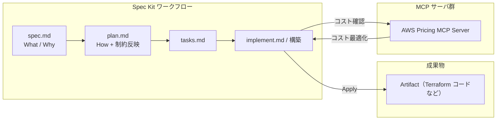
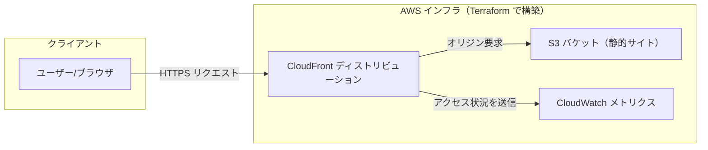

これは[豆蔵デベロッパーサイトアドベントカレンダー2025](/events/advent-calendar/2025/)第16日目の記事です。

## 1. はじめに

9月に[Kiroを使った仕様駆動開発の記事](http://localhost:8080/blogs/2025/09/08/kiro-spec-Terraform-iac/)を執筆してから、約3か月経ちました。

その間に、生成AIを取り巻くエコシステムやツールは驚くべき速度で進化を続けています。
最近話題のGeminiも、リリース当初と比べると、業務利用を視野に入れられるレベルまで急速に成熟していると  感じています。

今回はGitHub が提供する仕様駆動開発（Spec-Driven Development; SDD）のツール「[Spec Kit](https://github.com/github/spec-kit)」と、Model Context Protocol（MCP）に対応した AI クライアントである Gemini CLI を組み合わせて、インフラストラクチャを生成する開発手法を試してみます。

前回の記事では「Kiro × Claude」で SDD + Terraform を扱いました。
本記事ではこれを「Spec Kit × Gemini」に置き換えたうえで、特にビジネスの現場では重要となるコスト最適化・コスト把握を **AWS Pricing MCP Server** を使って行えるようにします。

これらを組み合わせることで、設計思想（Why）から具体的な実装（What）、そしてコードとアーキテクチャの品質保証までを一気通貫で行う、インフラ構築フローをSpec Kitでどこまで実現できるのかを検証していきます。

## 2. 記事のゴール

本記事のゴールは次の通りです。

- **Spec Kit を使いこなせるようになる**
  GitHub Spec Kit の 4 段階プロセス（Specify, Plan, Tasks, Implement）に沿って、インフラの仕様を定義し、具体的なコード（IaC）に落とし込む流れを体験します。

- **SDD を踏まえたインフラ構築フローを理解する**
  設計思想（Why）から実装（What）、そして品質保証までを一気通貫で行う、AI を活用した新しいインフラ構築のやり方を学びます。

- **コストを含めた品質保証を実現する方法を知る**
  AWS Pricing MCP Server を組み合わせ、Terraform コードから構築されるインフラのランニングコストを見積もりつつ、仕様レベルでコスト制約を織り込むアプローチを理解します。

- **実践的なインフラを構築できるようになる**
  上記フローを通じて、S3 と CloudFront を用いた静的ウェブサイトと、そのアクセス状況を可視化できる CloudWatch メトリクスを持つ、実践的なリソースを構築できる状態を目指します。

## 3. 事前知識 / 前提

本記事は、次のような読者を想定しています。

対象読者
- インフラ構築・運用や、クラウド環境の設計に興味がある方
- SDD（Spec-Driven Development）や IaC（特に Terraform）に興味がある方
- 生成 AI を用いた開発フローを、インフラ領域でも試してみたい方

本記事で扱わないこと
- GitHub Spec Kit 自体のインストール手順や細かな設定方法
- SDD開発における細かいプロンプト指示の内容
- MCP Server（例: AWS Pricing MCP Server）のセットアップ方法の詳細
- 生成 AI（Gemini など）のアカウント作成や課金設定の手順
- Terraform や AWS のコードの解説・公開

実施環境
- Mac (M1) / macOS Sequoia 15.5[^1]
- VSCode: `1.107.0`
- Gemini CLI: `0.20.2`
- Gemini 2.5 系列モデル（Flash / Pro など）
- Spec Kit `v0.0.90`

これらの前提知識・環境は事前に整っているものとして、本記事では「どう組み合わせて活用するか」という観点に焦点を当てます。

## 4. 「Vibe-Coding」の限界と見過ごされるコスト

AIコーディングエージェントの能力は日々向上していますが、その利用方法の多くは、開発者の曖昧な指示（Vibe）に依存した「Vibe-Coding」に留まっています。
このアプローチでは、コードがコンパイルしなかったり、開発者の意図を正確に反映しなかったりといった、目先の生成エラーに注目が集まりがちです。

とりわけ深刻なのは、一見正常に動作しているコードが、Vibe-Coding によって大量に生まれてしまう点です。
これらのコードは、次のような「見過ごされがちなコスト」を内包しています。

- **属人化とブラックボックス化**  
  - 生成時のプロンプトや前提条件が十分に残らないため、「なぜその設計になっているのか（Why）」がコードから読み取れません。
  - 結果として、他の開発者には触りづらいブラックボックスとなり、修正・改善のたびに大きな認知コストが発生します。
- **アーキテクチャの一貫性低下**  
  - その場その場の Vibe-Coding で機能追加を続けると、システム全体のアーキテクチャが当初の設計意図から徐々にずれていきます。
  - IaC の場合、環境ごとに微妙に異なる定義が増え、「どれが正なのか」を後から整理・リファクタリングするコストが跳ね上がります。
- **レビュー・監査コストの増大**  
  - レビュー担当者は、コードを読むたびに「そもそも何のための変更か？」を会話履歴やコミットメッセージから逆算する必要があります。
  - セキュリティやコンプライアンスの観点では、どのコードがどの前提・ポリシーに基づいて生成されたかが追いきれず、チェックに時間がかかります。

このように、Vibe-Codingは目先の生産性を一時的に向上させるかもしれませんが、長期的な保守性や品質、セキュリティの観点では、むしろコストを増大させる要因になりえます。

## 5. 仕様駆動開発（SDD）の哲学

Vibe-Codingがもたらす長期的な課題に対し、GitHubは公式ブログでSpec Kitを発表し、新たな開発パラダイムとして「仕様駆動開発（SDD）」を提唱しました。

GitHubは、その哲学について次のように述べています。

> "That’s why we’re rethinking specifications — not as static documents, but as living, executable artifacts that evolve with the project. Specs become the shared source of truth. When something doesn’t make sense, you go back to the spec; when a project grows complex, you refine it; when tasks feel too large, you break them down."
>
> （だからこそ私たちは仕様を再考しています。それは静的なドキュメントではなく、プロジェクトと共に進化する生きた、実行可能な成果物として。仕様は共有された真実の源となります。何か理解できないことがあれば仕様に戻り、プロジェクトが複雑になればそれを洗練させ、タスクが大きすぎると感じたら分解するのです。）

この引用が示すエッセンスは、次の2つの重要な概念に集約されます。

1. **仕様は「生きた実行可能な成果物」である**
 一度作られて陳腐化する静的なドキュメントではなく、プロジェクトの進化に合わせて更新され続け、ツールやAIがコードを生成・テスト・検証する際に直接利用する「実行可能」なファイルそのもの、という考え方です。
2. **仕様は「信頼できる唯一の情報源」である**
コードがどう動作すべきかを定義した「契約」として機能します。開発者は迷ったときに立ち戻る原点となり、AIエージェントにとっては振る舞いを決定する上での絶対的な拠り所となります。

このように仕様と実装の一貫性を強く保つことこそが、Vibe-Codingの混沌に秩序をもたらし、AIの力を最大限に引き出す鍵である、というのがGitHubの示す方向性です。

## 6. GitHub Spec Kitの役割

Spec Kit は、この SDD を AI コーディングエージェント（GitHub Copilot、Gemini CLI、Claude Code など）のワークフローに取り込むための **オープンソースのツールキット** です。  
- `/speckit.specify`：仕様（Spec）を作成する
- `/speckit.plan`：技術スタックやアーキテクチャ方針を整理する
- `/speckit.tasks`：作業単位に分解したタスクリストを作る
- `/speckit.implement`：タスクに基づいて実装を進める

といったコマンドを通じて、「仕様 → 計画 → タスク → 実装」の流れを構造化し、AI に対しても一貫したコンテキストを与えられるようにします。

## 7. Spec Kitの構造化された開発ワークフロー

Spec Kit の大きなメリットは、「どの生成 AI を使うか」に依存しすぎず、共通のワークフローで開発を進められる点です。  
現実には、複数の生成 AI を同時に利用することはコスト面で難しい場合も多く、組織として利用できる AI が限定されるケースもありますが、Spec Kit のワークフローはそうした制約の中でも再利用しやすい構造になっています。

Spec Kitは、AIとの協調作業を円滑にするため、次の4段階の明確なプロセスを定義しています。各フェーズは、特定のコマンドを通じて実行されます。

**1. Specify（仕様作成）― WhatとWhyの定義**

`/speckit.specify` コマンドを使用し、技術スタックではなく、**ユーザーのジャーニー、期待される成果、成功基準** に焦点を当てて仕様（Spec）を定義します。
仕様は、利用者や要件が変わるたびに更新される「生きた成果物」として扱われ、インフラの構成もこの Spec を起点に設計されます。

**2. Plan（計画作成）― 制約の組み込み**

`/speckit.plan` コマンドで技術的な方向性を決定します。**技術スタック、アーキテクチャ、コンプライアンス要件、性能目標** など、エンタープライズ制約を AI エージェントに提供し、
包括的な技術実装計画を `plan.md` として生成させます。ここで MCP Server からの制約も統合されます。

**3. Tasks（タスク分解）― レビュー可能な単位へ**

`/speckit.tasks` コマンドを使用し、Plan に基づき、**独立して実装・テスト可能な小さな作業単位**（レビュー可能な差分）に分解します。
依存関係や並列実行可能なタスク `[P]` が明示されることで、「どこから手を付けるべきか」が分かりやすくなります。

**4. Implement（実装と検証）― 焦点を絞った変更**

`/speckit.implement` コマンドで、エージェントがタスクリストに従って実装します。開発者は大規模なコードの塊ではなく、
特定の問題を解決する **焦点の絞られた変更** をレビューします。これにより、AI が生成した変更を人間が理解・検証しやすい単位に保つことができます。

### 7.1. Spec KitとKiroのプロセス対応

Spec Kit と AWS Kiro はどちらも SDD を支援するツールですが、フェーズ名や成果物の切り方が少し異なります。本記事では、おおよそ次の対応関係を意識して解説します。

| 観点               | Spec Kit のフェーズ / コマンド   | 主な成果物（Spec Kit）                                                                | 参考: Kiro のプロセス / ファイル例                |
| :----------------- | :------------------------------- | :------------------------------------------------------------------------------------ | :------------------------------------------------ |
| 要件・意図の明確化 | Specify / `/speckit.specify`     | プロダクトの目的・前提・スコープなどを整理した仕様ファイル（例: `spec.md`）           | Requirements フェーズ / `requirements.md`         |
| 実現方式の検討     | Plan / `/speckit.plan`           | アーキテクチャ方針・技術選定・インフラ構成などをまとめた計画ファイル（例: `plan.md`） | Design フェーズ / `design.md`                     |
| 作業単位への分解   | Tasks / `/speckit.tasks`         | 実装・テスト可能な単位に分解されたタスクリスト（例: `tasks.md`）                      | Tasks / Implementation のタスク一覧               |
| 実装の実行・検証   | Implement / `/speckit.implement` | タスクリストを基にしたコード・テスト・設定ファイル等の変更                            | Implementation フェーズ全体（フックやタスク実行） |

※ Kiro は「Requirements → Design → Implementation」の 3 フェーズ構成で、Implementation の中にタスク実行やコード生成が含まれます。一方、Spec Kit は Tasks と Implement を分離することで、「タスク分解」と「実装実行」を明示的に分けている点が特徴です。

## 8. AWS Pricing MCP Server によるコスト制約の実現

**テーマ:** Spec Kit のワークフローに、AWS インフラのコスト制約やコスト最適化の観点を組み込む方法論。

本章では、AWS Pricing MCP Server の役割と、それを Spec Kit のワークフロー、とくに Implement フェーズのあとに統合することで、コストの観点からどのように制約をかけられるか解説します。

### 8.1. Model Context Protocol (MCP) の役割

MCP および MCP Registry を利用することで、Gemini CLI などの MCP 対応クライアントから AWS Pricing MCP Server といった外部サービスに接続できます。  
Spec Kit はこの MCP の上に「Spec / Plan / Tasks / Implement」というワークフローを載せることで、外部ツールからの制約や推奨事項（本記事では主にコスト情報）を自然に統合します。

### 8.2. AWS Pricing MCP Serverによるコスト把握

AWS Pricing MCP Server は、AWS の料金情報にアクセスするための MCP Server です。  
Gemini CLI から呼び出すことで、サービス種別・リージョン・利用想定などを入力し、概算の料金を問い合わせることができます。

Spec Kit の文脈では、Implement フェーズで生成された Terraform コードやアーキテクチャ案に対してコストを問い合わせることで、

- どの構成が月額コストを抑えられそうか  
- トラフィック増加時にどの程度コストがスケールしそうか  
- どのリソースがコストのボトルネックになりそうか  

といった観点を、AI エージェント経由で評価させることができます。

### 8.3. Implementフェーズ後のコスト評価への統合

`/speckit.implement` コマンドや、Implement フェーズで Terraform コードが生成・デプロイされたあとに、AWS Pricing MCP Server を呼び出し、実際のリソース構成に基づくコスト情報や制約・推奨事項を取得します。  
これにより、パフォーマンスや可用性などの非機能要件に加え、想定トラフィックに対するランニングコストの見積もりを踏まえて、アーキテクチャやコードをリファインするループを回せるようになります。

Implement実行後は次のような流れで進めます。
1. リソース構成からコストを試算する
2. パフォーマンスとコストのバランスを評価する
3. 必要に応じてPlan/Specを修正する

レイヤ構造として見ると、次のような関係になります。



## 9. 実践：CloudFrontとS3で構築する静的サイトとアクセス可視化

本章では、Spec Kit と Gemini CLI を用いて、S3 と CloudFront による静的ウェブサイトを構築し、そのアクセス状況が CloudWatch で可視化されるまでを追います。
まずは静的ウェブサイトをSDDを使って構築し、そのあと仕様を追加した上でCloudWatchによるアクセスが可視化できるようにだっっしゅボードを作成します。

ここでのゴールは、単にインフラを構築するだけでなく、CloudWatch コンソールでリクエスト数のグラフが動くのを確認するところまでを実践することです。
これにより、意図（Spec）が実際の運用（Monitoring）に繋がる流れまでを意識するためです。



### 9.1. Gemini.mdの設定と、specify init - プロジェクトの作成

`specify init <PROJECT_NAME>` でプロジェクトを作成します。
作成と同時に、次のような階層でファイルが作成されます。

原則、生成されるファイルはすべて英語となっているため、次のプロンプトと Gemini.md を設定することを推奨します。

```md
# Gemini.md

## 使用言語
日本語を利用してください。
英語の場合は日本語に訳してください。
```

```bash
# プロンプト
.specify配下のtemplatesの各ファイルを、日本語に直してください。
```

```txt
+---.gemini
|   \---commands
|           speckit.analyze.toml
|           speckit.checklist.toml
|           speckit.clarify.toml
|           speckit.constitution.toml
|           speckit.implement.toml
|           speckit.plan.toml
|           speckit.specify.toml
|           speckit.tasks.toml
|           speckit.taskstoissues.toml
|
+---.specify
|   +---scripts
|   |   \---bash
|   |           check-prerequisites.sh
|   |           common.sh
|   |           create-new-feature.sh
|   |           setup-plan.sh
|   |           update-agent-context.sh
|   |
|   \---templates
|           agent-file-template.md
|           checklist-template.md
|           plan-template.md
|           spec-template.md
|           tasks-template.md
(その他多数)
```

### 9.2. Constitution ― 「規約」を定義

まず、`/speckit.constitution` を実行します。
Gemini では「憲法」と訳されますが、個人的には訳し方が好みではなかったので、「規約」とするようにこの constitution も設定しました。
簡単な指示を出すと、`<workspace-name>\.specify\memory\constitution.md` が作成されます。

### 9.3. Specify ― 「何を」作るかを定義

まず `spec.md` を作成し、「セキュアで高速な静的ウェブサイト」という目的を定義します。  
成功基準としては、例えば次のような条件を明記します。
- CloudFront のエンドポイントにアクセスすると、静的コンテンツが HTTPS で配信されること

### 9.4. Plan ― 「どう」作るかを計画

`/speckit.plan` 実行時には、技術スタック（S3, CloudFront, OAI）やセキュリティ・運用要件など、主に非機能要件とアーキテクチャ制約を与えます。  
この段階では、まだ具体的な Terraform コードが存在しないため、AWS Pricing MCP Server を直接呼び出して厳密なコスト試算は行いません。  
代わりに、トラフィック量の見込みやざっくりとした予算感などを Spec / Plan に書き込み、後続の Implement フェーズで生成されるコードに対してコスト評価する前提を整えます。  
これにより生成される `plan.md` には、例えば次のような方針が盛り込まれます。
- S3 バケットはプライベートとし、直接のパブリックアクセスは許可しない
- CloudFront からのみアクセスできるよう、Origin Access Identity（OAI）または OAC を利用する

### 9.5. Tasks ― 実装タスクへ分解

Plan に基づき、Gemini が具体的なタスクリストを生成します。例としては次のようなタスクが含まれます。
- S3 バケットの作成と基本ポリシーの設定
- CloudFront ディストリビューションの作成（オリジンに S3 を指定）
- OAI（Origin Access Identity）の作成と、S3 バケットポリシーへの組み込み

依存関係を考慮しながらタスクが並べられることで、Terraform 実装の順序も明確になります。

以下が、実際に作成されたタスクリストを簡略化した例です。
```md
# タスクリスト: 静的サイトのアクセス数計測

**ブランチ**: `001-measure-site-access`

## 実装タスク

> `[P]` が付いたタスクは、並列に実行できます。

- [ ] T001 [P] S3 バケットの作成と基本ポリシーの設定
- [ ] T002 [P] CloudFront ディストリビューションの作成（オリジンに S3 を指定）
- [ ] T003 CloudWatch ダッシュボードの作成とメトリクス追加
- [ ] T004 HTML に最終適用日時を表示するようテンプレートを更新
```

### 9.6. Implement ― 実装と動作確認

Gemini が各タスクを Terraform コードとして実装し、デプロイを行います。  
デプロイ後、CloudFront のエンドポイントに数回アクセスし、静的コンテンツが HTTPS で配信されることを確認します。  
この確認作業をもって、最初の仕様で定義した成功基準が満たされたことを検証します。  

さらに、生成された Terraform コードやデプロイされたリソース構成を入力として、AWS Pricing MCP Server を呼び出し、ランニングコストの概算を取得します。  
これにより、
- 想定していた予算内に収まりそうか
- ボトルネックになりそうなサービスはどこか
といった観点を踏まえて、Plan / Tasks / Implement を再度見直すフィードバックループを回すことができます。

### 9.7. 要件・リソースの追加

さて、前項で静的サイトの作成・公開は無事に完了しました。  
ここからは、サイトのアクセス状況を CloudWatch で可視化する要件を追加してみます。

追加する仕様（成功基準の例）は、次のようになります。
- アクセス後、CloudWatch の CloudFront メトリクスでリクエスト数がカウントされること

これに対応して、Plan / Tasks には例えば次のタスクを追加します。
- CloudWatch で確認するためのメトリクスやログ設定の有効化

Implement フェーズでは、これらのタスクに基づいて Terraform コードを拡張し、再度デプロイを行います。  
デプロイ後、CloudFront のエンドポイントにアクセスし、CloudWatch の CloudFront メトリクス画面で「Requests」グラフにデータが反映されることを確認します。  
この確認作業をもって、追加した仕様が満たされたことを検証します。  


## 10. SDD が特に有効な 3 つのシナリオ

Spec Kit の背景にある Spec-Driven Development は、特に次の 3 パターンで役立つと[GitHubの公式ブログ](https://github.blog/ai-and-ml/generative-ai/spec-driven-development-with-ai-get-started-with-a-new-open-source-toolkit/)で提示しています。

1. **Greenfield（ゼロからの新規開発）**
   - これから新しくシステムを作る場面では、「コードから考える」のではなく「意図と制約から考える」ことが重要です。
   - 仕様（Spec）をきちんと書き、Plan / Tasks / Implement を順に進めることで、アーキテクチャの迷子になりにくくなります。

2. **Feature work（既存システムへの機能追加）**
   - 既存のインフラやシステムに対して機能追加を行う場合は、影響範囲の洗い出しや既存ポリシー・命名規約との整合といった点を、Spec / Plan フェーズで明文化しておくことで、レビューやロールバックがしやすくなります。
   - スペック駆動開発が最も威力を発揮する分野とGitHub側が推しています。

3. **Legacy modernization（レガシーの近代化）**
   - 手作業やスクリプトで運用されているレガシーシステムをモダンなアーキテクチャや IaC に移行する際、暗黙知になっている仕様や制約を Spec / Plan として言語化しながら段階的に置き換えていくのに、SDD は相性が良いとされています。

## 11. 利用してみた感想

実際に Spec Kit を Kiro と比較しながら使ってみて、次のような違いを感じました。

#### レビューの厳格さ
Spec Kit は、仕様・計画・タスク・実装の各段階でこまめに人間にレビューを求めてきます。AI がまとめた内容を読み込みながら一歩ずつ進めるスタイルのため、手戻りは少ない一方で、進行のテンポはややゆっくりになります。

#### Kiro の進め方  
Kiro は、AI 側がある程度まとめた状態まで一気に進めてから人間にレビューを返してくる印象で、少ないやり取りでテンポよく進めたい場合に向いています。

一方で、今回の検証では次のような点も気になりました。

- Constitution（規約）を完全には守らず、たまにルールから外れた提案をしてしまうことがある
- Kiro と比べると、SDD の各フェーズ（Requirements / Design / Implementation）の境界が曖昧になりやすい

これらは、Spec Kit と組み合わせる AI エージェントの実装やプロンプト設計にも依存する部分が大きいと感じています。

総じて、

- ゼロから新しいシステムをじっくり設計したい（Greenfield）
- チームで仕様〜タスクまでをきちんとレビューしながら進めたい

といったケースでは、Spec Kit の方がフィットしやすいと感じました。

一方で、

- まずは SDD を軽めに体験してみたい
- AWS プロダクト中心の構成で、Kiro のテンプレートやガイドに乗って進めたい

といった場合は、Kiro を選ぶ方が導入のハードルは低いと思います。

## 12. 実行可能な仕様の実現例

本記事で扱った S3 静的サイトの例では、次のような形で「実行可能な仕様」が実現されます。

- `spec.md`  
  - ユースケース・制約・非機能要件をまとめたドキュメント
- `plan.md`  
  - Spec で定義した要件や、非機能要件・アーキテクチャ制約を整理した方針
  - 使用する AWS サービスや Terraform モジュール構成の決定
- `tasks.md`  
  - 実装・テスト・監査タスクに分解された ToDo リスト
- Terraform コード  
  - これらの成果物から導かれた、具体的な IaC 実装
  - Implement 後に AWS Pricing MCP Server を用いてコスト評価する対象

重要なのは、

**コード単体ではなく、「仕様 → 計画 → タスク → コード」の流れ全体が一貫していること**

です。Spec Kit は、この流れを AI を介して半自動化しつつも、人間がレビューしやすい単位に分割してくれる点に価値があります。

## 13. 今後の発展と課題

最後に、今後の展望と課題を簡単に整理します。

### 13.1. 期待できる発展

- IDE / エディタとの連携強化  
  - 現在はAI内でコマンドを叩くのに対し、VS Code などで `/speckit.*` コマンドを直接叩けるようになれば、より自然なワークフローになるはずです。

- 複数実装案の比較
  - 同じ Spec / Plan から複数の実装パターン（例：S3 単体 / S3 + CloudFront / S3 + CloudFront + WAF）を生成し、コスト・運用性・セキュリティなどで比較する、といった使い方も考えられます。

- 大規模プロジェクトへの適用  
  - マイクロサービス群や複雑なネットワーク構成など、より大きなスコープでの Spec-Driven Development への展開も今後のテーマになりえます。

### 13.2. 現時点での課題・注意点

- MCP エコシステムの成熟度  
  - MCP や各 MCP Server はまだ進化の真っ最中であり、仕様変更やバージョンアップの影響を受けやすい段階です。

- セキュリティと権限管理  
  - MCP Server の実装やデプロイ方法によっては、資格情報の取り扱いやアクセス制御に注意が必要です。

- 「人間のレビュー」をどう組み込むか  
  - 最終的な責任は人間にあります。Spec / Plan / Tasks / コードの各段階で、どのようなレビューを行うかをチームとして設計することが重要です。

## 14. 最後に

本記事で扱った内容をあえて一言で表すと、

**「コードが起点」から「仕様・意図が起点」へと軸足を移す**  

ということだと考えています。

コードはあくまで「仕様と意図を具現化した結果」であり、AI や MCP Server はその橋渡しを支援する存在として捉えると、Spec-Driven Development のコンセプトが理解しやすくなるはずです。

また、今回 Spec Kit を利用してみて、SDD を支援するツールそのものだけでなく、組み合わせる AI や MCP Server によって得意な領域やワークフローが変わることも実感しました。今後も、インフラ構築や運用の現場での適用例を増やしながら、より良い組み合わせ方を探っていきたいと思います。

仕様駆動開発という考え方自体は、特にインフラ構築において長期的な保守性と品質を支える重要なアプローチだと感じています。

本記事が、読者の皆さまが自分たちのプロジェクトで SDD や Spec Kit、そして AI / MCP を試してみるきっかけになれば幸いです。

---
[^1]: 執筆時点では、Windows上のGitBashでGemini CLIをnpmインストールできるのですが、文字化けを起こしたり色々とトラブルがあります。
これはWindows環境では、Gemini CLIがPowerShellを利用していることに起因するためです。ターミナルをPowerShellでそれらのトラブルは解消します。
