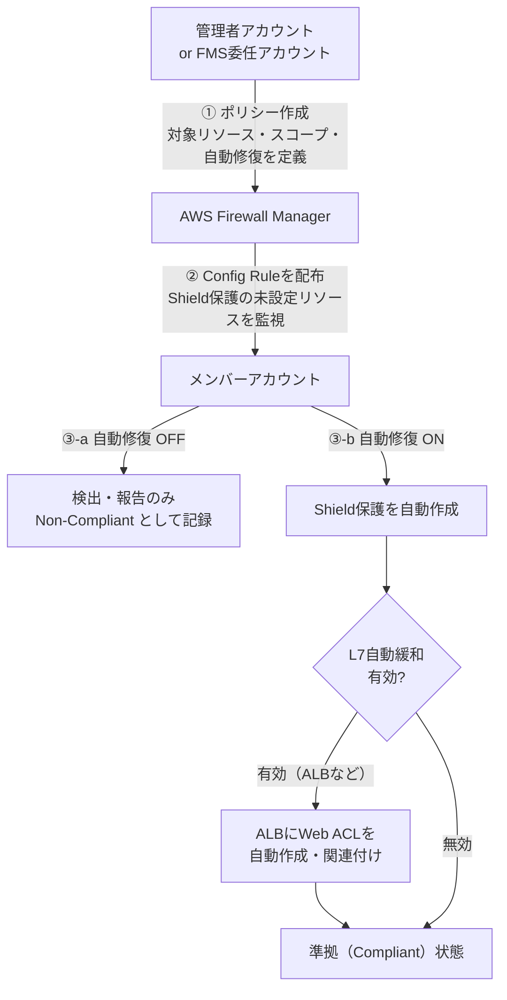
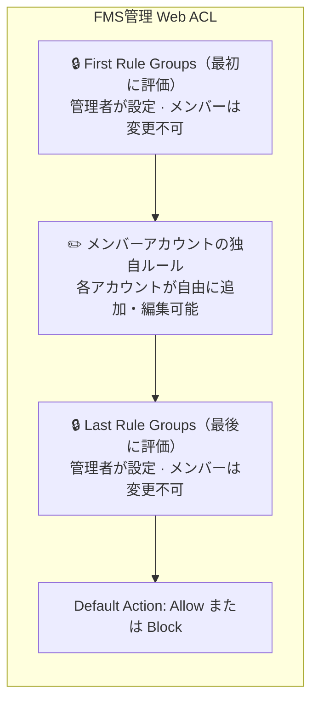

## 0. はじめに

こんにちは。豆蔵R&Dグループの丹羽です。今回はAWSセキュリティサービスの1つである「AWS Firewall Manager」（以下、FMS）[^1]のポリシー設定について紹介したいと思います。

最近、私が関わるプロジェクトで「AWS Shield Advanced」を導入する必要があり、Organizationsでのアカウント管理を行っている場合、任意のOUや任意のアカウントをShield Advancedの保護対象に設定するには「AWS Firewall Manager」のポリシー設定を行う必要があります。
このポリシー設定における挙動がややわかりにくかったため、今回実際に検証してみた結果を共有したいと思います。

現在Organizationsを利用していて、「一元的なDDoS対策やWeb ACL適用をしたい」「AWS Shield Advancedの導入を考えている」「FMSポリシーについて事前に挙動を知っておきたい」という検討をされている方やAWSセキュリティ運用を本格的に開始しようとしているプロジェクトにとって参考になればと思います。

---

## 1. この記事で分かること

この記事では、FMSが提供する **2つの主要なセキュリティポリシー** について、実際の検証結果をもとに解説します。

- **FMS Shield Advancedポリシー**: 組織全体にDDoS保護を一元適用するポリシー
- **FMS WAFポリシー**: 組織全体にWeb ACL[^2]ルール[^3]を一元配布・適用するポリシー

どちらのポリシーについても「目的」「仕組み」「検証して分かったこと」の3つの観点で整理していきます。特に、**自動修復機能（Auto Remediation）**[^4]の挙動や、**既存のWeb ACL**との共存パターンなど、公式ドキュメントだけでは掴みにくいリアルな動きを中心にお届けします。

---

## 2. 前提知識と対象読者
### 前提知識
本記事は「FMSポリシー設定における挙動の検証」がメインの内容になるため、FMSと検証時に登場するWAFやShield、それらに関連するサービスについて簡単に整理しておきます。
その他にも登場するサービスについては記事の各所で補足していきたいと思います。

:::column: AWS Firewall Manager とは

AWS Firewall Manager（FMS）は、AWS Organizations を利用して、複数の AWS アカウントにまたがる各種セキュリティルールを一元的に管理・適用するためのサービスです。FMS を使うことで、セキュリティポリシーの適用漏れを防ぎ、組織全体のセキュリティレベルを均一に保つことができます。

本記事で紹介するFMSのポリシーは以下の2つです。

- **FMS Shield Advancedポリシー**: 組織全体にDDoS保護を一元適用するポリシー
- **FMS WAFポリシー**: 組織全体にWeb ACLルールを一元配布・適用するポリシー

> **補足: AWS Organizationsとは**
> 複数のAWSアカウントを組織として一元管理するサービスです。**OU（Organizational Unit：組織単位）** という階層構造でアカウントをグループ化し、ポリシーを一括適用できます。FMSポリシーはこのOU・アカウント単位でスコープを指定して配布します。

:::

:::column: AWS WAF とは

AWS WAF は、Webアプリケーションへの不正なリクエストをフィルタリングするためのサービスです。**Web ACL（アクセスコントロールリスト）**の中にルールを定義し、CloudFrontやALBなどのリソースに関連付けて使います。

たとえば「SQLインジェクション攻撃をブロックする」「特定の国からのアクセスを制限する」といった防御ルールを、リソース単位で細かく設定できるのが特徴です。

> **補足: 関連するAWSリソース**
> - **ALB（Application Load Balancer）**: HTTPSレベルでトラフィックを振り分けるロードバランサー。WAF・Shield Advancedの主要な保護対象リソースの1つ。
> - **CloudFront**: AWSのCDN（コンテンツ配信ネットワーク）サービス。グローバルエッジでWAFルールを適用できる。

:::

:::column: AWS Shield とは

AWS Shieldは、DDoS攻撃[^5]からAWSリソースを保護するサービスです。2つのプランがあります。

| プラン              | 概要                                                                                                         |
| ------------------- | ------------------------------------------------------------------------------------------------------------ |
| **Shield Standard** | すべてのAWSユーザーに無料提供。L3/L4層（ネットワーク層・トランスポート層）の一般的なDDoS攻撃を自動防御       |
| **Shield Advanced** | 有料。より高度なDDoS保護、WAF利用料の無料化、DRT（DDoS Response Team）[^6]への相談権利、コスト保護などを提供 |

Shield Advancedを利用する場合、対象リソース（ALB、CloudFront、EIPなど）に「保護（Protection）」を作成して有効化する必要があります。

FMSを利用することで、新規リソース作成時に自動的にShield Advancedで保護し、設定漏れを防ぐことができ、Organizations内の全アカウントのShield Advanced保護を、FMSから集中管理することができます。

:::

### この記事の対象読者

- Organizationsを利用した一元的なアカウント管理をしている方
- Shield Advancedの導入を検討している方
- AWSのセキュリティサービスに興味があり、組織全体での統制を考えている方
- FMSを使って「全アカウントに共通のセキュリティルールを適用したい」と考えている方

---

## 3. FMS Shield Advancedポリシー

### 3-1. 何をするためのものか（目的）

先ほども軽く触れましたが、Shield Advancedを使うには、保護したいリソース1つ1つに対して「保護」を作成する必要があります。しかし、AWS Organizationsで管理している複数のアカウントにまたがるリソースすべてに手作業で保護を設定するのは、正直なところ現実的ではありません。

**FMS Shield Advancedポリシー**は、この課題を解決するためのものです。管理者アカウント（または委任管理者アカウント）[^7]から「この範囲のアカウント内に存在するALBやEIPには、全部Shield Advancedの保護をかけてね」とポリシーを定義するだけで、FMSが対象リソースを検出し、保護を一元的に適用してくれます。

### 3-2. 大まかな仕組み

FMS Shield Advancedポリシーの基本的な動作フローを整理すると、以下のようになります。

> **準拠（Compliant）**: FMSが対象リソースを検出し、保護を一元的に適用している状態。自動修復をOFFにしている場合、FMSは検出のみ行い保護対象には追加しないため非準拠となります。

:::column: AWS Configとは（FMSとの関係）
AWSリソースの設定状態を継続的に記録・評価するサービスです。**AWS Config Rule**（設定ルール）を定義することで、「リソースがこの基準を満たしているか？」を自動評価できます。
FMSはこの仕組みを活用し、ポリシー配布時にメンバーアカウントへConfig Ruleを自動定義。「Shield保護が未設定のリソースはないか」「FMS管理のWeb ACLが適用されているか」をConfigが継続監視し、準拠（Compliant）/非準拠（Non-Compliant）として報告します。
:::

ここで特に重要なのは、**L7自動緩和（Automatic application layer DDoS mitigation）**[^8]の設定です。この機能を有効にすると、ALBのような対象リソースに対してWeb ACLが必要になるため、FMSがShield管理用のWeb ACL（`FMManagedWebACLV2-...` という名前）を自動で作成し、リソースに関連付けます。

:::note alert
このWeb ACLの自動作成は、あくまで「Shield AdvancedのL7自動緩和機能」に必要なものです。WAFポリシーで作成されるWeb ACLとは別物であり、既存のWeb ACLに影響を与えることはありません。
実際、既存のWeb ACLのルール内の最後にFMSが作ったルールが追加されます。最後に追加されるので、ルール評価順序としても最後になり、既存ルールでチェックしたい内容を妨げることはないです。
:::

### 3-3. 実際の検証結果

検証は、メンバーアカウント上にALBとEIP（EC2にアタッチ）を用意し、管理者アカウントからFMS Shield Advancedポリシーを適用する形で行いました。

:::warn
念のため断っておきますが、以下の検証はあくまで「検証」という位置づけなので、いきなり本番運用しているアカウントやOUに対して実施することはおすすめしません。もしやらざるを得ない場合でもWebACLのバックアップ（JSONによる設定定義ファイル）をダウンロードしておくなどロールバックできる準備はしておくことをお勧めします。
:::

#### 検証パターンS-1: 自動修復OFF

| 項目     | 内容                                                          |
| -------- | ------------------------------------------------------------- |
| FMS設定  | 自動修復: **無効（Disabled）**                                |
| 事前状態 | ALB・EIPにShield保護なし                                      |
| 期待値   | Non-Compliant（非準拠）として検出されるが、保護は作成されない |

**結果**: 期待通りの挙動でした。

FMSがメンバーアカウントにAWS Configルールを自動配布し、そのルールによってALB・EIPのShield保護未設定が検出されました。FMSコンソール上では、アカウント自体のステータスが「Non-Compliant（非準拠）」、個別リソースのステータスも「Non-Compliant（非準拠）」となります。

**管理アカウントのFMSコンソール**
- メンバーアカウントに対するステータスが非準拠

- メンバーアカウント内の対象リソース（ALB, EIP）に対するステータスが非準拠

**メンバーアカウントのAWS Config画面**
- メンバーアカウントに作られるConfigルール

- Configルールによる非準拠リソースの検出

- 例えば、対象リソースALBのConfig詳細の「リソースタイムライン」を確認すると、FMSによってConfigルールが適用されたことが確認できる

> 補足しておくと、Configルールによって、リソースの設定情報が「どうだったか」「どうかわったのか」を確認するには、画像にある「ルールのコンプライアンス」「設定変更」を開くことで、**どのように設定が変更されて保護対象**になったのか（あるいは保護対象外になったのか）、**FMSルールが非準拠・準拠になったかどうか**が確認できる。
> （リソースの固有情報が割とバッと表示されるのでここでは開いた場合の画像は割愛します（マスクするのがめ…orz）。ご了承くださいｍｍ）

#### 検証パターンS-2: 自動修復ON

| 項目     | 内容                                                |
| -------- | --------------------------------------------------- |
| FMS設定  | 自動修復: **有効（Enabled）**                       |
| 事前状態 | ALB・EIPにShield保護なし                            |
| 期待値   | Shield保護が自動作成され、Compliant（準拠）に変わる |

**結果**: 期待通り、ただし**反映にはタイムラグ**がありました。

自動修復を有効にしてから約5分後、EIPのステータスが先にCompliantになりました。一方、ALBのステータスがCompliantになるまでにはもう少し時間がかかり、追加で数分待つ必要がありました。

ALBについては、Shield保護の作成に加えて、**L7自動緩和用のWeb ACL（`FMManagedWebACLV2-...`）が自動作成・関連付け**されていることも確認できました。これはShield Advancedの機能によるものであり、想定どおりの動作です。

**管理アカウントのFMSコンソール**
- 自動修復の有効設定

画像内にある「Replace~」ですが、今回Shield AdvancedポリシーでDDoS保護を有効にしているため、対象リソースのALBなどWeb ACLが紐づけれるリソースにそれ用のルールが自動作成（追加）されます。

**メンバーアカウントのコンソール画面**
- WAF&Shieldコンソール
FMSによってWeb ACLが作成されます。

FMS作成のWeb ACLはALBなどのリソースへの紐づけはされず、

代わりに既存Web ACLにルールが追加されます。
「ShieldMitigationRuleGroup_...」という名前のルールが既存Web ACLのルールの最後に追加されていることが確認できます。
これがDDoS保護のためのルールのようです。

WebACLの評価は上から順に適用されるので、最後に追加されていることで既存のWeb ACLルール評価順序に影響が出ないような仕組みになっているということですね。

- Configコンソール
自動修復の有効にしたことによってリソースが保護対象となりステータスが準拠になりました。

同様にリソースタイムラインから対象リソースがShield Advancedポリシーの保護対象になったことなどが見れます。（画像は割愛します。）

#### ポリシー削除時の挙動

検証完了後にポリシーを削除したところ、メンバーアカウント上にFMSが作成したConfigルールやWeb ACLは**きちんと削除**されました。ポリシー削除直後は残っていたリソースも、しばらく待つと自動的にクリーンアップされることを確認しています。

**管理アカウントのFMSコンソール**
- 削除

**メンバーアカウントのコンソール画面**
- WAF&Shieldコンソール

- Configコンソール
ルールが削除されるので「利用不可」になる。

---

## 4. FMS WAFポリシー

### 4-1. 何をするためのものか（目的）

AWS WAFは非常に強力なサービスですが、組織内の全アカウントで「最低限これだけは守ってほしい」という共通ルールを徹底するのは意外と大変です。各アカウントの管理者に「この設定を入れてください」とお願いして回るのは、管理する側も管理される側も負荷が高いですよね。

**FMS WAFポリシー**は、管理者がWeb ACLの設定内容（適用するルールグループ、デフォルトアクションなど）をポリシーとして定義し、組織全体に一括で配布・適用するためのものです。

### 4-2. 大まかな仕組み

FMS WAFポリシーには、Shield Advancedポリシーよりも設定項目が多く、特に「既存のWeb ACLがある場合にどう扱うか」が重要な設計ポイントになります。

#### 置換するor統合する

結論から言うと、FMS WAFポリシーを作成し、Web ACLを適用する際には、
- 管理者が定義したルールをFMSが管理するWeb ACLに**置換**する
- メンバーアカウントの独自ルールを**挟み込む**ような形で統合する
の2通りの設定パターンがあります。

挟みこむというのは、

> **補足: First / Last Rule Groups とは**
> FMS WAFポリシーで設定できるルールグループの配置枠です。
> - **First Rule Groups**: メンバーアカウントの独自ルールより**先**に評価される。「絶対にブロックしたい通信」を管理者が強制したい場合に使う。
> - **Last Rule Groups**: 独自ルールより**後**に評価される。「最後の砦」として組織共通の後処理ルールを設定する。
> - **Default Action**: どのルールにもマッチしなかったリクエストへの最終アクション（Allow または Block）。FMSポリシーで設定する。
>
> この構造により、管理者が強制するベースラインを保ちながら、各アカウントが独自ルールを自由に追加できます。

これにより、組織全体の**セキュリティベースライン**を管理者が強制しつつ、各アカウントのアプリケーション固有のルールも柔軟に追加できる仕組みになっています。

#### Web ACL管理の4パターンを検証してみる

FMS WAFポリシーでは、リソースに対してどのようにWeb ACLを適用するか、いくつかパターンがあると思いますが、今回は以下の4パターンを試してみようと思います。

| パターン                     | 自動修復 | 置換オプション | Retrofit[^9] | 挙動                                                                                                         |
| ---------------------------- | -------- | -------------- | ------------ | ------------------------------------------------------------------------------------------------------------ |
| W-1: **検出のみ**            | OFF      | -              | -            | ポリシー違反を検知・報告するだけ。リソースには何も変更しない                                                 |
| W-2: **自動修復（置換OFF）** | ON       | OFF            | OFF          | Web ACL未設定のリソースにはFMS作成のWeb ACLを適用。**既に独自のWeb ACLが設定されているリソースは変更しない** |
| W-3: **自動修復（置換ON）**  | ON       | ON             | OFF          | すべての対象リソースに対して、**強制的にFMS作成のWeb ACLに置き換える**                                       |
| W-4: **自動修復（置換OFF）** | ON       | OFF            | ON           | すべての対象リソースに対して、**FMSのルールを注入する**                                                      |

### 4-3. 実際の検証結果

検証は、メンバーアカウント上にALBと独自のWeb ACL（`test-fms-waf-log`）を用意し、4つのパターンで挙動を確認しました。

#### 検証パターンW-1: 自動修復OFF

| 項目     | 内容                                     |
| -------- | ---------------------------------------- |
| FMS設定  | 自動修復: **無効**                       |
| 事前状態 | ALBにWeb ACL関連付けなし                 |
| 期待値   | Non-Compliant。Web ACLは関連付けられない |

**結果**: 想定通り、FMSコンソール上でNon-Compliantとして検出され、ALBには何も変更が加えられていませんでした。

**管理アカウントのコンソール画面**
該当設定箇所

**メンバーアカウントのコンソール画面**
ポリシー設定後のWAF画面
リソースに関連付けされていない独自のWeb ACLがあり（事前に作成しているもの）、

ConfigコンソールのFMS作成ルールでのステータス
自動修復がOFFであり、ALBにはどのACLも関連付けされていないため、FMS WAFポリシーによる評価が非準拠になる。

**管理アカウントのコンソール画面**
ポリシー適用後のFMSコンソール画面

#### 検証パターンW-2: 自動修復ON・置換OFF

| 項目     | 内容                                                         |
| -------- | ------------------------------------------------------------ |
| FMS設定  | 自動修復: **有効**、既存Web ACLの置換: **OFF**               |
| 事前状態 | ALBにWeb ACL関連付けなし                                     |
| 期待値   | FMS作成のWeb ACLが自動的にALBに関連付けられ、Compliantになる |

**結果**: 想定通りFMSが自動で作成してくれたWeb ACLをALBに関連付けてくれました。ステータスもCompliantに変わりました。

**管理アカウントのコンソール画面**
該当設定の更新

**メンバーアカウントのコンソール画面**
fmsが作成したDDoS対策用Web ACLがALBに関連付けられている

Configルールも準拠になった

**管理アカウントのコンソール画面**
しばらくまってから管理コンソールを確認すると

#### 検証パターンW-3: 置換ONの状態で独自Web ACLを割り当ててみる

ここからが面白いところです。W-2でFMS管理のWeb ACLが適用された状態から、**手動でメンバーアカウント上で独自のWeb ACL（`test-fms-waf-log`）に差し替え**てみました。

| 項目     | 内容                                                              |
| -------- | ----------------------------------------------------------------- |
| FMS設定  | 自動修復: **有効**、既存Web ACLの置換: **ON**                     |
| 事前状態 | ALBにFMS作成のWeb ACLが関連付け済み → **手動で独自Web ACLに変更** |
| 期待値   | FMS管理のWeb ACLが強制的にALBに関連付けられ、Compliantになる      |

**結果**: 想定通りの結果

**メンバーアカウントのコンソール画面**
メンバーアカウントで独自Web ACLを割り当てた直後の画面

↓

↓

このようにfms管理のWeb ACLが外れ、独自Web ACLが設定されている状態となる。

**管理アカウントのコンソール画面**
次に、管理アカウントから置換ONに変更してみる。

**メンバーアカウントのコンソール画面**
メンバーアカウント上でのACLの状態において、fms管理のWeb ACLは以下のようになります。

そして、独自に作ったWeb ACLは以下のようになります。

このように置換設定ONで自動修復を有効にすると、手動で独自Web ACLをALBに関連付けた場合に、一度紐づけていたFMS管理のWeb ACLは自動的に外れますが、その後FMS管理のWeb ACLが強制的にALBに関連付けられ、Compliantになります。

もし、運用メンバーが意図せずにFMS管理のWeb ACLをALBから外してしまった場合などに、FMS管理のWeb ACLの関連付けに強制的に戻すことができるということですね。
ただ、意図していた場合には強制的に戻されるのは困るわけです。

#### 検証パターンW-4: Retrofit（既存Web ACLの改修）モード
そこで存在しているのが **「Retrofit existing web ACLs」** [^9]パターンなのかなと考えています。

少しややこしくなってきたと思うので、検証内容をざっと説明しておくと、
W-3の状態（FMS管理のWeb ACLがALBに関連付けられている状態）から、一度FMS WAFポリシーの「Replace existing associated web ACLs」オプションをOFF
に変更し、改めて独自のWeb ACLをALBに関連付けた状態で、自動修復有効・Retrofitモードも有効にした状態にWAFポリシーを更新します。

| 項目     | 内容                                                                               |
| -------- | ---------------------------------------------------------------------------------- |
| FMS設定  | 自動修復: **有効**、既存Web ACLの置換: **OFF**、Retrofit: **ON**                   |
| 事前状態 | ALBにFMS作成のWeb ACLが関連付け済み → **手動で独自Web ACLに変更**                  |
| 期待値   | FMS管理のWeb ACLルールが、独自Web ACLの内容を保ちながらマージされ、Compliantになる |
**結果**: 想定通りの結果

Retrofitモードでは、FMSは新たなWeb ACLを作成するのではなく、**既存のカスタムWeb ACLの中に、FMS WAFポリシー定義時に設定したルールグループを注入**しました。

具体的には、独自のWeb ACLに定義されていたルールはそのまま維持され、FMS WAFポリシーで設定したFirst Rule Groups（優先ルールグループ）とLast Rule Groups（最終ルールグループ）（今回はFirst Rule Goupsのみ）が**サンドイッチの形で追加**されます。

AWS Configのステータスも准拠（Compliant）となり、独自のWeb ACLの独自ルールとFMSのルールが共存している状態が確認できました。

以下検証時のコンソールの様子です。（※**事前状態**から始めています。）

**メンバーアカウント上のコンソール**
メンバーアカウント上でのWeb ACLの様子

**管理アカウント上のコンソール**
管理アカウントでのWAFポリシー設定を「置換OFFの状態で、RetrofitをONにする」
RetrofitON

RetorfitがONだと、自動で置換モードが選択できなくなる（以下の補足参照）

**メンバーアカウント上のコンソール**
fms管理のWeb ACLはリソースへの紐づけがありませんが、

独自に作成したWeb ACLにはFMSのルールが注入されています。

> **補足**: 置換ON設定とRetrofitモードは**排他的な設定**です。「置換ON設定で運用中にRetrofitに切り替える」場合は、一度置換OFFにしてからRetrofitを有効化する必要があります。

---

## 5. まとめ

今回の検証を通じて、FMSの2つのセキュリティポリシーの挙動を実際に確かめることができました。検証結果をまとめると、以下のようになります。

### Shield Advancedポリシーのポイント

| 確認事項                       | 結果                                                      |
| ------------------------------ | --------------------------------------------------------- |
| 自動修復OFFでの検出            | ✅ Non-Compliantとして正しく検出される                     |
| 自動修復ONでの保護作成         | ✅ Shield保護が自動作成される                              |
| L7自動緩和によるWeb ACL        | ✅ ALBにはDDoS緩和用のWeb ACLが自動作成される              |
| ポリシー削除時のクリーンアップ | ✅ FMS作成リソース（Config Rule、Web ACL）は自動削除される |

### WAFポリシーのポイント

| 確認事項                           | 結果                                                                                  |
| ---------------------------------- | ------------------------------------------------------------------------------------- |
| 自動修復OFFでの検出                | ✅ Non-Compliantとして正しく検出される                                                 |
| 自動修復ON・置換OFFでのWeb ACL適用 | ✅ 未設定リソースにのみFMS Web ACLが適用される                                         |
| 置換OFF時の既存Web ACL保護         | ✅ 既存Web ACLは書き戻されない（安全に運用可能）                                       |
| 置換ON時の強制置換                 | ✅ 既存Web ACLからFMS Web ACLに紐づけが切り替わる（カスタムWeb ACL自体は削除されない） |
| Retrofitモード                     | ✅ 既存Web ACLにFMSルールを注入。独自ルールは維持される                                |

### 運用する際のポイント

検証結果を踏まえ、FMSセキュリティポリシーを運用する際に意識しておくべきポイントを挙げます。

1. **まずは自動修復OFFで始める**: いきなり自動修復を有効にするのではなく、まずは「検出のみ」モードで対象を把握してから有効化するのが安全。
2. **置換オプションは慎重に**: 既にWAFを運用中のリソースがある場合、置換ONにすると既存の防御設定が外れるリスクがある。Retrofitモードの活用も検討。
3. **反映までのタイムラグを考慮する**: 地味に大事なのが、fmsポリシーの設定反映には数分〜十数分のラグがあるため、「設定したのに変わらない！」と慌てずに、しばらく待ってから確認したうえで次の設定をしたりするのがいいです。
4. **ポリシー削除時のクリーンアップを信頼する**: FMS作成のリソースはポリシー削除時にきちんと削除されます。ただし、こちらも完全削除までに若干の時間がかかります。

FMSは「設定して放っておけば組織全体を守ってくれる」便利なサービスですが、その裏側では多くのリソースが自動的に作成・管理されています。今回はFMSの2種類のポリシーに絞って紹介をしましたが、その挙動や背後で自動的に行われる設定などをざっくりとでも把握しておくことで、確証を持ったセキュリティ対策を実施できると思います。

:::column: ポリシー適用後のステップ

今回はボリューム感が大きくなってきたため扱えませんでしたが、FMSポリシーを設定したあとにさらに整備しておくと良い内容として、以下が挙げられます。

- **攻撃通知の整備**: Shield Advancedポリシーで検知した攻撃を管理者へ通知（SNSやCloudWatchアラームの活用）
- **リクエストログの収集・分析**: 保護対象リソースへのリクエストをS3バケットに蓄積し、Athenaなどで分析できる体制を整える

> **補足: 関連サービスの概要**
> - **SNS（Simple Notification Service）**: AWSのメッセージ通知サービス。Shield Advancedの攻撃検知イベントと組み合わせてアラート通知に利用する。
> - **CloudWatch**: AWSのモニタリングサービス。メトリクスやアラームを設定し、DDoS攻撃検知時に自動通知・自動対応のトリガーとして使える。
> - **S3（Simple Storage Service）**: WAFログの保管先。CloudFrontやALBのアクセスログ・WAFログを集約する。
> - **Athena**: S3上のデータをSQLでクエリできる分析サービス。S3に収集したWAFログをそのままSQL分析できるため、攻撃パターンの分析に有効。

私自身も今後のプロジェクトの中でこれらは実施していく予定ですので、また皆さんに共有すべき事項が出てきた場合にはまとめてみようと思います。

:::

紹介した検証内容がSheld AdvancedとFMSの理解、そしてセキュリティ対策の一助となれば幸いです。

## 注釈

[^1]: **AWS Firewall Manager（FMS）**: AWS Organizationsと連携し、組織全体のWAF・Shield・セキュリティグループなどのセキュリティポリシーを一元管理するサービス。参考: [AWS Firewall Manager Developer Guide](https://docs.aws.amazon.com/waf/latest/developerguide/fms-chapter.html)

[^2]: **Web ACL（Web Access Control List）**: AWS WAFの中核リソース。リクエストの許可・拒否を判定するためのルールをまとめた「箱」。ALBやCloudFrontなどのリソースに関連付けて使用する。参考: [AWS WAF Web ACLs](https://docs.aws.amazon.com/waf/latest/developerguide/web-acl.html)

[^3]: **ルール（Rule）**: Web ACL内に定義する個々の検査条件。「IPアドレスの一致」「リクエストボディの検査」など、トラフィックを評価するための条件と、マッチした場合のアクション（Allow/Block/Count）をセットにしたもの。

[^4]: **自動修復（Auto Remediation）**: FMSポリシーの機能の1つ。ポリシーに違反しているリソースを検出した際に、自動的にリソースの設定を修正すること。また、対象リソース（ELB、EIPなど）を自動的に保護対象に加えること。参考: [FMS Policy actions](https://docs.aws.amazon.com/waf/latest/developerguide/creating-firewall-manager-policy.html)

[^5]: **DDoS攻撃（Distributed Denial of Service attack）**: 大量のコンピューターから一斉にリクエストを送り、サービスを利用不能にする攻撃手法。

[^6]: **DRT（DDoS Response Team）**: AWSのDDoS対策専門チーム。Shield Advanced契約者が利用可能で、大規模攻撃時の対応支援を受けられる。参考: [DRT support](https://docs.aws.amazon.com/waf/latest/developerguide/ddos-srt-support.html)

[^7]: **委任管理者アカウント**: AWS Organizationsの管理アカウントから、特定のサービス（FMSなど）の管理権限を委任されたメンバーアカウント。管理アカウントの権限をむやみに使わず、専用の管理アカウントに役割を分離するのがベストプラクティス。FMSの場合、FMSを管理するアカウントを権限を絞って複数追加することができる。

[^8]: **L7自動緩和（Automatic application layer DDoS mitigation）**: Shield Advancedの機能の1つ。アプリケーション層（レイヤー7）のDDoS攻撃パターンを自動検知し、WAF Web ACLにルールを自動追加して緩和する。参考: [Shield Advanced application layer DDoS mitigation](https://docs.aws.amazon.com/waf/latest/developerguide/ddos-automatic-app-layer-response.html)

[^9]: **Retrofit existing web ACLs**: FMS WAFポリシーのWeb ACL管理モードの1つ。新しいWeb ACLを作成する代わりに、リソースに既に関連付けられている既存のWeb ACLをFMSの管理下に置き、FMSポリシーのルール（First/Last Rule Groups）を注入するアプローチ。参考: [FMS WAF policy](https://docs.aws.amazon.com/waf/latest/developerguide/waf-policies.html)
