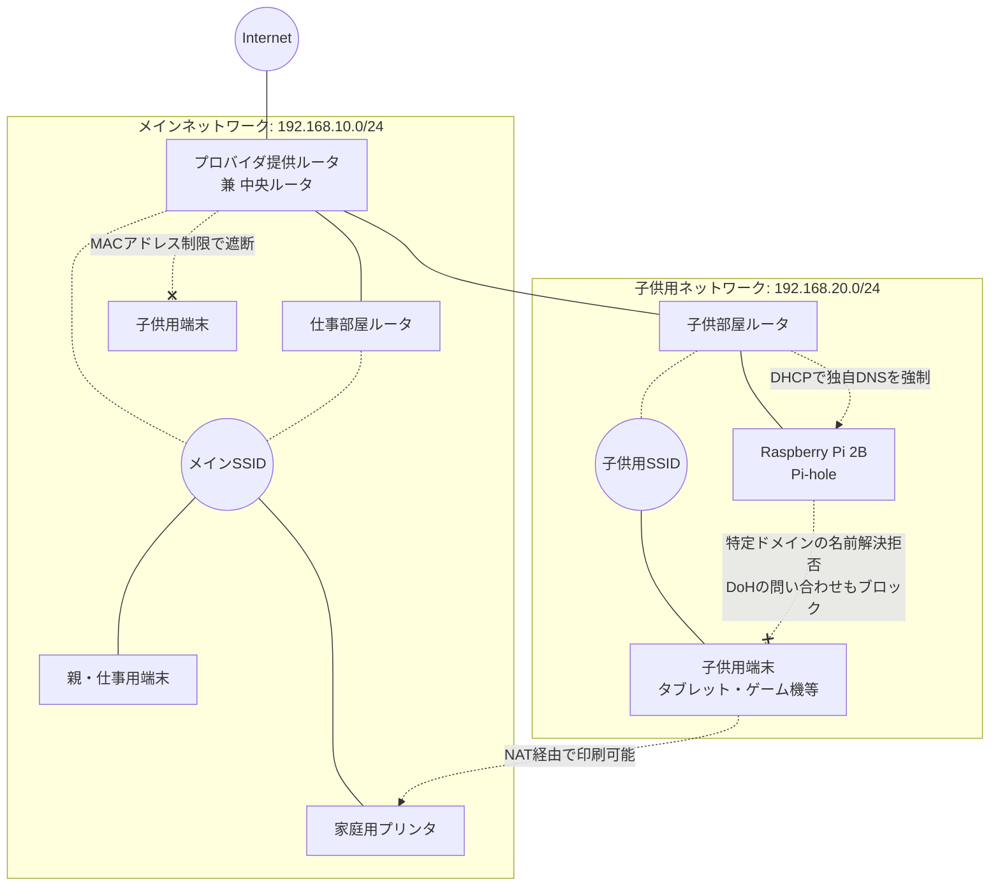

## はじめに
こんにちは。私の参加しているプロジェクトでは、毎朝の朝会で各自のコンディション（ニコニコ、ちょいニコ、普通、ちょいしんど、しんどめ、地獄など）を共有する「ニコニコカレンダー」を活用しています。
先日、私がその日の気分を「ちょいしんど」、理由に「寝不足」と入力していたことから、メンバーに「副鼻腔炎が悪化しましたか？」と心配されました。そこで「最近は副鼻腔炎は落ち着いているんですが、実は子供のネット制限のために徹夜で家庭内ネットワークをいじってまして……」と雑談をしたところ、「興味深いからぜひ記事にしてほしい！」と思わぬリクエストをいただきました。

これまでクラウド資格関連（全冠記など）の記事ばかり書いていたので、「たまには資格以外の息抜き記事も書いてみようかな」と思い立ち、今回筆をとりました。
当サイトの他の記事と違い、少し古い技術の組み合わせにはなりますが、ぜひ息抜きがてら読んでみていただけると嬉しいです。
とはいえ、今回扱っているような泥臭いネットワークの基礎知識（サブネット、DHCP、DNSの仕組みなど）を実際に手を動かして理解しておくことは、クラウド環境を設計・構築する際や、クラウド系の資格を受験する際にも非常に有用な土台となることを、 **クラウド認定”ほぼ”全冠の私が保証します！**

ITエンジニアの皆様におかれましては、お子さんのインターネットやゲームとの付き合い方に悩まれている方も多いのではないでしょうか。我が家で発生した問題と、エンジニアの親として実施した「本気のネットワーク対策」についてご紹介します。
（※なお、本記事に記載しているIPアドレスやサブネットなどのネットワーク情報は、セキュリティの観点から実際の数値から変更してぼかして記載しています）

## 我が家のネットワーク事情と事の発端
まずは前提となる我が家の状況（住環境や家族構成、働き方）は以下の通りです。

*   **家族構成、働き方**
    *   **子供**: 中学生と小学生の2人
    *   **妻**: たまに自宅からテレワークをする日がある
    *   **私（筆者）**: 常に自宅の仕事部屋からフルテレワーク
*   **住環境**: 4DK
    *   周辺住宅からの電波干渉が激しく、2.4GHz帯（11g等）は使い物にならない状態
    *   そのため、障害物に弱いが高速な5GHz帯（11a/ac/ax等）をメインにする必要がある
    *   また、夫婦のテレワーク（Web会議等）のため、家中のどこでも「安定したWi-Fi環境」が必須要件
    *   結果として、それぞれの部屋までの物理的な距離や壁を網羅するため、Wi-Fiルータが合計3台必要

子供たちにはそれぞれ学校からタブレットが支給されており、小学生は週に一回、宿題用で持ち帰るのですが、中学生のタブレットは常に自宅に置いている状態です。
ちなみに、子供用のスマホはAndroidを持たせており、そちらはGoogleの「ファミリーリンク」機能を使って利用可能な時間をしっかりと制限しています。

しかしある日、子供が盲点となっていた「学校タブレット」をベッドに持ち込み、夜中にゲーム等をしていることが発覚しました。寝不足で朝起きられなくなり、部活も休みがちになるという悪循環に陥ってしまいました。
（なお、学校タブレットはGoogle Workspaceで管理されているのですが、「Google Workspace側でインストールするアプリや閲覧可能なサイトを制限してほしいものだが。。。」というのが親としての本音です）。

これはいけないと思い、スマホ以外の端末に対しても、最初は以下のような対策を実施しました。
*   **Wifiルータのキッズコントロール機能**を活用し、利用可能時間を制限
*   **プロバイダ提供ルータと家庭用のBuffalo製ルータ（2台）を用いた計3台運用**によるアクセスポイントの分離
    *   中央ルータ（プロバイダ提供ルータ）と私の仕事部屋のルータは同じメインSSIDに設定
    *   子供部屋のルータは別の「子供用SSID」に設定
*   ゲーム機、学校のタブレット、チャレンジタッチ（進研ゼミ）などの子供用端末は、すべて「子供用SSID」に接続させる

なお、この時点ではネットワークは分割しておらず、すべて同じメインのネットワーク（例：`192.168.10.0/24`）内で運用していました。

## イタチごっこの始まり
初期対策で安心したのも束の間、平日の帰宅後にキッズコントロールで許可されている時間内は、勉強をせずにYouTubeを見たりゲームをしたりして過ごすようになってしまいました。

さらに悪いことに、いつの間にか子供が「メインのSSID」に接続しており、再びベッドへ端末を持ち込んでいるのを発見してしまったのです。
スマホはファミリーリンクで制限できていても、他の端末が抜け穴になっては意味がありません。寝不足で部活に行けない、勉強もできていない……。このまま子供の自制心に任せたままにするわけにはいかないと判断し、根本的なネットワーク改修を実施することにしました。

「DHCPの設定で、子供の端末にだけPi-holeのDNSを割り当てればいいのでは？」と思われるかもしれません。しかし、多くの家庭用ルータにはそこまで高度なDHCP機能はなく、また同じサブネット内にいると端末側でDNSを手動設定されるだけで簡単に突破されてしまいます。ネットワーク（サブネット）を物理的・論理的に完全に分けることで、逃げ場をなくす「境界での制御」を重視しました。

## 今回行った根本的な対策（ガチ構成）
ITエンジニアの親として、物理的・論理的に抜け穴を塞ぐためのネットワーク構成へと変更しました。

実は当初、賃貸物件に無償で付帯しているケーブルテレビ回線のルータがあり、子供用端末はそちらの別回線へ完全に追い出してしまう（物理的な回線分離）という強硬手段も考えました。しかし、無料回線ゆえに下り速度があまりにも遅く、本来の目的である学校の遠隔授業や調べ物に支障が出てしまっては本末転倒です。そのため、あくまでメインの高速回線を生かしつつ、論理的に安全なネットワークを構築する方向で設計しました。

なお、我が家の環境は**プロバイダの提供ルータと、一般的な家庭用のBuffalo製ルータの組み合わせ**です。設計を考えながら、何度「ああ、VLANさえ使えればどんなに楽だったか……！」と天を仰いだことかわかりません。もし企業向けの多機能ルータなどを使っていれば、VLANを活用してスマートに論理分割できたのですが、今回はあくまで「できるだけ自宅にあるものを組み合わせて一晩で完成させる」ことを裏テーマとし、手持ちの民生機だけで**そのまま徹夜で泥臭く一気に組み上げました**。

:::info
**💡 補足: VLAN（仮想LAN）とは**
物理的なLANケーブルの配線やルータの接続構成を変えずに、ネットワーク機器（スイッチやルータ）内部の設定だけで論理的にネットワークを安全に分割できる仕組みです。これがあれば、物理的なルータを複数台またがって繋ぎ、手作業で泥臭くサブネットを分離するような苦労は不要になります。
:::

作業中、ふと「豆蔵入社以前に在籍していた会社での社内インフラ構築を思い出すな……」と深夜に我に返りつつも、実施した対策は以下の通りです。

1.  **MACアドレス制限の導入**
    中央のルータにMACアドレスのブラックリストを設定し、子供の端末がメインSSIDに直接繋がらないようにシャットアウトしました。
2.  **サブネットの隔離**
    子供用SSIDのルータを、メインサブネット配下に別のサブネット（例：`192.168.20.0/24`）として構築し、論理的にネットワークを隔離しました。なお、子供用サブネットをメインサブネットの下にぶら下げる構成（NAT）にしているため、メインサブネット側に置かれている家庭用プリンタなどへの通信は引き続き利用可能です。
3.  **Raspberry Piによる独自DNS（Pi-hole）の構築**
    特定のドメインをブラックリストで弾くこと自体は市販のルータの機能でも可能ですが、ルータの標準機能だけでは「有志がインターネット上で公開している膨大なブラックリストをそのまま継続的にインポートして使う」といった柔軟な運用が困難です。そこで、子供用のサブネット内にRaspberry Piを設置し、強力なドメインフィルタリング機能を持つ「Pi-hole」を利用して専用のDNSサーバーを構築しました。
    （なぜ自宅にラズパイが転がっているのかは聞かないでください。徹夜で仕上げるために自宅の余り物を深夜にかき集めた結果、今回使用したのは少し古いRaspberry Pi 2Bです）。
4.  **DHCPによる独自DNSの強制**
    子供用ルータのDHCP設定を変更し、ラズパイのIPアドレスをDNSサーバーとして配布するようにしました。
5.  **特定ドメインの問い合わせ拒否と正常通信の転送（Upstream DNS）**
    Pi-holeのフィルタリング設定で、ゲームや動画サイトに関するDNS問い合わせをすべて拒否（ブラックホール化）しました。一方で、ブロック対象外の正常な問い合わせ（学習用サイトなど）については、Pi-holeから上位のパブリックDNS（Google DNSの `8.8.8.8` や Cloudflareの `1.1.1.1` など）へ転送させることで、安全な通信のみを許可する構成にしています。
6.  **暗号化DNS（DoH / DoT）への対策**
    実は学校のタブレットがDNS over HTTPS（DoH）などの暗号化されたDNS通信を使用していたため、通常のポート53のフィルタリングだけでは抜け道になってしまいます。そこで、Cloudflareなどの主要なパブリックDNSサービスに対する通信自体も拒否する設定を追加しました。
    :::info
    **💡 補足: 親（管理者）泣かせの DoH (DNS over HTTPS)**
    従来のDNS通信（ポート53）は暗号化されていないため、経路上に置いたPi-hole等で「どこにアクセスしようとしているか」を簡単に監視・遮断できました。しかし近年はプライバシー保護の観点から、OSやブラウザがDNS通信をHTTPS（ポート443）の暗号化通信に丸めてしまう機能（DoH）をデフォルトで利用するケースが増えています。これを使われると通信の中身がただのHTTPS通信に見えるため、ローカルのDNSサーバーが意図せずスルー・回避されてしまいます。セキュリティ的には素晴らしい技術ですが、家庭内ネットワークの管理者としては非常に悩ましい壁となります。
    :::

以上を踏まえた、最終的な我が家のネットワーク構成図は以下のようになります。

## 今後の展望と親の葛藤
これで現在のところ、子供の夜更かしネットサーフィンは完全に防ぐことができています。

親としては、本来であればこんなシステムでガチガチに管理するのではなく、できれば子供自身の自制に任せて成長を見守りたいというのが本音です。しかし現状では完全に自制に任せきりにすることができず、今回は苦渋の決断としてシステム的な制限を強めることになりました。

ただ、今回の構成も完璧ではありません。子供用サブネットから外部への標準的なDNS通信（UDP 53ポート）は通過させているため、もし今後、子供が知識を付けて、端末のネットワーク設定から自分でGoogle DNS（`8.8.8.8`や`8.8.4.4`）などを設定できるようになれば、この制限は突破されてしまいます。その場合は追加の検討が必要です。

……とはいえ、もしそこまでのネットワークの仕組みを自力で理解し、制限を突破できるほどの知識を身につけたのであれば、ITエンジニアの親としては「それはそれで喜ばしいことかもしれない？」と、少し複雑な感情も抱いています。いつかはこうした制限をすべて外し、自分自身の力でコントロールできるようになってくれることを願うばかりです。

## おわりに
家庭内ネットワークも、要件（家族の働き方や子供の利用状況、リテラシー、手持ちの機材）に合わせてアーキテクチャを見直していく必要があると痛感しました。同じようなお悩みを持つ方の参考になれば幸いです。
