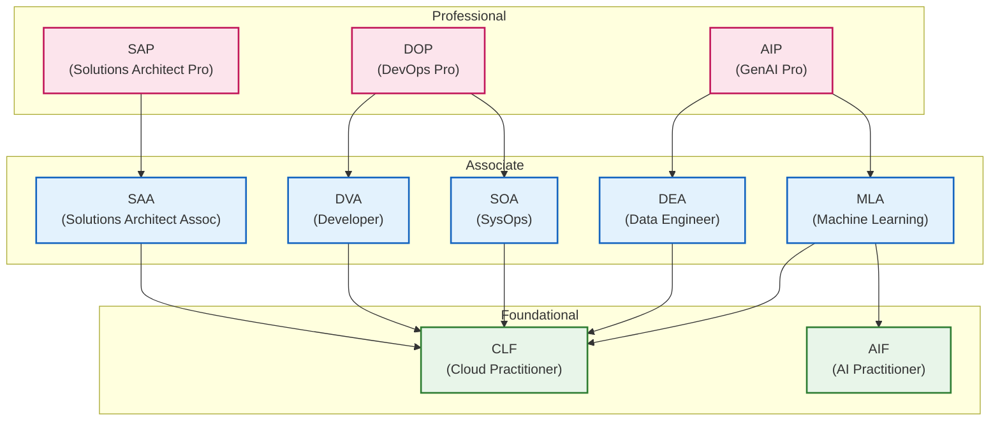

## はじめに

[前回の記事](/blogs/2026/04/13/google_cloud_all_certified_revenge/)では、Google Cloud認定の鬼門であった「Professional Security Operations Engineer（PSOE）」を突破し、念願の「Google Cloud認定全冠」を達成したことをご報告しました。

そして今回、AWS側で唯一未取得となっていた最新認定「[AWS Certified Generative AI Developer - Professional (AIP-C01)](https://aws.amazon.com/jp/certification/certified-generative-ai-developer-professional/)」が2026年4月14日に正式リリースされたため、さっそく受験してきました。結果は無事 **合格** ！ これにより、目標として掲げていた **「AWS＆Google CloudのW全冠達成」** をついに果たすことができました。

本記事では、過去のベータ試験での不合格体験を振り返りつつ、リベンジに向けてどのような対策を行ったのか、そして正式リリース版試験の所感についてまとめます。

:::info
秘密保持契約（NDA）があるため、詳細な試験内容については触れることができませんので、ご了承ください。
また記載の情報は2026年4月時点のものです。
:::

## 試験の概要：AWS Certified Generative AI Developer - Professional

AWS Certified Generative AI Developer - Professional (AIP-C01) は、GenAI デベロッパーの役割を担う方を対象としたプロフェッショナルレベルの認定です。基盤モデル（FM）をアプリケーションとビジネスワークフローに効果的に統合し、AWSテクノロジーを使用してGenAIソリューションを本番環境に実装する実践的な知識が検証されます。

主な出題分野と重みは以下の通りです。

- コンテンツ分野 1: 基盤モデルの統合、データ管理、コンプライアンス (31%)
- コンテンツ分野 2: 実装と統合 (26%)
- コンテンツ分野 3: AI の安全性、セキュリティ、ガバナンス (20%)
- コンテンツ分野 4: GenAIアプリケーションの運用効率と最適化 (12%)
- コンテンツ分野 5: テスト、検証、トラブルシューティング (11%)

試験は75問（うち10問は採点対象外）で構成されており、100～1,000の換算スコアで750点以上が合格ラインとなります。

## ベータ試験での敗因と課題

実は2025年12月に、この認定のベータ試験を受験していましたが、残念ながら **不合格** という悔しい思いをしていました。
当時の振り返りでも触れましたが、主な敗因は以下の点にありました。

- **長文問題による時間不足** : プロフェッショナルレベル特有の非常に長い問題文と選択肢に圧倒されました。複数のサービスを組み合わせた複雑なシナリオから、要件とアーキテクチャ図を素早く頭の中で組み立てるのに時間がかかり、ギリギリまで時間を使ってしまいました。
- **本番環境運用を考慮した実践的知識の不足** : Amazon Bedrockを中心とした構成において、スケーラビリティ、セキュリティ、コスト最適化などのベストプラクティスに基づいた判断が求められましたが、複数の正解に見える選択肢から最適なものを絞り切れませんでした。

## リベンジに向けた対策

前回の反省を踏まえ、正式版でのリベンジに向けて以下の対策を重点的に行いました。

- **試験ガイドの再確認と分野の深掘り** : 試験ガイドに記載されている、ベクトルストアやRAGの設計、プロンプトエンジニアリングの適用、エージェンティックAIソリューションの実装など、出題の核となる技術要素を再確認しました。
- **関連サービスのベストプラクティスの学習** : Amazon Bedrockを使った実際のアプリケーション構築をイメージし、連携するAWS Lambda、Amazon API Gateway、Amazon CloudFrontといったサービス群の詳細な理解を深めました。また、Amazon BedrockガードレールによるAIの安全性とガバナンスや、Amazon Comprehend等を用いたデータ保護についても重点的に学習しました。
- **長文シナリオへの対応** : 長い文章から即座に「要件は何か」「制約は何か（コスト優先か、レイテンシー優先かなど）」を整理し、構成図をイメージするトレーニングを意識的に行いました。

## 実際の試験で問われた技術テーマの傾向

今回の試験を通して、単なるGenerative AIの機能知識だけでなく、エンタープライズの「本番運用」に直結する実践的な知見が深く問われていると感じました。NDAの範囲内で、特に重要だと感じたテーマをいくつか共有します。

- **厳格なコンプライアンス要件を伴うユースケース**
  金融、医療、研究機関といった機密性の高いデータを扱うシナリオが頻繁に登場しました。単にAIを使うだけでなく、「データレジデンシー（特定のリージョン・域内からデータを持ち出さない原則）をどう担保するか」といった法令準拠の観点が求められます。
- **データ保護と安全性の確保**
  Amazon Comprehendなどを活用したPII（個人情報）の秘匿化や、Amazon Bedrockのガードレール機能による「暴力・ヘイト等の不適切な表現のフィルタリング」など、AIを安全に提供するためのガードメカニズムの実装手法は必須知識です。
- **効率的な運用とガバナンス**
  複数の部署でプラットフォームを共有する際の「部署ごとの権限・コスト分割（IAMやタグ付けの戦略）」をどうアーキテクチャに組み込むかが問われました。また、状況に応じて「アプリケーション側のコードを修正することなく、バックエンドの基盤モデル（FM）を柔軟に切り替える構成」なども重要なテーマでした。
- **プロンプト管理と稼働中の自動評価・アラート**
  Amazon Bedrock プロンプト管理等を用いた「プロンプトのバージョン管理と本番適用の承認フロー」に加え、稼働中のAIの応答結果をビジネス指標に基づいて継続的かつ自動的に評価し、「品質の低下を検知してアラートを発報する（CloudWatchを通じた異常検知）」といった、リリース後の品質監視運用に対する知識も深く問われました。
- **マルチアカウント環境での権限管理と閉域網接続**
  企業での利用を想定し、「アプリケーションアカウント」と「データレイクアカウント」が分かれているような複数アカウント構成において、どのようにセキュアなクロスアカウント権限設定を行うか。また、情報をインターネットに出さずにVPCエンドポイント（AWS PrivateLink）等を経由して閉域網内でAI系APIを呼び出すネットワークアーキテクチャも頻繁に問われました。
- **生成AI特有のMLOps（LLMOps）**
  基盤モデルの微調整（ファインチューニング）やRAGの運用において、「データの追加 → モデルの再学習・評価 → テスト → デプロイ」という一連のパイプラインを自動化するMLOps的な知識も一部で求められました。
- **生成AIのUX向上とフロントエンド連携**
  アプリケーションのユーザー体験（UX）を向上させるための実践的なアーキテクチャとして、Amplify AI Kit を用いた連携や、Amazon API Gateway 経由でAIの生成結果をストリーミング処理してフロントエンドに返すユースケースなども問われました。
- **Human-in-the-loop（HITL）ワークフローの設計**
  AIによる完全自動化だけでなく、AWS Step Functions などを用いて「基盤モデル（FM）の応答内容を最終的に人間がチェック・承認する（Human-in-the-loop）」といった、実運用における安全性を担保するワークフローの設計手法も出題されました。
- **目的に応じたベクトルデータベースの最適な選定**
  RAG（検索拡張生成）の構築において、Amazon OpenSearch Serverless を一律に選ぶのではなく、既存データの特性やユースケースに合わせて Amazon Aurora PostgreSQL（pgvector）や Amazon DocumentDB などを最適なベクトルデータベースとして見極める設計力が問われました。
- **処理時間に合わせたアーキテクチャ選定**
  推論やデータ処理にかかる「予想処理時間」を事前におおまかに見極め、短時間で終わるなら AWS Lambda、長時間の非同期フローになるなら AWS Step Functions や Amazon EKS、自律的な構成を重視するなら AIエージェント（Agents for Amazon Bedrock等）を活用するといったように、要件に合わせたリソースの正確な使い分けも重要なテーマでした。
- **コスト・レイテンシ最適化のためのキャッシュ戦略**
  応答速度の向上やAPIコスト削減の要件において、「推論結果を Amazon ElastiCache や Amazon DynamoDB 等に自前で保存して再利用する」といった従来のアーキテクチャよりも、基盤モデルレベルの組み込み機能である「プロンプトキャッシュ（Prompt Caching）」を素直に活用する構成が、よりスマートな最適解として問われる傾向が見受けられました。
- **目的に応じた監視手法（監査とメトリクス）の使い分け**
  監視の要件において、「誰がいつAPIを利用したかといった操作履歴を追う（AWS CloudTrailによる監査機能）」のか、「LLMの応答遅延増やトークン消費量などのパフォーマンス推移を追う（Amazon CloudWatchによるメトリクス監視やアラート）」のかといったように、目的に応じて適切なAWSサービスとアーキテクチャを正確に使い分ける運用知識も重要でした。
- **制限（クォータ）超過へのレジリエンスとモニタリング**
  AIサービスの時間当たりの利用上限（スロットリング）に達してしまった場合の対策として、「エクスポネンシャルバックオフ（指数関数的バックオフ）」を用いた再試行の実装や、制限到達をAmazon CloudWatch等で適切にモニタリングしアラートを通知する仕組みの構築といった、システムの可用性を高める構成も問われました。
- **クロスリージョン推論による負荷分散**
  前述の制限超過対策にも関連して、特定リージョンのトラフィック急増に伴う一時的なスループット低下を回避するため、Amazon Bedrockの「クロスリージョン推論（Cross-region inference）」プロファイルを利用して複数のリージョンへ自動的に負荷分散（ルーティング）を行うアプローチも、非常に実践的な最適化手法として出題されました。

プロフェッショナルレベルの試験では、1つの長文シナリオの中にこれらの観点が3〜4つ同時に絡み合って出題されます。そのため、紛らわしい選択肢の中から最適な設計を選ぶためには、「その課題において達成すべき最優先の要件は何か」を素早く洗い出し、各選択肢がそれらの要件を満たしているかを短時間で正確に判断する総合力が必要不可欠となります。

## 受験の所感（ついにW全冠達成！）

リベンジとなる今回の受験では、長文問題に対するタイムマネジメントも改善され、ベータ試験の時よりも落ち着いてシナリオを読み解くことができました。学習を重ねたことで、コストとパフォーマンスのトレードオフや、責任あるAIの実装、運用効率の最適化といった観点から自信を持って選択肢を絞れるようになっていたのが大きかったです。

そして結果は合格。無事にAWS側の未取得認定を埋めることができました！ 直前の4月11日にGoogle Cloud認定の全冠を達成したばかりだったので、立て続けの朗報に感無量です。

## 【余談】AIP合格に伴う下位認定の自動更新について

AWS認定には、[公式の再認定プログラム](https://aws.amazon.com/jp/certification/recertification/)にも記載されている通り、「上位資格に合格すると、関連する下位資格も自動的に更新される」という嬉しい仕様があります。

今回、AIPに合格した場合に具体的にどのアソシエイト・基礎レベル認定が更新対象になるのか、これまで公式ページに明記されておらず不明だったのですが（※本記事公開時点）、今回実際に合格してようやくその詳細が判明しました！

結果として、AIPに合格すると **DEA（Data Engineer）、MLA（Machine Learning Engineer）、AIF（AI Practitioner）、CLF（Cloud Practitioner）** の4つの認定が一気に自動更新されました。

それぞれの階層（Professional、Associate、Foundational）における、更新の相関関係を整理して図解すると以下のようになります。矢印の元となる認定に合格すると、矢印の先の認定が更新されます。

AIPは生成AIとデータ処理の両領域に深く関わるため、DEAやMLAといった複数の直近に追加されたアソシエイト資格の更新を一度にカバーしてくれる構成になっています。特にDEA、MLA、AIFの3つは2024年に新設されて順次取得した認定であり、来年がちょうど更新時期だったため、今回の合格でまとめて更新されたのは地味に助かりました。複数の資格を維持する立場としては、この更新仕様は非常にありがたい設計ですね。

## おわりに

**AWS認定全13冠、そしてGoogle Cloud認定全14冠** という、長きにわたる私のクラウド認定挑戦記は、これにて一つの大きな到達点を迎えました。

今回、AWSとGoogle Cloudという主要なクラウドプラットフォームを両方とも体系的に学べたことは、今後マルチクラウド環境での設計や提案の実務に挑むにあたって、間違いなく強力な土台になってくれると信じています。まずは今回の経験や知識の整理も兼ねて、 **「AWSとGoogle Cloudのアーキテクチャや思想の違いを対比する記事」** なども積極的に執筆し、皆さんに知見を共有していく予定です。

また、単なる認定保持にとどまらず、こうしたデベロッパーサイトへの継続的な記事の寄稿や情報発信を通して、今後は **「Top Engineer（トップエンジニア）」** としての選出も視野に入れながら、クラウド技術の普及とコミュニティの発展に一層貢献していきたいと考えています。

（短期間にこれだけの認定を一気に取得してしまったため、「数年後に一斉に大量の更新ラッシュが押し寄せてくる恐怖」からは目を逸らしつつ……）

これからクラウド認定に挑戦される方の参考になれば幸いです！
