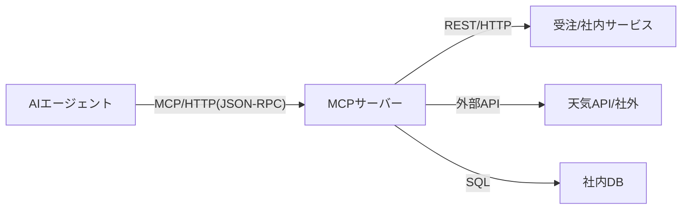

## はじめに

本シリーズでは、MCP(Model Context Protocol)の基本から実装まで段階を分けて解説します。  
「AIエージェントに社内システムや外部APIの知識を与えたい」という方へ向けた内容になります。  
  
今回はMCPそのものについて説明します。  
今後、トランスポート（stdio, Streamable HTTP）ごとの実装、MCPの自動生成などへの展開を予定しています。

## なぜMCPが必要なのか

AIエージェント（Claude、GPT-4、Geminiなど）は、膨大な知識を持っていますが「今この瞬間のデータ」や「社内システムの情報」には直接アクセスできません。  
たとえば「最新の受注状況」や「在庫数」をAIに聞いても、学習データに含まれていなければ答えられません。  

こうした「知識の壁」を越えるための仕組みがMCPです。  
MCPを使うことで、AIエージェントが社内外のシステムやデータベースと安全に連携できます。  
併せて、認証や認可（アクセス制御）が自身の方式に統合できるように検討するのが重要な課題です。  

## MCPとは

AIエージェントが外部サービスと通信するための仕様で、2024/11にAnthropic社によって初版がリリースされました。（[公式サイト](https://modelcontextprotocol.io)）  
MCPを使用することで、AIエージェントは外部サービスの機能を効果的に利用できます。  
MCPサーバーは、AIエージェントが外部ツールやデータソースと通信するため、MCPプロトコルを実装したサーバーを指します。  
MCPクライアントは、AIエージェントなどのMCPサーバー利用者を指します。  

※MCPは「AIエージェントと社内外サービスをつなぐハブ」のような役割を果たします。

|項目|MCP|
|---|---|
| **プロトコル** | JSON-RPC 2.0 over stdio または HTTP/SSE（Streamable HTTP） |
| **データ形式** | JSON (JSON-RPC 2.0) |
| **エンドポイント** | 統一エンドポイント（`/mcp` のみ） |
| **操作** | JSON-RPCメソッド（`tools/list`, `tools/call`） |
| **エラー** | JSON-RPC Error（code, message） |

:::info: SSE(Server-Sent Events)とは
HTTP接続を維持したまま、サーバーからイベントを逐次送信する仕組み。（`text/event-stream`）  
MCPでは、ツールの呼び出し結果やストリームレスポンスを段階的に返す用途で利用されます。
:::

## MCPサーバーの主な役割

MCPサーバーが担う主な役割は下記の通りです。  
BFFのMCPクライアント版のような役割と言えます。
* プロトコル変換（MCP⇔REST）
* 認証・認可
* 流量制限
* 監査ロギング
* ルーティング
* エラーハンドリング
* レスポンスの変換、合成

## MCPサーバーによる効果

AIエージェントは、学習データに含まれていない最新データや外部データは活用できません。
MCPサーバーで外部ツールやデータソースにアクセスできるツールを公開することで、リアルタイムデータにもとづいて返答できるようになります。
  ```mermaid
  sequenceDiagram
    actor User
    actor Agent as AIエージェント
    participant MCP as MCPサーバー
    participant API as 受注サービス

    note over User, Agent: MCPなし
    User->>+Agent: 受注番号O001の状況を教えて
    Agent-->>-User: 受注番号「O001」の状況を確認する手段がありません。担当の受注管理部門にお問い合わせください。

    note over User, Agent: MCPあり
    User->>+Agent: 受注番号O001の状況を教えて。調べる際はget_orderを使って。
      Agent->>+MCP: 受注取得ツール呼び出し<br>get_order(order_id="O001")
        MCP->>+API: 受注取得APIリクエスト<br>GET /orders/O001
        API-->>-MCP: 受注を返却<br>{ "order_id": "O001", "status": "shipped", ... }
      MCP-->>-Agent: 受注を返却<br>{ "jsonrpc": "2.0", "result": "{ "order_id": "O001", "status": "shipped", ... }", "id": 1 }
    Agent-->>-User: 受注O001の状況は発送済みです
  ```
**MCPの活用例**
* AIチャットボットが「受注番号O001の出荷状況を教えて」と聞かれたとき、MCP経由で社内の受注管理システムに問い合わせて最新情報を返す
* 社内FAQボットが、MCPを通じて人事システムや勤怠データベースから必要な情報を取得し、社員の質問に答える
* 外部API（天気、為替レートなど）と連携し、AIがリアルタイムなデータをもとにアドバイスを行う

## トランスポート（通信方式）の種類

MCPのトランスポートには`stdio`と`Streamable HTTP`があります。  

### stdio（標準入出力）

MCPクライアント（AIエージェントなど）がMCPサーバーをサブプロセスとして起動し、ローカル環境で通信する方式です。  
* 通信
  * データ形式: 改行区切りのJSON-RPCメッセージ。改行を許容するため、メッセージに改行を含めることはできません。
  * データ送受信: 標準入出力（stdin/stdout）を利用します。
  * セッションの終了: クライアントが入力ストリームを閉じるか、プロセスを終了する。
* 用途
  * 個人のPC上で動くAIエージェントにローカルリソース（ファイルやツール）を操作させる。

### Streamable HTTP

MCPサーバーは独立したプロセスとして稼働し、単一のHTTPエンドポイントで複数のMCPクライアントからの接続を受け付ける通信方式です。

* 通信
  * POSTとSSEの組み合わせ: クライアントからのリクエストはPOSTで送信し、サーバーからのレスポンスや通知はSSEを利用してストリーミング配信します。
  * 非同期・準双方向通信: GETを使って独立した受信ストリームを開いておくことで、サーバーから任意のタイミングで自発的に通知を送ることが可能です。
  * 回復と状態管理: ネットワークが切断されても`Last-Event-ID`を用いて途中から再接続できる機能や、`MCP-Session-Id`ヘッダーを使ってセッション管理する機能が備わっています。
* 用途
  * リモートサーバーでの利用: ネットワーク越しに配置されたサーバーの機能（クラウド上のデータベースや外部APIなど）を利用する場合に適しています。
  * 複数クライアントからの利用: 1つのMCPサーバーを複数のMCPクライアントから利用したい場合、Webサービスのような構成で活躍します。

:::info: `MCP-Session-Id`
クライアントとサーバー間のやり取り（セッション）を管理するIDのこと。

Streamable HTTPにおいて、サーバーは初期化時にセッションID（UUIDやJWTなど）を発行します。  
クライアントは、これ以降のすべてのHTTPリクエスト（POSTやGET）に`MCP-Session-Id`ヘッダーとしてこの値を含める必要があります。
:::

:::info: Last-Event-ID
セッション内で開かれたSSEストリーム通信の連続性を保証するIDのこと。  

サーバーからクライアントへメッセージを送るSSEストリーム上の各イベントにはIDが付与されます。  
ストリームが切断された際、クライアントは再接続時に`Last-Event-ID`ヘッダーを用いて「最後に受け取ったイベントID」をサーバーに伝えることで中断したところからストリームを再開できます。
:::

## 今後の展開

本シリーズでは、MCPの基本から実践的な実装方法を解説します。  
トランスポートごとの違い、自動生成ツールの活用など、段階的に解説していく予定です。  
「AIエージェントとシステムの連携をもっと身近に」するための内容を目指します。  
次回もぜひご期待ください。
